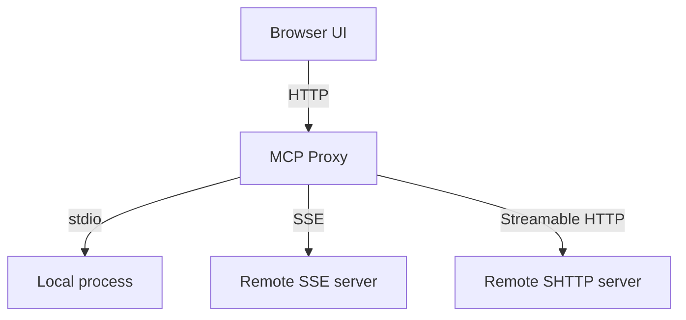
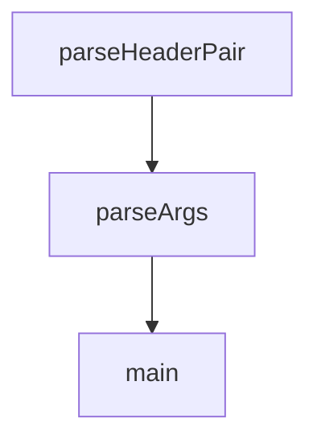

# Chapter 2: Architecture, Transports, and Session Model

Welcome to **Chapter 2: Architecture, Transports, and Session Model**. In this part of **MCP Inspector Tutorial: Debugging and Validating MCP Servers**, you will build an intuitive mental model first, then move into concrete implementation details and practical production tradeoffs.


Inspector has two runtime pieces: a web client and a proxy that speaks MCP transports to your target server.

## Learning Goals

- distinguish UI concerns from proxy transport concerns
- choose the right transport (`stdio`, `sse`, `streamable-http`) per test
- understand how session token auth gates proxy requests
- avoid misdiagnosing transport errors as schema/tool errors

## Architecture Map


```mermaid
flowchart TD
    A[Browser UI] -->|HTTP| B[MCP Proxy]
    B -->|stdio| C[Local process]
    B -->|SSE| D[Remote SSE server]
    B -->|Streamable HTTP| E[Remote SHTTP server]
```

## Transport Selection Heuristics

| Transport | Best For | Common Pitfall |
|:----------|:---------|:---------------|
| `stdio` | local server development | process startup env vars not aligned |
| `sse` | existing SSE endpoints | missing auth header or stale token |
| `streamable-http` | modern remote MCP services | incorrect endpoint path assumptions |

## Session Model

Inspector proxy auth is enabled by default and generates a session token at startup. Keep this token scoped to local workflows and rotate by restarting the process.

## Source References

- [Inspector README - Architecture Overview](https://github.com/modelcontextprotocol/inspector/blob/main/README.md#architecture-overview)
- [Inspector README - Transport Types in Config Files](https://github.com/modelcontextprotocol/inspector/blob/main/README.md#transport-types-in-config-files)
- [Inspector README - Authentication](https://github.com/modelcontextprotocol/inspector/blob/main/README.md#authentication-1)

## Summary

You now have a transport-first mental model for debugging with Inspector.

Next: [Chapter 3: UI Debugging Workflows: Tools, Resources, Prompts](03-ui-debugging-workflows-tools-resources-prompts.md)

## Depth Expansion Playbook

## Source Code Walkthrough

### `cli/src/index.ts`

The `parseHeaderPair` function in [`cli/src/index.ts`](https://github.com/modelcontextprotocol/inspector/blob/HEAD/cli/src/index.ts) handles a key part of this chapter's functionality:

```ts
}

function parseHeaderPair(
  value: string,
  previous: Record<string, string> = {},
): Record<string, string> {
  const colonIndex = value.indexOf(":");

  if (colonIndex === -1) {
    throw new Error(
      `Invalid header format: ${value}. Use "HeaderName: Value" format.`,
    );
  }

  const key = value.slice(0, colonIndex).trim();
  const val = value.slice(colonIndex + 1).trim();

  if (key === "" || val === "") {
    throw new Error(
      `Invalid header format: ${value}. Use "HeaderName: Value" format.`,
    );
  }

  return { ...previous, [key]: val };
}

function parseArgs(): Args {
  const program = new Command();

  // Find if there's a -- in the arguments and split them
  const argSeparatorIndex = process.argv.indexOf("--");
  let preArgs = process.argv;
```

This function is important because it defines how MCP Inspector Tutorial: Debugging and Validating MCP Servers implements the patterns covered in this chapter.

### `cli/src/index.ts`

The `parseArgs` function in [`cli/src/index.ts`](https://github.com/modelcontextprotocol/inspector/blob/HEAD/cli/src/index.ts) handles a key part of this chapter's functionality:

```ts
}

function parseArgs(): Args {
  const program = new Command();

  // Find if there's a -- in the arguments and split them
  const argSeparatorIndex = process.argv.indexOf("--");
  let preArgs = process.argv;
  let postArgs: string[] = [];

  if (argSeparatorIndex !== -1) {
    preArgs = process.argv.slice(0, argSeparatorIndex);
    postArgs = process.argv.slice(argSeparatorIndex + 1);
  }

  program
    .name("inspector-cli")
    .allowUnknownOption()
    .argument("<target...>", "Command and arguments or URL of the MCP server")
    //
    // Method selection
    //
    .option("--method <method>", "Method to invoke")
    //
    // Tool-related options
    //
    .option("--tool-name <toolName>", "Tool name (for tools/call method)")
    .option(
      "--tool-arg <pairs...>",
      "Tool argument as key=value pair",
      parseKeyValuePair,
      {},
```

This function is important because it defines how MCP Inspector Tutorial: Debugging and Validating MCP Servers implements the patterns covered in this chapter.

### `cli/src/index.ts`

The `main` function in [`cli/src/index.ts`](https://github.com/modelcontextprotocol/inspector/blob/HEAD/cli/src/index.ts) handles a key part of this chapter's functionality:

```ts
  };

  let remainingArgs = program.args;

  // Add back any arguments that came after --
  const finalArgs = [...remainingArgs, ...postArgs];

  if (!options.method) {
    throw new Error(
      "Method is required. Use --method to specify the method to invoke.",
    );
  }

  return {
    target: finalArgs,
    ...options,
    headers: options.header, // commander.js uses 'header' field, map to 'headers'
    metadata: options.metadata
      ? Object.fromEntries(
          Object.entries(options.metadata).map(([key, value]) => [
            key,
            String(value),
          ]),
        )
      : undefined,
    toolMeta: options.toolMetadata
      ? Object.fromEntries(
          Object.entries(options.toolMetadata).map(([key, value]) => [
            key,
            String(value),
          ]),
        )
```

This function is important because it defines how MCP Inspector Tutorial: Debugging and Validating MCP Servers implements the patterns covered in this chapter.


## How These Components Connect


```mermaid
flowchart TD
    A[parseHeaderPair]
    B[parseArgs]
    C[main]
    A --> B
    B --> C
```
