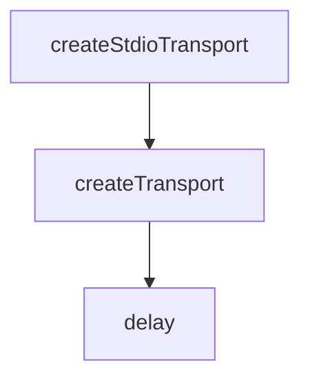

# Chapter 3: UI Debugging Workflows: Tools, Resources, Prompts

Welcome to **Chapter 3: UI Debugging Workflows: Tools, Resources, Prompts**. In this part of **MCP Inspector Tutorial: Debugging and Validating MCP Servers**, you will build an intuitive mental model first, then move into concrete implementation details and practical production tradeoffs.


The UI is optimized for rapid exploratory debugging across tools, resources, prompts, sampling, and request history.

## Learning Goals

- validate capability discovery quickly after connecting
- run tool calls with structured argument payloads
- inspect response payloads and error output in a repeatable way
- export server entries for reuse in client config files

## Recommended Debug Loop

1. run `tools/list`, inspect parameter schemas
2. execute one low-risk tool call with explicit arguments
3. run `resources/list` and fetch a small resource payload
4. run `prompts/list` and test one prompt path
5. export a Server Entry or full `mcp.json` for downstream clients

## UI-to-Config Handoff

Use Inspector's "Server Entry" and "Servers File" export buttons to avoid manual config drift when moving from local debug to tools like Claude Code or Cursor.

## Source References

- [Inspector README - Servers File Export](https://github.com/modelcontextprotocol/inspector/blob/main/README.md#servers-file-export)
- [Inspector README - UI Mode vs CLI Mode](https://github.com/modelcontextprotocol/inspector/blob/main/README.md#ui-mode-vs-cli-mode-when-to-use-each)
- [Inspector Client Source Tree](https://github.com/modelcontextprotocol/inspector/tree/main/client/src/components)

## Summary

You now have a practical, repeatable UI workflow for MCP server debugging.

Next: [Chapter 4: CLI Mode, Automation, and CI Loops](04-cli-mode-automation-and-ci-loops.md)

## Source Code Walkthrough

### `cli/src/transport.ts`

The `createStdioTransport` function in [`cli/src/transport.ts`](https://github.com/modelcontextprotocol/inspector/blob/HEAD/cli/src/transport.ts) handles a key part of this chapter's functionality:

```ts
};

function createStdioTransport(options: TransportOptions): Transport {
  let args: string[] = [];

  if (options.args !== undefined) {
    args = options.args;
  }

  const processEnv: Record<string, string> = {};

  for (const [key, value] of Object.entries(process.env)) {
    if (value !== undefined) {
      processEnv[key] = value;
    }
  }

  const defaultEnv = getDefaultEnvironment();

  const env: Record<string, string> = {
    ...defaultEnv,
    ...processEnv,
  };

  const { cmd: actualCommand, args: actualArgs } = findActualExecutable(
    options.command ?? "",
    args,
  );

  return new StdioClientTransport({
    command: actualCommand,
    args: actualArgs,
```

This function is important because it defines how MCP Inspector Tutorial: Debugging and Validating MCP Servers implements the patterns covered in this chapter.

### `cli/src/transport.ts`

The `createTransport` function in [`cli/src/transport.ts`](https://github.com/modelcontextprotocol/inspector/blob/HEAD/cli/src/transport.ts) handles a key part of this chapter's functionality:

```ts
}

export function createTransport(options: TransportOptions): Transport {
  const { transportType } = options;

  try {
    if (transportType === "stdio") {
      return createStdioTransport(options);
    }

    // If not STDIO, then it must be either SSE or HTTP.
    if (!options.url) {
      throw new Error("URL must be provided for SSE or HTTP transport types.");
    }
    const url = new URL(options.url);

    if (transportType === "sse") {
      const transportOptions = options.headers
        ? {
            requestInit: {
              headers: options.headers,
            },
          }
        : undefined;
      return new SSEClientTransport(url, transportOptions);
    }

    if (transportType === "http") {
      const transportOptions = options.headers
        ? {
            requestInit: {
              headers: options.headers,
```

This function is important because it defines how MCP Inspector Tutorial: Debugging and Validating MCP Servers implements the patterns covered in this chapter.

### `client/bin/start.js`

The `delay` function in [`client/bin/start.js`](https://github.com/modelcontextprotocol/inspector/blob/HEAD/client/bin/start.js) handles a key part of this chapter's functionality:

```js
const DEFAULT_MCP_PROXY_LISTEN_PORT = "6277";

function delay(ms) {
  return new Promise((resolve) => setTimeout(resolve, ms, true));
}

function getClientUrl(port, authDisabled, sessionToken, serverPort) {
  const host = process.env.HOST || "localhost";
  const baseUrl = `http://${host}:${port}`;

  const params = new URLSearchParams();
  if (serverPort && serverPort !== DEFAULT_MCP_PROXY_LISTEN_PORT) {
    params.set("MCP_PROXY_PORT", serverPort);
  }
  if (!authDisabled) {
    params.set("MCP_PROXY_AUTH_TOKEN", sessionToken);
  }
  return params.size > 0 ? `${baseUrl}/?${params.toString()}` : baseUrl;
}

async function startDevServer(serverOptions) {
  const {
    SERVER_PORT,
    CLIENT_PORT,
    sessionToken,
    envVars,
    abort,
    transport,
    serverUrl,
  } = serverOptions;
  const serverCommand = "npx";
  const serverArgs = ["tsx", "watch", "--clear-screen=false", "src/index.ts"];
```

This function is important because it defines how MCP Inspector Tutorial: Debugging and Validating MCP Servers implements the patterns covered in this chapter.


## How These Components Connect


