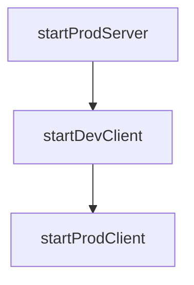

# Chapter 4: CLI Mode, Automation, and CI Loops

Welcome to **Chapter 4: CLI Mode, Automation, and CI Loops**. In this part of **MCP Inspector Tutorial: Debugging and Validating MCP Servers**, you will build an intuitive mental model first, then move into concrete implementation details and practical production tradeoffs.


Inspector CLI mode is the bridge from manual debugging to deterministic automation.

## Learning Goals

- run CLI mode against local and remote MCP servers
- script list/call flows for smoke tests
- pass headers and args safely for CI use
- standardize JSON outputs for pipeline checks

## Core CLI Patterns

```bash
# Local stdio server, list tools
npx @modelcontextprotocol/inspector --cli node build/index.js --method tools/list

# Call a tool with arguments
npx @modelcontextprotocol/inspector --cli node build/index.js \
  --method tools/call --tool-name mytool --tool-arg key=value

# Remote streamable HTTP endpoint
npx @modelcontextprotocol/inspector --cli https://example.com/mcp \
  --transport http --method resources/list
```

## CI Strategy

- keep one golden endpoint per server family for smoke checks
- run read-only calls first (`tools/list`, `resources/list`)
- treat timeouts and transport errors as separate failure classes
- persist raw JSON output for regression diffs

## Source References

- [Inspector README - CLI Mode](https://github.com/modelcontextprotocol/inspector/blob/main/README.md#cli-mode)
- [Inspector CLI Package](https://github.com/modelcontextprotocol/inspector/tree/main/cli)

## Summary

You can now automate Inspector-based checks in build and release pipelines.

Next: [Chapter 5: Security, Auth, and Network Hardening](05-security-auth-and-network-hardening.md)

## Depth Expansion Playbook

## Source Code Walkthrough

### `client/bin/start.js`

The `startProdServer` function in [`client/bin/start.js`](https://github.com/modelcontextprotocol/inspector/blob/HEAD/client/bin/start.js) handles a key part of this chapter's functionality:

```js
}

async function startProdServer(serverOptions) {
  const {
    SERVER_PORT,
    CLIENT_PORT,
    sessionToken,
    envVars,
    abort,
    command,
    mcpServerArgs,
    transport,
    serverUrl,
  } = serverOptions;
  const inspectorServerPath = resolve(
    __dirname,
    "../..",
    "server",
    "build",
    "index.js",
  );

  const server = spawnPromise(
    "node",
    [
      inspectorServerPath,
      ...(command ? [`--command=${command}`] : []),
      ...(mcpServerArgs && mcpServerArgs.length > 0
        ? [`--args=${mcpServerArgs.join(" ")}`]
        : []),
      ...(transport ? [`--transport=${transport}`] : []),
      ...(serverUrl ? [`--server-url=${serverUrl}`] : []),
```

This function is important because it defines how MCP Inspector Tutorial: Debugging and Validating MCP Servers implements the patterns covered in this chapter.

### `client/bin/start.js`

The `startDevClient` function in [`client/bin/start.js`](https://github.com/modelcontextprotocol/inspector/blob/HEAD/client/bin/start.js) handles a key part of this chapter's functionality:

```js
}

async function startDevClient(clientOptions) {
  const {
    CLIENT_PORT,
    SERVER_PORT,
    authDisabled,
    sessionToken,
    abort,
    cancelled,
  } = clientOptions;
  const clientCommand = "npx";
  const host = process.env.HOST || "localhost";
  const clientArgs = ["vite", "--port", CLIENT_PORT, "--host", host];
  const isWindows = process.platform === "win32";

  const spawnOptions = {
    cwd: resolve(__dirname, ".."),
    env: { ...process.env, CLIENT_PORT },
    signal: abort.signal,
    echoOutput: true,
  };

  // For Windows, we need to ignore stdin to prevent hanging
  if (isWindows) {
    spawnOptions.stdio = ["ignore", "pipe", "pipe"];
  }

  const client = spawn(clientCommand, clientArgs, spawnOptions);

  const url = getClientUrl(
    CLIENT_PORT,
```

This function is important because it defines how MCP Inspector Tutorial: Debugging and Validating MCP Servers implements the patterns covered in this chapter.

### `client/bin/start.js`

The `startProdClient` function in [`client/bin/start.js`](https://github.com/modelcontextprotocol/inspector/blob/HEAD/client/bin/start.js) handles a key part of this chapter's functionality:

```js
}

async function startProdClient(clientOptions) {
  const {
    CLIENT_PORT,
    SERVER_PORT,
    authDisabled,
    sessionToken,
    abort,
    cancelled,
  } = clientOptions;
  const inspectorClientPath = resolve(
    __dirname,
    "../..",
    "client",
    "bin",
    "client.js",
  );

  const url = getClientUrl(
    CLIENT_PORT,
    authDisabled,
    sessionToken,
    SERVER_PORT,
  );

  await spawnPromise("node", [inspectorClientPath], {
    env: {
      ...process.env,
      CLIENT_PORT,
      INSPECTOR_URL: url,
    },
```

This function is important because it defines how MCP Inspector Tutorial: Debugging and Validating MCP Servers implements the patterns covered in this chapter.


## How These Components Connect


