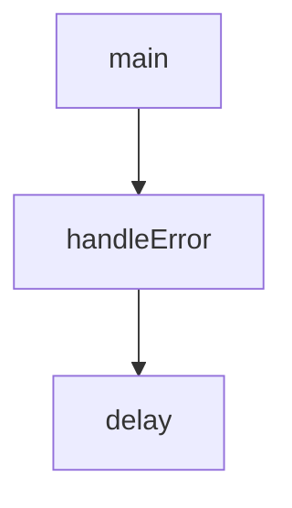

# Chapter 5: Security, Auth, and Network Hardening

Welcome to **Chapter 5: Security, Auth, and Network Hardening**. In this part of **MCP Inspector Tutorial: Debugging and Validating MCP Servers**, you will build an intuitive mental model first, then move into concrete implementation details and practical production tradeoffs.


Inspector's proxy can spawn local processes and connect to arbitrary endpoints, so hardening defaults matters.

## Learning Goals

- keep authentication enabled and token scope tight
- use local-only binding as a default posture
- configure allowed origins for DNS rebinding defense
- understand risks of disabling auth

## Hardening Checklist

| Control | Recommended Setting | Why |
|:--------|:--------------------|:----|
| Proxy auth | enabled | blocks unauthorized requests to process-spawning proxy |
| Binding | localhost only | reduces LAN exposure |
| Origins | explicit allowlist | protects against DNS rebinding attacks |
| `DANGEROUSLY_OMIT_AUTH` | never in routine dev | large local compromise risk |

## High-Risk Anti-Pattern

Avoid using `DANGEROUSLY_OMIT_AUTH=true` unless you are in a tightly isolated throwaway environment with a clear security reason.

## Source References

- [Inspector README - Security Considerations](https://github.com/modelcontextprotocol/inspector/blob/main/README.md#security-considerations)
- [Inspector README - Local-only Binding](https://github.com/modelcontextprotocol/inspector/blob/main/README.md#local-only-binding)
- [Inspector README - DNS Rebinding Protection](https://github.com/modelcontextprotocol/inspector/blob/main/README.md#dns-rebinding-protection)

## Summary

You now have a concrete baseline for safer Inspector operation.

Next: [Chapter 6: Configuration, Timeouts, and Runtime Tuning](06-configuration-timeouts-and-runtime-tuning.md)

## Depth Expansion Playbook

## Source Code Walkthrough

### `client/bin/start.js`

The `main` function in [`client/bin/start.js`](https://github.com/modelcontextprotocol/inspector/blob/HEAD/client/bin/start.js) handles a key part of this chapter's functionality:

```js
}

async function main() {
  // Parse command line arguments
  const args = process.argv.slice(2);
  const envVars = {};
  const mcpServerArgs = [];
  let command = null;
  let parsingFlags = true;
  let isDev = false;
  let transport = null;
  let serverUrl = null;

  for (let i = 0; i < args.length; i++) {
    const arg = args[i];

    if (parsingFlags && arg === "--") {
      parsingFlags = false;
      continue;
    }

    if (parsingFlags && arg === "--dev") {
      isDev = true;
      continue;
    }

    if (parsingFlags && arg === "--transport" && i + 1 < args.length) {
      transport = args[++i];
      continue;
    }

    if (parsingFlags && arg === "--server-url" && i + 1 < args.length) {
```

This function is important because it defines how MCP Inspector Tutorial: Debugging and Validating MCP Servers implements the patterns covered in this chapter.

### `cli/src/cli.ts`

The `handleError` function in [`cli/src/cli.ts`](https://github.com/modelcontextprotocol/inspector/blob/HEAD/cli/src/cli.ts) handles a key part of this chapter's functionality:

```ts
    };

function handleError(error: unknown): never {
  let message: string;

  if (error instanceof Error) {
    message = error.message;
  } else if (typeof error === "string") {
    message = error;
  } else {
    message = "Unknown error";
  }

  console.error(message);

  process.exit(1);
}

function delay(ms: number): Promise<void> {
  return new Promise((resolve) => setTimeout(resolve, ms, true));
}

async function runWebClient(args: Args): Promise<void> {
  // Path to the client entry point
  const inspectorClientPath = resolve(
    __dirname,
    "../../",
    "client",
    "bin",
    "start.js",
  );

```

This function is important because it defines how MCP Inspector Tutorial: Debugging and Validating MCP Servers implements the patterns covered in this chapter.

### `cli/src/cli.ts`

The `delay` function in [`cli/src/cli.ts`](https://github.com/modelcontextprotocol/inspector/blob/HEAD/cli/src/cli.ts) handles a key part of this chapter's functionality:

```ts
}

function delay(ms: number): Promise<void> {
  return new Promise((resolve) => setTimeout(resolve, ms, true));
}

async function runWebClient(args: Args): Promise<void> {
  // Path to the client entry point
  const inspectorClientPath = resolve(
    __dirname,
    "../../",
    "client",
    "bin",
    "start.js",
  );

  const abort = new AbortController();
  let cancelled: boolean = false;
  process.on("SIGINT", () => {
    cancelled = true;
    abort.abort();
  });

  // Build arguments to pass to start.js
  const startArgs: string[] = [];

  // Pass environment variables
  for (const [key, value] of Object.entries(args.envArgs)) {
    startArgs.push("-e", `${key}=${value}`);
  }

  // Pass transport type if specified
```

This function is important because it defines how MCP Inspector Tutorial: Debugging and Validating MCP Servers implements the patterns covered in this chapter.


## How These Components Connect


