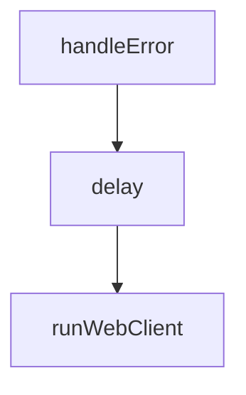

# Chapter 6: Configuration, Timeouts, and Runtime Tuning

Welcome to **Chapter 6: Configuration, Timeouts, and Runtime Tuning**. In this part of **MCP Inspector Tutorial: Debugging and Validating MCP Servers**, you will build an intuitive mental model first, then move into concrete implementation details and practical production tradeoffs.


The default timeout behavior is good for quick tests, but long-running tools and interactive flows need explicit tuning.

## Learning Goals

- tune request timeout values for realistic workloads
- use progress-aware timeout reset behavior correctly
- separate client-side timeout policy from server-side limits
- manage profile-like configs for multiple targets

## Key Runtime Settings

| Setting | Purpose | Typical Adjustment |
|:--------|:--------|:-------------------|
| `MCP_SERVER_REQUEST_TIMEOUT` | client request timeout | increase for slow tool operations |
| `MCP_REQUEST_TIMEOUT_RESET_ON_PROGRESS` | extend timeout on progress events | keep enabled for streaming/progress tools |
| `MCP_REQUEST_MAX_TOTAL_TIMEOUT` | max total duration cap | set upper bound for long tasks |
| `MCP_PROXY_FULL_ADDRESS` | non-default proxy address | required for remote/devbox scenarios |
| `MCP_AUTO_OPEN_ENABLED` | browser auto-open behavior | disable in CI/headless contexts |

## Practical Rule

Set Inspector timeout ceilings high enough for legitimate long calls, but keep a finite max timeout to prevent invisible hangs.

## Source References

- [Inspector README - Configuration](https://github.com/modelcontextprotocol/inspector/blob/main/README.md#configuration)
- [Inspector README - Note on Timeouts](https://github.com/modelcontextprotocol/inspector/blob/main/README.md#configuration)

## Summary

You now have a runtime tuning approach that reduces false failures and stalled sessions.

Next: [Chapter 7: Inspector in Server Development Lifecycle](07-inspector-in-server-development-lifecycle.md)

## Source Code Walkthrough

### `cli/src/cli.ts`

The `handleError` function in [`cli/src/cli.ts`](https://github.com/modelcontextprotocol/inspector/blob/HEAD/cli/src/cli.ts) handles a key part of this chapter's functionality:

```ts
    };

function handleError(error: unknown): never {
  let message: string;

  if (error instanceof Error) {
    message = error.message;
  } else if (typeof error === "string") {
    message = error;
  } else {
    message = "Unknown error";
  }

  console.error(message);

  process.exit(1);
}

function delay(ms: number): Promise<void> {
  return new Promise((resolve) => setTimeout(resolve, ms, true));
}

async function runWebClient(args: Args): Promise<void> {
  // Path to the client entry point
  const inspectorClientPath = resolve(
    __dirname,
    "../../",
    "client",
    "bin",
    "start.js",
  );

```

This function is important because it defines how MCP Inspector Tutorial: Debugging and Validating MCP Servers implements the patterns covered in this chapter.

### `cli/src/cli.ts`

The `delay` function in [`cli/src/cli.ts`](https://github.com/modelcontextprotocol/inspector/blob/HEAD/cli/src/cli.ts) handles a key part of this chapter's functionality:

```ts
}

function delay(ms: number): Promise<void> {
  return new Promise((resolve) => setTimeout(resolve, ms, true));
}

async function runWebClient(args: Args): Promise<void> {
  // Path to the client entry point
  const inspectorClientPath = resolve(
    __dirname,
    "../../",
    "client",
    "bin",
    "start.js",
  );

  const abort = new AbortController();
  let cancelled: boolean = false;
  process.on("SIGINT", () => {
    cancelled = true;
    abort.abort();
  });

  // Build arguments to pass to start.js
  const startArgs: string[] = [];

  // Pass environment variables
  for (const [key, value] of Object.entries(args.envArgs)) {
    startArgs.push("-e", `${key}=${value}`);
  }

  // Pass transport type if specified
```

This function is important because it defines how MCP Inspector Tutorial: Debugging and Validating MCP Servers implements the patterns covered in this chapter.

### `cli/src/cli.ts`

The `runWebClient` function in [`cli/src/cli.ts`](https://github.com/modelcontextprotocol/inspector/blob/HEAD/cli/src/cli.ts) handles a key part of this chapter's functionality:

```ts
}

async function runWebClient(args: Args): Promise<void> {
  // Path to the client entry point
  const inspectorClientPath = resolve(
    __dirname,
    "../../",
    "client",
    "bin",
    "start.js",
  );

  const abort = new AbortController();
  let cancelled: boolean = false;
  process.on("SIGINT", () => {
    cancelled = true;
    abort.abort();
  });

  // Build arguments to pass to start.js
  const startArgs: string[] = [];

  // Pass environment variables
  for (const [key, value] of Object.entries(args.envArgs)) {
    startArgs.push("-e", `${key}=${value}`);
  }

  // Pass transport type if specified
  if (args.transport) {
    startArgs.push("--transport", args.transport);
  }

```

This function is important because it defines how MCP Inspector Tutorial: Debugging and Validating MCP Servers implements the patterns covered in this chapter.


## How These Components Connect


