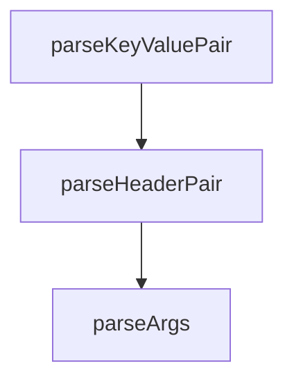

# Chapter 7: Inspector in Server Development Lifecycle

Welcome to **Chapter 7: Inspector in Server Development Lifecycle**. In this part of **MCP Inspector Tutorial: Debugging and Validating MCP Servers**, you will build an intuitive mental model first, then move into concrete implementation details and practical production tradeoffs.


Inspector is most effective when it is built into the normal MCP server development loop instead of used only for ad hoc debugging.

## Learning Goals

- position Inspector checks between local dev and release gates
- share reusable config profiles across team members
- validate server behavior after dependency and transport changes
- reduce drift between local runs and client-host configurations

## Lifecycle Pattern

1. implement server change
2. validate interactively in Inspector UI
3. export/update `mcp.json` entry
4. run CLI smoke checks in CI
5. publish with confidence once both loops pass

## Team Workflow Tips

- keep one minimal and one full-featured server config profile
- pin representative test tools/resources for regressions
- document expected failure modes (auth, timeout, transport)

## Source References

- [Inspector README - Config File Support](https://github.com/modelcontextprotocol/inspector/blob/main/README.md#configuration)
- [Inspector README - Default Server Selection](https://github.com/modelcontextprotocol/inspector/blob/main/README.md#default-server-selection)
- [Inspector Development Guide (AGENTS)](https://github.com/modelcontextprotocol/inspector/blob/main/AGENTS.md)

## Summary

You now have an integration model for using Inspector as a consistent part of server development.

Next: [Chapter 8: Production Ops, Testing, and Contribution](08-production-ops-testing-and-contribution.md)

## Depth Expansion Playbook

## Source Code Walkthrough

### `cli/src/cli.ts`

The `parseKeyValuePair` function in [`cli/src/cli.ts`](https://github.com/modelcontextprotocol/inspector/blob/HEAD/cli/src/cli.ts) handles a key part of this chapter's functionality:

```ts
}

function parseKeyValuePair(
  value: string,
  previous: Record<string, string> = {},
): Record<string, string> {
  const parts = value.split("=");
  const key = parts[0];
  const val = parts.slice(1).join("=");

  if (val === undefined || val === "") {
    throw new Error(
      `Invalid parameter format: ${value}. Use key=value format.`,
    );
  }

  return { ...previous, [key as string]: val };
}

function parseHeaderPair(
  value: string,
  previous: Record<string, string> = {},
): Record<string, string> {
  const colonIndex = value.indexOf(":");

  if (colonIndex === -1) {
    throw new Error(
      `Invalid header format: ${value}. Use "HeaderName: Value" format.`,
    );
  }

  const key = value.slice(0, colonIndex).trim();
```

This function is important because it defines how MCP Inspector Tutorial: Debugging and Validating MCP Servers implements the patterns covered in this chapter.

### `cli/src/cli.ts`

The `parseHeaderPair` function in [`cli/src/cli.ts`](https://github.com/modelcontextprotocol/inspector/blob/HEAD/cli/src/cli.ts) handles a key part of this chapter's functionality:

```ts
}

function parseHeaderPair(
  value: string,
  previous: Record<string, string> = {},
): Record<string, string> {
  const colonIndex = value.indexOf(":");

  if (colonIndex === -1) {
    throw new Error(
      `Invalid header format: ${value}. Use "HeaderName: Value" format.`,
    );
  }

  const key = value.slice(0, colonIndex).trim();
  const val = value.slice(colonIndex + 1).trim();

  if (key === "" || val === "") {
    throw new Error(
      `Invalid header format: ${value}. Use "HeaderName: Value" format.`,
    );
  }

  return { ...previous, [key]: val };
}

function parseArgs(): Args {
  const program = new Command();

  const argSeparatorIndex = process.argv.indexOf("--");
  let preArgs = process.argv;
  let postArgs: string[] = [];
```

This function is important because it defines how MCP Inspector Tutorial: Debugging and Validating MCP Servers implements the patterns covered in this chapter.

### `cli/src/cli.ts`

The `parseArgs` function in [`cli/src/cli.ts`](https://github.com/modelcontextprotocol/inspector/blob/HEAD/cli/src/cli.ts) handles a key part of this chapter's functionality:

```ts
}

function parseArgs(): Args {
  const program = new Command();

  const argSeparatorIndex = process.argv.indexOf("--");
  let preArgs = process.argv;
  let postArgs: string[] = [];

  if (argSeparatorIndex !== -1) {
    preArgs = process.argv.slice(0, argSeparatorIndex);
    postArgs = process.argv.slice(argSeparatorIndex + 1);
  }

  program
    .name("inspector-bin")
    .allowExcessArguments()
    .allowUnknownOption()
    .option(
      "-e <env>",
      "environment variables in KEY=VALUE format",
      parseKeyValuePair,
      {},
    )
    .option("--config <path>", "config file path")
    .option("--server <n>", "server name from config file")
    .option("--cli", "enable CLI mode")
    .option("--transport <type>", "transport type (stdio, sse, http)")
    .option("--server-url <url>", "server URL for SSE/HTTP transport")
    .option(
      "--header <headers...>",
      'HTTP headers as "HeaderName: Value" pairs (for HTTP/SSE transports)',
```

This function is important because it defines how MCP Inspector Tutorial: Debugging and Validating MCP Servers implements the patterns covered in this chapter.


## How These Components Connect


