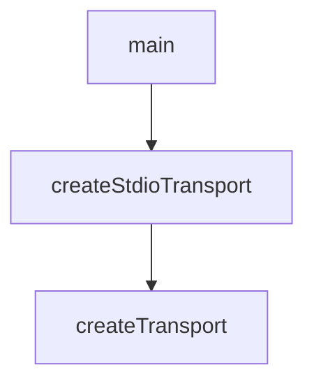

# Chapter 8: Production Ops, Testing, and Contribution

Welcome to **Chapter 8: Production Ops, Testing, and Contribution**. In this part of **MCP Inspector Tutorial: Debugging and Validating MCP Servers**, you will build an intuitive mental model first, then move into concrete implementation details and practical production tradeoffs.


Teams using Inspector at scale should treat it as a governed developer dependency with explicit update and contribution paths.

## Learning Goals

- define update windows for Inspector version bumps
- run regression checks around known high-risk surfaces (auth, transport, timeout)
- align contributions with current maintainer guidance
- maintain stable local developer UX while Inspector evolves

## Operational Playbook

- pin version in CI and dev bootstrap docs
- run a short smoke suite for `stdio`, `sse`, and `streamable-http`
- review release notes before bumping major/minor versions
- follow maintainer guidance: prioritize bug fixes and MCP spec compliance while V2 evolves

## Source References

- [Inspector Releases](https://github.com/modelcontextprotocol/inspector/releases)
- [Inspector Development Guide](https://github.com/modelcontextprotocol/inspector/blob/main/AGENTS.md)
- [Inspector Scripts README](https://github.com/modelcontextprotocol/inspector/blob/main/scripts/README.md)

## Summary

You now have a production-oriented approach for operating Inspector and contributing changes with lower risk.

Next: Continue with [MCP Registry Tutorial](../mcp-registry-tutorial/)

## Depth Expansion Playbook

## Source Code Walkthrough

### `cli/src/cli.ts`

The `main` function in [`cli/src/cli.ts`](https://github.com/modelcontextprotocol/inspector/blob/HEAD/cli/src/cli.ts) handles a key part of this chapter's functionality:

```ts

  const options = program.opts() as CliOptions;
  const remainingArgs = program.args;

  // Add back any arguments that came after --
  const finalArgs = [...remainingArgs, ...postArgs];

  // Validate config and server options
  if (!options.config && options.server) {
    throw new Error("--server requires --config to be specified");
  }

  // If config is provided without server, try to auto-select
  if (options.config && !options.server) {
    const configContent = fs.readFileSync(
      path.isAbsolute(options.config)
        ? options.config
        : path.resolve(process.cwd(), options.config),
      "utf8",
    );
    const parsedConfig = JSON.parse(configContent);
    const servers = Object.keys(parsedConfig.mcpServers || {});

    if (servers.length === 1) {
      // Use the only server if there's just one
      options.server = servers[0];
    } else if (servers.length === 0) {
      throw new Error("No servers found in config file");
    } else {
      // Multiple servers, require explicit selection
      throw new Error(
        `Multiple servers found in config file. Please specify one with --server.\nAvailable servers: ${servers.join(", ")}`,
```

This function is important because it defines how MCP Inspector Tutorial: Debugging and Validating MCP Servers implements the patterns covered in this chapter.

### `cli/src/transport.ts`

The `createStdioTransport` function in [`cli/src/transport.ts`](https://github.com/modelcontextprotocol/inspector/blob/HEAD/cli/src/transport.ts) handles a key part of this chapter's functionality:

```ts
};

function createStdioTransport(options: TransportOptions): Transport {
  let args: string[] = [];

  if (options.args !== undefined) {
    args = options.args;
  }

  const processEnv: Record<string, string> = {};

  for (const [key, value] of Object.entries(process.env)) {
    if (value !== undefined) {
      processEnv[key] = value;
    }
  }

  const defaultEnv = getDefaultEnvironment();

  const env: Record<string, string> = {
    ...defaultEnv,
    ...processEnv,
  };

  const { cmd: actualCommand, args: actualArgs } = findActualExecutable(
    options.command ?? "",
    args,
  );

  return new StdioClientTransport({
    command: actualCommand,
    args: actualArgs,
```

This function is important because it defines how MCP Inspector Tutorial: Debugging and Validating MCP Servers implements the patterns covered in this chapter.

### `cli/src/transport.ts`

The `createTransport` function in [`cli/src/transport.ts`](https://github.com/modelcontextprotocol/inspector/blob/HEAD/cli/src/transport.ts) handles a key part of this chapter's functionality:

```ts
}

export function createTransport(options: TransportOptions): Transport {
  const { transportType } = options;

  try {
    if (transportType === "stdio") {
      return createStdioTransport(options);
    }

    // If not STDIO, then it must be either SSE or HTTP.
    if (!options.url) {
      throw new Error("URL must be provided for SSE or HTTP transport types.");
    }
    const url = new URL(options.url);

    if (transportType === "sse") {
      const transportOptions = options.headers
        ? {
            requestInit: {
              headers: options.headers,
            },
          }
        : undefined;
      return new SSEClientTransport(url, transportOptions);
    }

    if (transportType === "http") {
      const transportOptions = options.headers
        ? {
            requestInit: {
              headers: options.headers,
```

This function is important because it defines how MCP Inspector Tutorial: Debugging and Validating MCP Servers implements the patterns covered in this chapter.


## How These Components Connect


