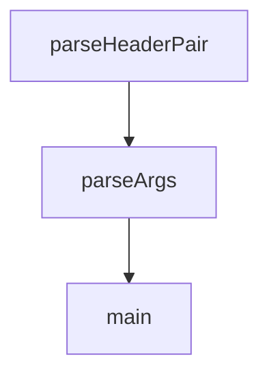

# Chapter 8: Production Ops, Testing, and Contribution

Welcome to **Chapter 8: Production Ops, Testing, and Contribution**. In this part of **MCP Inspector Tutorial: Debugging and Validating MCP Servers**, you will build an intuitive mental model first, then move into concrete implementation details and practical production tradeoffs.


Teams using Inspector at scale should treat it as a governed developer dependency with explicit update and contribution paths.

## Learning Goals

- define update windows for Inspector version bumps
- run regression checks around known high-risk surfaces (auth, transport, timeout)
- align contributions with current maintainer guidance
- maintain stable local developer UX while Inspector evolves

## Operational Playbook

- pin version in CI and dev bootstrap docs
- run a short smoke suite for `stdio`, `sse`, and `streamable-http`
- review release notes before bumping major/minor versions
- follow maintainer guidance: prioritize bug fixes and MCP spec compliance while V2 evolves

## Source References

- [Inspector Releases](https://github.com/modelcontextprotocol/inspector/releases)
- [Inspector Development Guide](https://github.com/modelcontextprotocol/inspector/blob/main/AGENTS.md)
- [Inspector Scripts README](https://github.com/modelcontextprotocol/inspector/blob/main/scripts/README.md)

## Summary

You now have a production-oriented approach for operating Inspector and contributing changes with lower risk.

Next: Continue with [MCP Registry Tutorial](../mcp-registry-tutorial/)

## Source Code Walkthrough

### `cli/src/cli.ts`

The `parseHeaderPair` function in [`cli/src/cli.ts`](https://github.com/modelcontextprotocol/inspector/blob/HEAD/cli/src/cli.ts) handles a key part of this chapter's functionality:

```ts
}

function parseHeaderPair(
  value: string,
  previous: Record<string, string> = {},
): Record<string, string> {
  const colonIndex = value.indexOf(":");

  if (colonIndex === -1) {
    throw new Error(
      `Invalid header format: ${value}. Use "HeaderName: Value" format.`,
    );
  }

  const key = value.slice(0, colonIndex).trim();
  const val = value.slice(colonIndex + 1).trim();

  if (key === "" || val === "") {
    throw new Error(
      `Invalid header format: ${value}. Use "HeaderName: Value" format.`,
    );
  }

  return { ...previous, [key]: val };
}

function parseArgs(): Args {
  const program = new Command();

  const argSeparatorIndex = process.argv.indexOf("--");
  let preArgs = process.argv;
  let postArgs: string[] = [];
```

This function is important because it defines how MCP Inspector Tutorial: Debugging and Validating MCP Servers implements the patterns covered in this chapter.

### `cli/src/cli.ts`

The `parseArgs` function in [`cli/src/cli.ts`](https://github.com/modelcontextprotocol/inspector/blob/HEAD/cli/src/cli.ts) handles a key part of this chapter's functionality:

```ts
}

function parseArgs(): Args {
  const program = new Command();

  const argSeparatorIndex = process.argv.indexOf("--");
  let preArgs = process.argv;
  let postArgs: string[] = [];

  if (argSeparatorIndex !== -1) {
    preArgs = process.argv.slice(0, argSeparatorIndex);
    postArgs = process.argv.slice(argSeparatorIndex + 1);
  }

  program
    .name("inspector-bin")
    .allowExcessArguments()
    .allowUnknownOption()
    .option(
      "-e <env>",
      "environment variables in KEY=VALUE format",
      parseKeyValuePair,
      {},
    )
    .option("--config <path>", "config file path")
    .option("--server <n>", "server name from config file")
    .option("--cli", "enable CLI mode")
    .option("--transport <type>", "transport type (stdio, sse, http)")
    .option("--server-url <url>", "server URL for SSE/HTTP transport")
    .option(
      "--header <headers...>",
      'HTTP headers as "HeaderName: Value" pairs (for HTTP/SSE transports)',
```

This function is important because it defines how MCP Inspector Tutorial: Debugging and Validating MCP Servers implements the patterns covered in this chapter.

### `cli/src/cli.ts`

The `main` function in [`cli/src/cli.ts`](https://github.com/modelcontextprotocol/inspector/blob/HEAD/cli/src/cli.ts) handles a key part of this chapter's functionality:

```ts

  const options = program.opts() as CliOptions;
  const remainingArgs = program.args;

  // Add back any arguments that came after --
  const finalArgs = [...remainingArgs, ...postArgs];

  // Validate config and server options
  if (!options.config && options.server) {
    throw new Error("--server requires --config to be specified");
  }

  // If config is provided without server, try to auto-select
  if (options.config && !options.server) {
    const configContent = fs.readFileSync(
      path.isAbsolute(options.config)
        ? options.config
        : path.resolve(process.cwd(), options.config),
      "utf8",
    );
    const parsedConfig = JSON.parse(configContent);
    const servers = Object.keys(parsedConfig.mcpServers || {});

    if (servers.length === 1) {
      // Use the only server if there's just one
      options.server = servers[0];
    } else if (servers.length === 0) {
      throw new Error("No servers found in config file");
    } else {
      // Multiple servers, require explicit selection
      throw new Error(
        `Multiple servers found in config file. Please specify one with --server.\nAvailable servers: ${servers.join(", ")}`,
```

This function is important because it defines how MCP Inspector Tutorial: Debugging and Validating MCP Servers implements the patterns covered in this chapter.


## How These Components Connect


