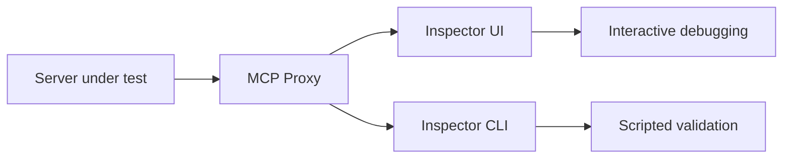

# MCP Inspector Tutorial: Debugging and Validating MCP Servers

> Learn how to use `modelcontextprotocol/inspector` to test MCP servers across stdio, SSE, and streamable HTTP, with safer auth defaults and repeatable CLI automation.

## Why This Track Matters

MCP Inspector is the primary developer surface for validating MCP server behavior before rolling changes into production clients. It combines an interactive web UI with a CLI mode so teams can run both exploratory and automated checks.

This track focuses on:

- establishing a reliable first-run setup for local and remote MCP servers
- understanding proxy and transport behavior to avoid false debugging signals
- using CLI mode in automation loops for regression checks
- hardening auth, local binding, and origin controls when running the proxy

## Current Snapshot (Verified February 12, 2026)

- repository: [`modelcontextprotocol/inspector`](https://github.com/modelcontextprotocol/inspector)
- stars: about **8.6k**
- latest release: [`0.20.0`](https://github.com/modelcontextprotocol/inspector/releases/tag/0.20.0) (**February 6, 2026**)
- recent activity: updated on **February 12, 2026**
- runtime requirement: Node.js `^22.7.5`
- licensing note: MCP project transition from MIT to Apache-2.0 (docs under CC-BY-4.0)

## Mental Model

## Chapter Guide

| Chapter | Key Question | Outcome |
|:--------|:-------------|:--------|
| [01 - Getting Started](01-getting-started.md) | How do I run Inspector quickly and verify connectivity? | Working baseline |
| [02 - Architecture, Transports, and Session Model](02-architecture-transports-and-session-model.md) | How do proxy, client, and transport layers interact? | Clear debugging model |
| [03 - UI Debugging Workflows: Tools, Resources, Prompts](03-ui-debugging-workflows-tools-resources-prompts.md) | How should I use the UI to inspect server behavior end to end? | Faster issue isolation |
| [04 - CLI Mode, Automation, and CI Loops](04-cli-mode-automation-and-ci-loops.md) | How do I automate MCP checks without opening a browser? | Repeatable command-line validation |
| [05 - Security, Auth, and Network Hardening](05-security-auth-and-network-hardening.md) | How do I reduce local attack surface when using the proxy? | Safer local and shared environments |
| [06 - Configuration, Timeouts, and Runtime Tuning](06-configuration-timeouts-and-runtime-tuning.md) | Which settings matter most for long-running or interactive tools? | Better reliability under load |
| [07 - Inspector in Server Development Lifecycle](07-inspector-in-server-development-lifecycle.md) | How does Inspector fit into day-to-day MCP server development? | Stable dev workflow |
| [08 - Production Ops, Testing, and Contribution](08-production-ops-testing-and-contribution.md) | How do teams operate Inspector usage over time and contribute safely? | Operational playbook |

## What You Will Learn

- how to validate MCP servers consistently across UI and CLI pathways
- how to handle transport-specific behavior without mixing concerns
- how to tune timeout/session settings for realistic tool workloads
- how to apply auth and origin controls to reduce remote execution risk

## Source References

- [Inspector README](https://github.com/modelcontextprotocol/inspector/blob/main/README.md)
- [Inspector Client README](https://github.com/modelcontextprotocol/inspector/blob/main/client/README.md)
- [Inspector Scripts README](https://github.com/modelcontextprotocol/inspector/blob/main/scripts/README.md)
- [Inspector Development Guide](https://github.com/modelcontextprotocol/inspector/blob/main/AGENTS.md)
- [Inspector Release Notes](https://github.com/modelcontextprotocol/inspector/releases)
- [Inspector License](https://github.com/modelcontextprotocol/inspector/blob/main/LICENSE)

## Related Tutorials

- [MCP Python SDK Tutorial](../mcp-python-sdk-tutorial/)
- [FastMCP Tutorial](../fastmcp-tutorial/)
- [MCP Servers Tutorial](../mcp-servers-tutorial/)
- [MCP Registry Tutorial](../mcp-registry-tutorial/)

---

Start with [Chapter 1: Getting Started](01-getting-started.md).
