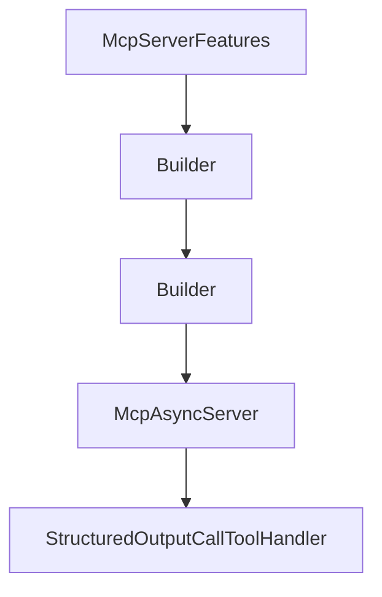

# Chapter 1: Getting Started and Module Selection

Welcome to **Chapter 1: Getting Started and Module Selection**. In this part of **MCP Java SDK Tutorial: Building MCP Clients and Servers with Reactor, Servlet, and Spring**, you will build an intuitive mental model first, then move into concrete implementation details and practical production tradeoffs.


This chapter establishes a clean dependency and runtime baseline for Java MCP projects.

## Learning Goals

- choose between `mcp`, `mcp-core`, and Spring modules
- align Java version and build tooling prerequisites
- avoid premature coupling to one transport or framework layer
- set up reproducible local build/test flows

## Module Selection Guide

| Module | Use When |
|:-------|:---------|
| `mcp` | you want the convenience bundle for most workloads |
| `mcp-core` | you need lower-level control and minimal dependencies |
| `mcp-spring` | you are integrating with Spring WebFlux/WebMVC stacks |

## First-Run Steps

1. confirm Java 17+ and Maven wrapper availability
2. start with `mcp` unless you have a strict minimal-dependency requirement
3. run `./mvnw clean install -DskipTests` to validate baseline build
4. move to module-specific integrations only after client/server flows work

## Source References

- [Java SDK README](https://github.com/modelcontextprotocol/java-sdk/blob/main/README.md)
- [mcp Module README](https://github.com/modelcontextprotocol/java-sdk/blob/main/mcp/README.md)
- [Contributing Prerequisites](https://github.com/modelcontextprotocol/java-sdk/blob/main/CONTRIBUTING.md)

## Summary

You now have a stable Java MCP baseline and module decision model.

Next: [Chapter 2: SDK Architecture: Reactive Model and JSON Layer](02-sdk-architecture-reactive-model-and-json-layer.md)

## Source Code Walkthrough

### `mcp-core/src/main/java/io/modelcontextprotocol/server/McpServerFeatures.java`

The `McpServerFeatures` class in [`mcp-core/src/main/java/io/modelcontextprotocol/server/McpServerFeatures.java`](https://github.com/modelcontextprotocol/java-sdk/blob/HEAD/mcp-core/src/main/java/io/modelcontextprotocol/server/McpServerFeatures.java) handles a key part of this chapter's functionality:

```java
 * @author Jihoon Kim
 */
public class McpServerFeatures {

	/**
	 * Asynchronous server features specification.
	 *
	 * @param serverInfo The server implementation details
	 * @param serverCapabilities The server capabilities
	 * @param tools The list of tool specifications
	 * @param resources The map of resource specifications
	 * @param resourceTemplates The list of resource templates
	 * @param prompts The map of prompt specifications
	 * @param rootsChangeConsumers The list of consumers that will be notified when the
	 * roots list changes
	 * @param instructions The server instructions text
	 */
	record Async(McpSchema.Implementation serverInfo, McpSchema.ServerCapabilities serverCapabilities,
			List<McpServerFeatures.AsyncToolSpecification> tools, Map<String, AsyncResourceSpecification> resources,
			Map<String, McpServerFeatures.AsyncResourceTemplateSpecification> resourceTemplates,
			Map<String, McpServerFeatures.AsyncPromptSpecification> prompts,
			Map<McpSchema.CompleteReference, McpServerFeatures.AsyncCompletionSpecification> completions,
			List<BiFunction<McpAsyncServerExchange, List<McpSchema.Root>, Mono<Void>>> rootsChangeConsumers,
			String instructions) {

		/**
		 * Create an instance and validate the arguments.
		 * @param serverInfo The server implementation details
		 * @param serverCapabilities The server capabilities
		 * @param tools The list of tool specifications
		 * @param resources The map of resource specifications
		 * @param resourceTemplates The map of resource templates
```

This class is important because it defines how MCP Java SDK Tutorial: Building MCP Clients and Servers with Reactor, Servlet, and Spring implements the patterns covered in this chapter.

### `mcp-core/src/main/java/io/modelcontextprotocol/server/McpServerFeatures.java`

The `Builder` class in [`mcp-core/src/main/java/io/modelcontextprotocol/server/McpServerFeatures.java`](https://github.com/modelcontextprotocol/java-sdk/blob/HEAD/mcp-core/src/main/java/io/modelcontextprotocol/server/McpServerFeatures.java) handles a key part of this chapter's functionality:

```java

		/**
		 * Builder for creating AsyncToolSpecification instances.
		 */
		public static class Builder {

			private McpSchema.Tool tool;

			private BiFunction<McpAsyncServerExchange, McpSchema.CallToolRequest, Mono<McpSchema.CallToolResult>> callHandler;

			/**
			 * Sets the tool definition.
			 * @param tool The tool definition including name, description, and parameter
			 * schema
			 * @return this builder instance
			 */
			public Builder tool(McpSchema.Tool tool) {
				this.tool = tool;
				return this;
			}

			/**
			 * Sets the call tool handler function.
			 * @param callHandler The function that implements the tool's logic
			 * @return this builder instance
			 */
			public Builder callHandler(
					BiFunction<McpAsyncServerExchange, McpSchema.CallToolRequest, Mono<McpSchema.CallToolResult>> callHandler) {
				this.callHandler = callHandler;
				return this;
			}

```

This class is important because it defines how MCP Java SDK Tutorial: Building MCP Clients and Servers with Reactor, Servlet, and Spring implements the patterns covered in this chapter.

### `mcp-core/src/main/java/io/modelcontextprotocol/server/McpServerFeatures.java`

The `Builder` class in [`mcp-core/src/main/java/io/modelcontextprotocol/server/McpServerFeatures.java`](https://github.com/modelcontextprotocol/java-sdk/blob/HEAD/mcp-core/src/main/java/io/modelcontextprotocol/server/McpServerFeatures.java) handles a key part of this chapter's functionality:

```java

		/**
		 * Builder for creating AsyncToolSpecification instances.
		 */
		public static class Builder {

			private McpSchema.Tool tool;

			private BiFunction<McpAsyncServerExchange, McpSchema.CallToolRequest, Mono<McpSchema.CallToolResult>> callHandler;

			/**
			 * Sets the tool definition.
			 * @param tool The tool definition including name, description, and parameter
			 * schema
			 * @return this builder instance
			 */
			public Builder tool(McpSchema.Tool tool) {
				this.tool = tool;
				return this;
			}

			/**
			 * Sets the call tool handler function.
			 * @param callHandler The function that implements the tool's logic
			 * @return this builder instance
			 */
			public Builder callHandler(
					BiFunction<McpAsyncServerExchange, McpSchema.CallToolRequest, Mono<McpSchema.CallToolResult>> callHandler) {
				this.callHandler = callHandler;
				return this;
			}

```

This class is important because it defines how MCP Java SDK Tutorial: Building MCP Clients and Servers with Reactor, Servlet, and Spring implements the patterns covered in this chapter.

### `mcp-core/src/main/java/io/modelcontextprotocol/server/McpAsyncServer.java`

The `McpAsyncServer` class in [`mcp-core/src/main/java/io/modelcontextprotocol/server/McpAsyncServer.java`](https://github.com/modelcontextprotocol/java-sdk/blob/HEAD/mcp-core/src/main/java/io/modelcontextprotocol/server/McpAsyncServer.java) handles a key part of this chapter's functionality:

```java
 * @see McpClientSession
 */
public class McpAsyncServer {

	private static final Logger logger = LoggerFactory.getLogger(McpAsyncServer.class);

	private final McpServerTransportProviderBase mcpTransportProvider;

	private final McpJsonMapper jsonMapper;

	private final JsonSchemaValidator jsonSchemaValidator;

	private final McpSchema.ServerCapabilities serverCapabilities;

	private final McpSchema.Implementation serverInfo;

	private final String instructions;

	private final CopyOnWriteArrayList<McpServerFeatures.AsyncToolSpecification> tools = new CopyOnWriteArrayList<>();

	private final ConcurrentHashMap<String, McpServerFeatures.AsyncResourceSpecification> resources = new ConcurrentHashMap<>();

	private final ConcurrentHashMap<String, McpServerFeatures.AsyncResourceTemplateSpecification> resourceTemplates = new ConcurrentHashMap<>();

	private final ConcurrentHashMap<String, McpServerFeatures.AsyncPromptSpecification> prompts = new ConcurrentHashMap<>();

	private final ConcurrentHashMap<McpSchema.CompleteReference, McpServerFeatures.AsyncCompletionSpecification> completions = new ConcurrentHashMap<>();

	private final ConcurrentHashMap<String, Set<String>> resourceSubscriptions = new ConcurrentHashMap<>();

	private List<String> protocolVersions;

```

This class is important because it defines how MCP Java SDK Tutorial: Building MCP Clients and Servers with Reactor, Servlet, and Spring implements the patterns covered in this chapter.


## How These Components Connect


