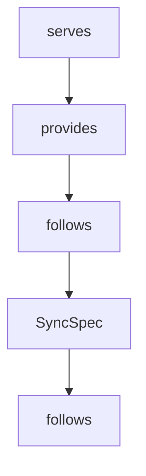

# Chapter 2: SDK Architecture: Reactive Model and JSON Layer

Welcome to **Chapter 2: SDK Architecture: Reactive Model and JSON Layer**. In this part of **MCP Java SDK Tutorial: Building MCP Clients and Servers with Reactor, Servlet, and Spring**, you will build an intuitive mental model first, then move into concrete implementation details and practical production tradeoffs.


Java SDK architecture choices are deliberate and affect interoperability and operability.

## Learning Goals

- understand the reactive-first API posture and sync facade rationale
- map JSON abstraction and Jackson implementation choices
- reason about observability propagation and logging strategy
- connect architecture choices to deployment constraints

## Architecture Highlights

- reactive streams are the primary abstraction for async and streaming MCP interactions
- sync APIs are layered on top for blocking-friendly usage
- JSON mapper and schema validation are abstracted, with Jackson implementations provided
- logging is SLF4J-based for backend neutrality

## Practical Implications

- keep async boundaries explicit when building high-throughput servers
- use sync facades only where blocking behavior is acceptable
- validate schema configuration early in integration tests
- propagate correlation and trace context across reactive boundaries

## Source References

- [Architecture and Design Decisions](https://github.com/modelcontextprotocol/java-sdk/blob/main/README.md#architecture-and-design-decisions)
- [mcp-core JSON and Schema Packages](https://github.com/modelcontextprotocol/java-sdk/tree/main/mcp-core/src/main/java/io/modelcontextprotocol/json)
- [mcp-json-jackson3 Module](https://github.com/modelcontextprotocol/java-sdk/tree/main/mcp-json-jackson3)

## Summary

You now understand why Java SDK core abstractions are shaped for bidirectional async protocol workloads.

Next: [Chapter 3: Client Transports and Connection Strategy](03-client-transports-and-connection-strategy.md)

## Depth Expansion Playbook

## Source Code Walkthrough

### `mcp-core/src/main/java/io/modelcontextprotocol/client/McpClient.java`

The `serves` class in [`mcp-core/src/main/java/io/modelcontextprotocol/client/McpClient.java`](https://github.com/modelcontextprotocol/java-sdk/blob/HEAD/mcp-core/src/main/java/io/modelcontextprotocol/client/McpClient.java) handles a key part of this chapter's functionality:

```java
 *
 * <p>
 * This class serves as the main entry point for establishing connections with MCP
 * servers, implementing the client-side of the MCP specification. The protocol follows a
 * client-server architecture where:
 * <ul>
 * <li>The client (this implementation) initiates connections and sends requests
 * <li>The server responds to requests and provides access to tools and resources
 * <li>Communication occurs through a transport layer (e.g., stdio, SSE) using JSON-RPC
 * 2.0
 * </ul>
 *
 * <p>
 * The class provides factory methods to create either:
 * <ul>
 * <li>{@link McpAsyncClient} for non-blocking operations with CompletableFuture responses
 * <li>{@link McpSyncClient} for blocking operations with direct responses
 * </ul>
 *
 * <p>
 * Example of creating a basic synchronous client: <pre>{@code
 * McpClient.sync(transport)
 *     .requestTimeout(Duration.ofSeconds(5))
 *     .build();
 * }</pre>
 *
 * Example of creating a basic asynchronous client: <pre>{@code
 * McpClient.async(transport)
 *     .requestTimeout(Duration.ofSeconds(5))
 *     .build();
 * }</pre>
 *
```

This class is important because it defines how MCP Java SDK Tutorial: Building MCP Clients and Servers with Reactor, Servlet, and Spring implements the patterns covered in this chapter.

### `mcp-core/src/main/java/io/modelcontextprotocol/client/McpClient.java`

The `provides` class in [`mcp-core/src/main/java/io/modelcontextprotocol/client/McpClient.java`](https://github.com/modelcontextprotocol/java-sdk/blob/HEAD/mcp-core/src/main/java/io/modelcontextprotocol/client/McpClient.java) handles a key part of this chapter's functionality:

```java
 * <ul>
 * <li>The client (this implementation) initiates connections and sends requests
 * <li>The server responds to requests and provides access to tools and resources
 * <li>Communication occurs through a transport layer (e.g., stdio, SSE) using JSON-RPC
 * 2.0
 * </ul>
 *
 * <p>
 * The class provides factory methods to create either:
 * <ul>
 * <li>{@link McpAsyncClient} for non-blocking operations with CompletableFuture responses
 * <li>{@link McpSyncClient} for blocking operations with direct responses
 * </ul>
 *
 * <p>
 * Example of creating a basic synchronous client: <pre>{@code
 * McpClient.sync(transport)
 *     .requestTimeout(Duration.ofSeconds(5))
 *     .build();
 * }</pre>
 *
 * Example of creating a basic asynchronous client: <pre>{@code
 * McpClient.async(transport)
 *     .requestTimeout(Duration.ofSeconds(5))
 *     .build();
 * }</pre>
 *
 * <p>
 * Example with advanced asynchronous configuration: <pre>{@code
 * McpClient.async(transport)
 *     .requestTimeout(Duration.ofSeconds(10))
 *     .capabilities(new ClientCapabilities(...))
```

This class is important because it defines how MCP Java SDK Tutorial: Building MCP Clients and Servers with Reactor, Servlet, and Spring implements the patterns covered in this chapter.

### `mcp-core/src/main/java/io/modelcontextprotocol/client/McpClient.java`

The `follows` class in [`mcp-core/src/main/java/io/modelcontextprotocol/client/McpClient.java`](https://github.com/modelcontextprotocol/java-sdk/blob/HEAD/mcp-core/src/main/java/io/modelcontextprotocol/client/McpClient.java) handles a key part of this chapter's functionality:

```java
 * <p>
 * This class serves as the main entry point for establishing connections with MCP
 * servers, implementing the client-side of the MCP specification. The protocol follows a
 * client-server architecture where:
 * <ul>
 * <li>The client (this implementation) initiates connections and sends requests
 * <li>The server responds to requests and provides access to tools and resources
 * <li>Communication occurs through a transport layer (e.g., stdio, SSE) using JSON-RPC
 * 2.0
 * </ul>
 *
 * <p>
 * The class provides factory methods to create either:
 * <ul>
 * <li>{@link McpAsyncClient} for non-blocking operations with CompletableFuture responses
 * <li>{@link McpSyncClient} for blocking operations with direct responses
 * </ul>
 *
 * <p>
 * Example of creating a basic synchronous client: <pre>{@code
 * McpClient.sync(transport)
 *     .requestTimeout(Duration.ofSeconds(5))
 *     .build();
 * }</pre>
 *
 * Example of creating a basic asynchronous client: <pre>{@code
 * McpClient.async(transport)
 *     .requestTimeout(Duration.ofSeconds(5))
 *     .build();
 * }</pre>
 *
 * <p>
```

This class is important because it defines how MCP Java SDK Tutorial: Building MCP Clients and Servers with Reactor, Servlet, and Spring implements the patterns covered in this chapter.

### `mcp-core/src/main/java/io/modelcontextprotocol/client/McpClient.java`

The `SyncSpec` class in [`mcp-core/src/main/java/io/modelcontextprotocol/client/McpClient.java`](https://github.com/modelcontextprotocol/java-sdk/blob/HEAD/mcp-core/src/main/java/io/modelcontextprotocol/client/McpClient.java) handles a key part of this chapter's functionality:

```java
	 * @throws IllegalArgumentException if transport is null
	 */
	static SyncSpec sync(McpClientTransport transport) {
		return new SyncSpec(transport);
	}

	/**
	 * Start building an asynchronous MCP client with the specified transport layer. The
	 * asynchronous MCP client provides non-blocking operations. Asynchronous clients
	 * return reactive primitives (Mono/Flux) immediately, allowing for concurrent
	 * operations and reactive programming patterns. The transport layer handles the
	 * low-level communication between client and server using protocols like stdio or
	 * Server-Sent Events (SSE).
	 * @param transport The transport layer implementation for MCP communication. Common
	 * implementations include {@code StdioClientTransport} for stdio-based communication
	 * and {@code SseClientTransport} for SSE-based communication.
	 * @return A new builder instance for configuring the client
	 * @throws IllegalArgumentException if transport is null
	 */
	static AsyncSpec async(McpClientTransport transport) {
		return new AsyncSpec(transport);
	}

	/**
	 * Synchronous client specification. This class follows the builder pattern to provide
	 * a fluent API for setting up clients with custom configurations.
	 *
	 * <p>
	 * The builder supports configuration of:
	 * <ul>
	 * <li>Transport layer for client-server communication
	 * <li>Request timeouts for operation boundaries
```

This class is important because it defines how MCP Java SDK Tutorial: Building MCP Clients and Servers with Reactor, Servlet, and Spring implements the patterns covered in this chapter.


## How These Components Connect


