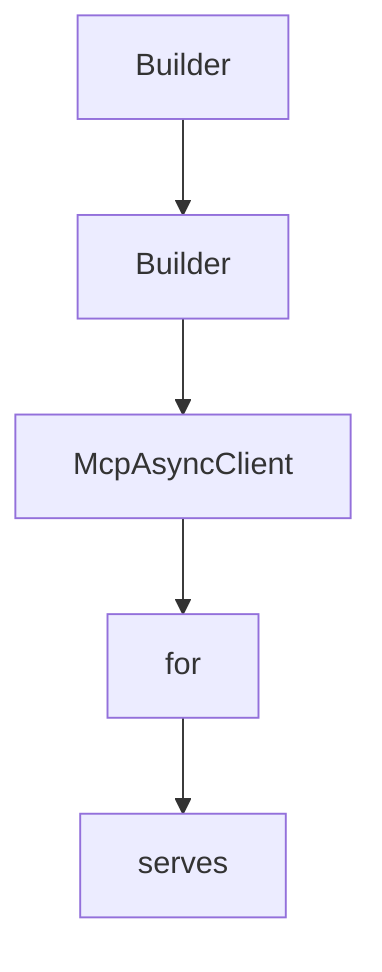

# Chapter 2: SDK Architecture: Reactive Model and JSON Layer

Welcome to **Chapter 2: SDK Architecture: Reactive Model and JSON Layer**. In this part of **MCP Java SDK Tutorial: Building MCP Clients and Servers with Reactor, Servlet, and Spring**, you will build an intuitive mental model first, then move into concrete implementation details and practical production tradeoffs.


Java SDK architecture choices are deliberate and affect interoperability and operability.

## Learning Goals

- understand the reactive-first API posture and sync facade rationale
- map JSON abstraction and Jackson implementation choices
- reason about observability propagation and logging strategy
- connect architecture choices to deployment constraints

## Architecture Highlights

- reactive streams are the primary abstraction for async and streaming MCP interactions
- sync APIs are layered on top for blocking-friendly usage
- JSON mapper and schema validation are abstracted, with Jackson implementations provided
- logging is SLF4J-based for backend neutrality

## Practical Implications

- keep async boundaries explicit when building high-throughput servers
- use sync facades only where blocking behavior is acceptable
- validate schema configuration early in integration tests
- propagate correlation and trace context across reactive boundaries

## Source References

- [Architecture and Design Decisions](https://github.com/modelcontextprotocol/java-sdk/blob/main/README.md#architecture-and-design-decisions)
- [mcp-core JSON and Schema Packages](https://github.com/modelcontextprotocol/java-sdk/tree/main/mcp-core/src/main/java/io/modelcontextprotocol/json)
- [mcp-json-jackson3 Module](https://github.com/modelcontextprotocol/java-sdk/tree/main/mcp-json-jackson3)

## Summary

You now understand why Java SDK core abstractions are shaped for bidirectional async protocol workloads.

Next: [Chapter 3: Client Transports and Connection Strategy](03-client-transports-and-connection-strategy.md)

## Source Code Walkthrough

### `mcp-core/src/main/java/io/modelcontextprotocol/server/McpStatelessServerFeatures.java`

The `Builder` class in [`mcp-core/src/main/java/io/modelcontextprotocol/server/McpStatelessServerFeatures.java`](https://github.com/modelcontextprotocol/java-sdk/blob/HEAD/mcp-core/src/main/java/io/modelcontextprotocol/server/McpStatelessServerFeatures.java) handles a key part of this chapter's functionality:

```java

		/**
		 * Builder for creating AsyncToolSpecification instances.
		 */
		public static class Builder {

			private McpSchema.Tool tool;

			private BiFunction<McpTransportContext, CallToolRequest, Mono<McpSchema.CallToolResult>> callHandler;

			/**
			 * Sets the tool definition.
			 * @param tool The tool definition including name, description, and parameter
			 * schema
			 * @return this builder instance
			 */
			public Builder tool(McpSchema.Tool tool) {
				this.tool = tool;
				return this;
			}

			/**
			 * Sets the call tool handler function.
			 * @param callHandler The function that implements the tool's logic
			 * @return this builder instance
			 */
			public Builder callHandler(
					BiFunction<McpTransportContext, CallToolRequest, Mono<McpSchema.CallToolResult>> callHandler) {
				this.callHandler = callHandler;
				return this;
			}

```

This class is important because it defines how MCP Java SDK Tutorial: Building MCP Clients and Servers with Reactor, Servlet, and Spring implements the patterns covered in this chapter.

### `mcp-core/src/main/java/io/modelcontextprotocol/server/McpStatelessServerFeatures.java`

The `Builder` class in [`mcp-core/src/main/java/io/modelcontextprotocol/server/McpStatelessServerFeatures.java`](https://github.com/modelcontextprotocol/java-sdk/blob/HEAD/mcp-core/src/main/java/io/modelcontextprotocol/server/McpStatelessServerFeatures.java) handles a key part of this chapter's functionality:

```java

		/**
		 * Builder for creating AsyncToolSpecification instances.
		 */
		public static class Builder {

			private McpSchema.Tool tool;

			private BiFunction<McpTransportContext, CallToolRequest, Mono<McpSchema.CallToolResult>> callHandler;

			/**
			 * Sets the tool definition.
			 * @param tool The tool definition including name, description, and parameter
			 * schema
			 * @return this builder instance
			 */
			public Builder tool(McpSchema.Tool tool) {
				this.tool = tool;
				return this;
			}

			/**
			 * Sets the call tool handler function.
			 * @param callHandler The function that implements the tool's logic
			 * @return this builder instance
			 */
			public Builder callHandler(
					BiFunction<McpTransportContext, CallToolRequest, Mono<McpSchema.CallToolResult>> callHandler) {
				this.callHandler = callHandler;
				return this;
			}

```

This class is important because it defines how MCP Java SDK Tutorial: Building MCP Clients and Servers with Reactor, Servlet, and Spring implements the patterns covered in this chapter.

### `mcp-core/src/main/java/io/modelcontextprotocol/client/McpAsyncClient.java`

The `McpAsyncClient` class in [`mcp-core/src/main/java/io/modelcontextprotocol/client/McpAsyncClient.java`](https://github.com/modelcontextprotocol/java-sdk/blob/HEAD/mcp-core/src/main/java/io/modelcontextprotocol/client/McpAsyncClient.java) handles a key part of this chapter's functionality:

```java
 * @see McpClientTransport
 */
public class McpAsyncClient {

	private static final Logger logger = LoggerFactory.getLogger(McpAsyncClient.class);

	private static final TypeRef<Void> VOID_TYPE_REFERENCE = new TypeRef<>() {
	};

	public static final TypeRef<Object> OBJECT_TYPE_REF = new TypeRef<>() {
	};

	public static final TypeRef<PaginatedRequest> PAGINATED_REQUEST_TYPE_REF = new TypeRef<>() {
	};

	public static final TypeRef<McpSchema.InitializeResult> INITIALIZE_RESULT_TYPE_REF = new TypeRef<>() {
	};

	public static final TypeRef<CreateMessageRequest> CREATE_MESSAGE_REQUEST_TYPE_REF = new TypeRef<>() {
	};

	public static final TypeRef<LoggingMessageNotification> LOGGING_MESSAGE_NOTIFICATION_TYPE_REF = new TypeRef<>() {
	};

	public static final TypeRef<McpSchema.ProgressNotification> PROGRESS_NOTIFICATION_TYPE_REF = new TypeRef<>() {
	};

	public static final String NEGOTIATED_PROTOCOL_VERSION = "io.modelcontextprotocol.client.negotiated-protocol-version";

	/**
	 * Client capabilities.
	 */
```

This class is important because it defines how MCP Java SDK Tutorial: Building MCP Clients and Servers with Reactor, Servlet, and Spring implements the patterns covered in this chapter.

### `mcp-core/src/main/java/io/modelcontextprotocol/client/McpClient.java`

The `for` class in [`mcp-core/src/main/java/io/modelcontextprotocol/client/McpClient.java`](https://github.com/modelcontextprotocol/java-sdk/blob/HEAD/mcp-core/src/main/java/io/modelcontextprotocol/client/McpClient.java) handles a key part of this chapter's functionality:

```java

/**
 * Factory class for creating Model Context Protocol (MCP) clients. MCP is a protocol that
 * enables AI models to interact with external tools and resources through a standardized
 * interface.
 *
 * <p>
 * This class serves as the main entry point for establishing connections with MCP
 * servers, implementing the client-side of the MCP specification. The protocol follows a
 * client-server architecture where:
 * <ul>
 * <li>The client (this implementation) initiates connections and sends requests
 * <li>The server responds to requests and provides access to tools and resources
 * <li>Communication occurs through a transport layer (e.g., stdio, SSE) using JSON-RPC
 * 2.0
 * </ul>
 *
 * <p>
 * The class provides factory methods to create either:
 * <ul>
 * <li>{@link McpAsyncClient} for non-blocking operations with CompletableFuture responses
 * <li>{@link McpSyncClient} for blocking operations with direct responses
 * </ul>
 *
 * <p>
 * Example of creating a basic synchronous client: <pre>{@code
 * McpClient.sync(transport)
 *     .requestTimeout(Duration.ofSeconds(5))
 *     .build();
 * }</pre>
 *
 * Example of creating a basic asynchronous client: <pre>{@code
```

This class is important because it defines how MCP Java SDK Tutorial: Building MCP Clients and Servers with Reactor, Servlet, and Spring implements the patterns covered in this chapter.


## How These Components Connect


