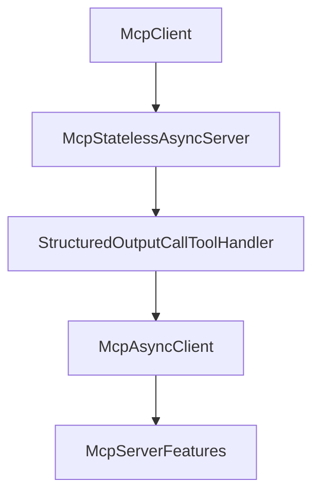

# Chapter 3: Client Transports and Connection Strategy

Welcome to **Chapter 3: Client Transports and Connection Strategy**. In this part of **MCP Java SDK Tutorial: Building MCP Clients and Servers with Reactor, Servlet, and Spring**, you will build an intuitive mental model first, then move into concrete implementation details and practical production tradeoffs.


Client transport choice should match server topology and runtime constraints.

## Learning Goals

- choose transport strategy for local subprocess vs remote HTTP servers
- understand JDK HttpClient and Spring WebClient integration options
- plan reconnection and streaming behavior explicitly
- keep client capability handling predictable

## Transport Strategy Matrix

| Option | Best Fit | Primary Risk |
|:-------|:---------|:-------------|
| Stdio client transport | local tool servers launched by host process | process lifecycle fragility |
| JDK HTTP streamable transport | standard Java deployments without Spring | HTTP/session edge-case handling |
| Spring WebClient transport | Spring-native reactive apps | configuration spread across layers |

## Source References

- [Java SDK README - Client Transport Decisions](https://github.com/modelcontextprotocol/java-sdk/blob/main/README.md)
- [HttpClient Streamable Transport Class](https://github.com/modelcontextprotocol/java-sdk/blob/main/mcp-core/src/main/java/io/modelcontextprotocol/client/transport/HttpClientStreamableHttpTransport.java)
- [Stdio Client Transport Class](https://github.com/modelcontextprotocol/java-sdk/blob/main/mcp-core/src/main/java/io/modelcontextprotocol/client/transport/StdioClientTransport.java)
- [WebFlux Client Transport](https://github.com/modelcontextprotocol/java-sdk/blob/main/mcp-spring/mcp-spring-webflux/src/main/java/io/modelcontextprotocol/client/transport/WebClientStreamableHttpTransport.java)

## Summary

You now have a transport selection framework for Java clients that balances simplicity and runtime resilience.

Next: [Chapter 4: Server Transports and Deployment Patterns](04-server-transports-and-deployment-patterns.md)

## Depth Expansion Playbook

## Source Code Walkthrough

### `mcp-core/src/main/java/io/modelcontextprotocol/client/McpClient.java`

The `McpClient` interface in [`mcp-core/src/main/java/io/modelcontextprotocol/client/McpClient.java`](https://github.com/modelcontextprotocol/java-sdk/blob/HEAD/mcp-core/src/main/java/io/modelcontextprotocol/client/McpClient.java) handles a key part of this chapter's functionality:

```java
import io.modelcontextprotocol.json.McpJsonDefaults;
import io.modelcontextprotocol.json.schema.JsonSchemaValidator;
import io.modelcontextprotocol.spec.McpClientTransport;
import io.modelcontextprotocol.spec.McpSchema;
import io.modelcontextprotocol.spec.McpSchema.ClientCapabilities;
import io.modelcontextprotocol.spec.McpSchema.CreateMessageRequest;
import io.modelcontextprotocol.spec.McpSchema.CreateMessageResult;
import io.modelcontextprotocol.spec.McpSchema.ElicitRequest;
import io.modelcontextprotocol.spec.McpSchema.ElicitResult;
import io.modelcontextprotocol.spec.McpSchema.Implementation;
import io.modelcontextprotocol.spec.McpSchema.Root;
import io.modelcontextprotocol.spec.McpTransport;
import io.modelcontextprotocol.util.Assert;
import reactor.core.publisher.Mono;

import java.time.Duration;
import java.util.ArrayList;
import java.util.HashMap;
import java.util.List;
import java.util.Map;
import java.util.function.Consumer;
import java.util.function.Function;
import java.util.function.Supplier;

/**
 * Factory class for creating Model Context Protocol (MCP) clients. MCP is a protocol that
 * enables AI models to interact with external tools and resources through a standardized
 * interface.
 *
 * <p>
 * This class serves as the main entry point for establishing connections with MCP
 * servers, implementing the client-side of the MCP specification. The protocol follows a
```

This interface is important because it defines how MCP Java SDK Tutorial: Building MCP Clients and Servers with Reactor, Servlet, and Spring implements the patterns covered in this chapter.

### `mcp-core/src/main/java/io/modelcontextprotocol/server/McpStatelessAsyncServer.java`

The `McpStatelessAsyncServer` class in [`mcp-core/src/main/java/io/modelcontextprotocol/server/McpStatelessAsyncServer.java`](https://github.com/modelcontextprotocol/java-sdk/blob/HEAD/mcp-core/src/main/java/io/modelcontextprotocol/server/McpStatelessAsyncServer.java) handles a key part of this chapter's functionality:

```java
 * @author Dariusz Jędrzejczyk
 */
public class McpStatelessAsyncServer {

	private static final Logger logger = LoggerFactory.getLogger(McpStatelessAsyncServer.class);

	private final McpStatelessServerTransport mcpTransportProvider;

	private final McpJsonMapper jsonMapper;

	private final McpSchema.ServerCapabilities serverCapabilities;

	private final McpSchema.Implementation serverInfo;

	private final String instructions;

	private final CopyOnWriteArrayList<McpStatelessServerFeatures.AsyncToolSpecification> tools = new CopyOnWriteArrayList<>();

	private final ConcurrentHashMap<String, McpStatelessServerFeatures.AsyncResourceTemplateSpecification> resourceTemplates = new ConcurrentHashMap<>();

	private final ConcurrentHashMap<String, McpStatelessServerFeatures.AsyncResourceSpecification> resources = new ConcurrentHashMap<>();

	private final ConcurrentHashMap<String, McpStatelessServerFeatures.AsyncPromptSpecification> prompts = new ConcurrentHashMap<>();

	private final ConcurrentHashMap<McpSchema.CompleteReference, McpStatelessServerFeatures.AsyncCompletionSpecification> completions = new ConcurrentHashMap<>();

	private List<String> protocolVersions;

	private McpUriTemplateManagerFactory uriTemplateManagerFactory = new DefaultMcpUriTemplateManagerFactory();

	private final JsonSchemaValidator jsonSchemaValidator;

```

This class is important because it defines how MCP Java SDK Tutorial: Building MCP Clients and Servers with Reactor, Servlet, and Spring implements the patterns covered in this chapter.

### `mcp-core/src/main/java/io/modelcontextprotocol/server/McpStatelessAsyncServer.java`

The `StructuredOutputCallToolHandler` class in [`mcp-core/src/main/java/io/modelcontextprotocol/server/McpStatelessAsyncServer.java`](https://github.com/modelcontextprotocol/java-sdk/blob/HEAD/mcp-core/src/main/java/io/modelcontextprotocol/server/McpStatelessAsyncServer.java) handles a key part of this chapter's functionality:

```java
			McpStatelessServerFeatures.AsyncToolSpecification toolSpecification) {

		if (toolSpecification.callHandler() instanceof StructuredOutputCallToolHandler) {
			// If the tool is already wrapped, return it as is
			return toolSpecification;
		}

		if (toolSpecification.tool().outputSchema() == null) {
			// If the tool does not have an output schema, return it as is
			return toolSpecification;
		}

		return new McpStatelessServerFeatures.AsyncToolSpecification(toolSpecification.tool(),
				new StructuredOutputCallToolHandler(jsonSchemaValidator, toolSpecification.tool().outputSchema(),
						toolSpecification.callHandler()));
	}

	private static class StructuredOutputCallToolHandler
			implements BiFunction<McpTransportContext, McpSchema.CallToolRequest, Mono<McpSchema.CallToolResult>> {

		private final BiFunction<McpTransportContext, McpSchema.CallToolRequest, Mono<McpSchema.CallToolResult>> delegateHandler;

		private final JsonSchemaValidator jsonSchemaValidator;

		private final Map<String, Object> outputSchema;

		public StructuredOutputCallToolHandler(JsonSchemaValidator jsonSchemaValidator,
				Map<String, Object> outputSchema,
				BiFunction<McpTransportContext, McpSchema.CallToolRequest, Mono<McpSchema.CallToolResult>> delegateHandler) {

			Assert.notNull(jsonSchemaValidator, "JsonSchemaValidator must not be null");
			Assert.notNull(delegateHandler, "Delegate call tool result handler must not be null");
```

This class is important because it defines how MCP Java SDK Tutorial: Building MCP Clients and Servers with Reactor, Servlet, and Spring implements the patterns covered in this chapter.

### `mcp-core/src/main/java/io/modelcontextprotocol/client/McpAsyncClient.java`

The `McpAsyncClient` class in [`mcp-core/src/main/java/io/modelcontextprotocol/client/McpAsyncClient.java`](https://github.com/modelcontextprotocol/java-sdk/blob/HEAD/mcp-core/src/main/java/io/modelcontextprotocol/client/McpAsyncClient.java) handles a key part of this chapter's functionality:

```java
 * @see McpClientTransport
 */
public class McpAsyncClient {

	private static final Logger logger = LoggerFactory.getLogger(McpAsyncClient.class);

	private static final TypeRef<Void> VOID_TYPE_REFERENCE = new TypeRef<>() {
	};

	public static final TypeRef<Object> OBJECT_TYPE_REF = new TypeRef<>() {
	};

	public static final TypeRef<PaginatedRequest> PAGINATED_REQUEST_TYPE_REF = new TypeRef<>() {
	};

	public static final TypeRef<McpSchema.InitializeResult> INITIALIZE_RESULT_TYPE_REF = new TypeRef<>() {
	};

	public static final TypeRef<CreateMessageRequest> CREATE_MESSAGE_REQUEST_TYPE_REF = new TypeRef<>() {
	};

	public static final TypeRef<LoggingMessageNotification> LOGGING_MESSAGE_NOTIFICATION_TYPE_REF = new TypeRef<>() {
	};

	public static final TypeRef<McpSchema.ProgressNotification> PROGRESS_NOTIFICATION_TYPE_REF = new TypeRef<>() {
	};

	public static final String NEGOTIATED_PROTOCOL_VERSION = "io.modelcontextprotocol.client.negotiated-protocol-version";

	/**
	 * Client capabilities.
	 */
```

This class is important because it defines how MCP Java SDK Tutorial: Building MCP Clients and Servers with Reactor, Servlet, and Spring implements the patterns covered in this chapter.


## How These Components Connect


