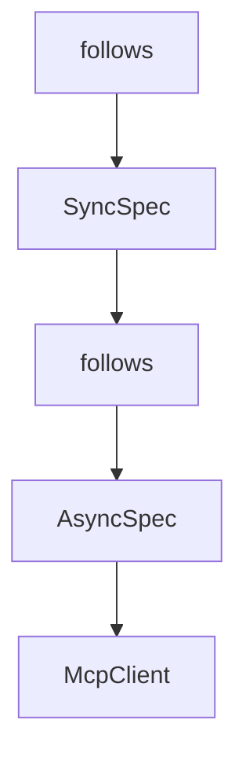

# Chapter 3: Client Transports and Connection Strategy

Welcome to **Chapter 3: Client Transports and Connection Strategy**. In this part of **MCP Java SDK Tutorial: Building MCP Clients and Servers with Reactor, Servlet, and Spring**, you will build an intuitive mental model first, then move into concrete implementation details and practical production tradeoffs.


Client transport choice should match server topology and runtime constraints.

## Learning Goals

- choose transport strategy for local subprocess vs remote HTTP servers
- understand JDK HttpClient and Spring WebClient integration options
- plan reconnection and streaming behavior explicitly
- keep client capability handling predictable

## Transport Strategy Matrix

| Option | Best Fit | Primary Risk |
|:-------|:---------|:-------------|
| Stdio client transport | local tool servers launched by host process | process lifecycle fragility |
| JDK HTTP streamable transport | standard Java deployments without Spring | HTTP/session edge-case handling |
| Spring WebClient transport | Spring-native reactive apps | configuration spread across layers |

## Source References

- [Java SDK README - Client Transport Decisions](https://github.com/modelcontextprotocol/java-sdk/blob/main/README.md)
- [HttpClient Streamable Transport Class](https://github.com/modelcontextprotocol/java-sdk/blob/main/mcp-core/src/main/java/io/modelcontextprotocol/client/transport/HttpClientStreamableHttpTransport.java)
- [Stdio Client Transport Class](https://github.com/modelcontextprotocol/java-sdk/blob/main/mcp-core/src/main/java/io/modelcontextprotocol/client/transport/StdioClientTransport.java)
- [WebFlux Client Transport](https://github.com/modelcontextprotocol/java-sdk/blob/main/mcp-spring/mcp-spring-webflux/src/main/java/io/modelcontextprotocol/client/transport/WebClientStreamableHttpTransport.java)

## Summary

You now have a transport selection framework for Java clients that balances simplicity and runtime resilience.

Next: [Chapter 4: Server Transports and Deployment Patterns](04-server-transports-and-deployment-patterns.md)

## Source Code Walkthrough

### `mcp-core/src/main/java/io/modelcontextprotocol/client/McpClient.java`

The `follows` class in [`mcp-core/src/main/java/io/modelcontextprotocol/client/McpClient.java`](https://github.com/modelcontextprotocol/java-sdk/blob/HEAD/mcp-core/src/main/java/io/modelcontextprotocol/client/McpClient.java) handles a key part of this chapter's functionality:

```java
 * <p>
 * This class serves as the main entry point for establishing connections with MCP
 * servers, implementing the client-side of the MCP specification. The protocol follows a
 * client-server architecture where:
 * <ul>
 * <li>The client (this implementation) initiates connections and sends requests
 * <li>The server responds to requests and provides access to tools and resources
 * <li>Communication occurs through a transport layer (e.g., stdio, SSE) using JSON-RPC
 * 2.0
 * </ul>
 *
 * <p>
 * The class provides factory methods to create either:
 * <ul>
 * <li>{@link McpAsyncClient} for non-blocking operations with CompletableFuture responses
 * <li>{@link McpSyncClient} for blocking operations with direct responses
 * </ul>
 *
 * <p>
 * Example of creating a basic synchronous client: <pre>{@code
 * McpClient.sync(transport)
 *     .requestTimeout(Duration.ofSeconds(5))
 *     .build();
 * }</pre>
 *
 * Example of creating a basic asynchronous client: <pre>{@code
 * McpClient.async(transport)
 *     .requestTimeout(Duration.ofSeconds(5))
 *     .build();
 * }</pre>
 *
 * <p>
```

This class is important because it defines how MCP Java SDK Tutorial: Building MCP Clients and Servers with Reactor, Servlet, and Spring implements the patterns covered in this chapter.

### `mcp-core/src/main/java/io/modelcontextprotocol/client/McpClient.java`

The `SyncSpec` class in [`mcp-core/src/main/java/io/modelcontextprotocol/client/McpClient.java`](https://github.com/modelcontextprotocol/java-sdk/blob/HEAD/mcp-core/src/main/java/io/modelcontextprotocol/client/McpClient.java) handles a key part of this chapter's functionality:

```java
	 * @throws IllegalArgumentException if transport is null
	 */
	static SyncSpec sync(McpClientTransport transport) {
		return new SyncSpec(transport);
	}

	/**
	 * Start building an asynchronous MCP client with the specified transport layer. The
	 * asynchronous MCP client provides non-blocking operations. Asynchronous clients
	 * return reactive primitives (Mono/Flux) immediately, allowing for concurrent
	 * operations and reactive programming patterns. The transport layer handles the
	 * low-level communication between client and server using protocols like stdio or
	 * Server-Sent Events (SSE).
	 * @param transport The transport layer implementation for MCP communication. Common
	 * implementations include {@code StdioClientTransport} for stdio-based communication
	 * and {@code SseClientTransport} for SSE-based communication.
	 * @return A new builder instance for configuring the client
	 * @throws IllegalArgumentException if transport is null
	 */
	static AsyncSpec async(McpClientTransport transport) {
		return new AsyncSpec(transport);
	}

	/**
	 * Synchronous client specification. This class follows the builder pattern to provide
	 * a fluent API for setting up clients with custom configurations.
	 *
	 * <p>
	 * The builder supports configuration of:
	 * <ul>
	 * <li>Transport layer for client-server communication
	 * <li>Request timeouts for operation boundaries
```

This class is important because it defines how MCP Java SDK Tutorial: Building MCP Clients and Servers with Reactor, Servlet, and Spring implements the patterns covered in this chapter.

### `mcp-core/src/main/java/io/modelcontextprotocol/client/McpClient.java`

The `follows` class in [`mcp-core/src/main/java/io/modelcontextprotocol/client/McpClient.java`](https://github.com/modelcontextprotocol/java-sdk/blob/HEAD/mcp-core/src/main/java/io/modelcontextprotocol/client/McpClient.java) handles a key part of this chapter's functionality:

```java
 * <p>
 * This class serves as the main entry point for establishing connections with MCP
 * servers, implementing the client-side of the MCP specification. The protocol follows a
 * client-server architecture where:
 * <ul>
 * <li>The client (this implementation) initiates connections and sends requests
 * <li>The server responds to requests and provides access to tools and resources
 * <li>Communication occurs through a transport layer (e.g., stdio, SSE) using JSON-RPC
 * 2.0
 * </ul>
 *
 * <p>
 * The class provides factory methods to create either:
 * <ul>
 * <li>{@link McpAsyncClient} for non-blocking operations with CompletableFuture responses
 * <li>{@link McpSyncClient} for blocking operations with direct responses
 * </ul>
 *
 * <p>
 * Example of creating a basic synchronous client: <pre>{@code
 * McpClient.sync(transport)
 *     .requestTimeout(Duration.ofSeconds(5))
 *     .build();
 * }</pre>
 *
 * Example of creating a basic asynchronous client: <pre>{@code
 * McpClient.async(transport)
 *     .requestTimeout(Duration.ofSeconds(5))
 *     .build();
 * }</pre>
 *
 * <p>
```

This class is important because it defines how MCP Java SDK Tutorial: Building MCP Clients and Servers with Reactor, Servlet, and Spring implements the patterns covered in this chapter.

### `mcp-core/src/main/java/io/modelcontextprotocol/client/McpClient.java`

The `AsyncSpec` class in [`mcp-core/src/main/java/io/modelcontextprotocol/client/McpClient.java`](https://github.com/modelcontextprotocol/java-sdk/blob/HEAD/mcp-core/src/main/java/io/modelcontextprotocol/client/McpClient.java) handles a key part of this chapter's functionality:

```java
	 * @throws IllegalArgumentException if transport is null
	 */
	static AsyncSpec async(McpClientTransport transport) {
		return new AsyncSpec(transport);
	}

	/**
	 * Synchronous client specification. This class follows the builder pattern to provide
	 * a fluent API for setting up clients with custom configurations.
	 *
	 * <p>
	 * The builder supports configuration of:
	 * <ul>
	 * <li>Transport layer for client-server communication
	 * <li>Request timeouts for operation boundaries
	 * <li>Client capabilities for feature negotiation
	 * <li>Client implementation details for version tracking
	 * <li>Root URIs for resource access
	 * <li>Change notification handlers for tools, resources, and prompts
	 * <li>Custom message sampling logic
	 * </ul>
	 */
	class SyncSpec {

		private final McpClientTransport transport;

		private Duration requestTimeout = Duration.ofSeconds(20); // Default timeout

		private Duration initializationTimeout = Duration.ofSeconds(20);

		private ClientCapabilities capabilities;

```

This class is important because it defines how MCP Java SDK Tutorial: Building MCP Clients and Servers with Reactor, Servlet, and Spring implements the patterns covered in this chapter.


## How These Components Connect


