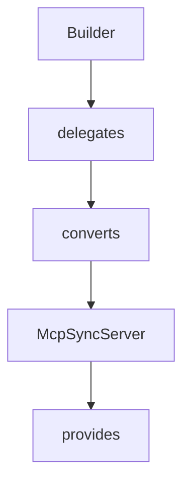

# Chapter 4: Server Transports and Deployment Patterns

Welcome to **Chapter 4: Server Transports and Deployment Patterns**. In this part of **MCP Java SDK Tutorial: Building MCP Clients and Servers with Reactor, Servlet, and Spring**, you will build an intuitive mental model first, then move into concrete implementation details and practical production tradeoffs.


Server transport architecture should be explicit before production rollout.

## Learning Goals

- deploy servlet, WebFlux, or WebMVC server transports based on environment
- understand streamable HTTP provider boundaries
- apply stateless vs sessioned behavior intentionally
- reduce deployment risk by isolating transport concerns

## Deployment Patterns

- embedded servlet transport for portable Java server deployments
- Spring WebFlux for reactive pipelines and non-blocking APIs
- Spring WebMVC for established servlet-style Spring applications
- stdio server provider for local/desktop-oriented integrations

## Source References

- [Conformance Servlet Server README](https://github.com/modelcontextprotocol/java-sdk/blob/main/conformance-tests/server-servlet/README.md)
- [HttpServlet Streamable Transport Provider](https://github.com/modelcontextprotocol/java-sdk/blob/main/mcp-core/src/main/java/io/modelcontextprotocol/server/transport/HttpServletStreamableServerTransportProvider.java)
- [WebFlux Server Transport Provider](https://github.com/modelcontextprotocol/java-sdk/blob/main/mcp-spring/mcp-spring-webflux/src/main/java/io/modelcontextprotocol/server/transport/WebFluxStreamableServerTransportProvider.java)
- [WebMVC Server Transport README](https://github.com/modelcontextprotocol/java-sdk/blob/main/mcp-spring/mcp-spring-webmvc/README.md)

## Summary

You now have deployment-level transport guidance for selecting the right Java runtime surface.

Next: [Chapter 5: Tools, Resources, Prompts, and Schema Validation](05-tools-resources-prompts-and-schema-validation.md)

## Depth Expansion Playbook

## Source Code Walkthrough

### `mcp-core/src/main/java/io/modelcontextprotocol/server/McpServerFeatures.java`

The `Builder` class in [`mcp-core/src/main/java/io/modelcontextprotocol/server/McpServerFeatures.java`](https://github.com/modelcontextprotocol/java-sdk/blob/HEAD/mcp-core/src/main/java/io/modelcontextprotocol/server/McpServerFeatures.java) handles a key part of this chapter's functionality:

```java

		/**
		 * Builder for creating AsyncToolSpecification instances.
		 */
		public static class Builder {

			private McpSchema.Tool tool;

			private BiFunction<McpAsyncServerExchange, McpSchema.CallToolRequest, Mono<McpSchema.CallToolResult>> callHandler;

			/**
			 * Sets the tool definition.
			 * @param tool The tool definition including name, description, and parameter
			 * schema
			 * @return this builder instance
			 */
			public Builder tool(McpSchema.Tool tool) {
				this.tool = tool;
				return this;
			}

			/**
			 * Sets the call tool handler function.
			 * @param callHandler The function that implements the tool's logic
			 * @return this builder instance
			 */
			public Builder callHandler(
					BiFunction<McpAsyncServerExchange, McpSchema.CallToolRequest, Mono<McpSchema.CallToolResult>> callHandler) {
				this.callHandler = callHandler;
				return this;
			}

```

This class is important because it defines how MCP Java SDK Tutorial: Building MCP Clients and Servers with Reactor, Servlet, and Spring implements the patterns covered in this chapter.

### `mcp-core/src/main/java/io/modelcontextprotocol/server/McpSyncServer.java`

The `delegates` class in [`mcp-core/src/main/java/io/modelcontextprotocol/server/McpSyncServer.java`](https://github.com/modelcontextprotocol/java-sdk/blob/HEAD/mcp-core/src/main/java/io/modelcontextprotocol/server/McpSyncServer.java) handles a key part of this chapter's functionality:

```java
/**
 * A synchronous implementation of the Model Context Protocol (MCP) server that wraps
 * {@link McpAsyncServer} to provide blocking operations. This class delegates all
 * operations to an underlying async server instance while providing a simpler,
 * synchronous API for scenarios where reactive programming is not required.
 *
 * <p>
 * The MCP server enables AI models to expose tools, resources, and prompts through a
 * standardized interface. Key features available through this synchronous API include:
 * <ul>
 * <li>Tool registration and management for extending AI model capabilities
 * <li>Resource handling with URI-based addressing for providing context
 * <li>Prompt template management for standardized interactions
 * <li>Real-time client notifications for state changes
 * <li>Structured logging with configurable severity levels
 * <li>Support for client-side AI model sampling
 * </ul>
 *
 * <p>
 * While {@link McpAsyncServer} uses Project Reactor's Mono and Flux types for
 * non-blocking operations, this class converts those into blocking calls, making it more
 * suitable for:
 * <ul>
 * <li>Traditional synchronous applications
 * <li>Simple scripting scenarios
 * <li>Testing and debugging
 * <li>Cases where reactive programming adds unnecessary complexity
 * </ul>
 *
 * <p>
 * The server supports runtime modification of its capabilities through methods like
 * {@link #addTool}, {@link #addResource}, and {@link #addPrompt}, automatically notifying
```

This class is important because it defines how MCP Java SDK Tutorial: Building MCP Clients and Servers with Reactor, Servlet, and Spring implements the patterns covered in this chapter.

### `mcp-core/src/main/java/io/modelcontextprotocol/server/McpSyncServer.java`

The `converts` class in [`mcp-core/src/main/java/io/modelcontextprotocol/server/McpSyncServer.java`](https://github.com/modelcontextprotocol/java-sdk/blob/HEAD/mcp-core/src/main/java/io/modelcontextprotocol/server/McpSyncServer.java) handles a key part of this chapter's functionality:

```java
 * <p>
 * While {@link McpAsyncServer} uses Project Reactor's Mono and Flux types for
 * non-blocking operations, this class converts those into blocking calls, making it more
 * suitable for:
 * <ul>
 * <li>Traditional synchronous applications
 * <li>Simple scripting scenarios
 * <li>Testing and debugging
 * <li>Cases where reactive programming adds unnecessary complexity
 * </ul>
 *
 * <p>
 * The server supports runtime modification of its capabilities through methods like
 * {@link #addTool}, {@link #addResource}, and {@link #addPrompt}, automatically notifying
 * connected clients of changes when configured to do so.
 *
 * @author Christian Tzolov
 * @author Dariusz Jędrzejczyk
 * @see McpAsyncServer
 * @see McpSchema
 */
public class McpSyncServer {

	/**
	 * The async server to wrap.
	 */
	private final McpAsyncServer asyncServer;

	private final boolean immediateExecution;

	/**
	 * Creates a new synchronous server that wraps the provided async server.
```

This class is important because it defines how MCP Java SDK Tutorial: Building MCP Clients and Servers with Reactor, Servlet, and Spring implements the patterns covered in this chapter.

### `mcp-core/src/main/java/io/modelcontextprotocol/server/McpSyncServer.java`

The `McpSyncServer` class in [`mcp-core/src/main/java/io/modelcontextprotocol/server/McpSyncServer.java`](https://github.com/modelcontextprotocol/java-sdk/blob/HEAD/mcp-core/src/main/java/io/modelcontextprotocol/server/McpSyncServer.java) handles a key part of this chapter's functionality:

```java
 * @see McpSchema
 */
public class McpSyncServer {

	/**
	 * The async server to wrap.
	 */
	private final McpAsyncServer asyncServer;

	private final boolean immediateExecution;

	/**
	 * Creates a new synchronous server that wraps the provided async server.
	 * @param asyncServer The async server to wrap
	 */
	public McpSyncServer(McpAsyncServer asyncServer) {
		this(asyncServer, false);
	}

	/**
	 * Creates a new synchronous server that wraps the provided async server.
	 * @param asyncServer The async server to wrap
	 * @param immediateExecution Tools, prompts, and resources handlers execute work
	 * without blocking code offloading. Do NOT set to true if the {@code asyncServer}'s
	 * transport is non-blocking.
	 */
	public McpSyncServer(McpAsyncServer asyncServer, boolean immediateExecution) {
		Assert.notNull(asyncServer, "Async server must not be null");
		this.asyncServer = asyncServer;
		this.immediateExecution = immediateExecution;
	}

```

This class is important because it defines how MCP Java SDK Tutorial: Building MCP Clients and Servers with Reactor, Servlet, and Spring implements the patterns covered in this chapter.


## How These Components Connect


