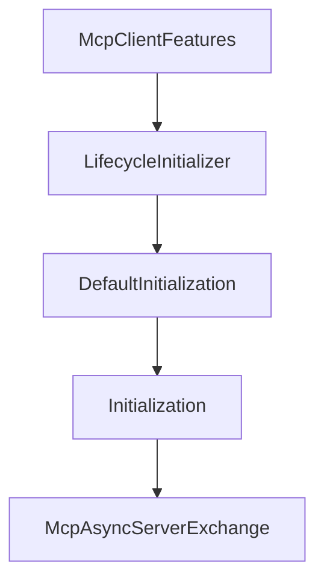

# Chapter 5: Tools, Resources, Prompts, and Schema Validation

Welcome to **Chapter 5: Tools, Resources, Prompts, and Schema Validation**. In this part of **MCP Java SDK Tutorial: Building MCP Clients and Servers with Reactor, Servlet, and Spring**, you will build an intuitive mental model first, then move into concrete implementation details and practical production tradeoffs.


This chapter focuses on building clear server capabilities that clients can trust.

## Learning Goals

- design tool/resource/prompt surfaces with precise contracts
- enforce schema validation and tool naming discipline
- support mixed content responses where needed
- prevent capability sprawl inside a single server

## Capability Quality Checklist

- define strict JSON schemas for tool inputs and outputs
- validate tool names and avoid ambiguous naming patterns
- keep resource URI structure stable and meaningful
- expose only primitives that match the server's real domain boundary

## Source References

- [Server Feature Coverage (Conformance Server)](https://github.com/modelcontextprotocol/java-sdk/blob/main/conformance-tests/server-servlet/README.md)
- [Tool Name Validator](https://github.com/modelcontextprotocol/java-sdk/blob/main/mcp-core/src/main/java/io/modelcontextprotocol/util/ToolNameValidator.java)
- [JSON Schema Validator Interface](https://github.com/modelcontextprotocol/java-sdk/blob/main/mcp-core/src/main/java/io/modelcontextprotocol/spec/JsonSchemaValidator.java)

## Summary

You now have a quality model for Java MCP primitives that improves interoperability and operational clarity.

Next: [Chapter 6: Security, Authorization, and Runtime Controls](06-security-authorization-and-runtime-controls.md)

## Depth Expansion Playbook

## Source Code Walkthrough

### `mcp-core/src/main/java/io/modelcontextprotocol/client/McpClientFeatures.java`

The `McpClientFeatures` class in [`mcp-core/src/main/java/io/modelcontextprotocol/client/McpClientFeatures.java`](https://github.com/modelcontextprotocol/java-sdk/blob/HEAD/mcp-core/src/main/java/io/modelcontextprotocol/client/McpClientFeatures.java) handles a key part of this chapter's functionality:

```java
 * @see McpSchema.ClientCapabilities
 */
class McpClientFeatures {

	/**
	 * Asynchronous client features specification providing the capabilities and request
	 * and notification handlers.
	 *
	 * @param clientInfo the client implementation information.
	 * @param clientCapabilities the client capabilities.
	 * @param roots the roots.
	 * @param toolsChangeConsumers the tools change consumers.
	 * @param resourcesChangeConsumers the resources change consumers.
	 * @param promptsChangeConsumers the prompts change consumers.
	 * @param loggingConsumers the logging consumers.
	 * @param progressConsumers the progress consumers.
	 * @param samplingHandler the sampling handler.
	 * @param elicitationHandler the elicitation handler.
	 * @param enableCallToolSchemaCaching whether to enable call tool schema caching.
	 */
	record Async(McpSchema.Implementation clientInfo, McpSchema.ClientCapabilities clientCapabilities,
			Map<String, McpSchema.Root> roots, List<Function<List<McpSchema.Tool>, Mono<Void>>> toolsChangeConsumers,
			List<Function<List<McpSchema.Resource>, Mono<Void>>> resourcesChangeConsumers,
			List<Function<List<McpSchema.ResourceContents>, Mono<Void>>> resourcesUpdateConsumers,
			List<Function<List<McpSchema.Prompt>, Mono<Void>>> promptsChangeConsumers,
			List<Function<McpSchema.LoggingMessageNotification, Mono<Void>>> loggingConsumers,
			List<Function<McpSchema.ProgressNotification, Mono<Void>>> progressConsumers,
			Function<McpSchema.CreateMessageRequest, Mono<McpSchema.CreateMessageResult>> samplingHandler,
			Function<McpSchema.ElicitRequest, Mono<McpSchema.ElicitResult>> elicitationHandler,
			boolean enableCallToolSchemaCaching) {

		/**
```

This class is important because it defines how MCP Java SDK Tutorial: Building MCP Clients and Servers with Reactor, Servlet, and Spring implements the patterns covered in this chapter.

### `mcp-core/src/main/java/io/modelcontextprotocol/client/LifecycleInitializer.java`

The `LifecycleInitializer` class in [`mcp-core/src/main/java/io/modelcontextprotocol/client/LifecycleInitializer.java`](https://github.com/modelcontextprotocol/java-sdk/blob/HEAD/mcp-core/src/main/java/io/modelcontextprotocol/client/LifecycleInitializer.java) handles a key part of this chapter's functionality:

```java
 * </ul>
 */
class LifecycleInitializer {

	private static final Logger logger = LoggerFactory.getLogger(LifecycleInitializer.class);

	/**
	 * The MCP session supplier that manages bidirectional JSON-RPC communication between
	 * clients and servers.
	 */
	private final Function<ContextView, McpClientSession> sessionSupplier;

	private final McpSchema.ClientCapabilities clientCapabilities;

	private final McpSchema.Implementation clientInfo;

	private List<String> protocolVersions;

	private final AtomicReference<DefaultInitialization> initializationRef = new AtomicReference<>();

	/**
	 * The max timeout to await for the client-server connection to be initialized.
	 */
	private final Duration initializationTimeout;

	/**
	 * Post-initialization hook to perform additional operations after every successful
	 * initialization.
	 */
	private final Function<Initialization, Mono<Void>> postInitializationHook;

	public LifecycleInitializer(McpSchema.ClientCapabilities clientCapabilities, McpSchema.Implementation clientInfo,
```

This class is important because it defines how MCP Java SDK Tutorial: Building MCP Clients and Servers with Reactor, Servlet, and Spring implements the patterns covered in this chapter.

### `mcp-core/src/main/java/io/modelcontextprotocol/client/LifecycleInitializer.java`

The `DefaultInitialization` class in [`mcp-core/src/main/java/io/modelcontextprotocol/client/LifecycleInitializer.java`](https://github.com/modelcontextprotocol/java-sdk/blob/HEAD/mcp-core/src/main/java/io/modelcontextprotocol/client/LifecycleInitializer.java) handles a key part of this chapter's functionality:

```java
	private List<String> protocolVersions;

	private final AtomicReference<DefaultInitialization> initializationRef = new AtomicReference<>();

	/**
	 * The max timeout to await for the client-server connection to be initialized.
	 */
	private final Duration initializationTimeout;

	/**
	 * Post-initialization hook to perform additional operations after every successful
	 * initialization.
	 */
	private final Function<Initialization, Mono<Void>> postInitializationHook;

	public LifecycleInitializer(McpSchema.ClientCapabilities clientCapabilities, McpSchema.Implementation clientInfo,
			List<String> protocolVersions, Duration initializationTimeout,
			Function<ContextView, McpClientSession> sessionSupplier,
			Function<Initialization, Mono<Void>> postInitializationHook) {

		Assert.notNull(sessionSupplier, "Session supplier must not be null");
		Assert.notNull(clientCapabilities, "Client capabilities must not be null");
		Assert.notNull(clientInfo, "Client info must not be null");
		Assert.notEmpty(protocolVersions, "Protocol versions must not be empty");
		Assert.notNull(initializationTimeout, "Initialization timeout must not be null");
		Assert.notNull(postInitializationHook, "Post-initialization hook must not be null");

		this.sessionSupplier = sessionSupplier;
		this.clientCapabilities = clientCapabilities;
		this.clientInfo = clientInfo;
		this.protocolVersions = Collections.unmodifiableList(new ArrayList<>(protocolVersions));
		this.initializationTimeout = initializationTimeout;
```

This class is important because it defines how MCP Java SDK Tutorial: Building MCP Clients and Servers with Reactor, Servlet, and Spring implements the patterns covered in this chapter.

### `mcp-core/src/main/java/io/modelcontextprotocol/client/LifecycleInitializer.java`

The `Initialization` interface in [`mcp-core/src/main/java/io/modelcontextprotocol/client/LifecycleInitializer.java`](https://github.com/modelcontextprotocol/java-sdk/blob/HEAD/mcp-core/src/main/java/io/modelcontextprotocol/client/LifecycleInitializer.java) handles a key part of this chapter's functionality:

```java
 * </ul>
 *
 * <b>Client Initialization Process</b>
 * <p>
 * The client MUST initiate this phase by sending an initialize request containing:
 * <ul>
 * <li>Protocol version supported</li>
 * <li>Client capabilities</li>
 * <li>Client implementation information</li>
 * </ul>
 *
 * <p>
 * After successful initialization, the client MUST send an initialized notification to
 * indicate it is ready to begin normal operations.
 *
 * <b>Server Response</b>
 * <p>
 * The server MUST respond with its own capabilities and information.
 *
 * <b>Protocol Version Negotiation</b>
 * <p>
 * In the initialize request, the client MUST send a protocol version it supports. This
 * SHOULD be the latest version supported by the client.
 *
 * <p>
 * If the server supports the requested protocol version, it MUST respond with the same
 * version. Otherwise, the server MUST respond with another protocol version it supports.
 * This SHOULD be the latest version supported by the server.
 *
 * <p>
 * If the client does not support the version in the server's response, it SHOULD
 * disconnect.
```

This interface is important because it defines how MCP Java SDK Tutorial: Building MCP Clients and Servers with Reactor, Servlet, and Spring implements the patterns covered in this chapter.


## How These Components Connect


