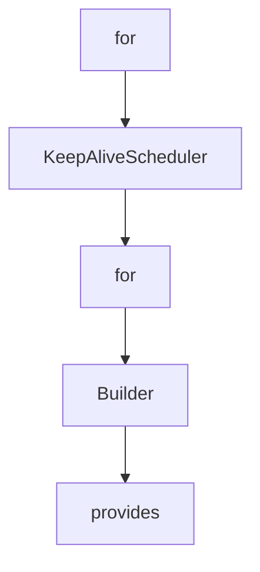

# Chapter 6: Security, Authorization, and Runtime Controls

Welcome to **Chapter 6: Security, Authorization, and Runtime Controls**. In this part of **MCP Java SDK Tutorial: Building MCP Clients and Servers with Reactor, Servlet, and Spring**, you will build an intuitive mental model first, then move into concrete implementation details and practical production tradeoffs.


Java SDK security posture depends on transport controls and host-level authorization integration.

## Learning Goals

- apply transport-level security validators for HTTP deployments
- integrate authorization through framework-native controls
- align runtime behavior with MCP security best practices
- avoid weak defaults around origin and session handling

## Security Principles

- enforce origin/session protections in HTTP transport providers
- keep authorization hooks pluggable to fit existing security stacks
- treat server tool/resource scope as least-privilege surfaces
- log security-relevant events with enough context for incident triage

## Source References

- [Security Policy](https://github.com/modelcontextprotocol/java-sdk/blob/main/SECURITY.md)
- [Server Transport Security Validator](https://github.com/modelcontextprotocol/java-sdk/blob/main/mcp-core/src/main/java/io/modelcontextprotocol/server/transport/ServerTransportSecurityValidator.java)
- [Default Security Validator](https://github.com/modelcontextprotocol/java-sdk/blob/main/mcp-core/src/main/java/io/modelcontextprotocol/server/transport/DefaultServerTransportSecurityValidator.java)
- [Contributing - Security Section](https://github.com/modelcontextprotocol/java-sdk/blob/main/CONTRIBUTING.md)

## Summary

You now have a security baseline for Java MCP services that is compatible with framework-specific auth policies.

Next: [Chapter 7: Conformance Testing and Quality Workflows](07-conformance-testing-and-quality-workflows.md)

## Depth Expansion Playbook

## Source Code Walkthrough

### `mcp-core/src/main/java/io/modelcontextprotocol/util/KeepAliveScheduler.java`

The `for` class in [`mcp-core/src/main/java/io/modelcontextprotocol/util/KeepAliveScheduler.java`](https://github.com/modelcontextprotocol/java-sdk/blob/HEAD/mcp-core/src/main/java/io/modelcontextprotocol/util/KeepAliveScheduler.java) handles a key part of this chapter's functionality:

```java

/**
 * A utility class for scheduling regular keep-alive calls to maintain connections. It
 * sends periodic keep-alive, ping, messages to connected mcp clients to prevent idle
 * timeouts.
 *
 * The pings are sent to all active mcp sessions at regular intervals.
 *
 * @author Christian Tzolov
 */
public class KeepAliveScheduler {

	private static final Logger logger = LoggerFactory.getLogger(KeepAliveScheduler.class);

	private static final TypeRef<Object> OBJECT_TYPE_REF = new TypeRef<>() {
	};

	/** Initial delay before the first keepAlive call */
	private final Duration initialDelay;

	/** Interval between subsequent keepAlive calls */
	private final Duration interval;

	/** The scheduler used for executing keepAlive calls */
	private final Scheduler scheduler;

	/** The current state of the scheduler */
	private final AtomicBoolean isRunning = new AtomicBoolean(false);

	/** The current subscription for the keepAlive calls */
	private Disposable currentSubscription;

```

This class is important because it defines how MCP Java SDK Tutorial: Building MCP Clients and Servers with Reactor, Servlet, and Spring implements the patterns covered in this chapter.

### `mcp-core/src/main/java/io/modelcontextprotocol/util/KeepAliveScheduler.java`

The `KeepAliveScheduler` class in [`mcp-core/src/main/java/io/modelcontextprotocol/util/KeepAliveScheduler.java`](https://github.com/modelcontextprotocol/java-sdk/blob/HEAD/mcp-core/src/main/java/io/modelcontextprotocol/util/KeepAliveScheduler.java) handles a key part of this chapter's functionality:

```java
 * @author Christian Tzolov
 */
public class KeepAliveScheduler {

	private static final Logger logger = LoggerFactory.getLogger(KeepAliveScheduler.class);

	private static final TypeRef<Object> OBJECT_TYPE_REF = new TypeRef<>() {
	};

	/** Initial delay before the first keepAlive call */
	private final Duration initialDelay;

	/** Interval between subsequent keepAlive calls */
	private final Duration interval;

	/** The scheduler used for executing keepAlive calls */
	private final Scheduler scheduler;

	/** The current state of the scheduler */
	private final AtomicBoolean isRunning = new AtomicBoolean(false);

	/** The current subscription for the keepAlive calls */
	private Disposable currentSubscription;

	// TODO Currently we do not support the streams (streamable http session created by
	// http post/get)

	/** Supplier for reactive McpSession instances */
	private final Supplier<Flux<McpSession>> mcpSessions;

	/**
	 * Creates a KeepAliveScheduler with a custom scheduler, initial delay, interval and a
```

This class is important because it defines how MCP Java SDK Tutorial: Building MCP Clients and Servers with Reactor, Servlet, and Spring implements the patterns covered in this chapter.

### `mcp-core/src/main/java/io/modelcontextprotocol/util/KeepAliveScheduler.java`

The `for` class in [`mcp-core/src/main/java/io/modelcontextprotocol/util/KeepAliveScheduler.java`](https://github.com/modelcontextprotocol/java-sdk/blob/HEAD/mcp-core/src/main/java/io/modelcontextprotocol/util/KeepAliveScheduler.java) handles a key part of this chapter's functionality:

```java

/**
 * A utility class for scheduling regular keep-alive calls to maintain connections. It
 * sends periodic keep-alive, ping, messages to connected mcp clients to prevent idle
 * timeouts.
 *
 * The pings are sent to all active mcp sessions at regular intervals.
 *
 * @author Christian Tzolov
 */
public class KeepAliveScheduler {

	private static final Logger logger = LoggerFactory.getLogger(KeepAliveScheduler.class);

	private static final TypeRef<Object> OBJECT_TYPE_REF = new TypeRef<>() {
	};

	/** Initial delay before the first keepAlive call */
	private final Duration initialDelay;

	/** Interval between subsequent keepAlive calls */
	private final Duration interval;

	/** The scheduler used for executing keepAlive calls */
	private final Scheduler scheduler;

	/** The current state of the scheduler */
	private final AtomicBoolean isRunning = new AtomicBoolean(false);

	/** The current subscription for the keepAlive calls */
	private Disposable currentSubscription;

```

This class is important because it defines how MCP Java SDK Tutorial: Building MCP Clients and Servers with Reactor, Servlet, and Spring implements the patterns covered in this chapter.

### `mcp-core/src/main/java/io/modelcontextprotocol/util/KeepAliveScheduler.java`

The `Builder` class in [`mcp-core/src/main/java/io/modelcontextprotocol/util/KeepAliveScheduler.java`](https://github.com/modelcontextprotocol/java-sdk/blob/HEAD/mcp-core/src/main/java/io/modelcontextprotocol/util/KeepAliveScheduler.java) handles a key part of this chapter's functionality:

```java

	/**
	 * Creates a new Builder instance for constructing KeepAliveScheduler.
	 * @return A new Builder instance
	 */
	public static Builder builder(Supplier<Flux<McpSession>> mcpSessions) {
		return new Builder(mcpSessions);
	}

	/**
	 * Starts regular keepAlive calls with sessions supplier.
	 * @return Disposable to control the scheduled execution
	 */
	public Disposable start() {
		if (this.isRunning.compareAndSet(false, true)) {

			this.currentSubscription = Flux.interval(this.initialDelay, this.interval, this.scheduler)
				.doOnNext(tick -> {
					this.mcpSessions.get()
						.flatMap(session -> session.sendRequest(McpSchema.METHOD_PING, null, OBJECT_TYPE_REF)
							.doOnError(e -> logger.warn("Failed to send keep-alive ping to session {}: {}", session,
									e.getMessage()))
							.onErrorComplete())
						.subscribe();
				})
				.doOnCancel(() -> this.isRunning.set(false))
				.doOnComplete(() -> this.isRunning.set(false))
				.onErrorComplete(error -> {
					logger.error("KeepAlive scheduler error", error);
					this.isRunning.set(false);
					return true;
				})
```

This class is important because it defines how MCP Java SDK Tutorial: Building MCP Clients and Servers with Reactor, Servlet, and Spring implements the patterns covered in this chapter.


## How These Components Connect


