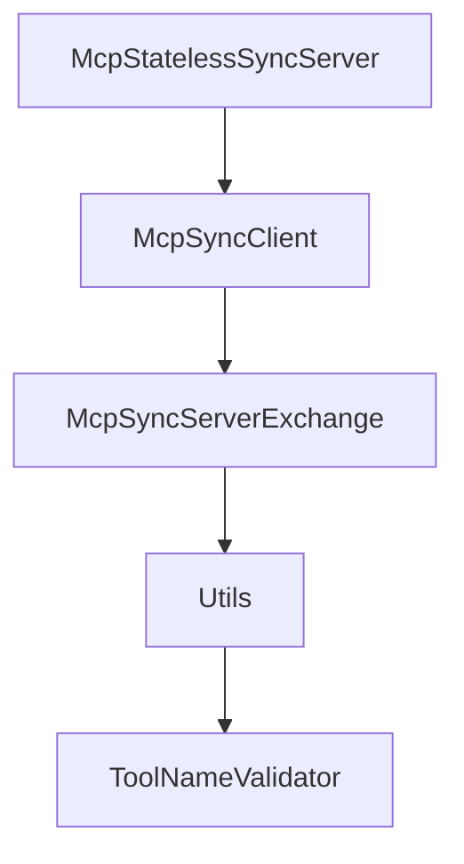

# Chapter 6: Security, Authorization, and Runtime Controls

Welcome to **Chapter 6: Security, Authorization, and Runtime Controls**. In this part of **MCP Java SDK Tutorial: Building MCP Clients and Servers with Reactor, Servlet, and Spring**, you will build an intuitive mental model first, then move into concrete implementation details and practical production tradeoffs.


Java SDK security posture depends on transport controls and host-level authorization integration.

## Learning Goals

- apply transport-level security validators for HTTP deployments
- integrate authorization through framework-native controls
- align runtime behavior with MCP security best practices
- avoid weak defaults around origin and session handling

## Security Principles

- enforce origin/session protections in HTTP transport providers
- keep authorization hooks pluggable to fit existing security stacks
- treat server tool/resource scope as least-privilege surfaces
- log security-relevant events with enough context for incident triage

## Source References

- [Security Policy](https://github.com/modelcontextprotocol/java-sdk/blob/main/SECURITY.md)
- [Server Transport Security Validator](https://github.com/modelcontextprotocol/java-sdk/blob/main/mcp-core/src/main/java/io/modelcontextprotocol/server/transport/ServerTransportSecurityValidator.java)
- [Default Security Validator](https://github.com/modelcontextprotocol/java-sdk/blob/main/mcp-core/src/main/java/io/modelcontextprotocol/server/transport/DefaultServerTransportSecurityValidator.java)
- [Contributing - Security Section](https://github.com/modelcontextprotocol/java-sdk/blob/main/CONTRIBUTING.md)

## Summary

You now have a security baseline for Java MCP services that is compatible with framework-specific auth policies.

Next: [Chapter 7: Conformance Testing and Quality Workflows](07-conformance-testing-and-quality-workflows.md)

## Source Code Walkthrough

### `mcp-core/src/main/java/io/modelcontextprotocol/server/McpStatelessSyncServer.java`

The `McpStatelessSyncServer` class in [`mcp-core/src/main/java/io/modelcontextprotocol/server/McpStatelessSyncServer.java`](https://github.com/modelcontextprotocol/java-sdk/blob/HEAD/mcp-core/src/main/java/io/modelcontextprotocol/server/McpStatelessSyncServer.java) handles a key part of this chapter's functionality:

```java
 * @author Dariusz Jędrzejczyk
 */
public class McpStatelessSyncServer {

	private static final Logger logger = LoggerFactory.getLogger(McpStatelessSyncServer.class);

	private final McpStatelessAsyncServer asyncServer;

	private final boolean immediateExecution;

	McpStatelessSyncServer(McpStatelessAsyncServer asyncServer, boolean immediateExecution) {
		this.asyncServer = asyncServer;
		this.immediateExecution = immediateExecution;
	}

	/**
	 * Get the server capabilities that define the supported features and functionality.
	 * @return The server capabilities
	 */
	public McpSchema.ServerCapabilities getServerCapabilities() {
		return this.asyncServer.getServerCapabilities();
	}

	/**
	 * Get the server implementation information.
	 * @return The server implementation details
	 */
	public McpSchema.Implementation getServerInfo() {
		return this.asyncServer.getServerInfo();
	}

	/**
```

This class is important because it defines how MCP Java SDK Tutorial: Building MCP Clients and Servers with Reactor, Servlet, and Spring implements the patterns covered in this chapter.

### `mcp-core/src/main/java/io/modelcontextprotocol/client/McpSyncClient.java`

The `McpSyncClient` class in [`mcp-core/src/main/java/io/modelcontextprotocol/client/McpSyncClient.java`](https://github.com/modelcontextprotocol/java-sdk/blob/HEAD/mcp-core/src/main/java/io/modelcontextprotocol/client/McpSyncClient.java) handles a key part of this chapter's functionality:

```java
 * @see McpSchema
 */
public class McpSyncClient implements AutoCloseable {

	private static final Logger logger = LoggerFactory.getLogger(McpSyncClient.class);

	// TODO: Consider providing a client config to set this properly
	// this is currently a concern only because AutoCloseable is used - perhaps it
	// is not a requirement?
	private static final long DEFAULT_CLOSE_TIMEOUT_MS = 10_000L;

	private final McpAsyncClient delegate;

	private final Supplier<McpTransportContext> contextProvider;

	/**
	 * Create a new McpSyncClient with the given delegate.
	 * @param delegate the asynchronous kernel on top of which this synchronous client
	 * provides a blocking API.
	 * @param contextProvider the supplier of context before calling any non-blocking
	 * operation on underlying delegate
	 */
	McpSyncClient(McpAsyncClient delegate, Supplier<McpTransportContext> contextProvider) {
		Assert.notNull(delegate, "The delegate can not be null");
		Assert.notNull(contextProvider, "The contextProvider can not be null");
		this.delegate = delegate;
		this.contextProvider = contextProvider;
	}

	/**
	 * Get the current initialization result.
	 * @return the initialization result.
```

This class is important because it defines how MCP Java SDK Tutorial: Building MCP Clients and Servers with Reactor, Servlet, and Spring implements the patterns covered in this chapter.

### `mcp-core/src/main/java/io/modelcontextprotocol/server/McpSyncServerExchange.java`

The `McpSyncServerExchange` class in [`mcp-core/src/main/java/io/modelcontextprotocol/server/McpSyncServerExchange.java`](https://github.com/modelcontextprotocol/java-sdk/blob/HEAD/mcp-core/src/main/java/io/modelcontextprotocol/server/McpSyncServerExchange.java) handles a key part of this chapter's functionality:

```java
 * @author Christian Tzolov
 */
public class McpSyncServerExchange {

	private final McpAsyncServerExchange exchange;

	/**
	 * Create a new synchronous exchange with the client using the provided asynchronous
	 * implementation as a delegate.
	 * @param exchange The asynchronous exchange to delegate to.
	 */
	public McpSyncServerExchange(McpAsyncServerExchange exchange) {
		this.exchange = exchange;
	}

	/**
	 * Provides the Session ID
	 * @return session ID
	 */
	public String sessionId() {
		return this.exchange.sessionId();
	}

	/**
	 * Get the client capabilities that define the supported features and functionality.
	 * @return The client capabilities
	 */
	public McpSchema.ClientCapabilities getClientCapabilities() {
		return this.exchange.getClientCapabilities();
	}

	/**
```

This class is important because it defines how MCP Java SDK Tutorial: Building MCP Clients and Servers with Reactor, Servlet, and Spring implements the patterns covered in this chapter.

### `mcp-core/src/main/java/io/modelcontextprotocol/util/Utils.java`

The `Utils` class in [`mcp-core/src/main/java/io/modelcontextprotocol/util/Utils.java`](https://github.com/modelcontextprotocol/java-sdk/blob/HEAD/mcp-core/src/main/java/io/modelcontextprotocol/util/Utils.java) handles a key part of this chapter's functionality:

```java
 */

public final class Utils {

	/**
	 * Check whether the given {@code String} contains actual <em>text</em>.
	 * <p>
	 * More specifically, this method returns {@code true} if the {@code String} is not
	 * {@code null}, its length is greater than 0, and it contains at least one
	 * non-whitespace character.
	 * @param str the {@code String} to check (may be {@code null})
	 * @return {@code true} if the {@code String} is not {@code null}, its length is
	 * greater than 0, and it does not contain whitespace only
	 * @see Character#isWhitespace
	 */
	public static boolean hasText(@Nullable String str) {
		return (str != null && !str.isBlank());
	}

	/**
	 * Return {@code true} if the supplied Collection is {@code null} or empty. Otherwise,
	 * return {@code false}.
	 * @param collection the Collection to check
	 * @return whether the given Collection is empty
	 */
	public static boolean isEmpty(@Nullable Collection<?> collection) {
		return (collection == null || collection.isEmpty());
	}

	/**
	 * Return {@code true} if the supplied Map is {@code null} or empty. Otherwise, return
	 * {@code false}.
```

This class is important because it defines how MCP Java SDK Tutorial: Building MCP Clients and Servers with Reactor, Servlet, and Spring implements the patterns covered in this chapter.


## How These Components Connect


