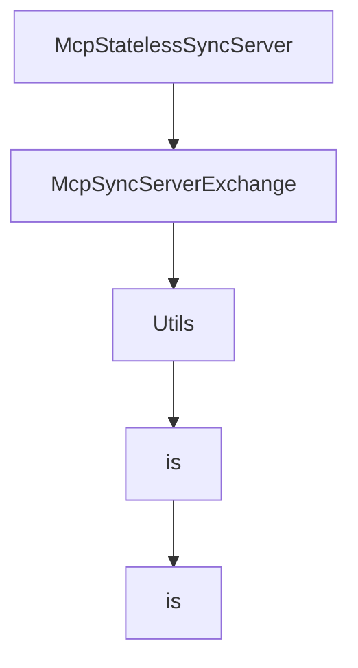

# Chapter 7: Conformance Testing and Quality Workflows

Welcome to **Chapter 7: Conformance Testing and Quality Workflows**. In this part of **MCP Java SDK Tutorial: Building MCP Clients and Servers with Reactor, Servlet, and Spring**, you will build an intuitive mental model first, then move into concrete implementation details and practical production tradeoffs.


Conformance testing gives Java teams a concrete way to verify protocol fidelity.

## Learning Goals

- run client/server conformance scenarios and interpret output
- understand current known gaps and warning classes
- combine conformance checks with module-level integration tests
- build CI gates that track protocol behavior drift

## Conformance Loop

1. run conformance server scenarios and inspect failing checks
2. run conformance client scenarios against reference servers
3. store check artifacts (`checks.json`, stdout/stderr logs)
4. track pass-rate changes over time, not just one-off success

## Source References

- [Conformance Client README](https://github.com/modelcontextprotocol/java-sdk/blob/main/conformance-tests/client-jdk-http-client/README.md)
- [Conformance Server README](https://github.com/modelcontextprotocol/java-sdk/blob/main/conformance-tests/server-servlet/README.md)
- [SDK Integration Guidance (Referenced)](https://github.com/modelcontextprotocol/conformance/blob/main/SDK_INTEGRATION.md)

## Summary

You now have a repeatable testing process for preventing protocol regressions in Java SDK deployments.

Next: [Chapter 8: Spring Integration and Upgrade Strategy](08-spring-integration-and-upgrade-strategy.md)

## Depth Expansion Playbook

## Source Code Walkthrough

### `mcp-core/src/main/java/io/modelcontextprotocol/server/McpStatelessSyncServer.java`

The `McpStatelessSyncServer` class in [`mcp-core/src/main/java/io/modelcontextprotocol/server/McpStatelessSyncServer.java`](https://github.com/modelcontextprotocol/java-sdk/blob/HEAD/mcp-core/src/main/java/io/modelcontextprotocol/server/McpStatelessSyncServer.java) handles a key part of this chapter's functionality:

```java
 * @author Dariusz Jędrzejczyk
 */
public class McpStatelessSyncServer {

	private static final Logger logger = LoggerFactory.getLogger(McpStatelessSyncServer.class);

	private final McpStatelessAsyncServer asyncServer;

	private final boolean immediateExecution;

	McpStatelessSyncServer(McpStatelessAsyncServer asyncServer, boolean immediateExecution) {
		this.asyncServer = asyncServer;
		this.immediateExecution = immediateExecution;
	}

	/**
	 * Get the server capabilities that define the supported features and functionality.
	 * @return The server capabilities
	 */
	public McpSchema.ServerCapabilities getServerCapabilities() {
		return this.asyncServer.getServerCapabilities();
	}

	/**
	 * Get the server implementation information.
	 * @return The server implementation details
	 */
	public McpSchema.Implementation getServerInfo() {
		return this.asyncServer.getServerInfo();
	}

	/**
```

This class is important because it defines how MCP Java SDK Tutorial: Building MCP Clients and Servers with Reactor, Servlet, and Spring implements the patterns covered in this chapter.

### `mcp-core/src/main/java/io/modelcontextprotocol/server/McpSyncServerExchange.java`

The `McpSyncServerExchange` class in [`mcp-core/src/main/java/io/modelcontextprotocol/server/McpSyncServerExchange.java`](https://github.com/modelcontextprotocol/java-sdk/blob/HEAD/mcp-core/src/main/java/io/modelcontextprotocol/server/McpSyncServerExchange.java) handles a key part of this chapter's functionality:

```java
 * @author Christian Tzolov
 */
public class McpSyncServerExchange {

	private final McpAsyncServerExchange exchange;

	/**
	 * Create a new synchronous exchange with the client using the provided asynchronous
	 * implementation as a delegate.
	 * @param exchange The asynchronous exchange to delegate to.
	 */
	public McpSyncServerExchange(McpAsyncServerExchange exchange) {
		this.exchange = exchange;
	}

	/**
	 * Provides the Session ID
	 * @return session ID
	 */
	public String sessionId() {
		return this.exchange.sessionId();
	}

	/**
	 * Get the client capabilities that define the supported features and functionality.
	 * @return The client capabilities
	 */
	public McpSchema.ClientCapabilities getClientCapabilities() {
		return this.exchange.getClientCapabilities();
	}

	/**
```

This class is important because it defines how MCP Java SDK Tutorial: Building MCP Clients and Servers with Reactor, Servlet, and Spring implements the patterns covered in this chapter.

### `mcp-core/src/main/java/io/modelcontextprotocol/util/Utils.java`

The `Utils` class in [`mcp-core/src/main/java/io/modelcontextprotocol/util/Utils.java`](https://github.com/modelcontextprotocol/java-sdk/blob/HEAD/mcp-core/src/main/java/io/modelcontextprotocol/util/Utils.java) handles a key part of this chapter's functionality:

```java
 */

public final class Utils {

	/**
	 * Check whether the given {@code String} contains actual <em>text</em>.
	 * <p>
	 * More specifically, this method returns {@code true} if the {@code String} is not
	 * {@code null}, its length is greater than 0, and it contains at least one
	 * non-whitespace character.
	 * @param str the {@code String} to check (may be {@code null})
	 * @return {@code true} if the {@code String} is not {@code null}, its length is
	 * greater than 0, and it does not contain whitespace only
	 * @see Character#isWhitespace
	 */
	public static boolean hasText(@Nullable String str) {
		return (str != null && !str.isBlank());
	}

	/**
	 * Return {@code true} if the supplied Collection is {@code null} or empty. Otherwise,
	 * return {@code false}.
	 * @param collection the Collection to check
	 * @return whether the given Collection is empty
	 */
	public static boolean isEmpty(@Nullable Collection<?> collection) {
		return (collection == null || collection.isEmpty());
	}

	/**
	 * Return {@code true} if the supplied Map is {@code null} or empty. Otherwise, return
	 * {@code false}.
```

This class is important because it defines how MCP Java SDK Tutorial: Building MCP Clients and Servers with Reactor, Servlet, and Spring implements the patterns covered in this chapter.

### `mcp-core/src/main/java/io/modelcontextprotocol/json/McpJsonDefaults.java`

The `is` class in [`mcp-core/src/main/java/io/modelcontextprotocol/json/McpJsonDefaults.java`](https://github.com/modelcontextprotocol/java-sdk/blob/HEAD/mcp-core/src/main/java/io/modelcontextprotocol/json/McpJsonDefaults.java) handles a key part of this chapter's functionality:

```java

/**
 * This class is to be used to provide access to the default {@link McpJsonMapper} and to
 * the default {@link JsonSchemaValidator} instances via the static methods:
 * {@link #getMapper()} and {@link #getSchemaValidator()}.
 * <p>
 * The initialization of (singleton) instances of this class is different in non-OSGi
 * environments and OSGi environments. Specifically, in non-OSGi environments the
 * {@code McpJsonDefaults} class will be loaded by whatever classloader is used to call
 * one of the existing static get methods for the first time. For servers, this will
 * usually be in response to the creation of the first {@code McpServer} instance. At that
 * first time, the {@code mcpMapperServiceLoader} and {@code mcpValidatorServiceLoader}
 * will be null, and the {@code McpJsonDefaults} constructor will be called,
 * creating/initializing the {@code mcpMapperServiceLoader} and the
 * {@code mcpValidatorServiceLoader}...which will then be used to call the
 * {@code ServiceLoader.load} method.
 * <p>
 * In OSGi environments, upon bundle activation SCR will create a new (singleton) instance
 * of {@code McpJsonDefaults} (via the constructor), and then inject suppliers via the
 * {@code setMcpJsonMapperSupplier} and {@code setJsonSchemaValidatorSupplier} methods
 * with the SCR-discovered instances of those services. This does depend upon the
 * jars/bundles providing those suppliers to be started/activated. This SCR behavior is
 * dictated by xml files in {@code OSGi-INF} directory of {@code mcp-core} (this
 * project/jar/bundle), and the jsonmapper and jsonschemavalidator provider jars/bundles
 * (e.g. {@code mcp-json-jackson2}, {@code mcp-json-jackson3}, or others).
 */
public class McpJsonDefaults {

	protected static McpServiceLoader<McpJsonMapperSupplier, McpJsonMapper> mcpMapperServiceLoader;

	protected static McpServiceLoader<JsonSchemaValidatorSupplier, JsonSchemaValidator> mcpValidatorServiceLoader;

```

This class is important because it defines how MCP Java SDK Tutorial: Building MCP Clients and Servers with Reactor, Servlet, and Spring implements the patterns covered in this chapter.


## How These Components Connect


