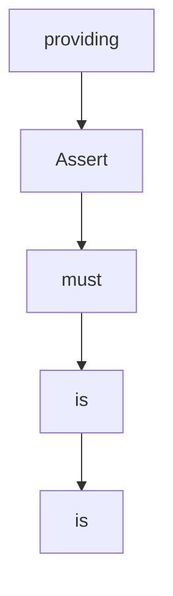

# Chapter 7: Conformance Testing and Quality Workflows

Welcome to **Chapter 7: Conformance Testing and Quality Workflows**. In this part of **MCP Java SDK Tutorial: Building MCP Clients and Servers with Reactor, Servlet, and Spring**, you will build an intuitive mental model first, then move into concrete implementation details and practical production tradeoffs.


Conformance testing gives Java teams a concrete way to verify protocol fidelity.

## Learning Goals

- run client/server conformance scenarios and interpret output
- understand current known gaps and warning classes
- combine conformance checks with module-level integration tests
- build CI gates that track protocol behavior drift

## Conformance Loop

1. run conformance server scenarios and inspect failing checks
2. run conformance client scenarios against reference servers
3. store check artifacts (`checks.json`, stdout/stderr logs)
4. track pass-rate changes over time, not just one-off success

## Source References

- [Conformance Client README](https://github.com/modelcontextprotocol/java-sdk/blob/main/conformance-tests/client-jdk-http-client/README.md)
- [Conformance Server README](https://github.com/modelcontextprotocol/java-sdk/blob/main/conformance-tests/server-servlet/README.md)
- [SDK Integration Guidance (Referenced)](https://github.com/modelcontextprotocol/conformance/blob/main/SDK_INTEGRATION.md)

## Summary

You now have a repeatable testing process for preventing protocol regressions in Java SDK deployments.

Next: [Chapter 8: Spring Integration and Upgrade Strategy](08-spring-integration-and-upgrade-strategy.md)

## Source Code Walkthrough

### `mcp-core/src/main/java/io/modelcontextprotocol/util/Assert.java`

The `providing` class in [`mcp-core/src/main/java/io/modelcontextprotocol/util/Assert.java`](https://github.com/modelcontextprotocol/java-sdk/blob/HEAD/mcp-core/src/main/java/io/modelcontextprotocol/util/Assert.java) handles a key part of this chapter's functionality:

```java

/**
 * Utility class providing assertion methods for parameter validation.
 */
public final class Assert {

	/**
	 * Assert that the collection is not {@code null} and not empty.
	 * @param collection the collection to check
	 * @param message the exception message to use if the assertion fails
	 * @throws IllegalArgumentException if the collection is {@code null} or empty
	 */
	public static void notEmpty(@Nullable Collection<?> collection, String message) {
		if (collection == null || collection.isEmpty()) {
			throw new IllegalArgumentException(message);
		}
	}

	/**
	 * Assert that an object is not {@code null}.
	 *
	 * <pre class="code">
	 * Assert.notNull(clazz, "The class must not be null");
	 * </pre>
	 * @param object the object to check
	 * @param message the exception message to use if the assertion fails
	 * @throws IllegalArgumentException if the object is {@code null}
	 */
	public static void notNull(@Nullable Object object, String message) {
		if (object == null) {
			throw new IllegalArgumentException(message);
		}
```

This class is important because it defines how MCP Java SDK Tutorial: Building MCP Clients and Servers with Reactor, Servlet, and Spring implements the patterns covered in this chapter.

### `mcp-core/src/main/java/io/modelcontextprotocol/util/Assert.java`

The `Assert` class in [`mcp-core/src/main/java/io/modelcontextprotocol/util/Assert.java`](https://github.com/modelcontextprotocol/java-sdk/blob/HEAD/mcp-core/src/main/java/io/modelcontextprotocol/util/Assert.java) handles a key part of this chapter's functionality:

```java

/**
 * Assertion utility class that assists in validating arguments.
 *
 * @author Christian Tzolov
 */

/**
 * Utility class providing assertion methods for parameter validation.
 */
public final class Assert {

	/**
	 * Assert that the collection is not {@code null} and not empty.
	 * @param collection the collection to check
	 * @param message the exception message to use if the assertion fails
	 * @throws IllegalArgumentException if the collection is {@code null} or empty
	 */
	public static void notEmpty(@Nullable Collection<?> collection, String message) {
		if (collection == null || collection.isEmpty()) {
			throw new IllegalArgumentException(message);
		}
	}

	/**
	 * Assert that an object is not {@code null}.
	 *
	 * <pre class="code">
	 * Assert.notNull(clazz, "The class must not be null");
	 * </pre>
	 * @param object the object to check
	 * @param message the exception message to use if the assertion fails
```

This class is important because it defines how MCP Java SDK Tutorial: Building MCP Clients and Servers with Reactor, Servlet, and Spring implements the patterns covered in this chapter.

### `mcp-core/src/main/java/io/modelcontextprotocol/util/Assert.java`

The `must` class in [`mcp-core/src/main/java/io/modelcontextprotocol/util/Assert.java`](https://github.com/modelcontextprotocol/java-sdk/blob/HEAD/mcp-core/src/main/java/io/modelcontextprotocol/util/Assert.java) handles a key part of this chapter's functionality:

```java
	 *
	 * <pre class="code">
	 * Assert.notNull(clazz, "The class must not be null");
	 * </pre>
	 * @param object the object to check
	 * @param message the exception message to use if the assertion fails
	 * @throws IllegalArgumentException if the object is {@code null}
	 */
	public static void notNull(@Nullable Object object, String message) {
		if (object == null) {
			throw new IllegalArgumentException(message);
		}
	}

	/**
	 * Assert that the given String contains valid text content; that is, it must not be
	 * {@code null} and must contain at least one non-whitespace character.
	 * <pre class="code">Assert.hasText(name, "'name' must not be empty");</pre>
	 * @param text the String to check
	 * @param message the exception message to use if the assertion fails
	 * @throws IllegalArgumentException if the text does not contain valid text content
	 */
	public static void hasText(@Nullable String text, String message) {
		if (!hasText(text)) {
			throw new IllegalArgumentException(message);
		}
	}

	/**
	 * Check whether the given {@code String} contains actual <em>text</em>.
	 * <p>
	 * More specifically, this method returns {@code true} if the {@code String} is not
```

This class is important because it defines how MCP Java SDK Tutorial: Building MCP Clients and Servers with Reactor, Servlet, and Spring implements the patterns covered in this chapter.

### `mcp-core/src/main/java/io/modelcontextprotocol/json/McpJsonDefaults.java`

The `is` class in [`mcp-core/src/main/java/io/modelcontextprotocol/json/McpJsonDefaults.java`](https://github.com/modelcontextprotocol/java-sdk/blob/HEAD/mcp-core/src/main/java/io/modelcontextprotocol/json/McpJsonDefaults.java) handles a key part of this chapter's functionality:

```java

/**
 * This class is to be used to provide access to the default {@link McpJsonMapper} and to
 * the default {@link JsonSchemaValidator} instances via the static methods:
 * {@link #getMapper()} and {@link #getSchemaValidator()}.
 * <p>
 * The initialization of (singleton) instances of this class is different in non-OSGi
 * environments and OSGi environments. Specifically, in non-OSGi environments the
 * {@code McpJsonDefaults} class will be loaded by whatever classloader is used to call
 * one of the existing static get methods for the first time. For servers, this will
 * usually be in response to the creation of the first {@code McpServer} instance. At that
 * first time, the {@code mcpMapperServiceLoader} and {@code mcpValidatorServiceLoader}
 * will be null, and the {@code McpJsonDefaults} constructor will be called,
 * creating/initializing the {@code mcpMapperServiceLoader} and the
 * {@code mcpValidatorServiceLoader}...which will then be used to call the
 * {@code ServiceLoader.load} method.
 * <p>
 * In OSGi environments, upon bundle activation SCR will create a new (singleton) instance
 * of {@code McpJsonDefaults} (via the constructor), and then inject suppliers via the
 * {@code setMcpJsonMapperSupplier} and {@code setJsonSchemaValidatorSupplier} methods
 * with the SCR-discovered instances of those services. This does depend upon the
 * jars/bundles providing those suppliers to be started/activated. This SCR behavior is
 * dictated by xml files in {@code OSGi-INF} directory of {@code mcp-core} (this
 * project/jar/bundle), and the jsonmapper and jsonschemavalidator provider jars/bundles
 * (e.g. {@code mcp-json-jackson2}, {@code mcp-json-jackson3}, or others).
 */
public class McpJsonDefaults {

	protected static McpServiceLoader<McpJsonMapperSupplier, McpJsonMapper> mcpMapperServiceLoader;

	protected static McpServiceLoader<JsonSchemaValidatorSupplier, JsonSchemaValidator> mcpValidatorServiceLoader;

```

This class is important because it defines how MCP Java SDK Tutorial: Building MCP Clients and Servers with Reactor, Servlet, and Spring implements the patterns covered in this chapter.


## How These Components Connect


