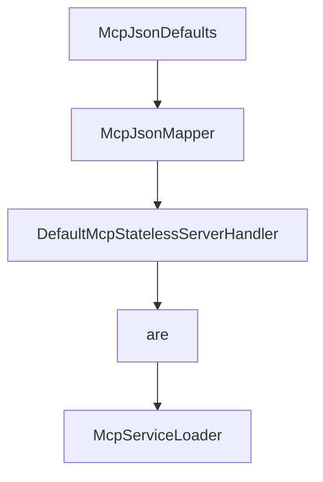

# Chapter 8: Spring Integration and Upgrade Strategy

Welcome to **Chapter 8: Spring Integration and Upgrade Strategy**. In this part of **MCP Java SDK Tutorial: Building MCP Clients and Servers with Reactor, Servlet, and Spring**, you will build an intuitive mental model first, then move into concrete implementation details and practical production tradeoffs.


This chapter connects Java core usage with Spring integration and long-term upgrade planning.

## Learning Goals

- decide when to adopt Spring-specific MCP modules
- prevent drift between core SDK behavior and Spring wrappers
- plan upgrade cadence around release and conformance signals
- keep contribution workflows aligned with maintainers

## Upgrade Playbook

- validate core transport behavior first, then layer Spring modules
- test WebFlux and WebMVC paths independently in CI
- track release changes and conformance notes before upgrading
- contribute fixes with scoped PRs and clear issue context

## Source References

- [Spring WebFlux MCP README](https://github.com/modelcontextprotocol/java-sdk/blob/main/mcp-spring/mcp-spring-webflux/README.md)
- [Spring WebMVC MCP README](https://github.com/modelcontextprotocol/java-sdk/blob/main/mcp-spring/mcp-spring-webmvc/README.md)
- [Java SDK Releases](https://github.com/modelcontextprotocol/java-sdk/releases)
- [Contributing Guide](https://github.com/modelcontextprotocol/java-sdk/blob/main/CONTRIBUTING.md)

## Summary

You now have a long-term operations model for combining Java core MCP and Spring integrations safely.

Next: Continue with [MCP C# SDK Tutorial](../mcp-csharp-sdk-tutorial/)

## Source Code Walkthrough

### `mcp-core/src/main/java/io/modelcontextprotocol/json/McpJsonDefaults.java`

The `McpJsonDefaults` class in [`mcp-core/src/main/java/io/modelcontextprotocol/json/McpJsonDefaults.java`](https://github.com/modelcontextprotocol/java-sdk/blob/HEAD/mcp-core/src/main/java/io/modelcontextprotocol/json/McpJsonDefaults.java) handles a key part of this chapter's functionality:

```java
 * The initialization of (singleton) instances of this class is different in non-OSGi
 * environments and OSGi environments. Specifically, in non-OSGi environments the
 * {@code McpJsonDefaults} class will be loaded by whatever classloader is used to call
 * one of the existing static get methods for the first time. For servers, this will
 * usually be in response to the creation of the first {@code McpServer} instance. At that
 * first time, the {@code mcpMapperServiceLoader} and {@code mcpValidatorServiceLoader}
 * will be null, and the {@code McpJsonDefaults} constructor will be called,
 * creating/initializing the {@code mcpMapperServiceLoader} and the
 * {@code mcpValidatorServiceLoader}...which will then be used to call the
 * {@code ServiceLoader.load} method.
 * <p>
 * In OSGi environments, upon bundle activation SCR will create a new (singleton) instance
 * of {@code McpJsonDefaults} (via the constructor), and then inject suppliers via the
 * {@code setMcpJsonMapperSupplier} and {@code setJsonSchemaValidatorSupplier} methods
 * with the SCR-discovered instances of those services. This does depend upon the
 * jars/bundles providing those suppliers to be started/activated. This SCR behavior is
 * dictated by xml files in {@code OSGi-INF} directory of {@code mcp-core} (this
 * project/jar/bundle), and the jsonmapper and jsonschemavalidator provider jars/bundles
 * (e.g. {@code mcp-json-jackson2}, {@code mcp-json-jackson3}, or others).
 */
public class McpJsonDefaults {

	protected static McpServiceLoader<McpJsonMapperSupplier, McpJsonMapper> mcpMapperServiceLoader;

	protected static McpServiceLoader<JsonSchemaValidatorSupplier, JsonSchemaValidator> mcpValidatorServiceLoader;

	public McpJsonDefaults() {
		mcpMapperServiceLoader = new McpServiceLoader<>(McpJsonMapperSupplier.class);
		mcpValidatorServiceLoader = new McpServiceLoader<>(JsonSchemaValidatorSupplier.class);
	}

	void setMcpJsonMapperSupplier(McpJsonMapperSupplier supplier) {
```

This class is important because it defines how MCP Java SDK Tutorial: Building MCP Clients and Servers with Reactor, Servlet, and Spring implements the patterns covered in this chapter.

### `mcp-core/src/main/java/io/modelcontextprotocol/json/McpJsonMapper.java`

The `McpJsonMapper` interface in [`mcp-core/src/main/java/io/modelcontextprotocol/json/McpJsonMapper.java`](https://github.com/modelcontextprotocol/java-sdk/blob/HEAD/mcp-core/src/main/java/io/modelcontextprotocol/json/McpJsonMapper.java) handles a key part of this chapter's functionality:

```java
 * io.modelcontextprotocol.spec.json.jackson.JacksonJsonMapper.
 */
public interface McpJsonMapper {

	/**
	 * Deserialize JSON string into a target type.
	 * @param content JSON as String
	 * @param type target class
	 * @return deserialized instance
	 * @param <T> generic type
	 * @throws IOException on parse errors
	 */
	<T> T readValue(String content, Class<T> type) throws IOException;

	/**
	 * Deserialize JSON bytes into a target type.
	 * @param content JSON as bytes
	 * @param type target class
	 * @return deserialized instance
	 * @param <T> generic type
	 * @throws IOException on parse errors
	 */
	<T> T readValue(byte[] content, Class<T> type) throws IOException;

	/**
	 * Deserialize JSON string into a parameterized target type.
	 * @param content JSON as String
	 * @param type parameterized type reference
	 * @return deserialized instance
	 * @param <T> generic type
	 * @throws IOException on parse errors
	 */
```

This interface is important because it defines how MCP Java SDK Tutorial: Building MCP Clients and Servers with Reactor, Servlet, and Spring implements the patterns covered in this chapter.

### `mcp-core/src/main/java/io/modelcontextprotocol/server/DefaultMcpStatelessServerHandler.java`

The `DefaultMcpStatelessServerHandler` class in [`mcp-core/src/main/java/io/modelcontextprotocol/server/DefaultMcpStatelessServerHandler.java`](https://github.com/modelcontextprotocol/java-sdk/blob/HEAD/mcp-core/src/main/java/io/modelcontextprotocol/server/DefaultMcpStatelessServerHandler.java) handles a key part of this chapter's functionality:

```java
import java.util.Map;

class DefaultMcpStatelessServerHandler implements McpStatelessServerHandler {

	private static final Logger logger = LoggerFactory.getLogger(DefaultMcpStatelessServerHandler.class);

	Map<String, McpStatelessRequestHandler<?>> requestHandlers;

	Map<String, McpStatelessNotificationHandler> notificationHandlers;

	public DefaultMcpStatelessServerHandler(Map<String, McpStatelessRequestHandler<?>> requestHandlers,
			Map<String, McpStatelessNotificationHandler> notificationHandlers) {
		this.requestHandlers = requestHandlers;
		this.notificationHandlers = notificationHandlers;
	}

	@Override
	public Mono<McpSchema.JSONRPCResponse> handleRequest(McpTransportContext transportContext,
			McpSchema.JSONRPCRequest request) {
		McpStatelessRequestHandler<?> requestHandler = this.requestHandlers.get(request.method());
		if (requestHandler == null) {
			return Mono.error(McpError.builder(McpSchema.ErrorCodes.METHOD_NOT_FOUND)
				.message("Missing handler for request type: " + request.method())
				.build());
		}
		return requestHandler.handle(transportContext, request.params())
			.map(result -> new McpSchema.JSONRPCResponse(McpSchema.JSONRPC_VERSION, request.id(), result, null))
			.onErrorResume(t -> {
				McpSchema.JSONRPCResponse.JSONRPCError error;
				if (t instanceof McpError mcpError && mcpError.getJsonRpcError() != null) {
					error = mcpError.getJsonRpcError();
				}
```

This class is important because it defines how MCP Java SDK Tutorial: Building MCP Clients and Servers with Reactor, Servlet, and Spring implements the patterns covered in this chapter.

### `mcp-core/src/main/java/io/modelcontextprotocol/util/McpServiceLoader.java`

The `are` class in [`mcp-core/src/main/java/io/modelcontextprotocol/util/McpServiceLoader.java`](https://github.com/modelcontextprotocol/java-sdk/blob/HEAD/mcp-core/src/main/java/io/modelcontextprotocol/util/McpServiceLoader.java) handles a key part of this chapter's functionality:

```java

/**
 * Instance of this class are intended to be used differently in OSGi and non-OSGi
 * environments. In all non-OSGi environments the supplier member will be
 * <code>null</code> and the serviceLoad method will be called to use the
 * ServiceLoader.load to find the first instance of the supplier (assuming one is present
 * in the runtime), cache it, and call the supplier's get method.
 * <p>
 * In OSGi environments, the Service component runtime (scr) will call the setSupplier
 * method upon bundle activation (assuming one is present in the runtime), and subsequent
 * calls will use the given supplier instance rather than the ServiceLoader.load.
 *
 * @param <S> the type of the supplier
 * @param <R> the type of the supplier result/returned value
 */
public class McpServiceLoader<S extends Supplier<R>, R> {

	private Class<S> supplierType;

	private S supplier;

	private R supplierResult;

	public void setSupplier(S supplier) {
		this.supplier = supplier;
		this.supplierResult = null;
	}

	public void unsetSupplier(S supplier) {
		this.supplier = null;
		this.supplierResult = null;
	}
```

This class is important because it defines how MCP Java SDK Tutorial: Building MCP Clients and Servers with Reactor, Servlet, and Spring implements the patterns covered in this chapter.


## How These Components Connect


