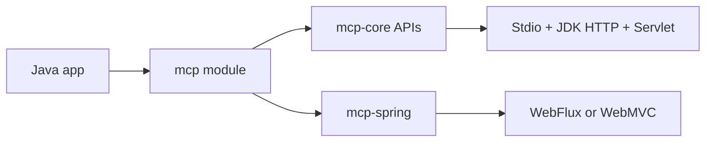

# MCP Java SDK Tutorial: Building MCP Clients and Servers with Reactor, Servlet, and Spring

> Learn how to use `modelcontextprotocol/java-sdk` across core Java and Spring stacks, from transport setup to conformance and production hardening.

## Why This Track Matters

Java teams often need MCP in existing backend estates with strict reliability and observability requirements. The official Java SDK provides a practical path with modular transport implementations and Spring ecosystem integration.

This track focuses on:

- selecting module boundaries (`mcp`, `mcp-core`, `mcp-spring`) with minimal friction
- understanding reactor-first design with sync facades
- deploying client/server transports across stdio, servlet, and Spring stacks
- validating behavior through conformance and contribution workflows

## Current Snapshot (auto-updated)

- repository: [`modelcontextprotocol/java-sdk`](https://github.com/modelcontextprotocol/java-sdk)
- stars: about **3.2k**
- latest release: [`v0.17.2`](https://github.com/modelcontextprotocol/java-sdk/releases/tag/v0.17.2) (**January 22, 2026**)
- recent activity: updated on **February 12, 2026**
- runtime baseline: Java 17+
- license: MIT

## Mental Model

## Chapter Guide

| Chapter | Key Question | Outcome |
|:--------|:-------------|:--------|
| [01 - Getting Started and Module Selection](01-getting-started-and-module-selection.md) | Which modules should I use first? | Correct dependency baseline |
| [02 - SDK Architecture: Reactive Model and JSON Layer](02-sdk-architecture-reactive-model-and-json-layer.md) | Why is the SDK reactive-first and how is JSON handled? | Better architectural decisions |
| [03 - Client Transports and Connection Strategy](03-client-transports-and-connection-strategy.md) | How should Java clients connect across local and remote servers? | More reliable client behavior |
| [04 - Server Transports and Deployment Patterns](04-server-transports-and-deployment-patterns.md) | Which server transport/runtime combination fits my deployment? | Cleaner deployment design |
| [05 - Tools, Resources, Prompts, and Schema Validation](05-tools-resources-prompts-and-schema-validation.md) | How do I model high-quality primitives in Java? | Stronger server interfaces |
| [06 - Security, Authorization, and Runtime Controls](06-security-authorization-and-runtime-controls.md) | How do I apply auth and transport security controls safely? | Lower security risk |
| [07 - Conformance Testing and Quality Workflows](07-conformance-testing-and-quality-workflows.md) | How do I verify behavior against protocol expectations? | More predictable releases |
| [08 - Spring Integration and Upgrade Strategy](08-spring-integration-and-upgrade-strategy.md) | How do I evolve Java/Spring MCP deployments over time? | Long-term maintainability |

## What You Will Learn

- how to map Java SDK modules to different deployment constraints
- how to use transport providers without mixing incompatible assumptions
- how to harden runtime behavior and validate it with conformance loops
- how to combine core SDK and Spring integrations with less migration risk

## Source References

- [Java SDK README](https://github.com/modelcontextprotocol/java-sdk/blob/main/README.md)
- [Core Bundle README](https://github.com/modelcontextprotocol/java-sdk/blob/main/mcp/README.md)
- [Spring WebFlux README](https://github.com/modelcontextprotocol/java-sdk/blob/main/mcp-spring/mcp-spring-webflux/README.md)
- [Spring WebMVC README](https://github.com/modelcontextprotocol/java-sdk/blob/main/mcp-spring/mcp-spring-webmvc/README.md)
- [Conformance Client README](https://github.com/modelcontextprotocol/java-sdk/blob/main/conformance-tests/client-jdk-http-client/README.md)
- [Conformance Server README](https://github.com/modelcontextprotocol/java-sdk/blob/main/conformance-tests/server-servlet/README.md)
- [Security Policy](https://github.com/modelcontextprotocol/java-sdk/blob/main/SECURITY.md)
- [Contributing Guide](https://github.com/modelcontextprotocol/java-sdk/blob/main/CONTRIBUTING.md)

## Related Tutorials

- [MCP Specification Tutorial](../mcp-specification-tutorial/)
- [MCP TypeScript SDK Tutorial](../mcp-typescript-sdk-tutorial/)
- [MCP Go SDK Tutorial](../mcp-go-sdk-tutorial/)
- [MCP C# SDK Tutorial](../mcp-csharp-sdk-tutorial/)

---

Start with [Chapter 1: Getting Started and Module Selection](01-getting-started-and-module-selection.md).

## Navigation & Backlinks

- [Start Here: Chapter 1: Getting Started and Module Selection](01-getting-started-and-module-selection.md)
- [Back to Main Catalog](../../README.md#-tutorial-catalog)
- [Browse A-Z Tutorial Directory](../../discoverability/tutorial-directory.md)
- [Search by Intent](../../discoverability/query-hub.md)
- [Explore Category Hubs](../../README.md#category-hubs)

## Full Chapter Map

1. [Chapter 1: Getting Started and Module Selection](01-getting-started-and-module-selection.md)
2. [Chapter 2: SDK Architecture: Reactive Model and JSON Layer](02-sdk-architecture-reactive-model-and-json-layer.md)
3. [Chapter 3: Client Transports and Connection Strategy](03-client-transports-and-connection-strategy.md)
4. [Chapter 4: Server Transports and Deployment Patterns](04-server-transports-and-deployment-patterns.md)
5. [Chapter 5: Tools, Resources, Prompts, and Schema Validation](05-tools-resources-prompts-and-schema-validation.md)
6. [Chapter 6: Security, Authorization, and Runtime Controls](06-security-authorization-and-runtime-controls.md)
7. [Chapter 7: Conformance Testing and Quality Workflows](07-conformance-testing-and-quality-workflows.md)
8. [Chapter 8: Spring Integration and Upgrade Strategy](08-spring-integration-and-upgrade-strategy.md)

*Generated by [AI Codebase Knowledge Builder](https://github.com/The-Pocket/Tutorial-Codebase-Knowledge)*
