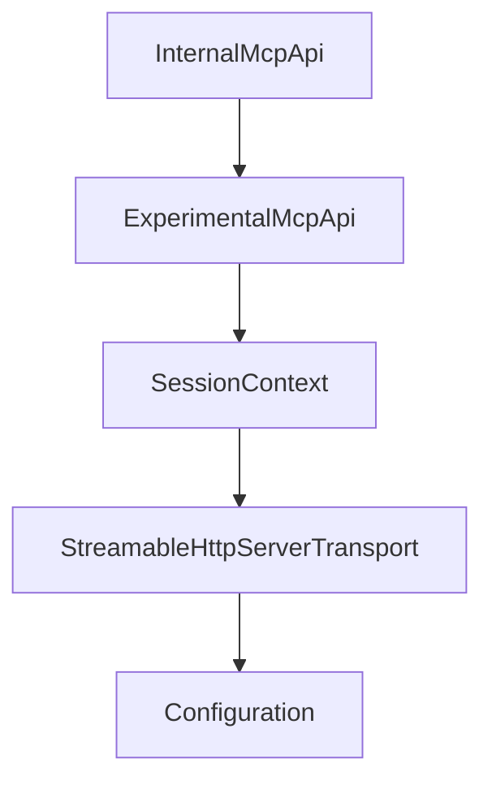

# Chapter 1: Getting Started and Module Selection

Welcome to **Chapter 1: Getting Started and Module Selection**. In this part of **MCP Kotlin SDK Tutorial: Building Multiplatform MCP Clients and Servers**, you will build an intuitive mental model first, then move into concrete implementation details and practical production tradeoffs.


This chapter sets a clean dependency and runtime baseline for Kotlin MCP projects.

## Learning Goals

- choose the right artifact strategy (`kotlin-sdk` vs client/server splits)
- align Kotlin/JVM/Ktor prerequisites before protocol implementation
- establish a reproducible first-run workflow
- avoid hidden transport dependency gaps

## Module Selection Matrix

| Artifact | Use When |
|:---------|:---------|
| `kotlin-sdk` | you want client + server APIs together |
| `kotlin-sdk-client` | you only build MCP clients |
| `kotlin-sdk-server` | you only expose MCP server primitives |

## Baseline Steps

1. confirm Kotlin 2.2+ toolchain and JVM 11+ runtime
2. add Maven Central and one of the SDK artifacts
3. add explicit Ktor engine dependencies for your transport needs
4. run one sample flow (client or server) before adding custom features

## Source References

- [Kotlin SDK README - Installation](https://github.com/modelcontextprotocol/kotlin-sdk/blob/main/README.md#installation)
- [Kotlin SDK README - Ktor Dependencies](https://github.com/modelcontextprotocol/kotlin-sdk/blob/main/README.md#ktor-dependencies)
- [Client Sample README](https://github.com/modelcontextprotocol/kotlin-sdk/blob/main/samples/kotlin-mcp-client/README.md)

## Summary

You now have a stable Kotlin baseline and module selection model.

Next: [Chapter 2: Core Protocol Model and Module Architecture](02-core-protocol-model-and-module-architecture.md)

## Source Code Walkthrough

### `kotlin-sdk-core/src/commonMain/kotlin/io/modelcontextprotocol/kotlin/sdk/InternalMcpApi.kt`

The `InternalMcpApi` class in [`kotlin-sdk-core/src/commonMain/kotlin/io/modelcontextprotocol/kotlin/sdk/InternalMcpApi.kt`](https://github.com/modelcontextprotocol/kotlin-sdk/blob/HEAD/kotlin-sdk-core/src/commonMain/kotlin/io/modelcontextprotocol/kotlin/sdk/InternalMcpApi.kt) handles a key part of this chapter's functionality:

```kt
)
@Retention(AnnotationRetention.BINARY)
public annotation class InternalMcpApi

```

This class is important because it defines how MCP Kotlin SDK Tutorial: Building Multiplatform MCP Clients and Servers implements the patterns covered in this chapter.

### `kotlin-sdk-core/src/commonMain/kotlin/io/modelcontextprotocol/kotlin/sdk/ExperimentalMcpApi.kt`

The `ExperimentalMcpApi` class in [`kotlin-sdk-core/src/commonMain/kotlin/io/modelcontextprotocol/kotlin/sdk/ExperimentalMcpApi.kt`](https://github.com/modelcontextprotocol/kotlin-sdk/blob/HEAD/kotlin-sdk-core/src/commonMain/kotlin/io/modelcontextprotocol/kotlin/sdk/ExperimentalMcpApi.kt) handles a key part of this chapter's functionality:

```kt
)
@Retention(AnnotationRetention.BINARY)
public annotation class ExperimentalMcpApi

```

This class is important because it defines how MCP Kotlin SDK Tutorial: Building Multiplatform MCP Clients and Servers implements the patterns covered in this chapter.

### `kotlin-sdk-server/src/commonMain/kotlin/io/modelcontextprotocol/kotlin/sdk/server/StreamableHttpServerTransport.kt`

The `SessionContext` class in [`kotlin-sdk-server/src/commonMain/kotlin/io/modelcontextprotocol/kotlin/sdk/server/StreamableHttpServerTransport.kt`](https://github.com/modelcontextprotocol/kotlin-sdk/blob/HEAD/kotlin-sdk-server/src/commonMain/kotlin/io/modelcontextprotocol/kotlin/sdk/server/StreamableHttpServerTransport.kt) handles a key part of this chapter's functionality:

```kt
 * Otherwise, the session is not null.
 */
private data class SessionContext(val session: ServerSSESession?, val call: ApplicationCall)

/**
 * Server transport for Streamable HTTP: this implements the MCP Streamable HTTP transport specification.
 * It supports both SSE streaming and direct HTTP responses.
 *
 * In stateful mode:
 * - Session ID is generated and included in response headers
 * - Session ID is always included in initialization responses
 * - Requests with invalid session IDs are rejected with 404 Not Found
 * - Non-initialization requests without a session ID are rejected with 400 Bad Request
 * - State is maintained in-memory (connections, message history)
 *
 * In stateless mode:
 * - No Session ID is included in any responses
 * - No session validation is performed
 *
 * @param configuration Transport configuration. See [Configuration] for available options.
 * @property sessionId session identifier assigned after initialization, or `null` in stateless mode
 */
@OptIn(ExperimentalUuidApi::class, ExperimentalAtomicApi::class)
@Suppress("TooManyFunctions")
public class StreamableHttpServerTransport(private val configuration: Configuration) : AbstractTransport() {

    @Deprecated("Use default constructor with explicit Configuration()")
    public constructor() : this(configuration = Configuration())

    /**
     * Secondary constructor for `StreamableHttpServerTransport` that simplifies initialization by directly taking the
     * configurable parameters without requiring a `Configuration` instance.
```

This class is important because it defines how MCP Kotlin SDK Tutorial: Building Multiplatform MCP Clients and Servers implements the patterns covered in this chapter.

### `kotlin-sdk-server/src/commonMain/kotlin/io/modelcontextprotocol/kotlin/sdk/server/StreamableHttpServerTransport.kt`

The `StreamableHttpServerTransport` class in [`kotlin-sdk-server/src/commonMain/kotlin/io/modelcontextprotocol/kotlin/sdk/server/StreamableHttpServerTransport.kt`](https://github.com/modelcontextprotocol/kotlin-sdk/blob/HEAD/kotlin-sdk-server/src/commonMain/kotlin/io/modelcontextprotocol/kotlin/sdk/server/StreamableHttpServerTransport.kt) handles a key part of this chapter's functionality:

```kt
/**
 * A holder for an active request call.
 * If [StreamableHttpServerTransport.Configuration.enableJsonResponse] is true, the session is null.
 * Otherwise, the session is not null.
 */
private data class SessionContext(val session: ServerSSESession?, val call: ApplicationCall)

/**
 * Server transport for Streamable HTTP: this implements the MCP Streamable HTTP transport specification.
 * It supports both SSE streaming and direct HTTP responses.
 *
 * In stateful mode:
 * - Session ID is generated and included in response headers
 * - Session ID is always included in initialization responses
 * - Requests with invalid session IDs are rejected with 404 Not Found
 * - Non-initialization requests without a session ID are rejected with 400 Bad Request
 * - State is maintained in-memory (connections, message history)
 *
 * In stateless mode:
 * - No Session ID is included in any responses
 * - No session validation is performed
 *
 * @param configuration Transport configuration. See [Configuration] for available options.
 * @property sessionId session identifier assigned after initialization, or `null` in stateless mode
 */
@OptIn(ExperimentalUuidApi::class, ExperimentalAtomicApi::class)
@Suppress("TooManyFunctions")
public class StreamableHttpServerTransport(private val configuration: Configuration) : AbstractTransport() {

    @Deprecated("Use default constructor with explicit Configuration()")
    public constructor() : this(configuration = Configuration())

```

This class is important because it defines how MCP Kotlin SDK Tutorial: Building Multiplatform MCP Clients and Servers implements the patterns covered in this chapter.


## How These Components Connect


