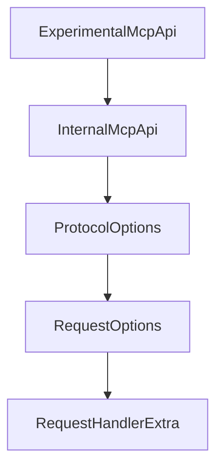

# Chapter 1: Getting Started and Module Selection

Welcome to **Chapter 1: Getting Started and Module Selection**. In this part of **MCP Kotlin SDK Tutorial: Building Multiplatform MCP Clients and Servers**, you will build an intuitive mental model first, then move into concrete implementation details and practical production tradeoffs.


This chapter sets a clean dependency and runtime baseline for Kotlin MCP projects.

## Learning Goals

- choose the right artifact strategy (`kotlin-sdk` vs client/server splits)
- align Kotlin/JVM/Ktor prerequisites before protocol implementation
- establish a reproducible first-run workflow
- avoid hidden transport dependency gaps

## Module Selection Matrix

| Artifact | Use When |
|:---------|:---------|
| `kotlin-sdk` | you want client + server APIs together |
| `kotlin-sdk-client` | you only build MCP clients |
| `kotlin-sdk-server` | you only expose MCP server primitives |

## Baseline Steps

1. confirm Kotlin 2.2+ toolchain and JVM 11+ runtime
2. add Maven Central and one of the SDK artifacts
3. add explicit Ktor engine dependencies for your transport needs
4. run one sample flow (client or server) before adding custom features

## Source References

- [Kotlin SDK README - Installation](https://github.com/modelcontextprotocol/kotlin-sdk/blob/main/README.md#installation)
- [Kotlin SDK README - Ktor Dependencies](https://github.com/modelcontextprotocol/kotlin-sdk/blob/main/README.md#ktor-dependencies)
- [Client Sample README](https://github.com/modelcontextprotocol/kotlin-sdk/blob/main/samples/kotlin-mcp-client/README.md)

## Summary

You now have a stable Kotlin baseline and module selection model.

Next: [Chapter 2: Core Protocol Model and Module Architecture](02-core-protocol-model-and-module-architecture.md)

## Depth Expansion Playbook

## Source Code Walkthrough

### `kotlin-sdk-core/src/commonMain/kotlin/io/modelcontextprotocol/kotlin/sdk/ExperimentalMcpApi.kt`

The `ExperimentalMcpApi` class in [`kotlin-sdk-core/src/commonMain/kotlin/io/modelcontextprotocol/kotlin/sdk/ExperimentalMcpApi.kt`](https://github.com/modelcontextprotocol/kotlin-sdk/blob/HEAD/kotlin-sdk-core/src/commonMain/kotlin/io/modelcontextprotocol/kotlin/sdk/ExperimentalMcpApi.kt) handles a key part of this chapter's functionality:

```kt
)
@Retention(AnnotationRetention.BINARY)
public annotation class ExperimentalMcpApi

```

This class is important because it defines how MCP Kotlin SDK Tutorial: Building Multiplatform MCP Clients and Servers implements the patterns covered in this chapter.

### `kotlin-sdk-core/src/commonMain/kotlin/io/modelcontextprotocol/kotlin/sdk/InternalMcpApi.kt`

The `InternalMcpApi` class in [`kotlin-sdk-core/src/commonMain/kotlin/io/modelcontextprotocol/kotlin/sdk/InternalMcpApi.kt`](https://github.com/modelcontextprotocol/kotlin-sdk/blob/HEAD/kotlin-sdk-core/src/commonMain/kotlin/io/modelcontextprotocol/kotlin/sdk/InternalMcpApi.kt) handles a key part of this chapter's functionality:

```kt
)
@Retention(AnnotationRetention.BINARY)
public annotation class InternalMcpApi

```

This class is important because it defines how MCP Kotlin SDK Tutorial: Building Multiplatform MCP Clients and Servers implements the patterns covered in this chapter.

### `kotlin-sdk-core/src/commonMain/kotlin/io/modelcontextprotocol/kotlin/sdk/shared/Protocol.kt`

The `ProtocolOptions` class in [`kotlin-sdk-core/src/commonMain/kotlin/io/modelcontextprotocol/kotlin/sdk/shared/Protocol.kt`](https://github.com/modelcontextprotocol/kotlin-sdk/blob/HEAD/kotlin-sdk-core/src/commonMain/kotlin/io/modelcontextprotocol/kotlin/sdk/shared/Protocol.kt) handles a key part of this chapter's functionality:

```kt
 * Additional initialization options.
 */
public open class ProtocolOptions(
    /**
     * Whether to restrict emitted requests to only those that the remote side has indicated
     * that they can handle, through their advertised capabilities.
     *
     * Note that this DOES NOT affect checking of _local_ side capabilities, as it is
     * considered a logic error to mis-specify those.
     *
     * Currently, this defaults to false, for backwards compatibility with SDK versions
     * that did not advertise capabilities correctly.
     * In the future, this will default to true.
     */
    public var enforceStrictCapabilities: Boolean = false,

    public var timeout: Duration = DEFAULT_REQUEST_TIMEOUT,
)

/**
 * The default request timeout.
 */
public val DEFAULT_REQUEST_TIMEOUT: Duration = 60.seconds

/**
 * Options that can be given per request.
 *
 * @property relatedRequestId if present,
 * `relatedRequestId` is used to indicate to the transport which incoming request to associate this outgoing message with.
 * @property resumptionToken the resumption token used to continue long-running requests that were interrupted.
 * This allows clients to reconnect and continue from where they left off, if supported by the transport.
 * @property onResumptionToken a callback that is invoked when the resumption token changes, if supported by the transport.
```

This class is important because it defines how MCP Kotlin SDK Tutorial: Building Multiplatform MCP Clients and Servers implements the patterns covered in this chapter.

### `kotlin-sdk-core/src/commonMain/kotlin/io/modelcontextprotocol/kotlin/sdk/shared/Protocol.kt`

The `RequestOptions` class in [`kotlin-sdk-core/src/commonMain/kotlin/io/modelcontextprotocol/kotlin/sdk/shared/Protocol.kt`](https://github.com/modelcontextprotocol/kotlin-sdk/blob/HEAD/kotlin-sdk-core/src/commonMain/kotlin/io/modelcontextprotocol/kotlin/sdk/shared/Protocol.kt) handles a key part of this chapter's functionality:

```kt
 * If not specified, `DEFAULT_REQUEST_TIMEOUT` will be used as the timeout.
 */
public class RequestOptions(
    relatedRequestId: RequestId? = null,
    resumptionToken: String? = null,
    onResumptionToken: ((String) -> Unit)? = null,
    public val onProgress: ProgressCallback? = null,
    public val timeout: Duration = DEFAULT_REQUEST_TIMEOUT,
) : TransportSendOptions(relatedRequestId, resumptionToken, onResumptionToken) {
    public operator fun component4(): ProgressCallback? = onProgress
    public operator fun component5(): Duration = timeout

    public fun copy(
        relatedRequestId: RequestId? = this.relatedRequestId,
        resumptionToken: String? = this.resumptionToken,
        onResumptionToken: ((String) -> Unit)? = this.onResumptionToken,
        onProgress: ProgressCallback? = this.onProgress,
        timeout: Duration = this.timeout,
    ): RequestOptions = RequestOptions(relatedRequestId, resumptionToken, onResumptionToken, onProgress, timeout)

    override fun equals(other: Any?): Boolean {
        if (this === other) return true
        if (other == null || this::class != other::class) return false
        if (!super.equals(other)) return false

        other as RequestOptions

        return onProgress == other.onProgress && timeout == other.timeout
    }

    override fun hashCode(): Int {
        var result = super.hashCode()
```

This class is important because it defines how MCP Kotlin SDK Tutorial: Building Multiplatform MCP Clients and Servers implements the patterns covered in this chapter.


## How These Components Connect


