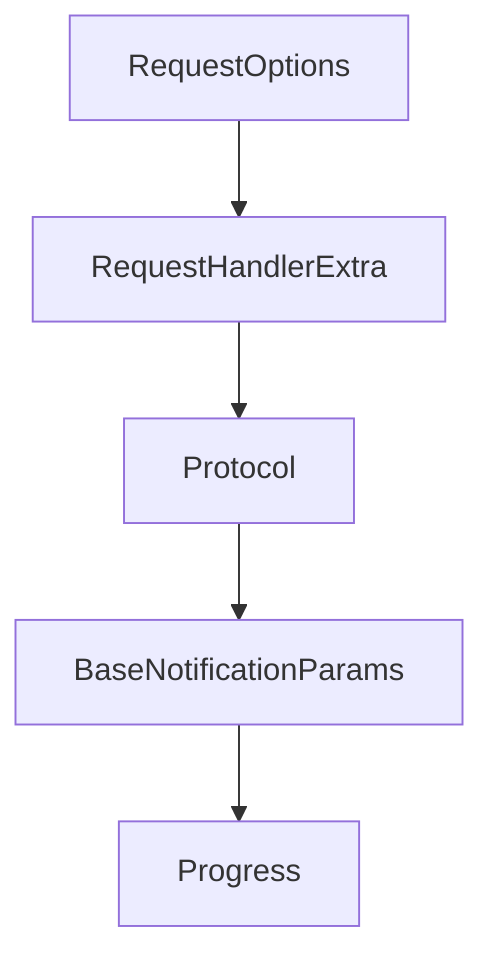

# Chapter 2: Core Protocol Model and Module Architecture

Welcome to **Chapter 2: Core Protocol Model and Module Architecture**. In this part of **MCP Kotlin SDK Tutorial: Building Multiplatform MCP Clients and Servers**, you will build an intuitive mental model first, then move into concrete implementation details and practical production tradeoffs.


This chapter explains how the Kotlin SDK separates protocol foundations from runtime roles.

## Learning Goals

- understand what lives in `kotlin-sdk-core` vs client/server modules
- map JSON-RPC and MCP model types to application layers
- use DSL helpers and protocol primitives without over-coupling
- decide when custom transport work belongs in core-level abstractions

## Architecture Boundaries

| Module | Responsibility |
|:-------|:---------------|
| `kotlin-sdk-core` | shared MCP types, JSON handling, protocol abstractions |
| `kotlin-sdk-client` | handshake + typed server calls + capability checks |
| `kotlin-sdk-server` | feature registration + session lifecycle + notifications |

## Design Notes

- `McpJson` and protocol models keep wire formats consistent across runtimes.
- `Protocol` logic centralizes request/response correlation and capability assertions.
- Client/server modules add role-specific ergonomics while reusing the same core schema model.

## Source References

- [Module Overview](https://github.com/modelcontextprotocol/kotlin-sdk/blob/main/docs/moduledoc.md)
- [kotlin-sdk-core Module Guide](https://github.com/modelcontextprotocol/kotlin-sdk/blob/main/kotlin-sdk-core/Module.md)
- [kotlin-sdk-client Module Guide](https://github.com/modelcontextprotocol/kotlin-sdk/blob/main/kotlin-sdk-client/Module.md)
- [kotlin-sdk-server Module Guide](https://github.com/modelcontextprotocol/kotlin-sdk/blob/main/kotlin-sdk-server/Module.md)

## Summary

You now have a clear module-level mental model for Kotlin MCP architecture decisions.

Next: [Chapter 3: Client Runtime and Capability Negotiation](03-client-runtime-and-capability-negotiation.md)

## Source Code Walkthrough

### `kotlin-sdk-core/src/commonMain/kotlin/io/modelcontextprotocol/kotlin/sdk/shared/Protocol.kt`

The `RequestOptions` class in [`kotlin-sdk-core/src/commonMain/kotlin/io/modelcontextprotocol/kotlin/sdk/shared/Protocol.kt`](https://github.com/modelcontextprotocol/kotlin-sdk/blob/HEAD/kotlin-sdk-core/src/commonMain/kotlin/io/modelcontextprotocol/kotlin/sdk/shared/Protocol.kt) handles a key part of this chapter's functionality:

```kt
 * If not specified, `DEFAULT_REQUEST_TIMEOUT` will be used as the timeout.
 */
public class RequestOptions(
    relatedRequestId: RequestId? = null,
    resumptionToken: String? = null,
    onResumptionToken: ((String) -> Unit)? = null,
    public val onProgress: ProgressCallback? = null,
    public val timeout: Duration = DEFAULT_REQUEST_TIMEOUT,
) : TransportSendOptions(relatedRequestId, resumptionToken, onResumptionToken) {
    /** Destructuring component for [onProgress]. */
    public operator fun component4(): ProgressCallback? = onProgress

    /** Destructuring component for [timeout]. */
    public operator fun component5(): Duration = timeout

    /** Creates a copy of this [RequestOptions] with the specified fields replaced. */
    public fun copy(
        relatedRequestId: RequestId? = this.relatedRequestId,
        resumptionToken: String? = this.resumptionToken,
        onResumptionToken: ((String) -> Unit)? = this.onResumptionToken,
        onProgress: ProgressCallback? = this.onProgress,
        timeout: Duration = this.timeout,
    ): RequestOptions = RequestOptions(relatedRequestId, resumptionToken, onResumptionToken, onProgress, timeout)

    override fun equals(other: Any?): Boolean {
        if (this === other) return true
        if (other == null || this::class != other::class) return false
        if (!super.equals(other)) return false

        other as RequestOptions

        return onProgress == other.onProgress && timeout == other.timeout
```

This class is important because it defines how MCP Kotlin SDK Tutorial: Building Multiplatform MCP Clients and Servers implements the patterns covered in this chapter.

### `kotlin-sdk-core/src/commonMain/kotlin/io/modelcontextprotocol/kotlin/sdk/shared/Protocol.kt`

The `RequestHandlerExtra` class in [`kotlin-sdk-core/src/commonMain/kotlin/io/modelcontextprotocol/kotlin/sdk/shared/Protocol.kt`](https://github.com/modelcontextprotocol/kotlin-sdk/blob/HEAD/kotlin-sdk-core/src/commonMain/kotlin/io/modelcontextprotocol/kotlin/sdk/shared/Protocol.kt) handles a key part of this chapter's functionality:

```kt
 * Extra data given to request handlers.
 */
public class RequestHandlerExtra

internal val COMPLETED = CompletableDeferred(Unit).also { it.complete(Unit) }

/**
 * Implements MCP protocol framing on top of a pluggable transport, including
 * features like request/response linking, notifications, and progress.
 *
 * @property transport the active transport, or `null` if not connected
 * @property requestHandlers registered request handlers keyed by method name
 * @property notificationHandlers registered notification handlers keyed by method name
 * @property responseHandlers pending response handlers keyed by request ID
 * @property progressHandlers registered progress callbacks keyed by progress token
 */
public abstract class Protocol(@PublishedApi internal val options: ProtocolOptions?) {
    public var transport: Transport? = null
        private set

    private val _requestHandlers:
        AtomicRef<PersistentMap<String, suspend (JSONRPCRequest, RequestHandlerExtra) -> RequestResult?>> =
        atomic(persistentMapOf())
    public val requestHandlers: Map<
        String,
        suspend (
            request: JSONRPCRequest,
            extra: RequestHandlerExtra,
        ) -> RequestResult?,
        >
        get() = _requestHandlers.value

```

This class is important because it defines how MCP Kotlin SDK Tutorial: Building Multiplatform MCP Clients and Servers implements the patterns covered in this chapter.

### `kotlin-sdk-core/src/commonMain/kotlin/io/modelcontextprotocol/kotlin/sdk/shared/Protocol.kt`

The `Protocol` class in [`kotlin-sdk-core/src/commonMain/kotlin/io/modelcontextprotocol/kotlin/sdk/shared/Protocol.kt`](https://github.com/modelcontextprotocol/kotlin-sdk/blob/HEAD/kotlin-sdk-core/src/commonMain/kotlin/io/modelcontextprotocol/kotlin/sdk/shared/Protocol.kt) handles a key part of this chapter's functionality:

```kt
 * @property timeout default timeout for outgoing requests
 */
public open class ProtocolOptions(
    /**
     * Whether to restrict emitted requests to only those that the remote side has indicated
     * that they can handle, through their advertised capabilities.
     *
     * Note that this DOES NOT affect checking of _local_ side capabilities, as it is
     * considered a logic error to mis-specify those.
     *
     * Currently, this defaults to false, for backwards compatibility with SDK versions
     * that did not advertise capabilities correctly.
     * In the future, this will default to true.
     */
    public var enforceStrictCapabilities: Boolean = false,

    public var timeout: Duration = DEFAULT_REQUEST_TIMEOUT,
)

/**
 * The default request timeout.
 */
public val DEFAULT_REQUEST_TIMEOUT: Duration = 60.seconds

/**
 * Options that can be given per request.
 *
 * @property relatedRequestId if present,
 * `relatedRequestId` is used to indicate to the transport which incoming request to associate this outgoing message with.
 * @property resumptionToken the resumption token used to continue long-running requests that were interrupted.
 * This allows clients to reconnect and continue from where they left off, if supported by the transport.
 * @property onResumptionToken a callback that is invoked when the resumption token changes, if supported by the transport.
```

This class is important because it defines how MCP Kotlin SDK Tutorial: Building Multiplatform MCP Clients and Servers implements the patterns covered in this chapter.

### `kotlin-sdk-core/src/commonMain/kotlin/io/modelcontextprotocol/kotlin/sdk/types/notification.kt`

The `BaseNotificationParams` class in [`kotlin-sdk-core/src/commonMain/kotlin/io/modelcontextprotocol/kotlin/sdk/types/notification.kt`](https://github.com/modelcontextprotocol/kotlin-sdk/blob/HEAD/kotlin-sdk-core/src/commonMain/kotlin/io/modelcontextprotocol/kotlin/sdk/types/notification.kt) handles a key part of this chapter's functionality:

```kt
 */
@Serializable
public data class BaseNotificationParams(@SerialName("_meta") override val meta: JsonObject? = null) :
    NotificationParams

/**
 * Represents a progress notification.
 *
 * @property progress The progress thus far. This should increase every time progress is made,
 * even if the total is unknown.
 * @property total Total number of items to a process (or total progress required), if known.
 * @property message An optional message describing the current progress.
 */
@Serializable
public class Progress(
    public val progress: Double,
    public val total: Double? = null,
    public val message: String? = null,
)

// ============================================================================
// Custom Notification
// ============================================================================

/**
 * Represents a custom notification method that is not part of the core MCP specification.
 *
 * The MCP protocol allows implementations to define custom methods for extending functionality.
 * This class captures such custom notifications while preserving all their data.
 *
 * @property method The custom method name. By convention, custom methods often contain
 * organization-specific prefixes (e.g., "mycompany/custom_event").
```

This class is important because it defines how MCP Kotlin SDK Tutorial: Building Multiplatform MCP Clients and Servers implements the patterns covered in this chapter.


## How These Components Connect


