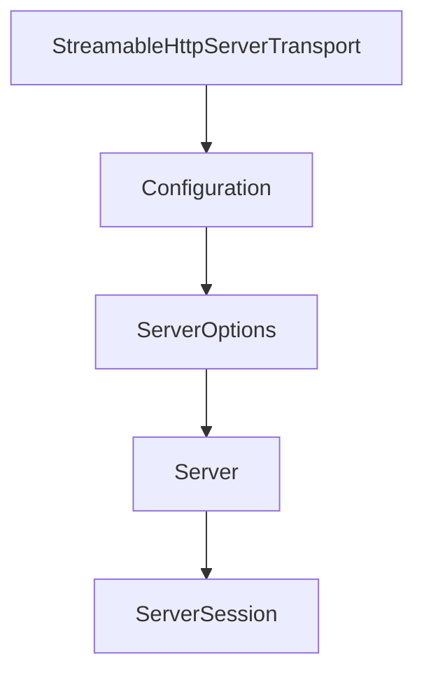

# Chapter 2: Core Protocol Model and Module Architecture

Welcome to **Chapter 2: Core Protocol Model and Module Architecture**. In this part of **MCP Kotlin SDK Tutorial: Building Multiplatform MCP Clients and Servers**, you will build an intuitive mental model first, then move into concrete implementation details and practical production tradeoffs.


This chapter explains how the Kotlin SDK separates protocol foundations from runtime roles.

## Learning Goals

- understand what lives in `kotlin-sdk-core` vs client/server modules
- map JSON-RPC and MCP model types to application layers
- use DSL helpers and protocol primitives without over-coupling
- decide when custom transport work belongs in core-level abstractions

## Architecture Boundaries

| Module | Responsibility |
|:-------|:---------------|
| `kotlin-sdk-core` | shared MCP types, JSON handling, protocol abstractions |
| `kotlin-sdk-client` | handshake + typed server calls + capability checks |
| `kotlin-sdk-server` | feature registration + session lifecycle + notifications |

## Design Notes

- `McpJson` and protocol models keep wire formats consistent across runtimes.
- `Protocol` logic centralizes request/response correlation and capability assertions.
- Client/server modules add role-specific ergonomics while reusing the same core schema model.

## Source References

- [Module Overview](https://github.com/modelcontextprotocol/kotlin-sdk/blob/main/docs/moduledoc.md)
- [kotlin-sdk-core Module Guide](https://github.com/modelcontextprotocol/kotlin-sdk/blob/main/kotlin-sdk-core/Module.md)
- [kotlin-sdk-client Module Guide](https://github.com/modelcontextprotocol/kotlin-sdk/blob/main/kotlin-sdk-client/Module.md)
- [kotlin-sdk-server Module Guide](https://github.com/modelcontextprotocol/kotlin-sdk/blob/main/kotlin-sdk-server/Module.md)

## Summary

You now have a clear module-level mental model for Kotlin MCP architecture decisions.

Next: [Chapter 3: Client Runtime and Capability Negotiation](03-client-runtime-and-capability-negotiation.md)

## Depth Expansion Playbook

## Source Code Walkthrough

### `kotlin-sdk-server/src/commonMain/kotlin/io/modelcontextprotocol/kotlin/sdk/server/StreamableHttpServerTransport.kt`

The `StreamableHttpServerTransport` class in [`kotlin-sdk-server/src/commonMain/kotlin/io/modelcontextprotocol/kotlin/sdk/server/StreamableHttpServerTransport.kt`](https://github.com/modelcontextprotocol/kotlin-sdk/blob/HEAD/kotlin-sdk-server/src/commonMain/kotlin/io/modelcontextprotocol/kotlin/sdk/server/StreamableHttpServerTransport.kt) handles a key part of this chapter's functionality:

```kt
/**
 * A holder for an active request call.
 * If [StreamableHttpServerTransport.Configuration.enableJsonResponse] is true, the session is null.
 * Otherwise, the session is not null.
 */
private data class SessionContext(val session: ServerSSESession?, val call: ApplicationCall)

/**
 * Server transport for Streamable HTTP: this implements the MCP Streamable HTTP transport specification.
 * It supports both SSE streaming and direct HTTP responses.
 *
 * In stateful mode:
 * - Session ID is generated and included in response headers
 * - Session ID is always included in initialization responses
 * - Requests with invalid session IDs are rejected with 404 Not Found
 * - Non-initialization requests without a session ID are rejected with 400 Bad Request
 * - State is maintained in-memory (connections, message history)
 *
 * In stateless mode:
 * - No Session ID is included in any responses
 * - No session validation is performed
 *
 * @param configuration Transport configuration. See [Configuration] for available options.
 */
@OptIn(ExperimentalUuidApi::class, ExperimentalAtomicApi::class)
@Suppress("TooManyFunctions")
public class StreamableHttpServerTransport(private val configuration: Configuration) : AbstractTransport() {

    @Deprecated("Use default constructor with explicit Configuration()")
    public constructor() : this(configuration = Configuration())

    /**
```

This class is important because it defines how MCP Kotlin SDK Tutorial: Building Multiplatform MCP Clients and Servers implements the patterns covered in this chapter.

### `kotlin-sdk-server/src/commonMain/kotlin/io/modelcontextprotocol/kotlin/sdk/server/StreamableHttpServerTransport.kt`

The `Configuration` class in [`kotlin-sdk-server/src/commonMain/kotlin/io/modelcontextprotocol/kotlin/sdk/server/StreamableHttpServerTransport.kt`](https://github.com/modelcontextprotocol/kotlin-sdk/blob/HEAD/kotlin-sdk-server/src/commonMain/kotlin/io/modelcontextprotocol/kotlin/sdk/server/StreamableHttpServerTransport.kt) handles a key part of this chapter's functionality:

```kt
/**
 * A holder for an active request call.
 * If [StreamableHttpServerTransport.Configuration.enableJsonResponse] is true, the session is null.
 * Otherwise, the session is not null.
 */
private data class SessionContext(val session: ServerSSESession?, val call: ApplicationCall)

/**
 * Server transport for Streamable HTTP: this implements the MCP Streamable HTTP transport specification.
 * It supports both SSE streaming and direct HTTP responses.
 *
 * In stateful mode:
 * - Session ID is generated and included in response headers
 * - Session ID is always included in initialization responses
 * - Requests with invalid session IDs are rejected with 404 Not Found
 * - Non-initialization requests without a session ID are rejected with 400 Bad Request
 * - State is maintained in-memory (connections, message history)
 *
 * In stateless mode:
 * - No Session ID is included in any responses
 * - No session validation is performed
 *
 * @param configuration Transport configuration. See [Configuration] for available options.
 */
@OptIn(ExperimentalUuidApi::class, ExperimentalAtomicApi::class)
@Suppress("TooManyFunctions")
public class StreamableHttpServerTransport(private val configuration: Configuration) : AbstractTransport() {

    @Deprecated("Use default constructor with explicit Configuration()")
    public constructor() : this(configuration = Configuration())

    /**
```

This class is important because it defines how MCP Kotlin SDK Tutorial: Building Multiplatform MCP Clients and Servers implements the patterns covered in this chapter.

### `kotlin-sdk-server/src/commonMain/kotlin/io/modelcontextprotocol/kotlin/sdk/server/Server.kt`

The `ServerOptions` class in [`kotlin-sdk-server/src/commonMain/kotlin/io/modelcontextprotocol/kotlin/sdk/server/Server.kt`](https://github.com/modelcontextprotocol/kotlin-sdk/blob/HEAD/kotlin-sdk-server/src/commonMain/kotlin/io/modelcontextprotocol/kotlin/sdk/server/Server.kt) handles a key part of this chapter's functionality:

```kt
 *   for matching resource URIs against registered templates. Defaults to [PathSegmentTemplateMatcher.factory].
 */
public class ServerOptions(
    public val capabilities: ServerCapabilities,
    enforceStrictCapabilities: Boolean = true,
    public val resourceTemplateMatcherFactory: ResourceTemplateMatcherFactory = PathSegmentTemplateMatcher.factory,
) : ProtocolOptions(enforceStrictCapabilities = enforceStrictCapabilities) {
    @JvmOverloads
    public constructor(
        capabilities: ServerCapabilities,
        enforceStrictCapabilities: Boolean = true,
    ) : this(capabilities, enforceStrictCapabilities, PathSegmentTemplateMatcher.factory)
}

/**
 * An MCP server is responsible for storing features and handling new connections.
 *
 * This server automatically responds to the initialization flow as initiated by the client.
 * You can register tools, prompts, and resources using [addTool], [addPrompt], and [addResource].
 * The server will then automatically handle listing and retrieval requests from the client.
 *
 * In case the server supports feature list notification or resource substitution,
 * the server will automatically send notifications for all connected clients.
 * Currently, after subscription to a resource, the server will NOT send the subscription confirmation
 * as this response schema is not defined in the protocol.
 *
 * @param serverInfo Information about this server implementation (name, version).
 * @param options Configuration options for the server.
 * @param instructionsProvider Optional provider for instructions from the server to the client about how to use
 * this server. The provider is called each time a new session is started to support dynamic instructions.
 * @param block A block to configure the mcp server.
 */
```

This class is important because it defines how MCP Kotlin SDK Tutorial: Building Multiplatform MCP Clients and Servers implements the patterns covered in this chapter.

### `kotlin-sdk-server/src/commonMain/kotlin/io/modelcontextprotocol/kotlin/sdk/server/Server.kt`

The `Server` class in [`kotlin-sdk-server/src/commonMain/kotlin/io/modelcontextprotocol/kotlin/sdk/server/Server.kt`](https://github.com/modelcontextprotocol/kotlin-sdk/blob/HEAD/kotlin-sdk-server/src/commonMain/kotlin/io/modelcontextprotocol/kotlin/sdk/server/Server.kt) handles a key part of this chapter's functionality:

```kt
import io.modelcontextprotocol.kotlin.sdk.types.ResourceTemplate
import io.modelcontextprotocol.kotlin.sdk.types.ResourceUpdatedNotification
import io.modelcontextprotocol.kotlin.sdk.types.ServerCapabilities
import io.modelcontextprotocol.kotlin.sdk.types.SubscribeRequest
import io.modelcontextprotocol.kotlin.sdk.types.TextContent
import io.modelcontextprotocol.kotlin.sdk.types.Tool
import io.modelcontextprotocol.kotlin.sdk.types.ToolAnnotations
import io.modelcontextprotocol.kotlin.sdk.types.ToolExecution
import io.modelcontextprotocol.kotlin.sdk.types.ToolSchema
import io.modelcontextprotocol.kotlin.sdk.types.UnsubscribeRequest
import io.modelcontextprotocol.kotlin.sdk.utils.MatchResult
import io.modelcontextprotocol.kotlin.sdk.utils.PathSegmentTemplateMatcher
import io.modelcontextprotocol.kotlin.sdk.utils.ResourceTemplateMatcher
import io.modelcontextprotocol.kotlin.sdk.utils.ResourceTemplateMatcherFactory
import kotlinx.coroutines.CancellationException
import kotlinx.coroutines.Deferred
import kotlinx.serialization.json.JsonObject
import kotlinx.serialization.json.buildJsonObject
import kotlinx.serialization.json.put
import kotlin.jvm.JvmOverloads
import kotlin.time.ExperimentalTime

private val logger = KotlinLogging.logger {}

/**
 * Configuration options for the MCP server.
 *
 * @property capabilities The capabilities this server supports.
 * @property enforceStrictCapabilities Whether to strictly enforce capabilities when interacting with clients.
 * @property resourceTemplateMatcherFactory The factory used to create [ResourceTemplateMatcher] instances
 *   for matching resource URIs against registered templates. Defaults to [PathSegmentTemplateMatcher.factory].
 */
```

This class is important because it defines how MCP Kotlin SDK Tutorial: Building Multiplatform MCP Clients and Servers implements the patterns covered in this chapter.


## How These Components Connect


