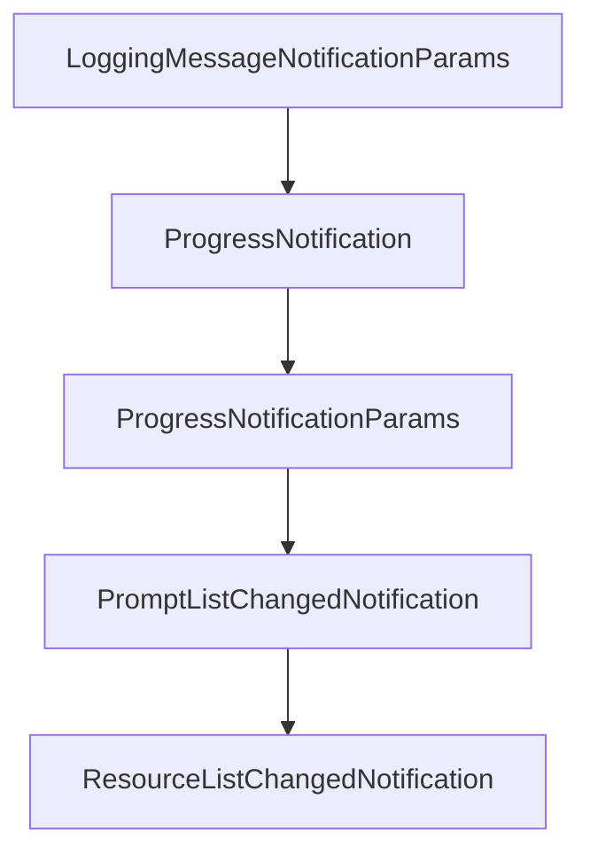

# Chapter 3: Client Runtime and Capability Negotiation

Welcome to **Chapter 3: Client Runtime and Capability Negotiation**. In this part of **MCP Kotlin SDK Tutorial: Building Multiplatform MCP Clients and Servers**, you will build an intuitive mental model first, then move into concrete implementation details and practical production tradeoffs.


This chapter covers how Kotlin clients initialize connections and safely consume server capabilities.

## Learning Goals

- configure `Client` or `mcpClient` with precise capability declarations
- run initialization and handshake flows correctly
- use typed operations (`listTools`, `callTool`, `readResource`, `getPrompt`) safely
- enforce capability checks to reduce runtime protocol errors

## Client Flow Checklist

1. define `clientInfo` and `ClientOptions` capability set
2. select transport (stdio, SSE, streamable HTTP, WebSocket)
3. call `connect` and inspect negotiated `serverCapabilities`
4. invoke only methods exposed by the server
5. close the client cleanly after operation completion

## Common Failure Modes

- calling optional endpoints before capability verification
- assuming subscriptions/logging are always available
- skipping lifecycle cleanup, leaving in-flight requests unresolved

## Source References

- [Kotlin SDK README - Creating a Client](https://github.com/modelcontextprotocol/kotlin-sdk/blob/main/README.md#creating-a-client)
- [kotlin-sdk-client Module Guide](https://github.com/modelcontextprotocol/kotlin-sdk/blob/main/kotlin-sdk-client/Module.md)
- [Kotlin MCP Client Sample](https://github.com/modelcontextprotocol/kotlin-sdk/blob/main/samples/kotlin-mcp-client/README.md)

## Summary

You now know how to run capability-safe client workflows in Kotlin.

Next: [Chapter 4: Server Runtime, Primitives, and Feature Registration](04-server-runtime-primitives-and-feature-registration.md)

## Source Code Walkthrough

### `kotlin-sdk-core/src/commonMain/kotlin/io/modelcontextprotocol/kotlin/sdk/types/notification.kt`

The `LoggingMessageNotificationParams` class in [`kotlin-sdk-core/src/commonMain/kotlin/io/modelcontextprotocol/kotlin/sdk/types/notification.kt`](https://github.com/modelcontextprotocol/kotlin-sdk/blob/HEAD/kotlin-sdk-core/src/commonMain/kotlin/io/modelcontextprotocol/kotlin/sdk/types/notification.kt) handles a key part of this chapter's functionality:

```kt
 */
@Serializable
public data class LoggingMessageNotification(override val params: LoggingMessageNotificationParams) :
    ServerNotification {
    @EncodeDefault
    override val method: Method = Method.Defined.NotificationsMessage
}

/**
 * Parameters for a notifications/message notification.
 *
 * @property level The severity of this log message.
 * @property data The data to be logged, such as a string message or an object.
 * Any JSON serializable type is allowed here.
 * @property logger An optional name of the logger issuing this message.
 * @property meta Optional metadata for this notification.
 */
@Serializable
public data class LoggingMessageNotificationParams(
    val level: LoggingLevel,
    val data: JsonElement,
    val logger: String? = null,
    @SerialName("_meta")
    override val meta: JsonObject? = null,
) : NotificationParams

// ============================================================================
// Progress Notification
// ============================================================================

/**
 * An out-of-band notification used to inform the receiver of a progress update for a long-running request.
```

This class is important because it defines how MCP Kotlin SDK Tutorial: Building Multiplatform MCP Clients and Servers implements the patterns covered in this chapter.

### `kotlin-sdk-core/src/commonMain/kotlin/io/modelcontextprotocol/kotlin/sdk/types/notification.kt`

The `ProgressNotification` class in [`kotlin-sdk-core/src/commonMain/kotlin/io/modelcontextprotocol/kotlin/sdk/types/notification.kt`](https://github.com/modelcontextprotocol/kotlin-sdk/blob/HEAD/kotlin-sdk-core/src/commonMain/kotlin/io/modelcontextprotocol/kotlin/sdk/types/notification.kt) handles a key part of this chapter's functionality:

```kt
 */
@Serializable
public data class ProgressNotification(override val params: ProgressNotificationParams) :
    ClientNotification,
    ServerNotification {
    @EncodeDefault
    override val method: Method = Method.Defined.NotificationsProgress
}

/**
 * Parameters for a notifications/progress notification.
 *
 * @property progressToken The progress token which was given in the initial request,
 * used to associate this notification with the request that is proceeding.
 * @property progress The progress thus far. This should increase every time progress is made,
 * even if the total is unknown.
 * @property total Total number of items to process (or total progress required), if known.
 * @property message An optional message describing the current progress.
 * @property meta Optional metadata for this notification.
 */
@Serializable
public data class ProgressNotificationParams(
    val progressToken: ProgressToken,
    val progress: Double,
    val total: Double? = null,
    val message: String? = null,
    @SerialName("_meta")
    override val meta: JsonObject? = null,
) : NotificationParams

// ============================================================================
// Prompts List Changed Notification
```

This class is important because it defines how MCP Kotlin SDK Tutorial: Building Multiplatform MCP Clients and Servers implements the patterns covered in this chapter.

### `kotlin-sdk-core/src/commonMain/kotlin/io/modelcontextprotocol/kotlin/sdk/types/notification.kt`

The `ProgressNotificationParams` class in [`kotlin-sdk-core/src/commonMain/kotlin/io/modelcontextprotocol/kotlin/sdk/types/notification.kt`](https://github.com/modelcontextprotocol/kotlin-sdk/blob/HEAD/kotlin-sdk-core/src/commonMain/kotlin/io/modelcontextprotocol/kotlin/sdk/types/notification.kt) handles a key part of this chapter's functionality:

```kt
 */
@Serializable
public data class ProgressNotification(override val params: ProgressNotificationParams) :
    ClientNotification,
    ServerNotification {
    @EncodeDefault
    override val method: Method = Method.Defined.NotificationsProgress
}

/**
 * Parameters for a notifications/progress notification.
 *
 * @property progressToken The progress token which was given in the initial request,
 * used to associate this notification with the request that is proceeding.
 * @property progress The progress thus far. This should increase every time progress is made,
 * even if the total is unknown.
 * @property total Total number of items to process (or total progress required), if known.
 * @property message An optional message describing the current progress.
 * @property meta Optional metadata for this notification.
 */
@Serializable
public data class ProgressNotificationParams(
    val progressToken: ProgressToken,
    val progress: Double,
    val total: Double? = null,
    val message: String? = null,
    @SerialName("_meta")
    override val meta: JsonObject? = null,
) : NotificationParams

// ============================================================================
// Prompts List Changed Notification
```

This class is important because it defines how MCP Kotlin SDK Tutorial: Building Multiplatform MCP Clients and Servers implements the patterns covered in this chapter.

### `kotlin-sdk-core/src/commonMain/kotlin/io/modelcontextprotocol/kotlin/sdk/types/notification.kt`

The `PromptListChangedNotification` class in [`kotlin-sdk-core/src/commonMain/kotlin/io/modelcontextprotocol/kotlin/sdk/types/notification.kt`](https://github.com/modelcontextprotocol/kotlin-sdk/blob/HEAD/kotlin-sdk-core/src/commonMain/kotlin/io/modelcontextprotocol/kotlin/sdk/types/notification.kt) handles a key part of this chapter's functionality:

```kt
 */
@Serializable
public data class PromptListChangedNotification(override val params: BaseNotificationParams? = null) :
    ServerNotification {
    @EncodeDefault
    override val method: Method = Method.Defined.NotificationsPromptsListChanged
}

// ============================================================================
// Resources List Changed Notification
// ============================================================================

/**
 * An optional notification from the server to the client,
 * informing it that the list of resources it can read from has changed.
 *
 * Servers may issue this without any previous subscription from the client.
 * Sent only if the server's [ServerCapabilities.resources] has `listChanged = true`.
 *
 * @property params Optional notification parameters containing metadata.
 */
@Serializable
public data class ResourceListChangedNotification(override val params: BaseNotificationParams? = null) :
    ServerNotification {
    @EncodeDefault
    override val method: Method = Method.Defined.NotificationsResourcesListChanged
}

// ============================================================================
// Resource Updated Notification
// ============================================================================

```

This class is important because it defines how MCP Kotlin SDK Tutorial: Building Multiplatform MCP Clients and Servers implements the patterns covered in this chapter.


## How These Components Connect


