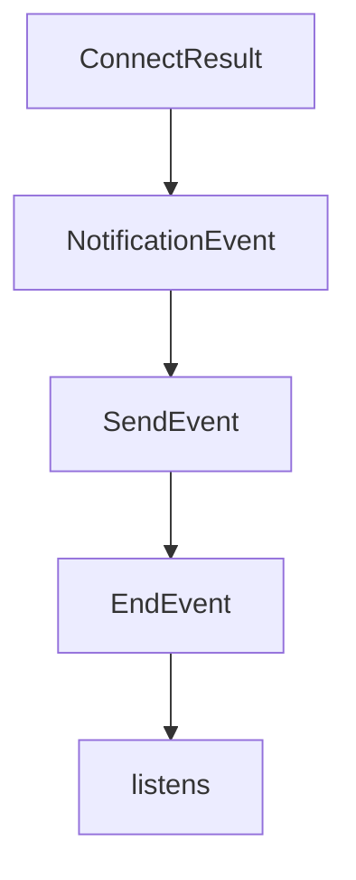

# Chapter 3: Client Runtime and Capability Negotiation

Welcome to **Chapter 3: Client Runtime and Capability Negotiation**. In this part of **MCP Kotlin SDK Tutorial: Building Multiplatform MCP Clients and Servers**, you will build an intuitive mental model first, then move into concrete implementation details and practical production tradeoffs.


This chapter covers how Kotlin clients initialize connections and safely consume server capabilities.

## Learning Goals

- configure `Client` or `mcpClient` with precise capability declarations
- run initialization and handshake flows correctly
- use typed operations (`listTools`, `callTool`, `readResource`, `getPrompt`) safely
- enforce capability checks to reduce runtime protocol errors

## Client Flow Checklist

1. define `clientInfo` and `ClientOptions` capability set
2. select transport (stdio, SSE, streamable HTTP, WebSocket)
3. call `connect` and inspect negotiated `serverCapabilities`
4. invoke only methods exposed by the server
5. close the client cleanly after operation completion

## Common Failure Modes

- calling optional endpoints before capability verification
- assuming subscriptions/logging are always available
- skipping lifecycle cleanup, leaving in-flight requests unresolved

## Source References

- [Kotlin SDK README - Creating a Client](https://github.com/modelcontextprotocol/kotlin-sdk/blob/main/README.md#creating-a-client)
- [kotlin-sdk-client Module Guide](https://github.com/modelcontextprotocol/kotlin-sdk/blob/main/kotlin-sdk-client/Module.md)
- [Kotlin MCP Client Sample](https://github.com/modelcontextprotocol/kotlin-sdk/blob/main/samples/kotlin-mcp-client/README.md)

## Summary

You now know how to run capability-safe client workflows in Kotlin.

Next: [Chapter 4: Server Runtime, Primitives, and Feature Registration](04-server-runtime-primitives-and-feature-registration.md)

## Depth Expansion Playbook

## Source Code Walkthrough

### `kotlin-sdk-client/src/commonMain/kotlin/io/modelcontextprotocol/kotlin/sdk/client/StreamableHttpClientTransport.kt`

The `ConnectResult` interface in [`kotlin-sdk-client/src/commonMain/kotlin/io/modelcontextprotocol/kotlin/sdk/client/StreamableHttpClientTransport.kt`](https://github.com/modelcontextprotocol/kotlin-sdk/blob/HEAD/kotlin-sdk-client/src/commonMain/kotlin/io/modelcontextprotocol/kotlin/sdk/client/StreamableHttpClientTransport.kt) handles a key part of this chapter's functionality:

```kt
    Exception("Streamable HTTP error: $message")

private sealed interface ConnectResult {
    data class Success(val session: ClientSSESession) : ConnectResult
    data object NonRetryable : ConnectResult
    data object Failed : ConnectResult
}

/**
 * Client transport for Streamable HTTP: this implements the MCP Streamable HTTP transport specification.
 * It will connect to a server using HTTP POST for sending messages and HTTP GET with Server-Sent Events
 * for receiving messages.
 */
@Suppress("TooManyFunctions")
public class StreamableHttpClientTransport(
    private val client: HttpClient,
    private val url: String,
    private val reconnectionOptions: ReconnectionOptions = ReconnectionOptions(),
    private val requestBuilder: HttpRequestBuilder.() -> Unit = {},
) : AbstractClientTransport() {

    @Deprecated(
        "Use constructor with ReconnectionOptions",
        replaceWith = ReplaceWith(
            "StreamableHttpClientTransport(client, url, " +
                "ReconnectionOptions(initialReconnectionDelay = reconnectionTime ?: 1.seconds), requestBuilder)",
            "kotlin.time.Duration.Companion.seconds",
            "io.modelcontextprotocol.kotlin.sdk.client.ReconnectionOptions",
        ),
    )
    public constructor(
        client: HttpClient,
```

This interface is important because it defines how MCP Kotlin SDK Tutorial: Building Multiplatform MCP Clients and Servers implements the patterns covered in this chapter.

### `kotlin-sdk-server/src/commonMain/kotlin/io/modelcontextprotocol/kotlin/sdk/server/FeatureNotificationService.kt`

The `NotificationEvent` class in [`kotlin-sdk-server/src/commonMain/kotlin/io/modelcontextprotocol/kotlin/sdk/server/FeatureNotificationService.kt`](https://github.com/modelcontextprotocol/kotlin-sdk/blob/HEAD/kotlin-sdk-server/src/commonMain/kotlin/io/modelcontextprotocol/kotlin/sdk/server/FeatureNotificationService.kt) handles a key part of this chapter's functionality:

```kt
 * @property timestamp A timestamp for the event.
 */
private sealed class NotificationEvent(open val timestamp: Long)

/**
 * Represents an event for a notification.
 *
 * @property notification The notification associated with the event.
 */
private class SendEvent(override val timestamp: Long, val notification: Notification) : NotificationEvent(timestamp)

/** Represents an event marking the end of notification processing. */
private class EndEvent(override val timestamp: Long) : NotificationEvent(timestamp)

/**
 * Represents a job that handles session-specific notifications, processing events
 * and delivering relevant notifications to the associated session.
 *
 * This class listens to a stream of notification events and processes them
 * based on the event type and the resource subscriptions associated with the session.
 * It allows subscribing to or unsubscribing from specific resource keys for granular
 * notification handling. The job can also be canceled to stop processing further events.
 * Notification with timestamps older than the starting timestamp are skipped.
 */
private class SessionNotificationJob {
    private val job: Job
    private val resourceSubscriptions = atomic(persistentMapOf<FeatureKey, Long>())
    private val logger = KotlinLogging.logger {}

    /**
     * Constructor for the SessionNotificationJob, responsible for processing notification events
     * and dispatching appropriate notifications to the provided server session. The job operates
```

This class is important because it defines how MCP Kotlin SDK Tutorial: Building Multiplatform MCP Clients and Servers implements the patterns covered in this chapter.

### `kotlin-sdk-server/src/commonMain/kotlin/io/modelcontextprotocol/kotlin/sdk/server/FeatureNotificationService.kt`

The `SendEvent` class in [`kotlin-sdk-server/src/commonMain/kotlin/io/modelcontextprotocol/kotlin/sdk/server/FeatureNotificationService.kt`](https://github.com/modelcontextprotocol/kotlin-sdk/blob/HEAD/kotlin-sdk-server/src/commonMain/kotlin/io/modelcontextprotocol/kotlin/sdk/server/FeatureNotificationService.kt) handles a key part of this chapter's functionality:

```kt
 * @property notification The notification associated with the event.
 */
private class SendEvent(override val timestamp: Long, val notification: Notification) : NotificationEvent(timestamp)

/** Represents an event marking the end of notification processing. */
private class EndEvent(override val timestamp: Long) : NotificationEvent(timestamp)

/**
 * Represents a job that handles session-specific notifications, processing events
 * and delivering relevant notifications to the associated session.
 *
 * This class listens to a stream of notification events and processes them
 * based on the event type and the resource subscriptions associated with the session.
 * It allows subscribing to or unsubscribing from specific resource keys for granular
 * notification handling. The job can also be canceled to stop processing further events.
 * Notification with timestamps older than the starting timestamp are skipped.
 */
private class SessionNotificationJob {
    private val job: Job
    private val resourceSubscriptions = atomic(persistentMapOf<FeatureKey, Long>())
    private val logger = KotlinLogging.logger {}

    /**
     * Constructor for the SessionNotificationJob, responsible for processing notification events
     * and dispatching appropriate notifications to the provided server session. The job operates
     * within the given coroutine scope and begins handling events starting from the specified
     * timestamp.
     *
     * @param session The server session where notifications will be dispatched.
     * @param scope The coroutine scope in which this job operates.
     * @param events A shared flow of notification events that the job listens to.
     * @param fromTimestamp The timestamp from which the job starts processing events.
```

This class is important because it defines how MCP Kotlin SDK Tutorial: Building Multiplatform MCP Clients and Servers implements the patterns covered in this chapter.

### `kotlin-sdk-server/src/commonMain/kotlin/io/modelcontextprotocol/kotlin/sdk/server/FeatureNotificationService.kt`

The `EndEvent` class in [`kotlin-sdk-server/src/commonMain/kotlin/io/modelcontextprotocol/kotlin/sdk/server/FeatureNotificationService.kt`](https://github.com/modelcontextprotocol/kotlin-sdk/blob/HEAD/kotlin-sdk-server/src/commonMain/kotlin/io/modelcontextprotocol/kotlin/sdk/server/FeatureNotificationService.kt) handles a key part of this chapter's functionality:

```kt

/** Represents an event marking the end of notification processing. */
private class EndEvent(override val timestamp: Long) : NotificationEvent(timestamp)

/**
 * Represents a job that handles session-specific notifications, processing events
 * and delivering relevant notifications to the associated session.
 *
 * This class listens to a stream of notification events and processes them
 * based on the event type and the resource subscriptions associated with the session.
 * It allows subscribing to or unsubscribing from specific resource keys for granular
 * notification handling. The job can also be canceled to stop processing further events.
 * Notification with timestamps older than the starting timestamp are skipped.
 */
private class SessionNotificationJob {
    private val job: Job
    private val resourceSubscriptions = atomic(persistentMapOf<FeatureKey, Long>())
    private val logger = KotlinLogging.logger {}

    /**
     * Constructor for the SessionNotificationJob, responsible for processing notification events
     * and dispatching appropriate notifications to the provided server session. The job operates
     * within the given coroutine scope and begins handling events starting from the specified
     * timestamp.
     *
     * @param session The server session where notifications will be dispatched.
     * @param scope The coroutine scope in which this job operates.
     * @param events A shared flow of notification events that the job listens to.
     * @param fromTimestamp The timestamp from which the job starts processing events.
     */
    constructor(
        session: ServerSession,
```

This class is important because it defines how MCP Kotlin SDK Tutorial: Building Multiplatform MCP Clients and Servers implements the patterns covered in this chapter.


## How These Components Connect


