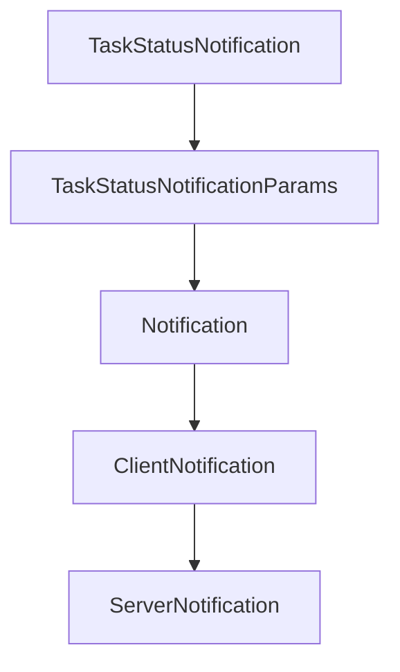

# Chapter 4: Server Runtime, Primitives, and Feature Registration

Welcome to **Chapter 4: Server Runtime, Primitives, and Feature Registration**. In this part of **MCP Kotlin SDK Tutorial: Building Multiplatform MCP Clients and Servers**, you will build an intuitive mental model first, then move into concrete implementation details and practical production tradeoffs.


This chapter explains how Kotlin MCP servers register and manage primitives with capability discipline.

## Learning Goals

- set `ServerOptions` and capabilities intentionally
- register tools, prompts, resources, and templates cleanly
- manage session lifecycle hooks and list-change notifications
- structure server code for later transport and scaling changes

## Primitive Registration Strategy

| Primitive | Typical API Surface |
|:----------|:--------------------|
| Tools | `addTool`, dynamic updates, list-changed notifications |
| Prompts | `addPrompt`, argument metadata, prompt retrieval |
| Resources | `addResource`, template exposure, optional subscriptions |

## Server Guidance

- advertise only capabilities you actively support.
- enable list-changed notifications only when clients need dynamic discovery.
- keep handlers deterministic and bounded to avoid long blocking tasks.

## Source References

- [Kotlin SDK README - Creating a Server](https://github.com/modelcontextprotocol/kotlin-sdk/blob/main/README.md#creating-a-server)
- [kotlin-sdk-server Module Guide](https://github.com/modelcontextprotocol/kotlin-sdk/blob/main/kotlin-sdk-server/Module.md)
- [Kotlin MCP Server Sample](https://github.com/modelcontextprotocol/kotlin-sdk/blob/main/samples/kotlin-mcp-server/README.md)
- [Weather STDIO Sample](https://github.com/modelcontextprotocol/kotlin-sdk/blob/main/samples/weather-stdio-server/README.md)

## Summary

You now have a server-side primitive model that is consistent with MCP capability negotiation.

Next: [Chapter 5: Transports: stdio, Streamable HTTP, SSE, and WebSocket](05-transports-stdio-streamable-http-sse-and-websocket.md)

## Source Code Walkthrough

### `kotlin-sdk-core/src/commonMain/kotlin/io/modelcontextprotocol/kotlin/sdk/types/notification.kt`

The `TaskStatusNotification` class in [`kotlin-sdk-core/src/commonMain/kotlin/io/modelcontextprotocol/kotlin/sdk/types/notification.kt`](https://github.com/modelcontextprotocol/kotlin-sdk/blob/HEAD/kotlin-sdk-core/src/commonMain/kotlin/io/modelcontextprotocol/kotlin/sdk/types/notification.kt) handles a key part of this chapter's functionality:

```kt
 */
@Serializable
public data class TaskStatusNotification(override val params: TaskStatusNotificationParams? = null) :
    ClientNotification,
    ServerNotification {
    @EncodeDefault
    override val method: Method = Method.Defined.NotificationsTasksStatus
}

/**
 * Parameters for a notifications/tasks/status notification.
 *
 * @property taskId The task identifier.
 * @property status Current task state.
 * @property statusMessage Optional human-readable message describing the current task state.
 * @property createdAt ISO 8601 timestamp when the task was created.
 * @property lastUpdatedAt ISO 8601 timestamp when the task was last updated.
 * @property ttl Actual retention duration from creation in milliseconds, null for unlimited.
 * @property pollInterval Suggested polling interval in milliseconds.
 * @property meta Optional metadata for this notification.
 */
@Serializable
public data class TaskStatusNotificationParams(
    override val taskId: String,
    override val status: TaskStatus,
    override val statusMessage: String? = null,
    override val createdAt: String,
    override val lastUpdatedAt: String,
    override val ttl: Long?,
    override val pollInterval: Long? = null,
    @SerialName("_meta") override val meta: JsonObject? = null,
) : NotificationParams,
```

This class is important because it defines how MCP Kotlin SDK Tutorial: Building Multiplatform MCP Clients and Servers implements the patterns covered in this chapter.

### `kotlin-sdk-core/src/commonMain/kotlin/io/modelcontextprotocol/kotlin/sdk/types/notification.kt`

The `TaskStatusNotificationParams` class in [`kotlin-sdk-core/src/commonMain/kotlin/io/modelcontextprotocol/kotlin/sdk/types/notification.kt`](https://github.com/modelcontextprotocol/kotlin-sdk/blob/HEAD/kotlin-sdk-core/src/commonMain/kotlin/io/modelcontextprotocol/kotlin/sdk/types/notification.kt) handles a key part of this chapter's functionality:

```kt
 */
@Serializable
public data class TaskStatusNotification(override val params: TaskStatusNotificationParams? = null) :
    ClientNotification,
    ServerNotification {
    @EncodeDefault
    override val method: Method = Method.Defined.NotificationsTasksStatus
}

/**
 * Parameters for a notifications/tasks/status notification.
 *
 * @property taskId The task identifier.
 * @property status Current task state.
 * @property statusMessage Optional human-readable message describing the current task state.
 * @property createdAt ISO 8601 timestamp when the task was created.
 * @property lastUpdatedAt ISO 8601 timestamp when the task was last updated.
 * @property ttl Actual retention duration from creation in milliseconds, null for unlimited.
 * @property pollInterval Suggested polling interval in milliseconds.
 * @property meta Optional metadata for this notification.
 */
@Serializable
public data class TaskStatusNotificationParams(
    override val taskId: String,
    override val status: TaskStatus,
    override val statusMessage: String? = null,
    override val createdAt: String,
    override val lastUpdatedAt: String,
    override val ttl: Long?,
    override val pollInterval: Long? = null,
    @SerialName("_meta") override val meta: JsonObject? = null,
) : NotificationParams,
```

This class is important because it defines how MCP Kotlin SDK Tutorial: Building Multiplatform MCP Clients and Servers implements the patterns covered in this chapter.

### `kotlin-sdk-core/src/commonMain/kotlin/io/modelcontextprotocol/kotlin/sdk/types/notification.kt`

The `Notification` interface in [`kotlin-sdk-core/src/commonMain/kotlin/io/modelcontextprotocol/kotlin/sdk/types/notification.kt`](https://github.com/modelcontextprotocol/kotlin-sdk/blob/HEAD/kotlin-sdk-core/src/commonMain/kotlin/io/modelcontextprotocol/kotlin/sdk/types/notification.kt) handles a key part of this chapter's functionality:

```kt
 * @property params optional notification parameters
 */
@Serializable(with = NotificationPolymorphicSerializer::class)
public sealed interface Notification {
    public val method: Method
    public val params: NotificationParams?
}

/**
 * Represents a notification sent by the client.
 */
@Serializable(with = ClientNotificationPolymorphicSerializer::class)
public sealed interface ClientNotification : Notification

/**
 * Represents a notification sent by the server.
 */
@Serializable(with = ServerNotificationPolymorphicSerializer::class)
public sealed interface ServerNotification : Notification

/**
 * Interface for notification parameter types.
 *
 * @property meta Optional metadata for the notification.
 */
@Serializable
public sealed interface NotificationParams : WithMeta

/**
 * Base parameters for notifications that only contain metadata.
 */
@Serializable
```

This interface is important because it defines how MCP Kotlin SDK Tutorial: Building Multiplatform MCP Clients and Servers implements the patterns covered in this chapter.

### `kotlin-sdk-core/src/commonMain/kotlin/io/modelcontextprotocol/kotlin/sdk/types/notification.kt`

The `ClientNotification` interface in [`kotlin-sdk-core/src/commonMain/kotlin/io/modelcontextprotocol/kotlin/sdk/types/notification.kt`](https://github.com/modelcontextprotocol/kotlin-sdk/blob/HEAD/kotlin-sdk-core/src/commonMain/kotlin/io/modelcontextprotocol/kotlin/sdk/types/notification.kt) handles a key part of this chapter's functionality:

```kt
 * Represents a notification sent by the client.
 */
@Serializable(with = ClientNotificationPolymorphicSerializer::class)
public sealed interface ClientNotification : Notification

/**
 * Represents a notification sent by the server.
 */
@Serializable(with = ServerNotificationPolymorphicSerializer::class)
public sealed interface ServerNotification : Notification

/**
 * Interface for notification parameter types.
 *
 * @property meta Optional metadata for the notification.
 */
@Serializable
public sealed interface NotificationParams : WithMeta

/**
 * Base parameters for notifications that only contain metadata.
 */
@Serializable
public data class BaseNotificationParams(@SerialName("_meta") override val meta: JsonObject? = null) :
    NotificationParams

/**
 * Represents a progress notification.
 *
 * @property progress The progress thus far. This should increase every time progress is made,
 * even if the total is unknown.
 * @property total Total number of items to a process (or total progress required), if known.
```

This interface is important because it defines how MCP Kotlin SDK Tutorial: Building Multiplatform MCP Clients and Servers implements the patterns covered in this chapter.


## How These Components Connect


