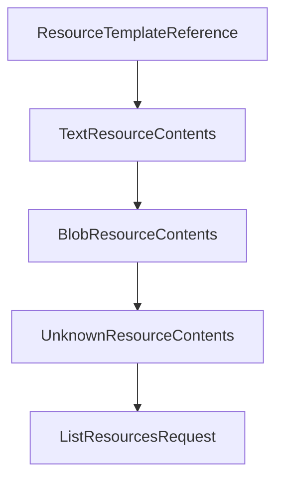

# Chapter 4: Server Runtime, Primitives, and Feature Registration

Welcome to **Chapter 4: Server Runtime, Primitives, and Feature Registration**. In this part of **MCP Kotlin SDK Tutorial: Building Multiplatform MCP Clients and Servers**, you will build an intuitive mental model first, then move into concrete implementation details and practical production tradeoffs.


This chapter explains how Kotlin MCP servers register and manage primitives with capability discipline.

## Learning Goals

- set `ServerOptions` and capabilities intentionally
- register tools, prompts, resources, and templates cleanly
- manage session lifecycle hooks and list-change notifications
- structure server code for later transport and scaling changes

## Primitive Registration Strategy

| Primitive | Typical API Surface |
|:----------|:--------------------|
| Tools | `addTool`, dynamic updates, list-changed notifications |
| Prompts | `addPrompt`, argument metadata, prompt retrieval |
| Resources | `addResource`, template exposure, optional subscriptions |

## Server Guidance

- advertise only capabilities you actively support.
- enable list-changed notifications only when clients need dynamic discovery.
- keep handlers deterministic and bounded to avoid long blocking tasks.

## Source References

- [Kotlin SDK README - Creating a Server](https://github.com/modelcontextprotocol/kotlin-sdk/blob/main/README.md#creating-a-server)
- [kotlin-sdk-server Module Guide](https://github.com/modelcontextprotocol/kotlin-sdk/blob/main/kotlin-sdk-server/Module.md)
- [Kotlin MCP Server Sample](https://github.com/modelcontextprotocol/kotlin-sdk/blob/main/samples/kotlin-mcp-server/README.md)
- [Weather STDIO Sample](https://github.com/modelcontextprotocol/kotlin-sdk/blob/main/samples/weather-stdio-server/README.md)

## Summary

You now have a server-side primitive model that is consistent with MCP capability negotiation.

Next: [Chapter 5: Transports: stdio, Streamable HTTP, SSE, and WebSocket](05-transports-stdio-streamable-http-sse-and-websocket.md)

## Depth Expansion Playbook

## Source Code Walkthrough

### `kotlin-sdk-core/src/commonMain/kotlin/io/modelcontextprotocol/kotlin/sdk/types/resources.kt`

The `ResourceTemplateReference` class in [`kotlin-sdk-core/src/commonMain/kotlin/io/modelcontextprotocol/kotlin/sdk/types/resources.kt`](https://github.com/modelcontextprotocol/kotlin-sdk/blob/HEAD/kotlin-sdk-core/src/commonMain/kotlin/io/modelcontextprotocol/kotlin/sdk/types/resources.kt) handles a key part of this chapter's functionality:

```kt
 */
@Serializable
public data class ResourceTemplateReference(val uri: String) : Reference {
    @EncodeDefault
    public override val type: ReferenceType = ReferenceType.ResourceTemplate
}

/**
 * The contents of a specific resource or sub-resource.
 *
 * @property uri The URI of this resource.
 * @property mimeType The MIME type of this resource, if known.
 * @property meta Optional metadata for this response.
 */
@Serializable(with = ResourceContentsPolymorphicSerializer::class)
public sealed interface ResourceContents : WithMeta {
    public val uri: String
    public val mimeType: String?
}

/**
 * Represents the text contents of a resource.
 *
 * @property text The text of the item.
 * This must only be set if the item can actually be represented as text (not binary data).
 * @property uri The URI of this resource.
 * @property mimeType The MIME type of this resource, if known.
 */
@Serializable
public data class TextResourceContents(
    val text: String,
    override val uri: String,
```

This class is important because it defines how MCP Kotlin SDK Tutorial: Building Multiplatform MCP Clients and Servers implements the patterns covered in this chapter.

### `kotlin-sdk-core/src/commonMain/kotlin/io/modelcontextprotocol/kotlin/sdk/types/resources.kt`

The `TextResourceContents` class in [`kotlin-sdk-core/src/commonMain/kotlin/io/modelcontextprotocol/kotlin/sdk/types/resources.kt`](https://github.com/modelcontextprotocol/kotlin-sdk/blob/HEAD/kotlin-sdk-core/src/commonMain/kotlin/io/modelcontextprotocol/kotlin/sdk/types/resources.kt) handles a key part of this chapter's functionality:

```kt
 */
@Serializable
public data class TextResourceContents(
    val text: String,
    override val uri: String,
    override val mimeType: String? = null,
    @SerialName("_meta")
    override val meta: JsonObject? = null,
) : ResourceContents

/**
 * The contents of a specific resource or sub-resource.
 *
 * @property blob A base64-encoded string representing the binary data of the item.
 * @property uri The URI of this resource.
 * @property mimeType The MIME type of this resource, if known.
 */
@Serializable
public data class BlobResourceContents(
    val blob: String,
    override val uri: String,
    override val mimeType: String? = null,
    @SerialName("_meta")
    override val meta: JsonObject? = null,
) : ResourceContents

/**
 * Represents resource contents with unknown or unspecified data.
 *
 * @property uri The URI of this resource.
 * @property mimeType The MIME type of this resource, if known.
 */
```

This class is important because it defines how MCP Kotlin SDK Tutorial: Building Multiplatform MCP Clients and Servers implements the patterns covered in this chapter.

### `kotlin-sdk-core/src/commonMain/kotlin/io/modelcontextprotocol/kotlin/sdk/types/resources.kt`

The `BlobResourceContents` class in [`kotlin-sdk-core/src/commonMain/kotlin/io/modelcontextprotocol/kotlin/sdk/types/resources.kt`](https://github.com/modelcontextprotocol/kotlin-sdk/blob/HEAD/kotlin-sdk-core/src/commonMain/kotlin/io/modelcontextprotocol/kotlin/sdk/types/resources.kt) handles a key part of this chapter's functionality:

```kt
 */
@Serializable
public data class BlobResourceContents(
    val blob: String,
    override val uri: String,
    override val mimeType: String? = null,
    @SerialName("_meta")
    override val meta: JsonObject? = null,
) : ResourceContents

/**
 * Represents resource contents with unknown or unspecified data.
 *
 * @property uri The URI of this resource.
 * @property mimeType The MIME type of this resource, if known.
 */
@Serializable
public data class UnknownResourceContents(
    override val uri: String,
    override val mimeType: String? = null,
    @SerialName("_meta")
    override val meta: JsonObject? = null,
) : ResourceContents

// ============================================================================
// resources/list
// ============================================================================

/**
 * Sent from the client to request a list of resources the server has.
 *
 * Resources are data sources that the server can provide access to, such as files,
```

This class is important because it defines how MCP Kotlin SDK Tutorial: Building Multiplatform MCP Clients and Servers implements the patterns covered in this chapter.

### `kotlin-sdk-core/src/commonMain/kotlin/io/modelcontextprotocol/kotlin/sdk/types/resources.kt`

The `UnknownResourceContents` class in [`kotlin-sdk-core/src/commonMain/kotlin/io/modelcontextprotocol/kotlin/sdk/types/resources.kt`](https://github.com/modelcontextprotocol/kotlin-sdk/blob/HEAD/kotlin-sdk-core/src/commonMain/kotlin/io/modelcontextprotocol/kotlin/sdk/types/resources.kt) handles a key part of this chapter's functionality:

```kt
 */
@Serializable
public data class UnknownResourceContents(
    override val uri: String,
    override val mimeType: String? = null,
    @SerialName("_meta")
    override val meta: JsonObject? = null,
) : ResourceContents

// ============================================================================
// resources/list
// ============================================================================

/**
 * Sent from the client to request a list of resources the server has.
 *
 * Resources are data sources that the server can provide access to, such as files,
 * database entries, API responses, or other structured data.
 *
 * @property params Optional pagination parameters to control which page of results to return.
 */
@Serializable
public data class ListResourcesRequest(override val params: PaginatedRequestParams? = null) :
    ClientRequest,
    PaginatedRequest {
    @EncodeDefault
    override val method: Method = Method.Defined.ResourcesList

    /**
     * Secondary constructor for creating a [ListResourcesRequest] instance
     * using optional cursor and metadata parameters.
     *
```

This class is important because it defines how MCP Kotlin SDK Tutorial: Building Multiplatform MCP Clients and Servers implements the patterns covered in this chapter.


## How These Components Connect


