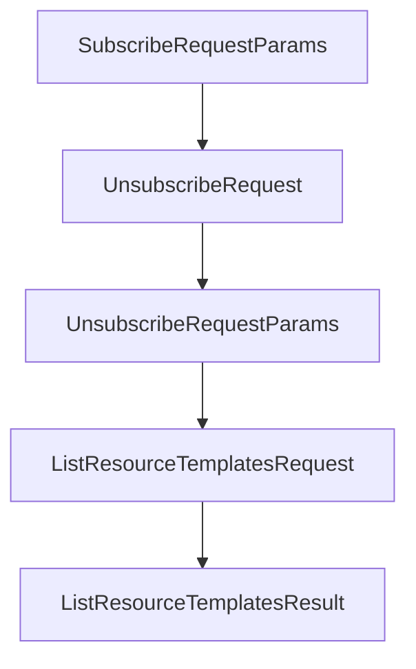

# Chapter 5: Transports: stdio, Streamable HTTP, SSE, and WebSocket

Welcome to **Chapter 5: Transports: stdio, Streamable HTTP, SSE, and WebSocket**. In this part of **MCP Kotlin SDK Tutorial: Building Multiplatform MCP Clients and Servers**, you will build an intuitive mental model first, then move into concrete implementation details and practical production tradeoffs.


This chapter maps transport options to deployment and operational constraints.

## Learning Goals

- choose the right transport for local tooling vs remote services
- understand session behavior differences across transports
- align Ktor client/server dependencies with transport choices
- reduce transport-related debugging cycles in early deployment

## Transport Selection Matrix

| Transport | Best Fit |
|:----------|:---------|
| stdio | local CLI/editor integrations and subprocess servers |
| Streamable HTTP | web service-style request/response with streaming support |
| SSE | server push plus POST back-channel patterns |
| WebSocket | long-lived bidirectional sessions |

## Operational Notes

- stdio is easiest for local integrations but harder to observe at scale.
- HTTP/SSE paths require session and header handling discipline.
- WebSocket simplifies bi-directional messaging but needs robust connection lifecycle handling.

## Source References

- [Kotlin SDK README - Transports](https://github.com/modelcontextprotocol/kotlin-sdk/blob/main/README.md#transports)
- [kotlin-sdk-client Module Guide - Ktor Transports](https://github.com/modelcontextprotocol/kotlin-sdk/blob/main/kotlin-sdk-client/Module.md)
- [kotlin-sdk-server Module Guide - Ktor Hosting](https://github.com/modelcontextprotocol/kotlin-sdk/blob/main/kotlin-sdk-server/Module.md)

## Summary

You now have a practical framework for choosing Kotlin MCP transports by workload.

Next: [Chapter 6: Advanced Client Features: Roots, Sampling, and Elicitation](06-advanced-client-features-roots-sampling-and-elicitation.md)

## Depth Expansion Playbook

## Source Code Walkthrough

### `kotlin-sdk-core/src/commonMain/kotlin/io/modelcontextprotocol/kotlin/sdk/types/resources.kt`

The `SubscribeRequestParams` class in [`kotlin-sdk-core/src/commonMain/kotlin/io/modelcontextprotocol/kotlin/sdk/types/resources.kt`](https://github.com/modelcontextprotocol/kotlin-sdk/blob/HEAD/kotlin-sdk-core/src/commonMain/kotlin/io/modelcontextprotocol/kotlin/sdk/types/resources.kt) handles a key part of this chapter's functionality:

```kt
 */
@Serializable
public data class SubscribeRequest(override val params: SubscribeRequestParams) : ClientRequest {
    @EncodeDefault
    override val method: Method = Method.Defined.ResourcesSubscribe

    /**
     * The URI of the resource to subscribe to.
     */
    public val uri: String
        get() = params.uri

    /**
     * Metadata for this request. May include a progressToken for out-of-band progress notifications.
     */
    public val meta: RequestMeta?
        get() = params.meta

    @Deprecated(
        message = "Use the constructor with SubscribeRequestParams property instead",
        replaceWith = ReplaceWith("ReadResourceRequest(SubscribeRequestParams(uri, meta))"),
        level = DeprecationLevel.ERROR,
    )
    public constructor(
        uri: String,
        meta: RequestMeta? = null,
    ) : this(SubscribeRequestParams(uri, meta))
}

/**
 * Parameters for a resources/subscribe request.
 *
```

This class is important because it defines how MCP Kotlin SDK Tutorial: Building Multiplatform MCP Clients and Servers implements the patterns covered in this chapter.

### `kotlin-sdk-core/src/commonMain/kotlin/io/modelcontextprotocol/kotlin/sdk/types/resources.kt`

The `UnsubscribeRequest` class in [`kotlin-sdk-core/src/commonMain/kotlin/io/modelcontextprotocol/kotlin/sdk/types/resources.kt`](https://github.com/modelcontextprotocol/kotlin-sdk/blob/HEAD/kotlin-sdk-core/src/commonMain/kotlin/io/modelcontextprotocol/kotlin/sdk/types/resources.kt) handles a key part of this chapter's functionality:

```kt
 */
@Serializable
public data class UnsubscribeRequest(override val params: UnsubscribeRequestParams) : ClientRequest {
    @EncodeDefault
    override val method: Method = Method.Defined.ResourcesUnsubscribe

    /**
     * The URI of the resource to unsubscribe from.
     */
    public val uri: String
        get() = params.uri

    /**
     * Metadata for this request. May include a progressToken for out-of-band progress notifications.
     */
    public val meta: RequestMeta?
        get() = params.meta

    public constructor(
        uri: String,
        meta: RequestMeta? = null,
    ) : this(UnsubscribeRequestParams(uri, meta))
}

/**
 * Parameters for a resources/unsubscribe request.
 *
 * @property uri The URI of the resource to unsubscribe from. This should match
 * a URI from a previous [SubscribeRequest].
 * @property meta Optional metadata for this request. May include a progressToken for
 * out-of-band progress notifications.
 */
```

This class is important because it defines how MCP Kotlin SDK Tutorial: Building Multiplatform MCP Clients and Servers implements the patterns covered in this chapter.

### `kotlin-sdk-core/src/commonMain/kotlin/io/modelcontextprotocol/kotlin/sdk/types/resources.kt`

The `UnsubscribeRequestParams` class in [`kotlin-sdk-core/src/commonMain/kotlin/io/modelcontextprotocol/kotlin/sdk/types/resources.kt`](https://github.com/modelcontextprotocol/kotlin-sdk/blob/HEAD/kotlin-sdk-core/src/commonMain/kotlin/io/modelcontextprotocol/kotlin/sdk/types/resources.kt) handles a key part of this chapter's functionality:

```kt
 */
@Serializable
public data class UnsubscribeRequest(override val params: UnsubscribeRequestParams) : ClientRequest {
    @EncodeDefault
    override val method: Method = Method.Defined.ResourcesUnsubscribe

    /**
     * The URI of the resource to unsubscribe from.
     */
    public val uri: String
        get() = params.uri

    /**
     * Metadata for this request. May include a progressToken for out-of-band progress notifications.
     */
    public val meta: RequestMeta?
        get() = params.meta

    public constructor(
        uri: String,
        meta: RequestMeta? = null,
    ) : this(UnsubscribeRequestParams(uri, meta))
}

/**
 * Parameters for a resources/unsubscribe request.
 *
 * @property uri The URI of the resource to unsubscribe from. This should match
 * a URI from a previous [SubscribeRequest].
 * @property meta Optional metadata for this request. May include a progressToken for
 * out-of-band progress notifications.
 */
```

This class is important because it defines how MCP Kotlin SDK Tutorial: Building Multiplatform MCP Clients and Servers implements the patterns covered in this chapter.

### `kotlin-sdk-core/src/commonMain/kotlin/io/modelcontextprotocol/kotlin/sdk/types/resources.kt`

The `ListResourceTemplatesRequest` class in [`kotlin-sdk-core/src/commonMain/kotlin/io/modelcontextprotocol/kotlin/sdk/types/resources.kt`](https://github.com/modelcontextprotocol/kotlin-sdk/blob/HEAD/kotlin-sdk-core/src/commonMain/kotlin/io/modelcontextprotocol/kotlin/sdk/types/resources.kt) handles a key part of this chapter's functionality:

```kt
 */
@Serializable
public data class ListResourceTemplatesRequest(override val params: PaginatedRequestParams? = null) :
    ClientRequest,
    PaginatedRequest {
    @EncodeDefault
    override val method: Method = Method.Defined.ResourcesTemplatesList

    /**
     * Secondary constructor for creating a [ListResourceTemplatesRequest] instance
     * using optional cursor and metadata parameters.
     *
     * This constructor simplifies the creation of the [ListResourceTemplatesRequest] by allowing a cursor
     * and metadata to be provided.
     *
     * @param cursor Optional cursor string to specify the starting point of the paginated request.
     * @param meta Optional metadata associated with the request.
     */
    @Deprecated(
        message = "Use the constructor with PaginatedRequestParams property instead",
        replaceWith = ReplaceWith("ListResourceTemplatesRequest(PaginatedRequestParams(cursor, meta))"),
        level = DeprecationLevel.ERROR,
    )
    public constructor(
        cursor: String?,
        meta: RequestMeta? = null,
    ) : this(paginatedRequestParams(cursor, meta))
}

/**
 * The server's response to a [ListResourceTemplatesRequest] from the client.
 *
```

This class is important because it defines how MCP Kotlin SDK Tutorial: Building Multiplatform MCP Clients and Servers implements the patterns covered in this chapter.


## How These Components Connect


