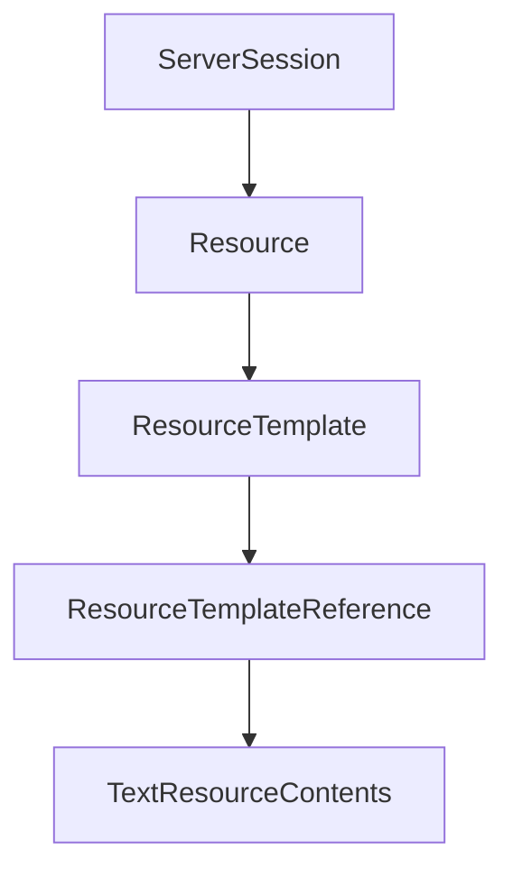

# Chapter 5: Transports: stdio, Streamable HTTP, SSE, and WebSocket

Welcome to **Chapter 5: Transports: stdio, Streamable HTTP, SSE, and WebSocket**. In this part of **MCP Kotlin SDK Tutorial: Building Multiplatform MCP Clients and Servers**, you will build an intuitive mental model first, then move into concrete implementation details and practical production tradeoffs.


This chapter maps transport options to deployment and operational constraints.

## Learning Goals

- choose the right transport for local tooling vs remote services
- understand session behavior differences across transports
- align Ktor client/server dependencies with transport choices
- reduce transport-related debugging cycles in early deployment

## Transport Selection Matrix

| Transport | Best Fit |
|:----------|:---------|
| stdio | local CLI/editor integrations and subprocess servers |
| Streamable HTTP | web service-style request/response with streaming support |
| SSE | server push plus POST back-channel patterns |
| WebSocket | long-lived bidirectional sessions |

## Operational Notes

- stdio is easiest for local integrations but harder to observe at scale.
- HTTP/SSE paths require session and header handling discipline.
- WebSocket simplifies bi-directional messaging but needs robust connection lifecycle handling.

## Source References

- [Kotlin SDK README - Transports](https://github.com/modelcontextprotocol/kotlin-sdk/blob/main/README.md#transports)
- [kotlin-sdk-client Module Guide - Ktor Transports](https://github.com/modelcontextprotocol/kotlin-sdk/blob/main/kotlin-sdk-client/Module.md)
- [kotlin-sdk-server Module Guide - Ktor Hosting](https://github.com/modelcontextprotocol/kotlin-sdk/blob/main/kotlin-sdk-server/Module.md)

## Summary

You now have a practical framework for choosing Kotlin MCP transports by workload.

Next: [Chapter 6: Advanced Client Features: Roots, Sampling, and Elicitation](06-advanced-client-features-roots-sampling-and-elicitation.md)

## Source Code Walkthrough

### `kotlin-sdk-server/src/commonMain/kotlin/io/modelcontextprotocol/kotlin/sdk/server/ServerSession.kt`

The `ServerSession` class in [`kotlin-sdk-server/src/commonMain/kotlin/io/modelcontextprotocol/kotlin/sdk/server/ServerSession.kt`](https://github.com/modelcontextprotocol/kotlin-sdk/blob/HEAD/kotlin-sdk-server/src/commonMain/kotlin/io/modelcontextprotocol/kotlin/sdk/server/ServerSession.kt) handles a key part of this chapter's functionality:

```kt
 */
@Suppress("TooManyFunctions")
public open class ServerSession(
    protected val serverInfo: Implementation,
    options: ServerOptions,
    protected val instructions: String?,
) : Protocol(options) {

    @OptIn(ExperimentalUuidApi::class)
    public val sessionId: String = Uuid.random().toString()

    private var _onInitialized: (() -> Unit) = {}

    private var _onClose: () -> Unit = {}

    private val _clientCapabilities: AtomicRef<ClientCapabilities?> = atomic(null)
    private val _clientVersion: AtomicRef<Implementation?> = atomic(null)

    /**
     * The client's reported capabilities after initialization.
     */
    public val clientCapabilities: ClientCapabilities? get() = _clientCapabilities.value

    /**
     * The client's version information after initialization.
     */
    public val clientVersion: Implementation? get() = _clientVersion.value

    /**
     * The capabilities supported by the server, related to the session.
     */
    private val serverCapabilities = options.capabilities
```

This class is important because it defines how MCP Kotlin SDK Tutorial: Building Multiplatform MCP Clients and Servers implements the patterns covered in this chapter.

### `kotlin-sdk-core/src/commonMain/kotlin/io/modelcontextprotocol/kotlin/sdk/types/resources.kt`

The `Resource` class in [`kotlin-sdk-core/src/commonMain/kotlin/io/modelcontextprotocol/kotlin/sdk/types/resources.kt`](https://github.com/modelcontextprotocol/kotlin-sdk/blob/HEAD/kotlin-sdk-core/src/commonMain/kotlin/io/modelcontextprotocol/kotlin/sdk/types/resources.kt) handles a key part of this chapter's functionality:

```kt
 */
@Serializable
public sealed interface ResourceLike : WithMeta

/**
 * A known resource that the server is capable of reading.
 *
 * Resources represent data sources such as files, database entries, API responses,
 * or other structured data that can be read by clients.
 *
 * @property uri The URI of this resource. Can use any protocol scheme (`file://`, `http://`, etc.).
 * @property name The programmatic identifier for this resource.
 * Intended for logical use and API identification. If [title] is not provided,
 * this should be used as a fallback display name.
 * @property description A description of what this resource represents.
 * Clients can use this to improve the LLM's understanding of available resources.
 * It can be thought of like a "hint" to the model.
 * @property mimeType The MIME type of this resource, if known (e.g., "text/plain", "application/json", "image/png").
 * @property size The size of the raw resource content in bytes
 * (i.e., before base64 encoding or any tokenization), if known.
 * Hosts can use this to display file sizes and estimate context window usage.
 * @property title Optional human-readable display name for this resource.
 * Intended for UI and end-user contexts, optimized to be easily understood
 * even by those unfamiliar with domain-specific terminology.
 * If not provided, [name] should be used for display purposes.
 * @property annotations Optional annotations for the client. Provides additional metadata and hints
 * about how to use or display this resource.
 * @property icons Optional set of sized icons that clients can display in their user interface.
 * Clients MUST support at least PNG and JPEG formats.
 * Clients SHOULD also support SVG and WebP formats.
 * @property meta Optional metadata for this resource.
 */
```

This class is important because it defines how MCP Kotlin SDK Tutorial: Building Multiplatform MCP Clients and Servers implements the patterns covered in this chapter.

### `kotlin-sdk-core/src/commonMain/kotlin/io/modelcontextprotocol/kotlin/sdk/types/resources.kt`

The `ResourceTemplate` class in [`kotlin-sdk-core/src/commonMain/kotlin/io/modelcontextprotocol/kotlin/sdk/types/resources.kt`](https://github.com/modelcontextprotocol/kotlin-sdk/blob/HEAD/kotlin-sdk-core/src/commonMain/kotlin/io/modelcontextprotocol/kotlin/sdk/types/resources.kt) handles a key part of this chapter's functionality:

```kt
 */
@Serializable
public data class ResourceTemplate(
    val uriTemplate: String,
    val name: String,
    val description: String? = null,
    val mimeType: String? = null,
    val title: String? = null,
    val annotations: Annotations? = null,
    val icons: List<Icon>? = null,
    @SerialName("_meta")
    override val meta: JsonObject? = null,
) : WithMeta

/**
 * A reference to a resource or resource template definition.
 *
 * Used in completion requests and other contexts where a resource needs to be referenced
 * without including its full definition. The URI can be either a specific resource URI
 * or a URI template pattern.
 *
 * @property uri The URI or URI template of the resource.
 * Can be a specific resource URI (e.g., `file:///home/user/doc.txt`)
 * or a URI template with parameters (e.g., `file:///{path}`).
 */
@Serializable
public data class ResourceTemplateReference(val uri: String) : Reference {
    @EncodeDefault
    public override val type: ReferenceType = ReferenceType.ResourceTemplate
}

/**
```

This class is important because it defines how MCP Kotlin SDK Tutorial: Building Multiplatform MCP Clients and Servers implements the patterns covered in this chapter.

### `kotlin-sdk-core/src/commonMain/kotlin/io/modelcontextprotocol/kotlin/sdk/types/resources.kt`

The `ResourceTemplateReference` class in [`kotlin-sdk-core/src/commonMain/kotlin/io/modelcontextprotocol/kotlin/sdk/types/resources.kt`](https://github.com/modelcontextprotocol/kotlin-sdk/blob/HEAD/kotlin-sdk-core/src/commonMain/kotlin/io/modelcontextprotocol/kotlin/sdk/types/resources.kt) handles a key part of this chapter's functionality:

```kt
 */
@Serializable
public data class ResourceTemplateReference(val uri: String) : Reference {
    @EncodeDefault
    public override val type: ReferenceType = ReferenceType.ResourceTemplate
}

/**
 * The contents of a specific resource or sub-resource.
 *
 * @property uri The URI of this resource.
 * @property mimeType The MIME type of this resource, if known.
 * @property meta Optional metadata for this response.
 */
@Serializable(with = ResourceContentsPolymorphicSerializer::class)
public sealed interface ResourceContents : WithMeta {
    public val uri: String
    public val mimeType: String?
}

/**
 * Represents the text contents of a resource.
 *
 * @property text The text of the item.
 * This must only be set if the item can actually be represented as text (not binary data).
 * @property uri The URI of this resource.
 * @property mimeType The MIME type of this resource, if known.
 */
@Serializable
public data class TextResourceContents(
    val text: String,
    override val uri: String,
```

This class is important because it defines how MCP Kotlin SDK Tutorial: Building Multiplatform MCP Clients and Servers implements the patterns covered in this chapter.


## How These Components Connect


