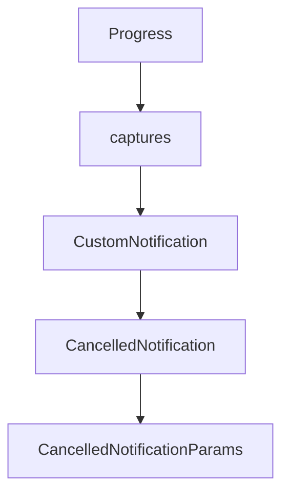

# Chapter 6: Advanced Client Features: Roots, Sampling, and Elicitation

Welcome to **Chapter 6: Advanced Client Features: Roots, Sampling, and Elicitation**. In this part of **MCP Kotlin SDK Tutorial: Building Multiplatform MCP Clients and Servers**, you will build an intuitive mental model first, then move into concrete implementation details and practical production tradeoffs.


This chapter covers advanced client features that materially affect user control and context boundaries.

## Learning Goals

- manage roots and contextual scope correctly
- apply sampling flows with explicit user-governed behavior
- understand elicitation support and capability gating
- avoid overexposing local context to remote server workflows

## Advanced Feature Guardrails

1. enable only required client capabilities (`roots`, `sampling`, `elicitation`)
2. track when server requests expand context boundaries
3. keep user-facing approvals around high-impact sampling/tool actions
4. log capability and session metadata for debugging and auditability

## Source References

- [Kotlin SDK README - Client Features](https://github.com/modelcontextprotocol/kotlin-sdk/blob/main/README.md#client-features)
- [kotlin-sdk-client Module Guide - Feature Usage Highlights](https://github.com/modelcontextprotocol/kotlin-sdk/blob/main/kotlin-sdk-client/Module.md)
- [MCP Specification - Client Features](https://modelcontextprotocol.io/specification/2025-11-25)

## Summary

You now have a control-oriented strategy for advanced Kotlin client capabilities.

Next: [Chapter 7: Testing, Conformance, and Operational Diagnostics](07-testing-conformance-and-operational-diagnostics.md)

## Depth Expansion Playbook

## Source Code Walkthrough

### `kotlin-sdk-core/src/commonMain/kotlin/io/modelcontextprotocol/kotlin/sdk/types/notification.kt`

The `Progress` class in [`kotlin-sdk-core/src/commonMain/kotlin/io/modelcontextprotocol/kotlin/sdk/types/notification.kt`](https://github.com/modelcontextprotocol/kotlin-sdk/blob/HEAD/kotlin-sdk-core/src/commonMain/kotlin/io/modelcontextprotocol/kotlin/sdk/types/notification.kt) handles a key part of this chapter's functionality:

```kt
 */
@Serializable
public class Progress(
    public val progress: Double,
    public val total: Double? = null,
    public val message: String? = null,
)

// ============================================================================
// Custom Notification
// ============================================================================

/**
 * Represents a custom notification method that is not part of the core MCP specification.
 *
 * The MCP protocol allows implementations to define custom methods for extending functionality.
 * This class captures such custom notifications while preserving all their data.
 *
 * @property method The custom method name. By convention, custom methods often contain
 * organization-specific prefixes (e.g., "mycompany/custom_event").
 * @property params Raw JSON parameters for the custom notification, if present.
 */
@Serializable
public data class CustomNotification(override val method: Method, override val params: BaseNotificationParams? = null) :
    ClientNotification,
    ServerNotification {

    public val meta: JsonObject?
        get() = params?.meta
}

// ============================================================================
```

This class is important because it defines how MCP Kotlin SDK Tutorial: Building Multiplatform MCP Clients and Servers implements the patterns covered in this chapter.

### `kotlin-sdk-core/src/commonMain/kotlin/io/modelcontextprotocol/kotlin/sdk/types/notification.kt`

The `captures` class in [`kotlin-sdk-core/src/commonMain/kotlin/io/modelcontextprotocol/kotlin/sdk/types/notification.kt`](https://github.com/modelcontextprotocol/kotlin-sdk/blob/HEAD/kotlin-sdk-core/src/commonMain/kotlin/io/modelcontextprotocol/kotlin/sdk/types/notification.kt) handles a key part of this chapter's functionality:

```kt
 *
 * The MCP protocol allows implementations to define custom methods for extending functionality.
 * This class captures such custom notifications while preserving all their data.
 *
 * @property method The custom method name. By convention, custom methods often contain
 * organization-specific prefixes (e.g., "mycompany/custom_event").
 * @property params Raw JSON parameters for the custom notification, if present.
 */
@Serializable
public data class CustomNotification(override val method: Method, override val params: BaseNotificationParams? = null) :
    ClientNotification,
    ServerNotification {

    public val meta: JsonObject?
        get() = params?.meta
}

// ============================================================================
// Cancelled Notification
// ============================================================================

/**
 * This notification can be sent by either side to indicate that it is cancelling a previously-issued request.
 *
 * The request SHOULD still be in-flight, but due to communication latency,
 * it is always possible that this notification MAY arrive after the request has already finished.
 *
 * This notification indicates that the result will be unused, so any associated processing SHOULD cease.
 *
 * A client MUST NOT attempt to cancel its `initialize` request.
 *
 * @property params Details of the cancellation request.
```

This class is important because it defines how MCP Kotlin SDK Tutorial: Building Multiplatform MCP Clients and Servers implements the patterns covered in this chapter.

### `kotlin-sdk-core/src/commonMain/kotlin/io/modelcontextprotocol/kotlin/sdk/types/notification.kt`

The `CustomNotification` class in [`kotlin-sdk-core/src/commonMain/kotlin/io/modelcontextprotocol/kotlin/sdk/types/notification.kt`](https://github.com/modelcontextprotocol/kotlin-sdk/blob/HEAD/kotlin-sdk-core/src/commonMain/kotlin/io/modelcontextprotocol/kotlin/sdk/types/notification.kt) handles a key part of this chapter's functionality:

```kt
 */
@Serializable
public data class CustomNotification(override val method: Method, override val params: BaseNotificationParams? = null) :
    ClientNotification,
    ServerNotification {

    public val meta: JsonObject?
        get() = params?.meta
}

// ============================================================================
// Cancelled Notification
// ============================================================================

/**
 * This notification can be sent by either side to indicate that it is cancelling a previously-issued request.
 *
 * The request SHOULD still be in-flight, but due to communication latency,
 * it is always possible that this notification MAY arrive after the request has already finished.
 *
 * This notification indicates that the result will be unused, so any associated processing SHOULD cease.
 *
 * A client MUST NOT attempt to cancel its `initialize` request.
 *
 * @property params Details of the cancellation request.
 */
@Serializable
public data class CancelledNotification(override val params: CancelledNotificationParams) :
    ClientNotification,
    ServerNotification {
    @EncodeDefault
    override val method: Method = Method.Defined.NotificationsCancelled
```

This class is important because it defines how MCP Kotlin SDK Tutorial: Building Multiplatform MCP Clients and Servers implements the patterns covered in this chapter.

### `kotlin-sdk-core/src/commonMain/kotlin/io/modelcontextprotocol/kotlin/sdk/types/notification.kt`

The `CancelledNotification` class in [`kotlin-sdk-core/src/commonMain/kotlin/io/modelcontextprotocol/kotlin/sdk/types/notification.kt`](https://github.com/modelcontextprotocol/kotlin-sdk/blob/HEAD/kotlin-sdk-core/src/commonMain/kotlin/io/modelcontextprotocol/kotlin/sdk/types/notification.kt) handles a key part of this chapter's functionality:

```kt
 */
@Serializable
public data class CancelledNotification(override val params: CancelledNotificationParams) :
    ClientNotification,
    ServerNotification {
    @EncodeDefault
    override val method: Method = Method.Defined.NotificationsCancelled

    /**
     * The ID of the request to cancel.
     */
    public val requestId: RequestId
        get() = params.requestId

    /**
     * A string describing the reason for the cancellation.
     */
    public val reason: String?
        get() = params.reason

    /**
     * Metadata for this notification.
     */
    public val meta: JsonObject?
        get() = params.meta
}

/**
 * Parameters for a notifications/cancelled notification.
 *
 * @property requestId The ID of the request to cancel.
 * This MUST correspond to the ID of a request previously issued in the same direction.
```

This class is important because it defines how MCP Kotlin SDK Tutorial: Building Multiplatform MCP Clients and Servers implements the patterns covered in this chapter.


## How These Components Connect


