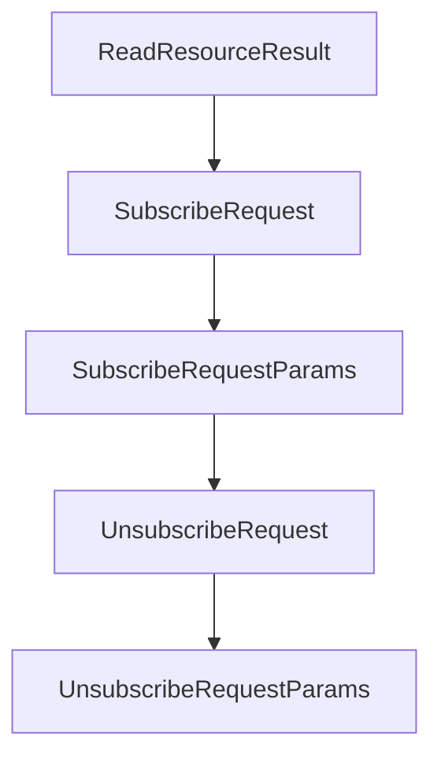

# Chapter 6: Advanced Client Features: Roots, Sampling, and Elicitation

Welcome to **Chapter 6: Advanced Client Features: Roots, Sampling, and Elicitation**. In this part of **MCP Kotlin SDK Tutorial: Building Multiplatform MCP Clients and Servers**, you will build an intuitive mental model first, then move into concrete implementation details and practical production tradeoffs.


This chapter covers advanced client features that materially affect user control and context boundaries.

## Learning Goals

- manage roots and contextual scope correctly
- apply sampling flows with explicit user-governed behavior
- understand elicitation support and capability gating
- avoid overexposing local context to remote server workflows

## Advanced Feature Guardrails

1. enable only required client capabilities (`roots`, `sampling`, `elicitation`)
2. track when server requests expand context boundaries
3. keep user-facing approvals around high-impact sampling/tool actions
4. log capability and session metadata for debugging and auditability

## Source References

- [Kotlin SDK README - Client Features](https://github.com/modelcontextprotocol/kotlin-sdk/blob/main/README.md#client-features)
- [kotlin-sdk-client Module Guide - Feature Usage Highlights](https://github.com/modelcontextprotocol/kotlin-sdk/blob/main/kotlin-sdk-client/Module.md)
- [MCP Specification - Client Features](https://modelcontextprotocol.io/specification/2025-11-25)

## Summary

You now have a control-oriented strategy for advanced Kotlin client capabilities.

Next: [Chapter 7: Testing, Conformance, and Operational Diagnostics](07-testing-conformance-and-operational-diagnostics.md)

## Source Code Walkthrough

### `kotlin-sdk-core/src/commonMain/kotlin/io/modelcontextprotocol/kotlin/sdk/types/resources.kt`

The `ReadResourceResult` class in [`kotlin-sdk-core/src/commonMain/kotlin/io/modelcontextprotocol/kotlin/sdk/types/resources.kt`](https://github.com/modelcontextprotocol/kotlin-sdk/blob/HEAD/kotlin-sdk-core/src/commonMain/kotlin/io/modelcontextprotocol/kotlin/sdk/types/resources.kt) handles a key part of this chapter's functionality:

```kt
 */
@Serializable
public data class ReadResourceResult(
    val contents: List<ResourceContents>,
    @SerialName("_meta")
    override val meta: JsonObject? = null,
) : ServerResult

// ============================================================================
// resources/subscribe
// ============================================================================

/**
 * Sent from the client to request resources/updated notifications from the server
 * whenever a particular resource changes.
 *
 * After subscribing, the server will send [ResourceUpdatedNotification] messages
 * whenever the subscribed resource is modified. This requires the server to support
 * the `subscribe` capability in [ServerCapabilities.resources].
 *
 * @property params The parameters specifying which resource URI to subscribe to.
 */
@Serializable
public data class SubscribeRequest(override val params: SubscribeRequestParams) : ClientRequest {
    @EncodeDefault
    override val method: Method = Method.Defined.ResourcesSubscribe

    /**
     * The URI of the resource to subscribe to.
     */
    public val uri: String
        get() = params.uri
```

This class is important because it defines how MCP Kotlin SDK Tutorial: Building Multiplatform MCP Clients and Servers implements the patterns covered in this chapter.

### `kotlin-sdk-core/src/commonMain/kotlin/io/modelcontextprotocol/kotlin/sdk/types/resources.kt`

The `SubscribeRequest` class in [`kotlin-sdk-core/src/commonMain/kotlin/io/modelcontextprotocol/kotlin/sdk/types/resources.kt`](https://github.com/modelcontextprotocol/kotlin-sdk/blob/HEAD/kotlin-sdk-core/src/commonMain/kotlin/io/modelcontextprotocol/kotlin/sdk/types/resources.kt) handles a key part of this chapter's functionality:

```kt
 */
@Serializable
public data class SubscribeRequest(override val params: SubscribeRequestParams) : ClientRequest {
    @EncodeDefault
    override val method: Method = Method.Defined.ResourcesSubscribe

    /**
     * The URI of the resource to subscribe to.
     */
    public val uri: String
        get() = params.uri

    /**
     * Metadata for this request. May include a progressToken for out-of-band progress notifications.
     */
    public val meta: RequestMeta?
        get() = params.meta
}

/**
 * Parameters for a resources/subscribe request.
 *
 * @property uri The URI of the resource to subscribe to. The URI can use any protocol;
 * it is up to the server how to interpret it.
 * @property meta Optional metadata for this request. May include a progressToken for
 * out-of-band progress notifications.
 */
@Serializable
public data class SubscribeRequestParams(
    val uri: String,
    @SerialName("_meta")
    override val meta: RequestMeta? = null,
```

This class is important because it defines how MCP Kotlin SDK Tutorial: Building Multiplatform MCP Clients and Servers implements the patterns covered in this chapter.

### `kotlin-sdk-core/src/commonMain/kotlin/io/modelcontextprotocol/kotlin/sdk/types/resources.kt`

The `SubscribeRequestParams` class in [`kotlin-sdk-core/src/commonMain/kotlin/io/modelcontextprotocol/kotlin/sdk/types/resources.kt`](https://github.com/modelcontextprotocol/kotlin-sdk/blob/HEAD/kotlin-sdk-core/src/commonMain/kotlin/io/modelcontextprotocol/kotlin/sdk/types/resources.kt) handles a key part of this chapter's functionality:

```kt
 */
@Serializable
public data class SubscribeRequest(override val params: SubscribeRequestParams) : ClientRequest {
    @EncodeDefault
    override val method: Method = Method.Defined.ResourcesSubscribe

    /**
     * The URI of the resource to subscribe to.
     */
    public val uri: String
        get() = params.uri

    /**
     * Metadata for this request. May include a progressToken for out-of-band progress notifications.
     */
    public val meta: RequestMeta?
        get() = params.meta
}

/**
 * Parameters for a resources/subscribe request.
 *
 * @property uri The URI of the resource to subscribe to. The URI can use any protocol;
 * it is up to the server how to interpret it.
 * @property meta Optional metadata for this request. May include a progressToken for
 * out-of-band progress notifications.
 */
@Serializable
public data class SubscribeRequestParams(
    val uri: String,
    @SerialName("_meta")
    override val meta: RequestMeta? = null,
```

This class is important because it defines how MCP Kotlin SDK Tutorial: Building Multiplatform MCP Clients and Servers implements the patterns covered in this chapter.

### `kotlin-sdk-core/src/commonMain/kotlin/io/modelcontextprotocol/kotlin/sdk/types/resources.kt`

The `UnsubscribeRequest` class in [`kotlin-sdk-core/src/commonMain/kotlin/io/modelcontextprotocol/kotlin/sdk/types/resources.kt`](https://github.com/modelcontextprotocol/kotlin-sdk/blob/HEAD/kotlin-sdk-core/src/commonMain/kotlin/io/modelcontextprotocol/kotlin/sdk/types/resources.kt) handles a key part of this chapter's functionality:

```kt
 */
@Serializable
public data class UnsubscribeRequest(override val params: UnsubscribeRequestParams) : ClientRequest {
    @EncodeDefault
    override val method: Method = Method.Defined.ResourcesUnsubscribe

    /**
     * The URI of the resource to unsubscribe from.
     */
    public val uri: String
        get() = params.uri

    /**
     * Metadata for this request. May include a progressToken for out-of-band progress notifications.
     */
    public val meta: RequestMeta?
        get() = params.meta

    public constructor(
        uri: String,
        meta: RequestMeta? = null,
    ) : this(UnsubscribeRequestParams(uri, meta))
}

/**
 * Parameters for a resources/unsubscribe request.
 *
 * @property uri The URI of the resource to unsubscribe from. This should match
 * a URI from a previous [SubscribeRequest].
 * @property meta Optional metadata for this request. May include a progressToken for
 * out-of-band progress notifications.
 */
```

This class is important because it defines how MCP Kotlin SDK Tutorial: Building Multiplatform MCP Clients and Servers implements the patterns covered in this chapter.


## How These Components Connect


