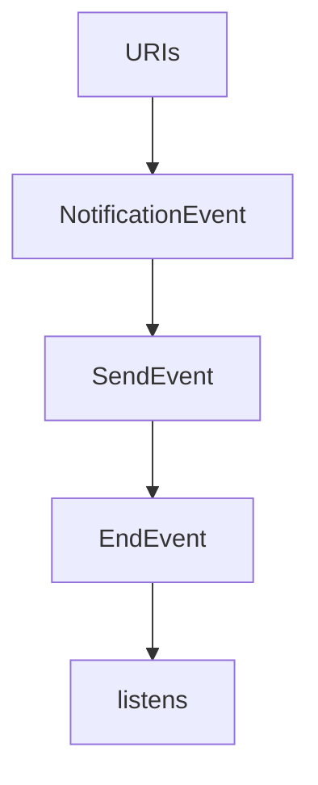

# Chapter 7: Testing, Conformance, and Operational Diagnostics

Welcome to **Chapter 7: Testing, Conformance, and Operational Diagnostics**. In this part of **MCP Kotlin SDK Tutorial: Building Multiplatform MCP Clients and Servers**, you will build an intuitive mental model first, then move into concrete implementation details and practical production tradeoffs.


This chapter focuses on verification workflows that keep Kotlin MCP integrations reliable as the SDK evolves.

## Learning Goals

- align local tests with upstream conformance expectations
- use sample apps and Inspector for transport-level debugging
- capture protocol-level failures early in CI
- standardize diagnostics across client and server paths

## Verification Loop

1. run unit/integration tests for your selected module set
2. validate protocol behavior with official sample servers/clients
3. test runtime interactions via MCP Inspector for wire-level sanity
4. monitor upstream conformance and changelog signals before upgrades

## Source References

- [Kotlin SDK Build Workflow Badge](https://github.com/modelcontextprotocol/kotlin-sdk/actions/workflows/build.yml)
- [Kotlin SDK Conformance Workflow Badge](https://github.com/modelcontextprotocol/kotlin-sdk/actions/workflows/conformance.yml)
- [Kotlin MCP Server Sample](https://github.com/modelcontextprotocol/kotlin-sdk/blob/main/samples/kotlin-mcp-server/README.md)
- [MCP Inspector](https://github.com/modelcontextprotocol/inspector)

## Summary

You now have a repeatable validation workflow for Kotlin MCP implementations.

Next: [Chapter 8: Release Strategy and Production Rollout](08-release-strategy-and-production-rollout.md)

## Source Code Walkthrough

### `kotlin-sdk-core/src/commonMain/kotlin/io/modelcontextprotocol/kotlin/sdk/types/resources.kt`

The `URIs` interface in [`kotlin-sdk-core/src/commonMain/kotlin/io/modelcontextprotocol/kotlin/sdk/types/resources.kt`](https://github.com/modelcontextprotocol/kotlin-sdk/blob/HEAD/kotlin-sdk-core/src/commonMain/kotlin/io/modelcontextprotocol/kotlin/sdk/types/resources.kt) handles a key part of this chapter's functionality:

```kt
 * where parameters are indicated with curly braces (e.g., `file:///{directory}/{filename}`).
 *
 * @property uriTemplate A URI template (according to RFC 6570) that can be used to construct resource URIs.
 * Parameters are indicated with curly braces, e.g., `file:///{path}` or `db://users/{userId}`.
 * @property name The programmatic identifier for this template.
 * Intended for logical use and API identification. If [title] is not provided,
 * this should be used as a fallback display name.
 * @property description A description of what this template is for.
 * Clients can use this to improve the LLM's understanding of available resources.
 * It can be thought of like a "hint" to the model.
 * @property mimeType The MIME type for all resources that match this template.
 * This should only be included if all resources matching this template have the same type.
 * For example, a file template might not have a MIME type since files can be of any type,
 * but a database record template might always return JSON.
 * @property title Optional human-readable display name for this template.
 * Intended for UI and end-user contexts, optimized to be easily understood
 * even by those unfamiliar with domain-specific terminology.
 * If not provided, [name] should be used for display purposes.
 * @property annotations Optional annotations for the client. Provides additional metadata and hints
 * about how to use or display resources created from this template.
 * @property icons Optional set of sized icons that clients can display in their user interface.
 * Clients MUST support at least PNG and JPEG formats.
 * Clients SHOULD also support SVG and WebP formats.
 * @property meta Optional metadata for this template.
 */
@Serializable
public data class ResourceTemplate(
    val uriTemplate: String,
    val name: String,
    val description: String? = null,
    val mimeType: String? = null,
    val title: String? = null,
```

This interface is important because it defines how MCP Kotlin SDK Tutorial: Building Multiplatform MCP Clients and Servers implements the patterns covered in this chapter.

### `kotlin-sdk-server/src/commonMain/kotlin/io/modelcontextprotocol/kotlin/sdk/server/FeatureNotificationService.kt`

The `NotificationEvent` class in [`kotlin-sdk-server/src/commonMain/kotlin/io/modelcontextprotocol/kotlin/sdk/server/FeatureNotificationService.kt`](https://github.com/modelcontextprotocol/kotlin-sdk/blob/HEAD/kotlin-sdk-server/src/commonMain/kotlin/io/modelcontextprotocol/kotlin/sdk/server/FeatureNotificationService.kt) handles a key part of this chapter's functionality:

```kt
 * @property timestamp A timestamp for the event.
 */
private sealed class NotificationEvent(open val timestamp: Long)

/**
 * Represents an event for a notification.
 *
 * @property notification The notification associated with the event.
 */
private class SendEvent(override val timestamp: Long, val notification: Notification) : NotificationEvent(timestamp)

/** Represents an event marking the end of notification processing. */
private class EndEvent(override val timestamp: Long) : NotificationEvent(timestamp)

/**
 * Represents a job that handles session-specific notifications, processing events
 * and delivering relevant notifications to the associated session.
 *
 * This class listens to a stream of notification events and processes them
 * based on the event type and the resource subscriptions associated with the session.
 * It allows subscribing to or unsubscribing from specific resource keys for granular
 * notification handling. The job can also be canceled to stop processing further events.
 * Notification with timestamps older than the starting timestamp are skipped.
 */
private class SessionNotificationJob {
    private val job: Job
    private val resourceSubscriptions = atomic(persistentMapOf<FeatureKey, Long>())
    private val logger = KotlinLogging.logger {}

    /**
     * Constructor for the SessionNotificationJob, responsible for processing notification events
     * and dispatching appropriate notifications to the provided server session. The job operates
```

This class is important because it defines how MCP Kotlin SDK Tutorial: Building Multiplatform MCP Clients and Servers implements the patterns covered in this chapter.

### `kotlin-sdk-server/src/commonMain/kotlin/io/modelcontextprotocol/kotlin/sdk/server/FeatureNotificationService.kt`

The `SendEvent` class in [`kotlin-sdk-server/src/commonMain/kotlin/io/modelcontextprotocol/kotlin/sdk/server/FeatureNotificationService.kt`](https://github.com/modelcontextprotocol/kotlin-sdk/blob/HEAD/kotlin-sdk-server/src/commonMain/kotlin/io/modelcontextprotocol/kotlin/sdk/server/FeatureNotificationService.kt) handles a key part of this chapter's functionality:

```kt
 * @property notification The notification associated with the event.
 */
private class SendEvent(override val timestamp: Long, val notification: Notification) : NotificationEvent(timestamp)

/** Represents an event marking the end of notification processing. */
private class EndEvent(override val timestamp: Long) : NotificationEvent(timestamp)

/**
 * Represents a job that handles session-specific notifications, processing events
 * and delivering relevant notifications to the associated session.
 *
 * This class listens to a stream of notification events and processes them
 * based on the event type and the resource subscriptions associated with the session.
 * It allows subscribing to or unsubscribing from specific resource keys for granular
 * notification handling. The job can also be canceled to stop processing further events.
 * Notification with timestamps older than the starting timestamp are skipped.
 */
private class SessionNotificationJob {
    private val job: Job
    private val resourceSubscriptions = atomic(persistentMapOf<FeatureKey, Long>())
    private val logger = KotlinLogging.logger {}

    /**
     * Constructor for the SessionNotificationJob, responsible for processing notification events
     * and dispatching appropriate notifications to the provided server session. The job operates
     * within the given coroutine scope and begins handling events starting from the specified
     * timestamp.
     *
     * @param session The server session where notifications will be dispatched.
     * @param scope The coroutine scope in which this job operates.
     * @param events A shared flow of notification events that the job listens to.
     * @param fromTimestamp The timestamp from which the job starts processing events.
```

This class is important because it defines how MCP Kotlin SDK Tutorial: Building Multiplatform MCP Clients and Servers implements the patterns covered in this chapter.

### `kotlin-sdk-server/src/commonMain/kotlin/io/modelcontextprotocol/kotlin/sdk/server/FeatureNotificationService.kt`

The `EndEvent` class in [`kotlin-sdk-server/src/commonMain/kotlin/io/modelcontextprotocol/kotlin/sdk/server/FeatureNotificationService.kt`](https://github.com/modelcontextprotocol/kotlin-sdk/blob/HEAD/kotlin-sdk-server/src/commonMain/kotlin/io/modelcontextprotocol/kotlin/sdk/server/FeatureNotificationService.kt) handles a key part of this chapter's functionality:

```kt

/** Represents an event marking the end of notification processing. */
private class EndEvent(override val timestamp: Long) : NotificationEvent(timestamp)

/**
 * Represents a job that handles session-specific notifications, processing events
 * and delivering relevant notifications to the associated session.
 *
 * This class listens to a stream of notification events and processes them
 * based on the event type and the resource subscriptions associated with the session.
 * It allows subscribing to or unsubscribing from specific resource keys for granular
 * notification handling. The job can also be canceled to stop processing further events.
 * Notification with timestamps older than the starting timestamp are skipped.
 */
private class SessionNotificationJob {
    private val job: Job
    private val resourceSubscriptions = atomic(persistentMapOf<FeatureKey, Long>())
    private val logger = KotlinLogging.logger {}

    /**
     * Constructor for the SessionNotificationJob, responsible for processing notification events
     * and dispatching appropriate notifications to the provided server session. The job operates
     * within the given coroutine scope and begins handling events starting from the specified
     * timestamp.
     *
     * @param session The server session where notifications will be dispatched.
     * @param scope The coroutine scope in which this job operates.
     * @param events A shared flow of notification events that the job listens to.
     * @param fromTimestamp The timestamp from which the job starts processing events.
     */
    constructor(
        session: ServerSession,
```

This class is important because it defines how MCP Kotlin SDK Tutorial: Building Multiplatform MCP Clients and Servers implements the patterns covered in this chapter.


## How These Components Connect


