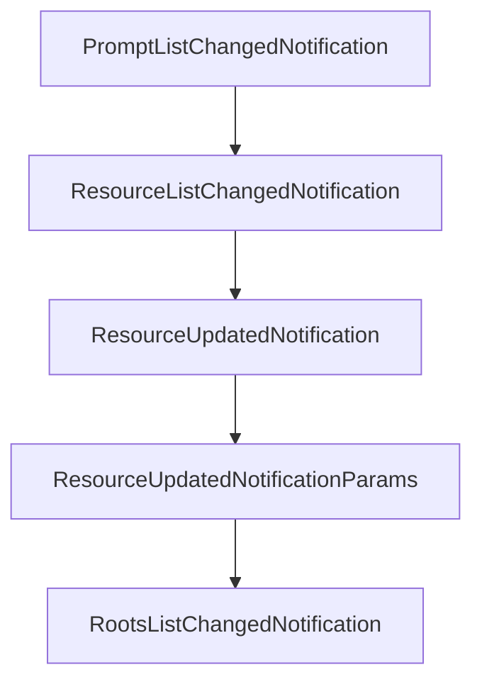

# Chapter 7: Testing, Conformance, and Operational Diagnostics

Welcome to **Chapter 7: Testing, Conformance, and Operational Diagnostics**. In this part of **MCP Kotlin SDK Tutorial: Building Multiplatform MCP Clients and Servers**, you will build an intuitive mental model first, then move into concrete implementation details and practical production tradeoffs.


This chapter focuses on verification workflows that keep Kotlin MCP integrations reliable as the SDK evolves.

## Learning Goals

- align local tests with upstream conformance expectations
- use sample apps and Inspector for transport-level debugging
- capture protocol-level failures early in CI
- standardize diagnostics across client and server paths

## Verification Loop

1. run unit/integration tests for your selected module set
2. validate protocol behavior with official sample servers/clients
3. test runtime interactions via MCP Inspector for wire-level sanity
4. monitor upstream conformance and changelog signals before upgrades

## Source References

- [Kotlin SDK Build Workflow Badge](https://github.com/modelcontextprotocol/kotlin-sdk/actions/workflows/build.yml)
- [Kotlin SDK Conformance Workflow Badge](https://github.com/modelcontextprotocol/kotlin-sdk/actions/workflows/conformance.yml)
- [Kotlin MCP Server Sample](https://github.com/modelcontextprotocol/kotlin-sdk/blob/main/samples/kotlin-mcp-server/README.md)
- [MCP Inspector](https://github.com/modelcontextprotocol/inspector)

## Summary

You now have a repeatable validation workflow for Kotlin MCP implementations.

Next: [Chapter 8: Release Strategy and Production Rollout](08-release-strategy-and-production-rollout.md)

## Depth Expansion Playbook

## Source Code Walkthrough

### `kotlin-sdk-core/src/commonMain/kotlin/io/modelcontextprotocol/kotlin/sdk/types/notification.kt`

The `PromptListChangedNotification` class in [`kotlin-sdk-core/src/commonMain/kotlin/io/modelcontextprotocol/kotlin/sdk/types/notification.kt`](https://github.com/modelcontextprotocol/kotlin-sdk/blob/HEAD/kotlin-sdk-core/src/commonMain/kotlin/io/modelcontextprotocol/kotlin/sdk/types/notification.kt) handles a key part of this chapter's functionality:

```kt
 */
@Serializable
public data class PromptListChangedNotification(override val params: BaseNotificationParams? = null) :
    ServerNotification {
    @EncodeDefault
    override val method: Method = Method.Defined.NotificationsPromptsListChanged
}

// ============================================================================
// Resources List Changed Notification
// ============================================================================

/**
 * An optional notification from the server to the client,
 * informing it that the list of resources it can read from has changed.
 *
 * Servers may issue this without any previous subscription from the client.
 * Sent only if the server's [ServerCapabilities.resources] has `listChanged = true`.
 *
 * @property params Optional notification parameters containing metadata.
 */
@Serializable
public data class ResourceListChangedNotification(override val params: BaseNotificationParams? = null) :
    ServerNotification {
    @EncodeDefault
    override val method: Method = Method.Defined.NotificationsResourcesListChanged
}

// ============================================================================
// Resource Updated Notification
// ============================================================================

```

This class is important because it defines how MCP Kotlin SDK Tutorial: Building Multiplatform MCP Clients and Servers implements the patterns covered in this chapter.

### `kotlin-sdk-core/src/commonMain/kotlin/io/modelcontextprotocol/kotlin/sdk/types/notification.kt`

The `ResourceListChangedNotification` class in [`kotlin-sdk-core/src/commonMain/kotlin/io/modelcontextprotocol/kotlin/sdk/types/notification.kt`](https://github.com/modelcontextprotocol/kotlin-sdk/blob/HEAD/kotlin-sdk-core/src/commonMain/kotlin/io/modelcontextprotocol/kotlin/sdk/types/notification.kt) handles a key part of this chapter's functionality:

```kt
 */
@Serializable
public data class ResourceListChangedNotification(override val params: BaseNotificationParams? = null) :
    ServerNotification {
    @EncodeDefault
    override val method: Method = Method.Defined.NotificationsResourcesListChanged
}

// ============================================================================
// Resource Updated Notification
// ============================================================================

/**
 * A notification from the server to the client, informing it that a resource has changed and may need to be read again.
 *
 * This should only be sent if the client previously sent a resources/subscribe request
 * and the server's [ServerCapabilities.resources] has `subscribe = true`.
 *
 * @property params Parameters identifying which resource was updated.
 */
@Serializable
public data class ResourceUpdatedNotification(override val params: ResourceUpdatedNotificationParams) :
    ServerNotification {
    @EncodeDefault
    override val method: Method = Method.Defined.NotificationsResourcesUpdated
}

/**
 * Parameters for a notifications/resources/updated notification.
 *
 * @property uri The URI of the resource that has been updated.
 * This might be a sub-resource of the one that the client actually subscribed to.
```

This class is important because it defines how MCP Kotlin SDK Tutorial: Building Multiplatform MCP Clients and Servers implements the patterns covered in this chapter.

### `kotlin-sdk-core/src/commonMain/kotlin/io/modelcontextprotocol/kotlin/sdk/types/notification.kt`

The `ResourceUpdatedNotification` class in [`kotlin-sdk-core/src/commonMain/kotlin/io/modelcontextprotocol/kotlin/sdk/types/notification.kt`](https://github.com/modelcontextprotocol/kotlin-sdk/blob/HEAD/kotlin-sdk-core/src/commonMain/kotlin/io/modelcontextprotocol/kotlin/sdk/types/notification.kt) handles a key part of this chapter's functionality:

```kt
 */
@Serializable
public data class ResourceUpdatedNotification(override val params: ResourceUpdatedNotificationParams) :
    ServerNotification {
    @EncodeDefault
    override val method: Method = Method.Defined.NotificationsResourcesUpdated
}

/**
 * Parameters for a notifications/resources/updated notification.
 *
 * @property uri The URI of the resource that has been updated.
 * This might be a sub-resource of the one that the client actually subscribed to.
 * @property meta Optional metadata for this notification.
 */
@Serializable
public data class ResourceUpdatedNotificationParams(
    val uri: String,
    @SerialName("_meta")
    override val meta: JsonObject? = null,
) : NotificationParams

// ============================================================================
// Roots List Changed Notification
// ============================================================================

/**
 * A notification from the client to the server, informing it that the list of roots has changed.
 *
 * This notification should be sent whenever the client adds, removes, or modifies any root.
 * The server should then request an updated list of roots using the ListRootsRequest.
 * Sent only if the client's [ClientCapabilities.roots] has `listChanged = true`.
```

This class is important because it defines how MCP Kotlin SDK Tutorial: Building Multiplatform MCP Clients and Servers implements the patterns covered in this chapter.

### `kotlin-sdk-core/src/commonMain/kotlin/io/modelcontextprotocol/kotlin/sdk/types/notification.kt`

The `ResourceUpdatedNotificationParams` class in [`kotlin-sdk-core/src/commonMain/kotlin/io/modelcontextprotocol/kotlin/sdk/types/notification.kt`](https://github.com/modelcontextprotocol/kotlin-sdk/blob/HEAD/kotlin-sdk-core/src/commonMain/kotlin/io/modelcontextprotocol/kotlin/sdk/types/notification.kt) handles a key part of this chapter's functionality:

```kt
 */
@Serializable
public data class ResourceUpdatedNotification(override val params: ResourceUpdatedNotificationParams) :
    ServerNotification {
    @EncodeDefault
    override val method: Method = Method.Defined.NotificationsResourcesUpdated
}

/**
 * Parameters for a notifications/resources/updated notification.
 *
 * @property uri The URI of the resource that has been updated.
 * This might be a sub-resource of the one that the client actually subscribed to.
 * @property meta Optional metadata for this notification.
 */
@Serializable
public data class ResourceUpdatedNotificationParams(
    val uri: String,
    @SerialName("_meta")
    override val meta: JsonObject? = null,
) : NotificationParams

// ============================================================================
// Roots List Changed Notification
// ============================================================================

/**
 * A notification from the client to the server, informing it that the list of roots has changed.
 *
 * This notification should be sent whenever the client adds, removes, or modifies any root.
 * The server should then request an updated list of roots using the ListRootsRequest.
 * Sent only if the client's [ClientCapabilities.roots] has `listChanged = true`.
```

This class is important because it defines how MCP Kotlin SDK Tutorial: Building Multiplatform MCP Clients and Servers implements the patterns covered in this chapter.


## How These Components Connect


