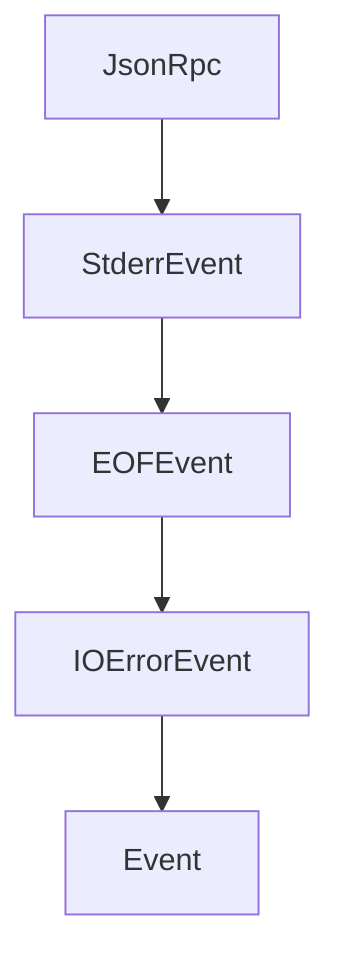

# Chapter 8: Release Strategy and Production Rollout

Welcome to **Chapter 8: Release Strategy and Production Rollout**. In this part of **MCP Kotlin SDK Tutorial: Building Multiplatform MCP Clients and Servers**, you will build an intuitive mental model first, then move into concrete implementation details and practical production tradeoffs.


This chapter defines how to keep Kotlin MCP services production-ready through protocol and SDK evolution.

## Learning Goals

- pin and upgrade SDK versions with controlled rollout plans
- track protocol-version drift across client/server estate
- build release checklists for transport, capability, and security posture
- reduce production incident risk during MCP upgrades

## Production Checklist

| Area | Baseline Control |
|:-----|:-----------------|
| Versioning | pin SDK versions; stage upgrades with compatibility tests |
| Protocol | verify supported protocol revision before fleet rollout |
| Transport | run load/reconnect tests per deployed transport |
| Security | review context boundaries, auth flows, and logging redaction |
| Operations | monitor session error rates and negotiation failures |

## Source References

- [Kotlin SDK Releases](https://github.com/modelcontextprotocol/kotlin-sdk/releases)
- [Kotlin SDK README](https://github.com/modelcontextprotocol/kotlin-sdk/blob/main/README.md)
- [MCP Specification](https://modelcontextprotocol.io/specification/2025-11-25)

## Summary

You now have a production rollout framework for operating Kotlin MCP systems with lower drift and clearer upgrade discipline.

Return to the [MCP Kotlin SDK Tutorial index](README.md).

## Source Code Walkthrough

### `kotlin-sdk-client/src/commonMain/kotlin/io/modelcontextprotocol/kotlin/sdk/client/StdioClientTransport.kt`

The `JsonRpc` class in [`kotlin-sdk-client/src/commonMain/kotlin/io/modelcontextprotocol/kotlin/sdk/client/StdioClientTransport.kt`](https://github.com/modelcontextprotocol/kotlin-sdk/blob/HEAD/kotlin-sdk-client/src/commonMain/kotlin/io/modelcontextprotocol/kotlin/sdk/client/StdioClientTransport.kt) handles a key part of this chapter's functionality:

```kt
                            do {
                                val msg = readBuffer.readMessage()
                                msg?.let { send(Event.JsonRpc(msg)) }
                            } while (msg != null)
                        }
                    }.invokeOnCompletion {
                        logger.debug(it) { "Read stdin coroutine finished." }
                    }

                    error?.let { source ->
                        launch(ioCoroutineContext) {
                            logger.debug { "Read stderr coroutine started." }
                            readSource(
                                stream = ProcessStream.Stderr,
                                source = source,
                                channel = this@channelFlow,
                            ) { bytes ->
                                val str = bytes.decodeToString()
                                send(Event.StderrEvent(str))
                            }
                        }
                    }
                }

                // Collect events on handlerCoroutineContext (Dispatchers.Default from parent scope)
                // No flowOn necessary - collection runs in parent launch context
                eventsFlow
                    .collect { event ->
                        when (event) {
                            is Event.JsonRpc -> {
                                handleJSONRPCMessage(event.message)
                            }
```

This class is important because it defines how MCP Kotlin SDK Tutorial: Building Multiplatform MCP Clients and Servers implements the patterns covered in this chapter.

### `kotlin-sdk-client/src/commonMain/kotlin/io/modelcontextprotocol/kotlin/sdk/client/StdioClientTransport.kt`

The `StderrEvent` class in [`kotlin-sdk-client/src/commonMain/kotlin/io/modelcontextprotocol/kotlin/sdk/client/StdioClientTransport.kt`](https://github.com/modelcontextprotocol/kotlin-sdk/blob/HEAD/kotlin-sdk-client/src/commonMain/kotlin/io/modelcontextprotocol/kotlin/sdk/client/StdioClientTransport.kt) handles a key part of this chapter's functionality:

```kt
                            ) { bytes ->
                                val str = bytes.decodeToString()
                                send(Event.StderrEvent(str))
                            }
                        }
                    }
                }

                // Collect events on handlerCoroutineContext (Dispatchers.Default from parent scope)
                // No flowOn necessary - collection runs in parent launch context
                eventsFlow
                    .collect { event ->
                        when (event) {
                            is Event.JsonRpc -> {
                                handleJSONRPCMessage(event.message)
                            }

                            is Event.StderrEvent -> {
                                val errorSeverity = classifyStderr(event.message)
                                when (errorSeverity) {
                                    FATAL -> {
                                        runCatching {
                                            _onError(
                                                McpException(INTERNAL_ERROR, "Message in StdErr: ${event.message}"),
                                            )
                                        }
                                        stopProcessing("Fatal STDERR message received")
                                    }

                                    WARNING -> {
                                        logger.warn { "STDERR message received: ${event.message}" }
                                    }
```

This class is important because it defines how MCP Kotlin SDK Tutorial: Building Multiplatform MCP Clients and Servers implements the patterns covered in this chapter.

### `kotlin-sdk-client/src/commonMain/kotlin/io/modelcontextprotocol/kotlin/sdk/client/StdioClientTransport.kt`

The `EOFEvent` class in [`kotlin-sdk-client/src/commonMain/kotlin/io/modelcontextprotocol/kotlin/sdk/client/StdioClientTransport.kt`](https://github.com/modelcontextprotocol/kotlin-sdk/blob/HEAD/kotlin-sdk-client/src/commonMain/kotlin/io/modelcontextprotocol/kotlin/sdk/client/StdioClientTransport.kt) handles a key part of this chapter's functionality:

```kt
                            }

                            is Event.EOFEvent -> {
                                if (event.stream == ProcessStream.Stdin) {
                                    stopProcessing("EOF in ${event.stream}")
                                }
                            }

                            is Event.IOErrorEvent -> {
                                runCatching { _onError(event.cause) }
                                stopProcessing("IO Error", event.cause)
                            }
                        }
                    }
            } finally {
                // Wait for write job to complete before closing, matching old implementation
                writeJob?.cancelAndJoin()
                logger.debug { "Transport coroutine completed, calling onClose" }
                invokeOnCloseCallback()
            }
        }
    }

    override suspend fun performSend(message: JSONRPCMessage, options: TransportSendOptions?) {
        @Suppress("SwallowedException")
        try {
            sendChannel.send(message)
        } catch (e: CancellationException) {
            throw e // MUST rethrow immediately - don't log, don't wrap
        } catch (e: ClosedSendChannelException) {
            logger.debug(e) { "Cannot send message: transport is closed" }
            throw McpException(
```

This class is important because it defines how MCP Kotlin SDK Tutorial: Building Multiplatform MCP Clients and Servers implements the patterns covered in this chapter.

### `kotlin-sdk-client/src/commonMain/kotlin/io/modelcontextprotocol/kotlin/sdk/client/StdioClientTransport.kt`

The `IOErrorEvent` class in [`kotlin-sdk-client/src/commonMain/kotlin/io/modelcontextprotocol/kotlin/sdk/client/StdioClientTransport.kt`](https://github.com/modelcontextprotocol/kotlin-sdk/blob/HEAD/kotlin-sdk-client/src/commonMain/kotlin/io/modelcontextprotocol/kotlin/sdk/client/StdioClientTransport.kt) handles a key part of this chapter's functionality:

```kt
                            }

                            is Event.IOErrorEvent -> {
                                runCatching { _onError(event.cause) }
                                stopProcessing("IO Error", event.cause)
                            }
                        }
                    }
            } finally {
                // Wait for write job to complete before closing, matching old implementation
                writeJob?.cancelAndJoin()
                logger.debug { "Transport coroutine completed, calling onClose" }
                invokeOnCloseCallback()
            }
        }
    }

    override suspend fun performSend(message: JSONRPCMessage, options: TransportSendOptions?) {
        @Suppress("SwallowedException")
        try {
            sendChannel.send(message)
        } catch (e: CancellationException) {
            throw e // MUST rethrow immediately - don't log, don't wrap
        } catch (e: ClosedSendChannelException) {
            logger.debug(e) { "Cannot send message: transport is closed" }
            throw McpException(
                code = CONNECTION_CLOSED,
                message = "Transport is closed",
                cause = e,
            )
        }
    }
```

This class is important because it defines how MCP Kotlin SDK Tutorial: Building Multiplatform MCP Clients and Servers implements the patterns covered in this chapter.


## How These Components Connect


