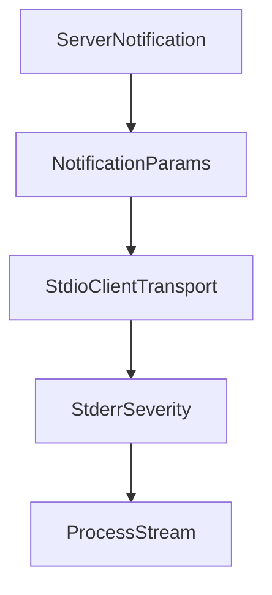

# Chapter 8: Release Strategy and Production Rollout

Welcome to **Chapter 8: Release Strategy and Production Rollout**. In this part of **MCP Kotlin SDK Tutorial: Building Multiplatform MCP Clients and Servers**, you will build an intuitive mental model first, then move into concrete implementation details and practical production tradeoffs.


This chapter defines how to keep Kotlin MCP services production-ready through protocol and SDK evolution.

## Learning Goals

- pin and upgrade SDK versions with controlled rollout plans
- track protocol-version drift across client/server estate
- build release checklists for transport, capability, and security posture
- reduce production incident risk during MCP upgrades

## Production Checklist

| Area | Baseline Control |
|:-----|:-----------------|
| Versioning | pin SDK versions; stage upgrades with compatibility tests |
| Protocol | verify supported protocol revision before fleet rollout |
| Transport | run load/reconnect tests per deployed transport |
| Security | review context boundaries, auth flows, and logging redaction |
| Operations | monitor session error rates and negotiation failures |

## Source References

- [Kotlin SDK Releases](https://github.com/modelcontextprotocol/kotlin-sdk/releases)
- [Kotlin SDK README](https://github.com/modelcontextprotocol/kotlin-sdk/blob/main/README.md)
- [MCP Specification](https://modelcontextprotocol.io/specification/2025-11-25)

## Summary

You now have a production rollout framework for operating Kotlin MCP systems with lower drift and clearer upgrade discipline.

Return to the [MCP Kotlin SDK Tutorial index](README.md).

## Depth Expansion Playbook

## Source Code Walkthrough

### `kotlin-sdk-core/src/commonMain/kotlin/io/modelcontextprotocol/kotlin/sdk/types/notification.kt`

The `ServerNotification` interface in [`kotlin-sdk-core/src/commonMain/kotlin/io/modelcontextprotocol/kotlin/sdk/types/notification.kt`](https://github.com/modelcontextprotocol/kotlin-sdk/blob/HEAD/kotlin-sdk-core/src/commonMain/kotlin/io/modelcontextprotocol/kotlin/sdk/types/notification.kt) handles a key part of this chapter's functionality:

```kt
 * Represents a notification sent by the server.
 */
@Serializable(with = ServerNotificationPolymorphicSerializer::class)
public sealed interface ServerNotification : Notification

/**
 * Interface for notification parameter types.
 *
 * @property meta Optional metadata for the notification.
 */
@Serializable
public sealed interface NotificationParams : WithMeta

/**
 * Base parameters for notifications that only contain metadata.
 */
@Serializable
public data class BaseNotificationParams(@SerialName("_meta") override val meta: JsonObject? = null) :
    NotificationParams

/**
 * Represents a progress notification.
 *
 * @property progress The progress thus far. This should increase every time progress is made,
 * even if the total is unknown.
 * @property total Total number of items to a process (or total progress required), if known.
 * @property message An optional message describing the current progress.
 */
@Serializable
public class Progress(
    public val progress: Double,
    public val total: Double? = null,
```

This interface is important because it defines how MCP Kotlin SDK Tutorial: Building Multiplatform MCP Clients and Servers implements the patterns covered in this chapter.

### `kotlin-sdk-core/src/commonMain/kotlin/io/modelcontextprotocol/kotlin/sdk/types/notification.kt`

The `NotificationParams` interface in [`kotlin-sdk-core/src/commonMain/kotlin/io/modelcontextprotocol/kotlin/sdk/types/notification.kt`](https://github.com/modelcontextprotocol/kotlin-sdk/blob/HEAD/kotlin-sdk-core/src/commonMain/kotlin/io/modelcontextprotocol/kotlin/sdk/types/notification.kt) handles a key part of this chapter's functionality:

```kt
public sealed interface Notification {
    public val method: Method
    public val params: NotificationParams?
}

/**
 * Represents a notification sent by the client.
 */
@Serializable(with = ClientNotificationPolymorphicSerializer::class)
public sealed interface ClientNotification : Notification

/**
 * Represents a notification sent by the server.
 */
@Serializable(with = ServerNotificationPolymorphicSerializer::class)
public sealed interface ServerNotification : Notification

/**
 * Interface for notification parameter types.
 *
 * @property meta Optional metadata for the notification.
 */
@Serializable
public sealed interface NotificationParams : WithMeta

/**
 * Base parameters for notifications that only contain metadata.
 */
@Serializable
public data class BaseNotificationParams(@SerialName("_meta") override val meta: JsonObject? = null) :
    NotificationParams

```

This interface is important because it defines how MCP Kotlin SDK Tutorial: Building Multiplatform MCP Clients and Servers implements the patterns covered in this chapter.

### `kotlin-sdk-client/src/commonMain/kotlin/io/modelcontextprotocol/kotlin/sdk/client/StdioClientTransport.kt`

The `StdioClientTransport` class in [`kotlin-sdk-client/src/commonMain/kotlin/io/modelcontextprotocol/kotlin/sdk/client/StdioClientTransport.kt`](https://github.com/modelcontextprotocol/kotlin-sdk/blob/HEAD/kotlin-sdk-client/src/commonMain/kotlin/io/modelcontextprotocol/kotlin/sdk/client/StdioClientTransport.kt) handles a key part of this chapter's functionality:

```kt
import io.github.oshai.kotlinlogging.KLogger
import io.github.oshai.kotlinlogging.KotlinLogging
import io.modelcontextprotocol.kotlin.sdk.client.StdioClientTransport.StderrSeverity.DEBUG
import io.modelcontextprotocol.kotlin.sdk.client.StdioClientTransport.StderrSeverity.FATAL
import io.modelcontextprotocol.kotlin.sdk.client.StdioClientTransport.StderrSeverity.IGNORE
import io.modelcontextprotocol.kotlin.sdk.client.StdioClientTransport.StderrSeverity.INFO
import io.modelcontextprotocol.kotlin.sdk.client.StdioClientTransport.StderrSeverity.WARNING
import io.modelcontextprotocol.kotlin.sdk.internal.IODispatcher
import io.modelcontextprotocol.kotlin.sdk.shared.AbstractClientTransport
import io.modelcontextprotocol.kotlin.sdk.shared.ReadBuffer
import io.modelcontextprotocol.kotlin.sdk.shared.TransportSendOptions
import io.modelcontextprotocol.kotlin.sdk.shared.serializeMessage
import io.modelcontextprotocol.kotlin.sdk.types.JSONRPCMessage
import io.modelcontextprotocol.kotlin.sdk.types.McpException
import io.modelcontextprotocol.kotlin.sdk.types.RPCError.ErrorCode.CONNECTION_CLOSED
import io.modelcontextprotocol.kotlin.sdk.types.RPCError.ErrorCode.INTERNAL_ERROR
import kotlinx.coroutines.CancellationException
import kotlinx.coroutines.CoroutineName
import kotlinx.coroutines.CoroutineScope
import kotlinx.coroutines.Dispatchers
import kotlinx.coroutines.Job
import kotlinx.coroutines.SupervisorJob
import kotlinx.coroutines.cancel
import kotlinx.coroutines.cancelAndJoin
import kotlinx.coroutines.channels.Channel
import kotlinx.coroutines.channels.ClosedSendChannelException
import kotlinx.coroutines.channels.ProducerScope
import kotlinx.coroutines.channels.consumeEach
import kotlinx.coroutines.flow.channelFlow
import kotlinx.coroutines.isActive
import kotlinx.coroutines.launch
import kotlinx.coroutines.yield
```

This class is important because it defines how MCP Kotlin SDK Tutorial: Building Multiplatform MCP Clients and Servers implements the patterns covered in this chapter.

### `kotlin-sdk-client/src/commonMain/kotlin/io/modelcontextprotocol/kotlin/sdk/client/StdioClientTransport.kt`

The `StderrSeverity` class in [`kotlin-sdk-client/src/commonMain/kotlin/io/modelcontextprotocol/kotlin/sdk/client/StdioClientTransport.kt`](https://github.com/modelcontextprotocol/kotlin-sdk/blob/HEAD/kotlin-sdk-client/src/commonMain/kotlin/io/modelcontextprotocol/kotlin/sdk/client/StdioClientTransport.kt) handles a key part of this chapter's functionality:

```kt
import io.github.oshai.kotlinlogging.KLogger
import io.github.oshai.kotlinlogging.KotlinLogging
import io.modelcontextprotocol.kotlin.sdk.client.StdioClientTransport.StderrSeverity.DEBUG
import io.modelcontextprotocol.kotlin.sdk.client.StdioClientTransport.StderrSeverity.FATAL
import io.modelcontextprotocol.kotlin.sdk.client.StdioClientTransport.StderrSeverity.IGNORE
import io.modelcontextprotocol.kotlin.sdk.client.StdioClientTransport.StderrSeverity.INFO
import io.modelcontextprotocol.kotlin.sdk.client.StdioClientTransport.StderrSeverity.WARNING
import io.modelcontextprotocol.kotlin.sdk.internal.IODispatcher
import io.modelcontextprotocol.kotlin.sdk.shared.AbstractClientTransport
import io.modelcontextprotocol.kotlin.sdk.shared.ReadBuffer
import io.modelcontextprotocol.kotlin.sdk.shared.TransportSendOptions
import io.modelcontextprotocol.kotlin.sdk.shared.serializeMessage
import io.modelcontextprotocol.kotlin.sdk.types.JSONRPCMessage
import io.modelcontextprotocol.kotlin.sdk.types.McpException
import io.modelcontextprotocol.kotlin.sdk.types.RPCError.ErrorCode.CONNECTION_CLOSED
import io.modelcontextprotocol.kotlin.sdk.types.RPCError.ErrorCode.INTERNAL_ERROR
import kotlinx.coroutines.CancellationException
import kotlinx.coroutines.CoroutineName
import kotlinx.coroutines.CoroutineScope
import kotlinx.coroutines.Dispatchers
import kotlinx.coroutines.Job
import kotlinx.coroutines.SupervisorJob
import kotlinx.coroutines.cancel
import kotlinx.coroutines.cancelAndJoin
import kotlinx.coroutines.channels.Channel
import kotlinx.coroutines.channels.ClosedSendChannelException
import kotlinx.coroutines.channels.ProducerScope
import kotlinx.coroutines.channels.consumeEach
import kotlinx.coroutines.flow.channelFlow
import kotlinx.coroutines.isActive
import kotlinx.coroutines.launch
import kotlinx.coroutines.yield
```

This class is important because it defines how MCP Kotlin SDK Tutorial: Building Multiplatform MCP Clients and Servers implements the patterns covered in this chapter.


## How These Components Connect


