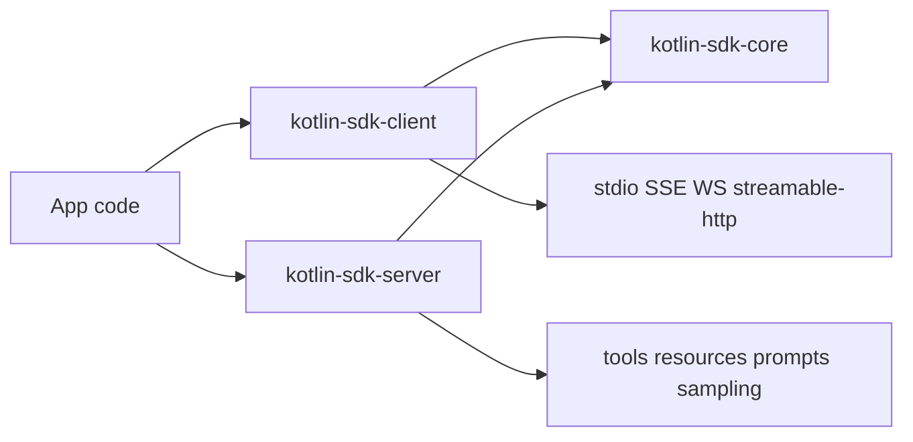

# MCP Kotlin SDK Tutorial: Building Multiplatform MCP Clients and Servers

> Learn how to implement MCP client/server workflows with `modelcontextprotocol/kotlin-sdk`, including module boundaries, transport choices, capability negotiation, and production lifecycle controls.

## Why This Track Matters

Kotlin teams increasingly need one MCP implementation that works across JVM, Native, JS, and Wasm. The official Kotlin SDK offers a clean split across `core`, `client`, and `server` modules with coroutine-friendly APIs and transport adapters for local and remote workflows.

This track focuses on:

- selecting the right module/artifact strategy for your codebase
- building capability-safe clients and servers with typed APIs
- choosing stdio, SSE, streamable HTTP, or WebSocket transports by workload
- running conformance, release, and upgrade workflows with low drift

## Current Snapshot (Verified February 12, 2026)

- repository: [`modelcontextprotocol/kotlin-sdk`](https://github.com/modelcontextprotocol/kotlin-sdk)
- stars: about **1.3k**
- latest release: [`0.8.3`](https://github.com/modelcontextprotocol/kotlin-sdk/releases/tag/0.8.3) (**January 21, 2026**)
- recent activity: updated on **February 12, 2026**
- runtime baseline: Kotlin 2.2+, JVM 11+; Ktor engine deps must be added explicitly
- licensing note: API metadata currently reports `NOASSERTION`; repository docs and license file indicate Apache 2.0 terms

## Mental Model

## Chapter Guide

| Chapter | Key Question | Outcome |
|:--------|:-------------|:--------|
| [01 - Getting Started and Module Selection](01-getting-started-and-module-selection.md) | How do I choose artifacts and baseline dependencies? | Stable dependency baseline |
| [02 - Core Protocol Model and Module Architecture](02-core-protocol-model-and-module-architecture.md) | How do `core`, `client`, and `server` responsibilities fit together? | Clear architecture boundaries |
| [03 - Client Runtime and Capability Negotiation](03-client-runtime-and-capability-negotiation.md) | How do Kotlin clients connect safely and use server features? | Safer client behavior |
| [04 - Server Runtime, Primitives, and Feature Registration](04-server-runtime-primitives-and-feature-registration.md) | How do I expose tools/resources/prompts with capability discipline? | Stronger server design |
| [05 - Transports: stdio, Streamable HTTP, SSE, and WebSocket](05-transports-stdio-streamable-http-sse-and-websocket.md) | Which transport should I run in each environment? | Better transport decisions |
| [06 - Advanced Client Features: Roots, Sampling, and Elicitation](06-advanced-client-features-roots-sampling-and-elicitation.md) | How do advanced MCP features change client behavior? | Better UX and control |
| [07 - Testing, Conformance, and Operational Diagnostics](07-testing-conformance-and-operational-diagnostics.md) | How do I validate SDK behavior and catch drift early? | Higher reliability |
| [08 - Release Strategy and Production Rollout](08-release-strategy-and-production-rollout.md) | How do teams keep Kotlin MCP integrations healthy over time? | Durable operations |

## What You Will Learn

- how to map Kotlin module boundaries to real client/server deployment needs
- how to run capability-aware MCP workflows with typed request/response models
- how to operate transports and sessions with fewer runtime surprises
- how to standardize testing and upgrade practices as protocol versions evolve

## Source References

- [Kotlin SDK README](https://github.com/modelcontextprotocol/kotlin-sdk/blob/main/README.md)
- [Kotlin SDK Module Documentation](https://github.com/modelcontextprotocol/kotlin-sdk/blob/main/docs/moduledoc.md)
- [kotlin-sdk-core Module Guide](https://github.com/modelcontextprotocol/kotlin-sdk/blob/main/kotlin-sdk-core/Module.md)
- [kotlin-sdk-client Module Guide](https://github.com/modelcontextprotocol/kotlin-sdk/blob/main/kotlin-sdk-client/Module.md)
- [kotlin-sdk-server Module Guide](https://github.com/modelcontextprotocol/kotlin-sdk/blob/main/kotlin-sdk-server/Module.md)
- [Kotlin MCP Client Sample](https://github.com/modelcontextprotocol/kotlin-sdk/blob/main/samples/kotlin-mcp-client/README.md)
- [Kotlin MCP Server Sample](https://github.com/modelcontextprotocol/kotlin-sdk/blob/main/samples/kotlin-mcp-server/README.md)
- [Weather STDIO Sample](https://github.com/modelcontextprotocol/kotlin-sdk/blob/main/samples/weather-stdio-server/README.md)

## Related Tutorials

- [MCP Specification Tutorial](../mcp-specification-tutorial/)
- [MCP Go SDK Tutorial](../mcp-go-sdk-tutorial/)
- [MCP Rust SDK Tutorial](../mcp-rust-sdk-tutorial/)
- [MCP Swift SDK Tutorial](../mcp-swift-sdk-tutorial/)

---

Start with [Chapter 1: Getting Started and Module Selection](01-getting-started-and-module-selection.md).
