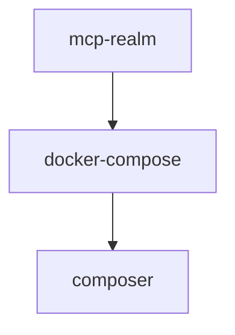

# Chapter 3: MCP Elements: Tools, Resources, Prompts, and Schemas

Welcome to **Chapter 3: MCP Elements: Tools, Resources, Prompts, and Schemas**. In this part of **MCP PHP SDK Tutorial: Building MCP Servers in PHP with Discovery and Transport Flexibility**, you will build an intuitive mental model first, then move into concrete implementation details and practical production tradeoffs.


This chapter covers primitive design and schema-quality controls in the PHP SDK.

## Learning Goals

- model tools/resources/prompts using PHP attributes or explicit registration
- control schema generation and validation depth
- return content in protocol-compliant formats
- avoid primitive drift that breaks client behavior

## Primitive Surface Overview

| Primitive | Attribute |
|:----------|:----------|
| Tool | `#[McpTool]` |
| Resource | `#[McpResource]` |
| Resource Template | `#[McpResourceTemplate]` |
| Prompt | `#[McpPrompt]` |

## Schema Discipline Checklist

1. prefer explicit parameter typing and docblocks for schema quality
2. use `#[Schema]` overrides for complex argument contracts
3. validate error/result content shapes before release
4. keep names/descriptions stable for client discoverability

## Source References

- [MCP Elements Guide](https://github.com/modelcontextprotocol/php-sdk/blob/main/docs/mcp-elements.md)
- [PHP SDK README - Attribute Discovery](https://github.com/modelcontextprotocol/php-sdk/blob/main/README.md#attribute-based-discovery)

## Summary

You now have a schema-first primitive strategy for PHP MCP servers.

Next: [Chapter 4: Discovery, Manual Registration, and Caching](04-discovery-manual-registration-and-caching.md)

## Source Code Walkthrough

### `examples/server/oauth-keycloak/keycloak/mcp-realm.json`

The `mcp-realm` module in [`examples/server/oauth-keycloak/keycloak/mcp-realm.json`](https://github.com/modelcontextprotocol/php-sdk/blob/HEAD/examples/server/oauth-keycloak/keycloak/mcp-realm.json) handles a key part of this chapter's functionality:

```json
{
  "realm": "mcp",
  "enabled": true,
  "registrationAllowed": false,
  "loginWithEmailAllowed": true,
  "duplicateEmailsAllowed": false,
  "resetPasswordAllowed": true,
  "editUsernameAllowed": false,
  "bruteForceProtected": true,
  "accessTokenLifespan": 300,
  "ssoSessionIdleTimeout": 1800,
  "ssoSessionMaxLifespan": 36000,
  "clients": [
    {
      "clientId": "mcp-client",
      "name": "MCP Client Application",
      "description": "Public client for MCP client applications",
      "enabled": true,
      "publicClient": true,
      "standardFlowEnabled": true,
      "directAccessGrantsEnabled": true,
      "serviceAccountsEnabled": false,
      "authorizationServicesEnabled": false,
      "fullScopeAllowed": true,
      "redirectUris": [
        "http://localhost:*",
        "http://127.0.0.1:*"
      ],
      "webOrigins": [
        "http://localhost:*",
        "http://127.0.0.1:*"
      ],
      "defaultClientScopes": [
        "openid",
        "profile",
```

This module is important because it defines how MCP PHP SDK Tutorial: Building MCP Servers in PHP with Discovery and Transport Flexibility implements the patterns covered in this chapter.

### `examples/server/oauth-microsoft/docker-compose.yml`

The `docker-compose` module in [`examples/server/oauth-microsoft/docker-compose.yml`](https://github.com/modelcontextprotocol/php-sdk/blob/HEAD/examples/server/oauth-microsoft/docker-compose.yml) handles a key part of this chapter's functionality:

```yml
services:
  php:
    build:
      context: .
      dockerfile: Dockerfile
    container_name: mcp-php-microsoft
    volumes:
      - ../../../:/app
    working_dir: /app
    env_file:
      - .env
    environment:
      AZURE_TENANT_ID: ${AZURE_TENANT_ID:-}
      AZURE_CLIENT_ID: ${AZURE_CLIENT_ID:-}
      AZURE_CLIENT_SECRET: ${AZURE_CLIENT_SECRET:-}
    command: >
      sh -c "mkdir -p /app/examples/server/oauth-microsoft/sessions;
      chmod -R 0777 /app/examples/server/oauth-microsoft/sessions;
      touch /app/examples/server/oauth-microsoft/dev.log;
      chmod 0666 /app/examples/server/oauth-microsoft/dev.log;
      touch /app/examples/server/dev.log;
      chmod 0666 /app/examples/server/dev.log;
      composer install --no-interaction --quiet 2>/dev/null || true;
      php-fpm"
    networks:
      - mcp-network

  nginx:
    image: nginx:alpine
    container_name: mcp-nginx-microsoft
    ports:
      - "${MCP_HTTP_PORT:-8000}:80"
    volumes:
      - ./nginx/default.conf:/etc/nginx/conf.d/default.conf:ro
      - ../../../:/app:ro
```

This module is important because it defines how MCP PHP SDK Tutorial: Building MCP Servers in PHP with Discovery and Transport Flexibility implements the patterns covered in this chapter.

### `composer.json`

The `composer` module in [`composer.json`](https://github.com/modelcontextprotocol/php-sdk/blob/HEAD/composer.json) handles a key part of this chapter's functionality:

```json
{
  "name": "mcp/sdk",
  "description": "Model Context Protocol SDK for Client and Server applications in PHP",
  "license": "Apache-2.0",
  "type": "library",
  "authors": [
    {
      "name": "Christopher Hertel",
      "email": "mail@christopher-hertel.de"
    },
    {
      "name": "Kyrian Obikwelu",
      "email": "koshnawaza@gmail.com"
    },
    {
      "name": "Tobias Nyholm",
      "email": "tobias.nyholm@gmail.com"
    }
  ],
  "require": {
    "php": "^8.1",
    "ext-fileinfo": "*",
    "opis/json-schema": "^2.4",
    "php-http/discovery": "^1.20",
    "phpdocumentor/reflection-docblock": "^5.6 || ^6.0",
    "psr/clock": "^1.0",
    "psr/container": "^1.0 || ^2.0",
    "psr/event-dispatcher": "^1.0",
    "psr/http-client": "^1.0",
    "psr/http-factory": "^1.1",
    "psr/http-message": "^1.1 || ^2.0",
    "psr/http-server-handler": "^1.0",
    "psr/http-server-middleware": "^1.0",
    "psr/log": "^1.0 || ^2.0 || ^3.0",
    "symfony/finder": "^5.4 || ^6.4 || ^7.3 || ^8.0",
```

This module is important because it defines how MCP PHP SDK Tutorial: Building MCP Servers in PHP with Discovery and Transport Flexibility implements the patterns covered in this chapter.


## How These Components Connect


