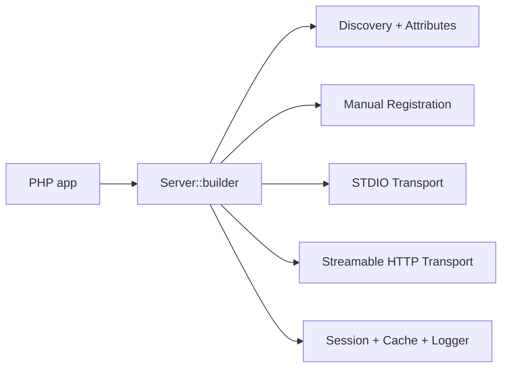

# MCP PHP SDK Tutorial: Building MCP Servers in PHP with Discovery and Transport Flexibility

> Learn how to implement MCP server workflows with `modelcontextprotocol/php-sdk`, including attribute discovery, manual capability registration, transport strategy, session storage, and framework integration patterns.

## Why This Track Matters

PHP teams integrating MCP need a practical path that works across plain scripts and framework-based HTTP stacks. The official PHP SDK focuses on server construction with a strong attribute model, pluggable discovery and session controls, and transport support for both local stdio and HTTP deployments.

This track focuses on:

- setting a safe baseline for an actively evolving SDK
- designing tools/resources/prompts with schema discipline
- choosing between discovery, manual registration, or hybrid patterns
- running transport/session strategies for CLI and web workloads

## Current Snapshot (auto-updated)

- repository: [`modelcontextprotocol/php-sdk`](https://github.com/modelcontextprotocol/php-sdk)
- stars: about **1.35k**
- latest release: [`v0.3.0`](https://github.com/modelcontextprotocol/php-sdk/releases/tag/v0.3.0) (**January 11, 2026**)
- recent activity: updated on **February 12, 2026**
- package: `composer require mcp/sdk`
- stability note: README marks the SDK as actively evolving/experimental and lists client component work on the roadmap
- licensing note: metadata reports `NOASSERTION`; repository includes a `LICENSE` file and Symfony-aligned contribution standards

## Mental Model

## Chapter Guide

| Chapter | Key Question | Outcome |
|:--------|:-------------|:--------|
| [01 - Getting Started and Experimental Baseline](01-getting-started-and-experimental-baseline.md) | How do I start safely with a fast-moving PHP SDK? | Stable setup |
| [02 - Server Builder and Capability Registration](02-server-builder-and-capability-registration.md) | How does `Server::builder()` shape server architecture? | Better composition |
| [03 - MCP Elements: Tools, Resources, Prompts, and Schemas](03-mcp-elements-tools-resources-prompts-and-schemas.md) | How should primitives be modeled for robust interoperability? | Higher schema quality |
| [04 - Discovery, Manual Registration, and Caching](04-discovery-manual-registration-and-caching.md) | When should I use discovery, explicit registration, or both? | Faster startup and lower drift |
| [05 - Transports: STDIO and Streamable HTTP](05-transports-stdio-and-streamable-http.md) | Which transport should I deploy per environment? | Clear runtime strategy |
| [06 - Client Communication: Sampling, Logging, and Progress](06-client-communication-sampling-logging-and-progress.md) | How do server-side handlers communicate back to clients correctly? | Better protocol UX |
| [07 - Framework Integration, Session Stores, and Dependencies](07-framework-integration-session-stores-and-dependencies.md) | How do I integrate PHP MCP into web stacks safely? | Production-ready integration |
| [08 - Roadmap, Release Strategy, and Production Readiness](08-roadmap-release-strategy-and-production-readiness.md) | How should teams manage upgrades while APIs are still evolving? | Safer operations |

## What You Will Learn

- how to build PHP MCP servers with a durable builder/discovery architecture
- how to expose and validate primitives using attribute and schema controls
- how to run stdio and HTTP transports with appropriate session management
- how to operate the SDK with roadmap-aware release discipline

## Source References

- [PHP SDK README](https://github.com/modelcontextprotocol/php-sdk/blob/main/README.md)
- [PHP SDK Guides Index](https://github.com/modelcontextprotocol/php-sdk/blob/main/docs/index.md)
- [Server Builder Guide](https://github.com/modelcontextprotocol/php-sdk/blob/main/docs/server-builder.md)
- [MCP Elements Guide](https://github.com/modelcontextprotocol/php-sdk/blob/main/docs/mcp-elements.md)
- [Transports Guide](https://github.com/modelcontextprotocol/php-sdk/blob/main/docs/transports.md)
- [Client Communication Guide](https://github.com/modelcontextprotocol/php-sdk/blob/main/docs/server-client-communication.md)
- [Examples Guide](https://github.com/modelcontextprotocol/php-sdk/blob/main/docs/examples.md)
- [Server Examples README](https://github.com/modelcontextprotocol/php-sdk/blob/main/examples/server/README.md)
- [PHP SDK Changelog](https://github.com/modelcontextprotocol/php-sdk/blob/main/CHANGELOG.md)

## Related Tutorials

- [MCP Specification Tutorial](../mcp-specification-tutorial/)
- [MCP Python SDK Tutorial](../mcp-python-sdk-tutorial/)
- [MCP TypeScript SDK Tutorial](../mcp-typescript-sdk-tutorial/)
- [MCP Ruby SDK Tutorial](../mcp-ruby-sdk-tutorial/)

---

Start with [Chapter 1: Getting Started and Experimental Baseline](01-getting-started-and-experimental-baseline.md).

## Navigation & Backlinks

- [Start Here: Chapter 1: Getting Started and Experimental Baseline](01-getting-started-and-experimental-baseline.md)
- [Back to Main Catalog](../../README.md#-tutorial-catalog)
- [Browse A-Z Tutorial Directory](../../discoverability/tutorial-directory.md)
- [Search by Intent](../../discoverability/query-hub.md)
- [Explore Category Hubs](../../README.md#category-hubs)

## Full Chapter Map

1. [Chapter 1: Getting Started and Experimental Baseline](01-getting-started-and-experimental-baseline.md)
2. [Chapter 2: Server Builder and Capability Registration](02-server-builder-and-capability-registration.md)
3. [Chapter 3: MCP Elements: Tools, Resources, Prompts, and Schemas](03-mcp-elements-tools-resources-prompts-and-schemas.md)
4. [Chapter 4: Discovery, Manual Registration, and Caching](04-discovery-manual-registration-and-caching.md)
5. [Chapter 5: Transports: STDIO and Streamable HTTP](05-transports-stdio-and-streamable-http.md)
6. [Chapter 6: Client Communication: Sampling, Logging, and Progress](06-client-communication-sampling-logging-and-progress.md)
7. [Chapter 7: Framework Integration, Session Stores, and Dependencies](07-framework-integration-session-stores-and-dependencies.md)
8. [Chapter 8: Roadmap, Release Strategy, and Production Readiness](08-roadmap-release-strategy-and-production-readiness.md)

*Generated by [AI Codebase Knowledge Builder](https://github.com/The-Pocket/Tutorial-Codebase-Knowledge)*
