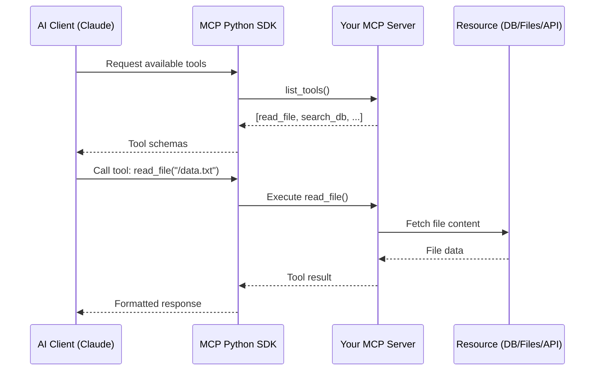

# Chapter 1: Getting Started with MCP Python SDK

Welcome to **Chapter 1: Getting Started with MCP Python SDK**. In this part of **MCP Python SDK Tutorial: Building AI Tool Servers**, you will build an intuitive mental model first, then move into concrete implementation details and practical production tradeoffs.


> Install the SDK, understand MCP fundamentals, and build your first MCP server in minutes.

## Overview

This chapter introduces the Model Context Protocol (MCP) and walks you through building your first MCP server using the Python SDK. You'll learn what MCP is, why it matters for AI development, and how to create a simple server that Claude or other AI assistants can interact with.

## What is the Model Context Protocol?

The **Model Context Protocol (MCP)** is an open standard created by Anthropic for connecting AI assistants to external tools and data sources. Think of it as a universal adapter that lets LLMs like Claude safely interact with files, databases, APIs, and custom logic.

### The Problem MCP Solves

Before MCP, every AI tool integration required custom code:

```
❌ Before MCP:
   Claude App ──→ Custom Integration ──→ File System
   Claude App ──→ Different Custom Code ──→ Database
   Claude App ──→ Yet Another Integration ──→ API
```

With MCP, you build once and integrate everywhere:

```
✅ With MCP:
   Claude Code ─┐
   Claude.ai ───┼──→ MCP Server ──→ Any Resource
   Custom App ──┘
```

### Core Concepts

| Concept | Description | Example |
|:--------|:------------|:--------|
| **MCP Server** | Provides tools/resources to AI clients | File system server, database server |
| **MCP Client** | AI assistant that uses MCP servers | Claude Code, Claude.ai, custom apps |
| **Resources** | Data sources exposed by servers | Files, database records, API responses |
| **Tools** | Functions AI can call | `read_file()`, `search_database()`, `send_email()` |
| **Prompts** | Reusable prompt templates | Code review template, analysis prompt |
| **Transport** | Communication method | stdio, SSE (Server-Sent Events), HTTP |

## Architecture Flow



## Installation

### Prerequisites

- **Python 3.10+** (MCP SDK requires modern Python features)
- **pip** for package management
- **Basic async/await** understanding (helpful but not required)

### Install MCP Python SDK

```bash
# Create a virtual environment (recommended)
python -m venv mcp-env
source mcp-env/bin/activate  # On Windows: mcp-env\Scripts\activate

# Install the MCP SDK
pip install mcp

# Verify installation
python -c "import mcp; print(f'MCP SDK {mcp.__version__} installed')"
```

### Development Dependencies

For building robust servers, install these optional packages:

```bash
# Type checking and validation
pip install pydantic

# Async HTTP client (for HTTP transport)
pip install httpx

# File operations
pip install aiofiles

# Testing
pip install pytest pytest-asyncio
```

## Your First MCP Server

Let's build a simple "Hello World" MCP server that provides a greeting tool.

### Step 1: Create the Server

Create `hello_server.py`:

```python
import asyncio
from mcp.server import Server
from mcp.server.stdio import stdio_server
from mcp.types import Tool, TextContent

# Create the MCP server instance
app = Server("hello-mcp-server")

# Define a tool
@app.list_tools()
async def list_tools() -> list[Tool]:
    """List available tools."""
    return [
        Tool(
            name="greet",
            description="Generate a personalized greeting",
            inputSchema={
                "type": "object",
                "properties": {
                    "name": {
                        "type": "string",
                        "description": "Name of the person to greet"
                    },
                    "language": {
                        "type": "string",
                        "enum": ["en", "es", "fr", "de"],
                        "description": "Language for the greeting",
                        "default": "en"
                    }
                },
                "required": ["name"]
            }
        )
    ]

# Implement the tool
@app.call_tool()
async def call_tool(name: str, arguments: dict) -> list[TextContent]:
    """Execute a tool call."""
    if name == "greet":
        person_name = arguments["name"]
        lang = arguments.get("language", "en")

        greetings = {
            "en": f"Hello, {person_name}!",
            "es": f"¡Hola, {person_name}!",
            "fr": f"Bonjour, {person_name}!",
            "de": f"Guten Tag, {person_name}!"
        }

        greeting = greetings.get(lang, greetings["en"])

        return [TextContent(
            type="text",
            text=greeting
        )]

    raise ValueError(f"Unknown tool: {name}")

# Run the server
async def main():
    """Run the MCP server using stdio transport."""
    async with stdio_server() as (read_stream, write_stream):
        await app.run(
            read_stream,
            write_stream,
            app.create_initialization_options()
        )

if __name__ == "__main__":
    asyncio.run(main())
```

### Step 2: Understanding the Code

Let's break down what each part does:

#### Server Creation

```python
app = Server("hello-mcp-server")
```

Creates an MCP server instance with a unique name. This name identifies your server to clients.

#### Tool Definition

```python
@app.list_tools()
async def list_tools() -> list[Tool]:
    return [Tool(...)]
```

The `list_tools()` decorator tells MCP what capabilities your server provides. Each `Tool` includes:

- **name**: Unique identifier for the tool
- **description**: What the tool does (helps AI decide when to use it)
- **inputSchema**: JSON Schema defining parameters

#### Tool Implementation

```python
@app.call_tool()
async def call_tool(name: str, arguments: dict) -> list[TextContent]:
    # Your logic here
    return [TextContent(...)]
```

The `call_tool()` decorator handles tool execution. It:
1. Receives the tool name and arguments
2. Executes your custom logic
3. Returns results as `TextContent`

#### Transport Layer

```python
async with stdio_server() as (read_stream, write_stream):
    await app.run(read_stream, write_stream, ...)
```

Uses **stdio** (standard input/output) for communication. This is the simplest transport, perfect for local development.

### Step 3: Testing Your Server

#### Manual Testing with MCP Inspector

Install the MCP Inspector (official debugging tool):

```bash
npm install -g @modelcontextprotocol/inspector
```

Run your server with the inspector:

```bash
mcp-inspector python hello_server.py
```

This opens a web UI where you can:
- See available tools
- Test tool calls
- Inspect request/response JSON

#### Testing Output

When you call the `greet` tool with `{"name": "Alice", "language": "es"}`:

```json
{
  "content": [
    {
      "type": "text",
      "text": "¡Hola, Alice!"
    }
  ]
}
```

### Step 4: Using with Claude Code

To use your server with Claude Code CLI:

1. Create a Claude Code config at `~/.claude/config.json`:

```json
{
  "mcpServers": {
    "hello-server": {
      "command": "python",
      "args": ["/path/to/hello_server.py"]
    }
  }
}
```

2. Start Claude Code:

```bash
claude-code
```

3. Ask Claude to use your tool:

```
> Claude, greet me in French
```

Claude will automatically discover and call your `greet` tool with French language.

## Understanding MCP Protocol Flow

### Message Types

MCP uses JSON-RPC 2.0 for communication. Key message types:

| Message | Direction | Purpose |
|:--------|:----------|:--------|
| `initialize` | Client → Server | Handshake, capability negotiation |
| `initialized` | Server → Client | Confirmation |
| `tools/list` | Client → Server | Request available tools |
| `tools/call` | Client → Server | Execute a tool |
| `resources/list` | Client → Server | Get available resources |
| `resources/read` | Client → Server | Fetch resource content |

### Example Protocol Exchange

```json
// Client requests tool list
{
  "jsonrpc": "2.0",
  "id": 1,
  "method": "tools/list"
}

// Server responds
{
  "jsonrpc": "2.0",
  "id": 1,
  "result": {
    "tools": [
      {
        "name": "greet",
        "description": "Generate a personalized greeting",
        "inputSchema": { ... }
      }
    ]
  }
}

// Client calls tool
{
  "jsonrpc": "2.0",
  "id": 2,
  "method": "tools/call",
  "params": {
    "name": "greet",
    "arguments": {
      "name": "Alice",
      "language": "fr"
    }
  }
}

// Server returns result
{
  "jsonrpc": "2.0",
  "id": 2,
  "result": {
    "content": [
      {
        "type": "text",
        "text": "Bonjour, Alice!"
      }
    ]
  }
}
```

## Common Patterns

### 1. Error Handling

Always validate inputs and handle errors gracefully:

```python
@app.call_tool()
async def call_tool(name: str, arguments: dict) -> list[TextContent]:
    try:
        if name == "greet":
            if "name" not in arguments:
                raise ValueError("Missing required argument: name")

            # Your logic here
            ...

    except ValueError as e:
        return [TextContent(
            type="text",
            text=f"Error: {str(e)}"
        )]
    except Exception as e:
        return [TextContent(
            type="text",
            text=f"Unexpected error: {str(e)}"
        )]
```

### 2. Async Operations

MCP is fully async - use `async def` and `await`:

```python
import aiofiles

@app.call_tool()
async def call_tool(name: str, arguments: dict) -> list[TextContent]:
    if name == "read_file":
        async with aiofiles.open(arguments["path"], "r") as f:
            content = await f.read()
            return [TextContent(type="text", text=content)]
```

### 3. Type Safety with Pydantic

Use Pydantic for robust input validation:

```python
from pydantic import BaseModel, Field

class GreetArgs(BaseModel):
    name: str = Field(..., description="Name of person to greet")
    language: str = Field("en", description="Greeting language")

@app.call_tool()
async def call_tool(name: str, arguments: dict) -> list[TextContent]:
    if name == "greet":
        args = GreetArgs(**arguments)  # Validates input
        # Use args.name, args.language
```

## Best Practices

### 1. Clear Tool Descriptions

Make descriptions actionable for AI:

```python
# ❌ Bad
Tool(name="proc", description="Process stuff")

# ✅ Good
Tool(
    name="process_data",
    description="Analyze CSV data and return statistical summary including mean, median, and outliers"
)
```

### 2. Structured Schemas

Provide complete JSON schemas:

```python
Tool(
    name="search",
    inputSchema={
        "type": "object",
        "properties": {
            "query": {
                "type": "string",
                "description": "Search query string",
                "minLength": 1
            },
            "limit": {
                "type": "integer",
                "description": "Max results to return",
                "default": 10,
                "minimum": 1,
                "maximum": 100
            }
        },
        "required": ["query"]
    }
)
```

### 3. Meaningful Error Messages

Help AI understand what went wrong:

```python
# ❌ Bad
return [TextContent(type="text", text="Error")]

# ✅ Good
return [TextContent(
    type="text",
    text="Error: File '/data.txt' not found. Please verify the path exists."
)]
```

## Troubleshooting

### Server Won't Start

**Problem:** `ModuleNotFoundError: No module named 'mcp'`

**Solution:**
```bash
pip install mcp
# Verify installation
python -c "import mcp"
```

### Tool Not Appearing in Client

**Problem:** Client doesn't see your tools

**Checklist:**
1. Is `list_tools()` decorated with `@app.list_tools()`?
2. Does it return a list of `Tool` objects?
3. Is the tool schema valid JSON Schema?
4. Check server logs for errors

### stdio Communication Issues

**Problem:** Server starts but doesn't respond

**Solution:**
- Ensure you're using `stdio_server()` transport
- Don't print to stdout (conflicts with protocol)
- Use logging instead:

```python
import logging
logging.basicConfig(level=logging.DEBUG, filename='server.log')
logger = logging.getLogger(__name__)

logger.debug("Processing tool call")  # ✅ Logs to file
# print("Debug")  # ❌ Breaks stdio
```

## Next Steps

Now that you understand MCP basics, the next chapter explores the three core primitives in depth:

- **Resources**: Expose data sources
- **Tools**: Enable AI actions
- **Prompts**: Create reusable templates

**Continue to:** [Chapter 2: Core Concepts](02-core-concepts.md)

## Quick Reference

### Minimal MCP Server Template

```python
import asyncio
from mcp.server import Server
from mcp.server.stdio import stdio_server
from mcp.types import Tool, TextContent

app = Server("my-server")

@app.list_tools()
async def list_tools() -> list[Tool]:
    return [
        Tool(name="my_tool", description="...", inputSchema={...})
    ]

@app.call_tool()
async def call_tool(name: str, arguments: dict) -> list[TextContent]:
    # Your logic
    return [TextContent(type="text", text="result")]

async def main():
    async with stdio_server() as (read_stream, write_stream):
        await app.run(read_stream, write_stream, app.create_initialization_options())

if __name__ == "__main__":
    asyncio.run(main())
```

### Key Imports

```python
from mcp.server import Server
from mcp.server.stdio import stdio_server
from mcp.types import Tool, TextContent, Resource, Prompt
```

---

*Next: [Chapter 2: Core Concepts →](02-core-concepts.md)*

## What Problem Does This Solve?

Most teams struggle here because the hard part is not writing more code, but deciding clear boundaries for `name`, `text`, `Server` so behavior stays predictable as complexity grows.

In practical terms, this chapter helps you avoid three common failures:

- coupling core logic too tightly to one implementation path
- missing the handoff boundaries between setup, execution, and validation
- shipping changes without clear rollback or observability strategy

After working through this chapter, you should be able to reason about `Chapter 1: Getting Started with MCP Python SDK` as an operating subsystem inside **MCP Python SDK Tutorial: Building AI Tool Servers**, with explicit contracts for inputs, state transitions, and outputs.

Use the implementation notes around `TextContent`, `Tool`, `server` as your checklist when adapting these patterns to your own repository.

## How it Works Under the Hood

Under the hood, `Chapter 1: Getting Started with MCP Python SDK` usually follows a repeatable control path:

1. **Context bootstrap**: initialize runtime config and prerequisites for `name`.
2. **Input normalization**: shape incoming data so `text` receives stable contracts.
3. **Core execution**: run the main logic branch and propagate intermediate state through `Server`.
4. **Policy and safety checks**: enforce limits, auth scopes, and failure boundaries.
5. **Output composition**: return canonical result payloads for downstream consumers.
6. **Operational telemetry**: emit logs/metrics needed for debugging and performance tuning.

When debugging, walk this sequence in order and confirm each stage has explicit success/failure conditions.

## Source Walkthrough

Use the following upstream sources to verify implementation details while reading this chapter:

- [MCP Python SDK repository](https://github.com/modelcontextprotocol/python-sdk)
  Why it matters: authoritative reference on `MCP Python SDK repository` (github.com).

Suggested trace strategy:
- search upstream code for `name` and `text` to map concrete implementation paths
- compare docs claims against actual runtime/config code before reusing patterns in production

## Chapter Connections

- [Tutorial Index](index.md)
- [Next Chapter: Chapter 2: Core Concepts - Resources, Tools, and Prompts](02-core-concepts.md)
- [Main Catalog](../../README.md#-tutorial-catalog)
- [A-Z Tutorial Directory](../../discoverability/tutorial-directory.md)
