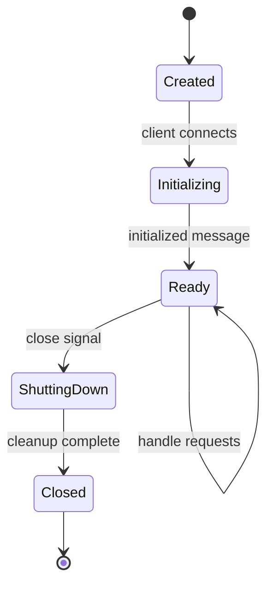

# Chapter 3: Server Architecture

Welcome to **Chapter 3: Server Architecture**. In this part of **MCP Python SDK Tutorial: Building AI Tool Servers**, you will build an intuitive mental model first, then move into concrete implementation details and practical production tradeoffs.


> Understand transport layers, server lifecycle, and architectural patterns for building robust MCP servers.

## Transport Layers

MCP supports three transport mechanisms:

### 1. stdio (Standard Input/Output)

Best for: Local development, CLI tools, subprocess communication

```python
from mcp.server.stdio import stdio_server

async def main():
    async with stdio_server() as (read_stream, write_stream):
        await app.run(read_stream, write_stream, app.create_initialization_options())
```

**Use Cases:**
- Claude Code integration
- Local testing
- Command-line tools

### 2. SSE (Server-Sent Events)

Best for: Web applications, HTTP-based communication

```python
from mcp.server.sse import SseServerTransport
from starlette.applications import Starlette
from starlette.routing import Route

app = Server("sse-server")

async def handle_sse(request):
    async with SseServerTransport("/messages") as transport:
        await app.run(
            transport.read_stream,
            transport.write_stream,
            app.create_initialization_options()
        )

starlette_app = Starlette(routes=[
    Route("/sse", endpoint=handle_sse)
])
```

### 3. HTTP

Best for: REST-like interfaces, custom protocols

```python
from mcp.server.http import HttpServerTransport
import httpx

transport = HttpServerTransport("http://localhost:8000")
await app.run(
    transport.read_stream,
    transport.write_stream,
    app.create_initialization_options()
)
```

## Server Lifecycle



### Lifecycle Hooks

```python
from contextlib import asynccontextmanager

@asynccontextmanager
async def server_lifespan():
    # Startup
    print("Server starting...")
    db = await connect_database()

    try:
        yield {"db": db}  # Context available during server lifetime
    finally:
        # Shutdown
        print("Server shutting down...")
        await db.close()

app = Server("lifecycle-demo", lifespan=server_lifespan)
```

## Production Server Example

Complete production-ready server with all transports:

```python
import asyncio
import logging
from mcp.server import Server
from mcp.server.stdio import stdio_server
from mcp.types import Tool, TextContent

logging.basicConfig(level=logging.INFO, filename='server.log')
logger = logging.getLogger(__name__)

class ProductionServer:
    def __init__(self):
        self.app = Server("production-mcp")
        self.setup_tools()

    def setup_tools(self):
        @self.app.list_tools()
        async def list_tools():
            return [
                Tool(
                    name="health_check",
                    description="Server health status",
                    inputSchema={"type": "object", "properties": {}}
                )
            ]

        @self.app.call_tool()
        async def call_tool(name: str, arguments: dict):
            if name == "health_check":
                return [TextContent(
                    type="text",
                    text="Server is healthy"
                )]

    async def run_stdio(self):
        logger.info("Starting stdio server")
        async with stdio_server() as (read_stream, write_stream):
            await self.app.run(
                read_stream,
                write_stream,
                self.app.create_initialization_options()
            )

    async def run_with_monitoring(self):
        """Run server with health monitoring"""
        async def monitor():
            while True:
                await asyncio.sleep(60)
                logger.info("Server alive, active connections: 1")

        await asyncio.gather(
            self.run_stdio(),
            monitor()
        )

if __name__ == "__main__":
    server = ProductionServer()
    asyncio.run(server.run_with_monitoring())
```

## Error Handling Patterns

```python
from mcp.types import TextContent, ErrorCode

@app.call_tool()
async def call_tool(name: str, arguments: dict) -> list[TextContent]:
    try:
        # Validate
        if not arguments.get("required_param"):
            raise ValueError("Missing required parameter")

        # Execute
        result = await perform_operation(arguments)

        return [TextContent(type="text", text=str(result))]

    except ValueError as e:
        logger.warning(f"Validation error: {e}")
        return [TextContent(
            type="text",
            text=f"❌ Validation Error: {str(e)}"
        )]
    except ConnectionError as e:
        logger.error(f"Connection failed: {e}")
        return [TextContent(
            type="text",
            text=f"🔌 Connection Error: Failed to reach external service"
        )]
    except Exception as e:
        logger.exception("Unexpected error")
        return [TextContent(
            type="text",
            text=f"⚠️ Unexpected error occurred. Check server logs."
        )]
```

## Configuration Management

```python
from pydantic_settings import BaseSettings

class ServerConfig(BaseSettings):
    server_name: str = "my-mcp-server"
    max_connections: int = 100
    timeout_seconds: int = 30
    log_level: str = "INFO"

    class Config:
        env_file = ".env"

config = ServerConfig()
app = Server(config.server_name)
```

## Next Steps

Chapter 4 explores advanced patterns including structured outputs, progress tracking, and context management.

**Continue to:** [Chapter 4: Advanced Patterns](04-advanced-patterns.md)

---

*Previous: [← Chapter 2: Core Concepts](02-core-concepts.md)*

## What Problem Does This Solve?

Most teams struggle here because the hard part is not writing more code, but deciding clear boundaries for `server`, `self`, `Server` so behavior stays predictable as complexity grows.

In practical terms, this chapter helps you avoid three common failures:

- coupling core logic too tightly to one implementation path
- missing the handoff boundaries between setup, execution, and validation
- shipping changes without clear rollback or observability strategy

After working through this chapter, you should be able to reason about `Chapter 3: Server Architecture` as an operating subsystem inside **MCP Python SDK Tutorial: Building AI Tool Servers**, with explicit contracts for inputs, state transitions, and outputs.

Use the implementation notes around `text`, `TextContent`, `read_stream` as your checklist when adapting these patterns to your own repository.

## How it Works Under the Hood

Under the hood, `Chapter 3: Server Architecture` usually follows a repeatable control path:

1. **Context bootstrap**: initialize runtime config and prerequisites for `server`.
2. **Input normalization**: shape incoming data so `self` receives stable contracts.
3. **Core execution**: run the main logic branch and propagate intermediate state through `Server`.
4. **Policy and safety checks**: enforce limits, auth scopes, and failure boundaries.
5. **Output composition**: return canonical result payloads for downstream consumers.
6. **Operational telemetry**: emit logs/metrics needed for debugging and performance tuning.

When debugging, walk this sequence in order and confirm each stage has explicit success/failure conditions.

## Source Walkthrough

Use the following upstream sources to verify implementation details while reading this chapter:

- [MCP Python SDK repository](https://github.com/modelcontextprotocol/python-sdk)
  Why it matters: authoritative reference on `MCP Python SDK repository` (github.com).

Suggested trace strategy:
- search upstream code for `server` and `self` to map concrete implementation paths
- compare docs claims against actual runtime/config code before reusing patterns in production

## Chapter Connections

- [Tutorial Index](index.md)
- [Previous Chapter: Chapter 2: Core Concepts - Resources, Tools, and Prompts](02-core-concepts.md)
- [Next Chapter: Chapter 4: Advanced Patterns](04-advanced-patterns.md)
- [Main Catalog](../../README.md#-tutorial-catalog)
- [A-Z Tutorial Directory](../../discoverability/tutorial-directory.md)
