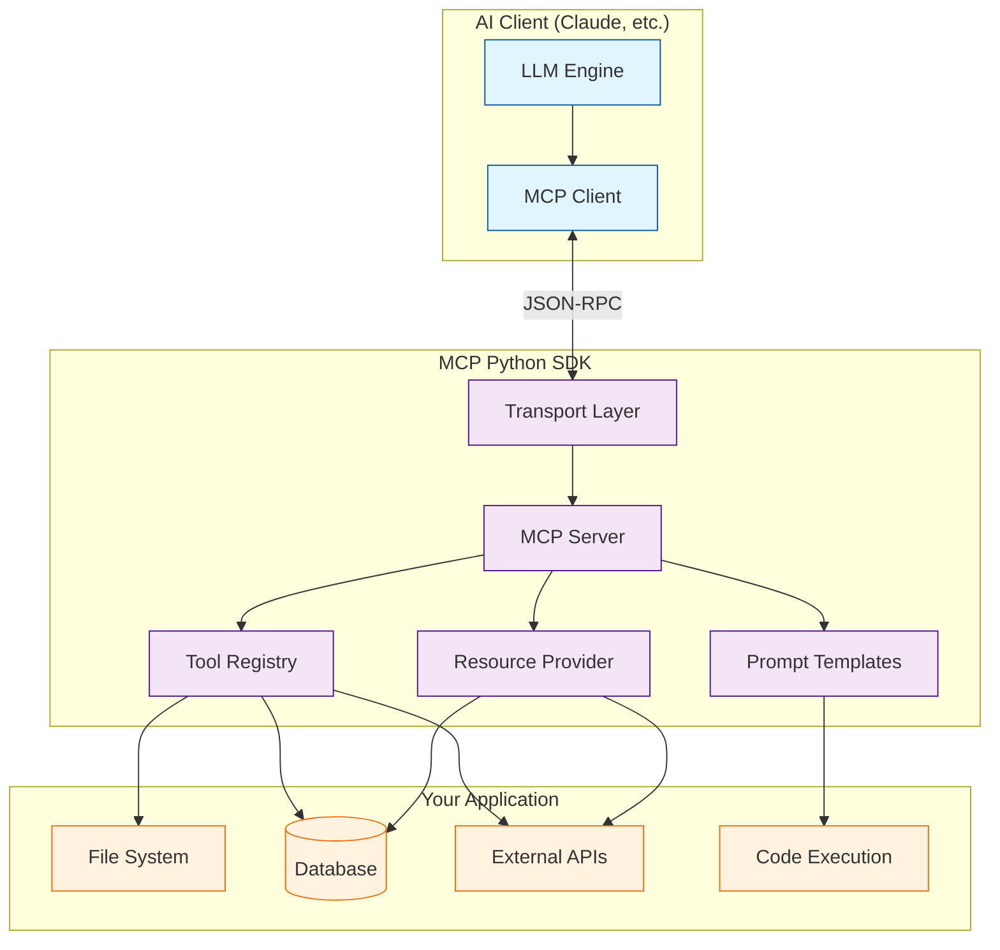

# MCP Python SDK Tutorial: Building AI Tool Servers

> Master the Model Context Protocol Python SDK to build custom tool servers that extend Claude and other LLMs with powerful capabilities.

## 🎯 What is MCP Python SDK?

The **Model Context Protocol (MCP) Python SDK** is the official Python implementation for building MCP servers - standardized tool providers that AI assistants like Claude can securely interact with. MCP enables LLMs to access external data sources, call APIs, execute code, and interact with systems through a unified protocol.

### Key Features

| Feature | Description |
|:--------|:------------|
| **Server & Client** | Build both MCP servers (tool providers) and clients (tool consumers) |
| **Resources** | Expose data sources (files, APIs, databases) to AI assistants |
| **Tools** | Define callable functions with automatic schema generation |
| **Prompts** | Create reusable prompt templates with parameters |
| **Multiple Transports** | stdio, SSE (Server-Sent Events), and HTTP support |
| **Type Safety** | Full Pydantic integration for request/response validation |
| **Async Support** | Built on asyncio for high-performance concurrent operations |

## Architecture Overview

## Tutorial Structure

| Chapter | Topic | What You'll Learn |
|:--------|:------|:------------------|
| [1. Getting Started](01-getting-started.md) | Setup & Basics | Installation, first MCP server, protocol overview |
| [2. Core Concepts](02-core-concepts.md) | Primitives | Resources, Tools, Prompts, and how they work |
| [3. Server Architecture](03-server-architecture.md) | Design | Transport layers (stdio, SSE, HTTP), server lifecycle |
| [4. Advanced Patterns](04-advanced-patterns.md) | Features | Structured outputs, progress tracking, context management |
| [5. Authentication & Security](05-authentication-security.md) | Security | OAuth integration, authentication, security best practices |
| [6. Production Deployment](06-production-deployment.md) | Operations | Docker, monitoring, error handling, scaling |
| [7. Client Integration](07-client-integration.md) | Integration | Using with Claude Code, Claude.ai, custom clients |
| [8. Real-World Examples](08-real-world-examples.md) | Case Studies | Complete implementations, production patterns |

## Tech Stack

| Component | Technology |
|:----------|:-----------|
| **Language** | Python 3.10+ |
| **Core Framework** | asyncio, Pydantic V2 |
| **Protocol** | JSON-RPC 2.0 over MCP |
| **Transports** | stdio (subprocess), SSE (HTTP streaming), HTTP |
| **Type Safety** | Pydantic models, TypedDict, Protocol classes |
| **Testing** | pytest, pytest-asyncio |
| **Common Integrations** | FastAPI, SQLAlchemy, httpx, aiofiles |

## What You'll Build

By the end of this tutorial, you'll be able to:

- **Build MCP Servers** that expose tools, resources, and prompts to AI assistants
- **Implement Custom Tools** with automatic schema generation and validation
- **Manage Resources** for files, databases, and external APIs
- **Handle Multiple Transports** including stdio, SSE, and HTTP
- **Deploy Production Servers** with authentication, monitoring, and error handling
- **Integrate with Claude** via Claude Code, Claude.ai, and custom applications
- **Follow Best Practices** for security, performance, and maintainability

## Prerequisites

- **Python 3.10+** knowledge (async/await, type hints)
- **Basic understanding of APIs** (REST, JSON-RPC)
- **Familiarity with AI assistants** (optional but helpful)
- **Command-line experience** for development and testing

## Related Tutorials

**Prerequisites:**
- None - this is a foundational tutorial

**Complementary:**
- [n8n MCP Tutorial](../n8n-mcp-tutorial/) - Production MCP implementation with workflow automation
- [Claude Code Tutorial - Chapter 7](../claude-code-tutorial/07-mcp.md) - Using MCP servers with Claude Code

**Next Steps:**
- [MCP Servers Tutorial](../mcp-servers-tutorial/) - Reference implementations in multiple languages
- [Anthropic Skills Tutorial](../anthropic-skills-tutorial/) - Building reusable agent capabilities

## Comparison: MCP SDK vs. n8n-mcp

| Aspect | MCP Python SDK (This Tutorial) | n8n-mcp Tutorial |
|:-------|:------------------------------|:-----------------|
| **Focus** | General-purpose MCP server development | n8n-specific MCP integration |
| **Language** | Python | TypeScript / Node.js |
| **Use Case** | Build any MCP server from scratch | Expose n8n workflows as MCP tools |
| **Scope** | Protocol implementation, SDK patterns | Production integration, multi-tenant |
| **Best For** | Learning MCP, custom tool development | n8n users, workflow automation |

---

Ready to begin? Start with [Chapter 1: Getting Started](01-getting-started.md).

---

*Built with insights from the [MCP Python SDK repository](https://github.com/modelcontextprotocol/python-sdk) and MCP specification.*

## Navigation & Backlinks

- [Start Here: Chapter 1: Getting Started with MCP Python SDK](01-getting-started.md)
- [Back to Main Catalog](../../README.md#-tutorial-catalog)
- [Browse A-Z Tutorial Directory](../../discoverability/tutorial-directory.md)
- [Search by Intent](../../discoverability/query-hub.md)
- [Explore Category Hubs](../../README.md#category-hubs)

## Full Chapter Map

1. [Chapter 1: Getting Started with MCP Python SDK](01-getting-started.md)
2. [Chapter 2: Core Concepts - Resources, Tools, and Prompts](02-core-concepts.md)
3. [Chapter 3: Server Architecture](03-server-architecture.md)
4. [Chapter 4: Advanced Patterns](04-advanced-patterns.md)
5. [Chapter 5: Authentication & Security](05-authentication-security.md)
6. [Chapter 6: Production Deployment](06-production-deployment.md)
7. [Chapter 7: Client Integration](07-client-integration.md)
8. [Chapter 8: Real-World Examples](08-real-world-examples.md)

## Source References

- [MCP Python SDK repository](https://github.com/modelcontextprotocol/python-sdk)

*Generated by [AI Codebase Knowledge Builder](https://github.com/The-Pocket/Tutorial-Codebase-Knowledge)*
