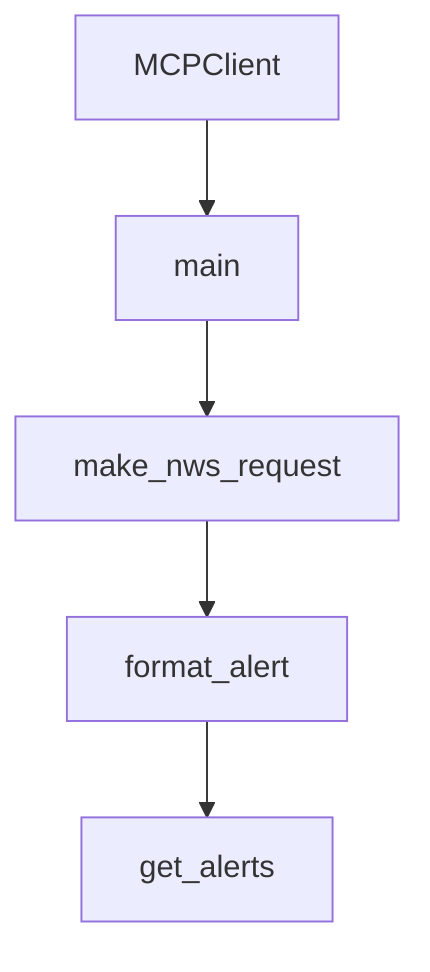

# Chapter 1: Getting Started and Repository Topology

Welcome to **Chapter 1: Getting Started and Repository Topology**. In this part of **MCP Quickstart Resources Tutorial: Cross-Language MCP Servers and Clients by Example**, you will build an intuitive mental model first, then move into concrete implementation details and practical production tradeoffs.


This chapter introduces the purpose and structure of the quickstart resource corpus.

## Learning Goals

- understand how server/client examples map to official tutorials
- identify language directories and their intended use
- choose a first example path for your runtime preference
- avoid confusing quickstart references with production templates

## Repository Anatomy

| Area | Purpose |
|:-----|:--------|
| `weather-server-*` | basic MCP server examples by language |
| `mcp-client-*` | basic MCP client examples by language |
| `tests/` | cross-runtime smoke tests and helper tooling |

## Source References

- [Quickstart Resources README](https://github.com/modelcontextprotocol/quickstart-resources/blob/main/README.md)

## Summary

You now have a clear map of quickstart assets and intended usage.

Next: [Chapter 2: Weather Server Patterns Across Languages](02-weather-server-patterns-across-languages.md)

## Depth Expansion Playbook

## Source Code Walkthrough

### `mcp-client-python/client.py`

The `MCPClient` class in [`mcp-client-python/client.py`](https://github.com/modelcontextprotocol/quickstart-resources/blob/HEAD/mcp-client-python/client.py) handles a key part of this chapter's functionality:

```py


class MCPClient:
    def __init__(self):
        # Initialize session and client objects
        self.session: ClientSession | None = None
        self.exit_stack = AsyncExitStack()
        self._anthropic: Anthropic | None = None

    @property
    def anthropic(self) -> Anthropic:
        """Lazy-initialize Anthropic client when needed"""
        if self._anthropic is None:
            self._anthropic = Anthropic(api_key=os.getenv("ANTHROPIC_API_KEY"))
        return self._anthropic

    async def connect_to_server(self, server_script_path: str):
        """Connect to an MCP server

        Args:
            server_script_path: Path to the server script (.py or .js)
        """
        is_python = server_script_path.endswith(".py")
        is_js = server_script_path.endswith(".js")
        if not (is_python or is_js):
            raise ValueError("Server script must be a .py or .js file")

        if is_python:
            path = Path(server_script_path).resolve()
            server_params = StdioServerParameters(
                command="uv",
                args=["--directory", str(path.parent), "run", path.name],
```

This class is important because it defines how MCP Quickstart Resources Tutorial: Cross-Language MCP Servers and Clients by Example implements the patterns covered in this chapter.

### `mcp-client-python/client.py`

The `main` function in [`mcp-client-python/client.py`](https://github.com/modelcontextprotocol/quickstart-resources/blob/HEAD/mcp-client-python/client.py) handles a key part of this chapter's functionality:

```py


async def main():
    if len(sys.argv) < 2:
        print("Usage: python client.py <path_to_server_script>")
        sys.exit(1)

    client = MCPClient()
    try:
        await client.connect_to_server(sys.argv[1])

        # Check if we have a valid API key to continue
        api_key = os.getenv("ANTHROPIC_API_KEY")
        if not api_key:
            print("\nNo ANTHROPIC_API_KEY found. To query these tools with Claude, set your API key:")
            print("  export ANTHROPIC_API_KEY=your-api-key-here")
            return

        await client.chat_loop()
    finally:
        await client.cleanup()


if __name__ == "__main__":
    import sys

    asyncio.run(main())

```

This function is important because it defines how MCP Quickstart Resources Tutorial: Cross-Language MCP Servers and Clients by Example implements the patterns covered in this chapter.

### `weather-server-python/weather.py`

The `make_nws_request` function in [`weather-server-python/weather.py`](https://github.com/modelcontextprotocol/quickstart-resources/blob/HEAD/weather-server-python/weather.py) handles a key part of this chapter's functionality:

```py


async def make_nws_request(url: str) -> dict[str, Any] | None:
    """Make a request to the NWS API with proper error handling."""
    headers = {"User-Agent": USER_AGENT, "Accept": "application/geo+json"}
    async with httpx.AsyncClient() as client:
        try:
            response = await client.get(url, headers=headers, timeout=30.0)
            response.raise_for_status()
            return response.json()
        except Exception:
            return None


def format_alert(feature: dict) -> str:
    """Format an alert feature into a readable string."""
    props = feature["properties"]
    return f"""
Event: {props.get("event", "Unknown")}
Area: {props.get("areaDesc", "Unknown")}
Severity: {props.get("severity", "Unknown")}
Description: {props.get("description", "No description available")}
Instructions: {props.get("instruction", "No specific instructions provided")}
"""


@mcp.tool()
async def get_alerts(state: str) -> str:
    """Get weather alerts for a US state.

    Args:
        state: Two-letter US state code (e.g. CA, NY)
```

This function is important because it defines how MCP Quickstart Resources Tutorial: Cross-Language MCP Servers and Clients by Example implements the patterns covered in this chapter.

### `weather-server-python/weather.py`

The `format_alert` function in [`weather-server-python/weather.py`](https://github.com/modelcontextprotocol/quickstart-resources/blob/HEAD/weather-server-python/weather.py) handles a key part of this chapter's functionality:

```py


def format_alert(feature: dict) -> str:
    """Format an alert feature into a readable string."""
    props = feature["properties"]
    return f"""
Event: {props.get("event", "Unknown")}
Area: {props.get("areaDesc", "Unknown")}
Severity: {props.get("severity", "Unknown")}
Description: {props.get("description", "No description available")}
Instructions: {props.get("instruction", "No specific instructions provided")}
"""


@mcp.tool()
async def get_alerts(state: str) -> str:
    """Get weather alerts for a US state.

    Args:
        state: Two-letter US state code (e.g. CA, NY)
    """
    url = f"{NWS_API_BASE}/alerts/active/area/{state}"
    data = await make_nws_request(url)

    if not data or "features" not in data:
        return "Unable to fetch alerts or no alerts found."

    if not data["features"]:
        return "No active alerts for this state."

    alerts = [format_alert(feature) for feature in data["features"]]
    return "\n---\n".join(alerts)
```

This function is important because it defines how MCP Quickstart Resources Tutorial: Cross-Language MCP Servers and Clients by Example implements the patterns covered in this chapter.


## How These Components Connect


