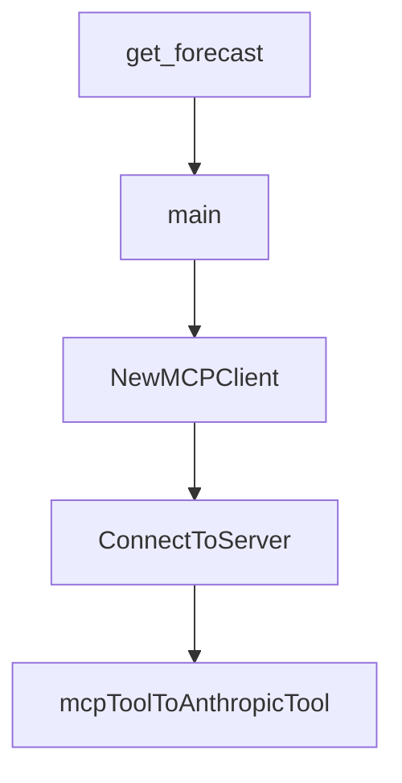

# Chapter 2: Weather Server Patterns Across Languages

Welcome to **Chapter 2: Weather Server Patterns Across Languages**. In this part of **MCP Quickstart Resources Tutorial: Cross-Language MCP Servers and Clients by Example**, you will build an intuitive mental model first, then move into concrete implementation details and practical production tradeoffs.


This chapter compares weather server implementations to highlight shared protocol behavior.

## Learning Goals

- identify common MCP server primitives in each runtime
- compare runtime-specific setup/build differences
- reason about maintainability tradeoffs by language
- preserve behavior parity when customizing server examples

## Comparison Lens

1. tool declaration and `tools/list` response shape
2. stdio transport setup and lifecycle handling
3. dependency/runtime management per ecosystem
4. local test and run commands

## Source References

- [Weather Server (Go)](https://github.com/modelcontextprotocol/quickstart-resources/blob/main/weather-server-go/README.md)
- [Weather Server (Python)](https://github.com/modelcontextprotocol/quickstart-resources/blob/main/weather-server-python/README.md)
- [Weather Server (Rust)](https://github.com/modelcontextprotocol/quickstart-resources/blob/main/weather-server-rust/README.md)
- [Weather Server (TypeScript)](https://github.com/modelcontextprotocol/quickstart-resources/blob/main/weather-server-typescript/README.md)

## Summary

You now have a cross-language pattern model for MCP weather-server implementations.

Next: [Chapter 3: MCP Client Patterns and LLM Chat Loops](03-mcp-client-patterns-and-llm-chat-loops.md)

## Depth Expansion Playbook

## Source Code Walkthrough

### `weather-server-python/weather.py`

The `get_forecast` function in [`weather-server-python/weather.py`](https://github.com/modelcontextprotocol/quickstart-resources/blob/HEAD/weather-server-python/weather.py) handles a key part of this chapter's functionality:

```py

@mcp.tool()
async def get_forecast(latitude: float, longitude: float) -> str:
    """Get weather forecast for a location.

    Args:
        latitude: Latitude of the location
        longitude: Longitude of the location
    """
    # First get the forecast grid endpoint
    points_url = f"{NWS_API_BASE}/points/{latitude},{longitude}"
    points_data = await make_nws_request(points_url)

    if not points_data:
        return "Unable to fetch forecast data for this location."

    # Get the forecast URL from the points response
    forecast_url = points_data["properties"]["forecast"]
    forecast_data = await make_nws_request(forecast_url)

    if not forecast_data:
        return "Unable to fetch detailed forecast."

    # Format the periods into a readable forecast
    periods = forecast_data["properties"]["periods"]
    forecasts = []
    for period in periods[:5]:  # Only show next 5 periods
        forecast = f"""
{period["name"]}:
Temperature: {period["temperature"]}°{period["temperatureUnit"]}
Wind: {period["windSpeed"]} {period["windDirection"]}
Forecast: {period["detailedForecast"]}
```

This function is important because it defines how MCP Quickstart Resources Tutorial: Cross-Language MCP Servers and Clients by Example implements the patterns covered in this chapter.

### `weather-server-python/weather.py`

The `main` function in [`weather-server-python/weather.py`](https://github.com/modelcontextprotocol/quickstart-resources/blob/HEAD/weather-server-python/weather.py) handles a key part of this chapter's functionality:

```py


def main():
    # Initialize and run the server
    mcp.run(transport="stdio")


if __name__ == "__main__":
    main()

```

This function is important because it defines how MCP Quickstart Resources Tutorial: Cross-Language MCP Servers and Clients by Example implements the patterns covered in this chapter.

### `mcp-client-go/main.go`

The `NewMCPClient` function in [`mcp-client-go/main.go`](https://github.com/modelcontextprotocol/quickstart-resources/blob/HEAD/mcp-client-go/main.go) handles a key part of this chapter's functionality:

```go
}

func NewMCPClient() (*MCPClient, error) {
	// Load .env file
	if err := godotenv.Load(); err != nil {
		return nil, fmt.Errorf("failed to load .env file: %w", err)
	}

	apiKey := os.Getenv("ANTHROPIC_API_KEY")
	if apiKey == "" {
		return nil, fmt.Errorf("ANTHROPIC_API_KEY environment variable not set")
	}

	client := anthropic.NewClient(option.WithAPIKey(apiKey))

	return &MCPClient{
		anthropic: &client,
	}, nil
}

func (c *MCPClient) ConnectToServer(ctx context.Context, serverArgs []string) error {
	if len(serverArgs) == 0 {
		return fmt.Errorf("no server command provided")
	}

	// Create command to spawn server process
	cmd := exec.CommandContext(ctx, serverArgs[0], serverArgs[1:]...)

	// Create MCP client
	client := mcp.NewClient(
		&mcp.Implementation{
			Name:    "mcp-client-go",
```

This function is important because it defines how MCP Quickstart Resources Tutorial: Cross-Language MCP Servers and Clients by Example implements the patterns covered in this chapter.

### `mcp-client-go/main.go`

The `ConnectToServer` function in [`mcp-client-go/main.go`](https://github.com/modelcontextprotocol/quickstart-resources/blob/HEAD/mcp-client-go/main.go) handles a key part of this chapter's functionality:

```go
}

func (c *MCPClient) ConnectToServer(ctx context.Context, serverArgs []string) error {
	if len(serverArgs) == 0 {
		return fmt.Errorf("no server command provided")
	}

	// Create command to spawn server process
	cmd := exec.CommandContext(ctx, serverArgs[0], serverArgs[1:]...)

	// Create MCP client
	client := mcp.NewClient(
		&mcp.Implementation{
			Name:    "mcp-client-go",
			Version: "0.1.0",
		},
		nil,
	)

	// Connect using CommandTransport
	transport := &mcp.CommandTransport{
		Command: cmd,
	}

	session, err := client.Connect(ctx, transport, nil)
	if err != nil {
		return fmt.Errorf("failed to connect to server: %w", err)
	}

	c.session = session

	// List available tools
```

This function is important because it defines how MCP Quickstart Resources Tutorial: Cross-Language MCP Servers and Clients by Example implements the patterns covered in this chapter.


## How These Components Connect


