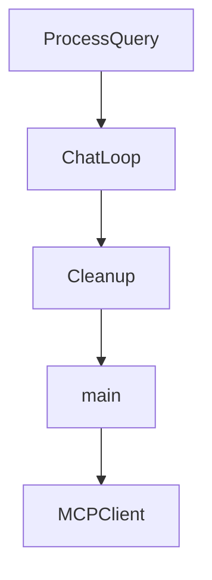

# Chapter 2: Weather Server Patterns Across Languages

Welcome to **Chapter 2: Weather Server Patterns Across Languages**. In this part of **MCP Quickstart Resources Tutorial: Cross-Language MCP Servers and Clients by Example**, you will build an intuitive mental model first, then move into concrete implementation details and practical production tradeoffs.


This chapter compares weather server implementations to highlight shared protocol behavior.

## Learning Goals

- identify common MCP server primitives in each runtime
- compare runtime-specific setup/build differences
- reason about maintainability tradeoffs by language
- preserve behavior parity when customizing server examples

## Comparison Lens

1. tool declaration and `tools/list` response shape
2. stdio transport setup and lifecycle handling
3. dependency/runtime management per ecosystem
4. local test and run commands

## Source References

- [Weather Server (Go)](https://github.com/modelcontextprotocol/quickstart-resources/blob/main/weather-server-go/README.md)
- [Weather Server (Python)](https://github.com/modelcontextprotocol/quickstart-resources/blob/main/weather-server-python/README.md)
- [Weather Server (Rust)](https://github.com/modelcontextprotocol/quickstart-resources/blob/main/weather-server-rust/README.md)
- [Weather Server (TypeScript)](https://github.com/modelcontextprotocol/quickstart-resources/blob/main/weather-server-typescript/README.md)

## Summary

You now have a cross-language pattern model for MCP weather-server implementations.

Next: [Chapter 3: MCP Client Patterns and LLM Chat Loops](03-mcp-client-patterns-and-llm-chat-loops.md)

## Source Code Walkthrough

### `mcp-client-go/main.go`

The `ProcessQuery` function in [`mcp-client-go/main.go`](https://github.com/modelcontextprotocol/quickstart-resources/blob/HEAD/mcp-client-go/main.go) handles a key part of this chapter's functionality:

```go
}

func (c *MCPClient) ProcessQuery(ctx context.Context, query string) (string, error) {
	if c.session == nil {
		return "", fmt.Errorf("client is not connected to any server")
	}

	messages := []anthropic.MessageParam{
		anthropic.NewUserMessage(anthropic.NewTextBlock(query)),
	}

	// Initial Claude API call with tools
	response, err := c.anthropic.Messages.New(ctx, anthropic.MessageNewParams{
		Model:     model,
		MaxTokens: 1024,
		Messages:  messages,
		Tools:     c.tools,
	})
	if err != nil {
		return "", fmt.Errorf("anthropic API request failed: %w", err)
	}

	var toolUseBlocks []anthropic.ToolUseBlock
	var finalText []string
	for _, block := range response.Content {
		switch b := block.AsAny().(type) {
		case anthropic.TextBlock:
			finalText = append(finalText, b.Text)
		case anthropic.ToolUseBlock:
			toolUseBlocks = append(toolUseBlocks, b)
		}
	}
```

This function is important because it defines how MCP Quickstart Resources Tutorial: Cross-Language MCP Servers and Clients by Example implements the patterns covered in this chapter.

### `mcp-client-go/main.go`

The `ChatLoop` function in [`mcp-client-go/main.go`](https://github.com/modelcontextprotocol/quickstart-resources/blob/HEAD/mcp-client-go/main.go) handles a key part of this chapter's functionality:

```go
}

func (c *MCPClient) ChatLoop(ctx context.Context) error {
	fmt.Println("\nMCP Client Started!")
	fmt.Println("Type your queries or 'quit' to exit.")

	scanner := bufio.NewScanner(os.Stdin)

	for {
		fmt.Print("\nQuery: ")
		if !scanner.Scan() {
			break // EOF
		}

		query := strings.TrimSpace(scanner.Text())
		if strings.EqualFold(query, "quit") {
			break
		}
		if query == "" {
			continue
		}

		response, err := c.ProcessQuery(ctx, query)
		if err != nil {
			fmt.Printf("\nError: %v\n", err)
			continue
		}

		fmt.Printf("\n%s\n", response)
	}

	return scanner.Err()
```

This function is important because it defines how MCP Quickstart Resources Tutorial: Cross-Language MCP Servers and Clients by Example implements the patterns covered in this chapter.

### `mcp-client-go/main.go`

The `Cleanup` function in [`mcp-client-go/main.go`](https://github.com/modelcontextprotocol/quickstart-resources/blob/HEAD/mcp-client-go/main.go) handles a key part of this chapter's functionality:

```go
}

func (c *MCPClient) Cleanup() error {
	if c.session != nil {
		if err := c.session.Close(); err != nil {
			return fmt.Errorf("failed to close session: %w", err)
		}
		c.session = nil
	}
	return nil
}

func main() {
	if len(os.Args) < 2 {
		fmt.Fprintln(os.Stderr, "Usage: go run main.go <server_script_or_binary> [args...]")
		os.Exit(1)
	}

	serverArgs := os.Args[1:]

	client, err := NewMCPClient()
	if err != nil {
		log.Fatalf("Failed to create MCP client: %v", err)
	}

	ctx := context.Background()

	if err := client.ConnectToServer(ctx, serverArgs); err != nil {
		log.Fatalf("Failed to connect to MCP server: %v", err)
	}

	if err := client.ChatLoop(ctx); err != nil {
```

This function is important because it defines how MCP Quickstart Resources Tutorial: Cross-Language MCP Servers and Clients by Example implements the patterns covered in this chapter.

### `mcp-client-go/main.go`

The `main` function in [`mcp-client-go/main.go`](https://github.com/modelcontextprotocol/quickstart-resources/blob/HEAD/mcp-client-go/main.go) handles a key part of this chapter's functionality:

```go
package main

import (
	"bufio"
	"context"
	"encoding/json"
	"fmt"
	"log"
	"os"
	"os/exec"
	"strings"

	"github.com/anthropics/anthropic-sdk-go"
	"github.com/anthropics/anthropic-sdk-go/option"
	"github.com/joho/godotenv"
	"github.com/modelcontextprotocol/go-sdk/mcp"
)

var model anthropic.Model = anthropic.ModelClaudeSonnet4_5_20250929

type MCPClient struct {
	anthropic *anthropic.Client
	session   *mcp.ClientSession
	tools     []anthropic.ToolUnionParam
}

func NewMCPClient() (*MCPClient, error) {
	// Load .env file
	if err := godotenv.Load(); err != nil {
		return nil, fmt.Errorf("failed to load .env file: %w", err)
```

This function is important because it defines how MCP Quickstart Resources Tutorial: Cross-Language MCP Servers and Clients by Example implements the patterns covered in this chapter.


## How These Components Connect


