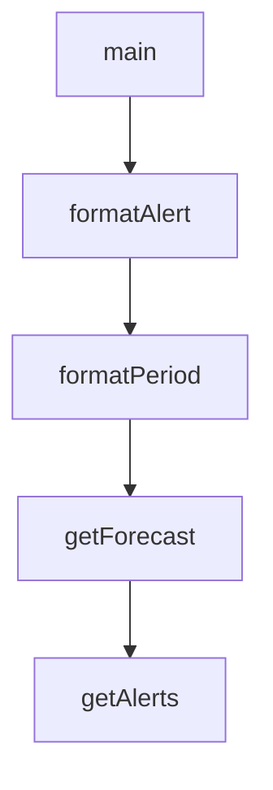

# Chapter 3: MCP Client Patterns and LLM Chat Loops

Welcome to **Chapter 3: MCP Client Patterns and LLM Chat Loops**. In this part of **MCP Quickstart Resources Tutorial: Cross-Language MCP Servers and Clients by Example**, you will build an intuitive mental model first, then move into concrete implementation details and practical production tradeoffs.


This chapter covers client-side flows for connecting to MCP servers and exposing tool calls in chat UX.

## Learning Goals

- compare client behavior across Go/Python/TypeScript examples
- map MCP tool discovery to conversational interaction loops
- handle absent credentials and fallback behavior safely
- design adapter layers for provider-specific LLM APIs

## Client Design Guardrails

- isolate MCP transport logic from model-provider wrappers.
- keep tool call schemas strict and explicit.
- fail gracefully when API keys or external services are unavailable.

## Source References

- [MCP Client (Go)](https://github.com/modelcontextprotocol/quickstart-resources/blob/main/mcp-client-go/README.md)
- [MCP Client (Python)](https://github.com/modelcontextprotocol/quickstart-resources/blob/main/mcp-client-python/README.md)
- [MCP Client (TypeScript)](https://github.com/modelcontextprotocol/quickstart-resources/blob/main/mcp-client-typescript/README.md)

## Summary

You now have a practical MCP client loop model for chatbot-oriented integrations.

Next: [Chapter 4: Protocol Flow and stdio Transport Behavior](04-protocol-flow-and-stdio-transport-behavior.md)

## Source Code Walkthrough

### `mcp-client-typescript/index.ts`

The `main` function in [`mcp-client-typescript/index.ts`](https://github.com/modelcontextprotocol/quickstart-resources/blob/HEAD/mcp-client-typescript/index.ts) handles a key part of this chapter's functionality:

```ts
}

async function main() {
  if (process.argv.length < 3) {
    console.log("Usage: node build/index.js <path_to_server_script>");
    return;
  }
  const mcpClient = new MCPClient();
  try {
    await mcpClient.connectToServer(process.argv[2]);

    // Check if we have a valid API key to continue
    const apiKey = process.env.ANTHROPIC_API_KEY;
    if (!apiKey) {
      console.log(
        "\nNo ANTHROPIC_API_KEY found. To query these tools with Claude, set your API key:"
      );
      console.log("  export ANTHROPIC_API_KEY=your-api-key-here");
      return;
    }

    await mcpClient.chatLoop();
  } catch (e) {
    console.error("Error:", e);
    await mcpClient.cleanup();
    process.exit(1);
  } finally {
    await mcpClient.cleanup();
    process.exit(0);
  }
}

```

This function is important because it defines how MCP Quickstart Resources Tutorial: Cross-Language MCP Servers and Clients by Example implements the patterns covered in this chapter.

### `weather-server-go/main.go`

The `formatAlert` function in [`weather-server-go/main.go`](https://github.com/modelcontextprotocol/quickstart-resources/blob/HEAD/weather-server-go/main.go) handles a key part of this chapter's functionality:

```go
}

func formatAlert(alert AlertFeature) string {
	props := alert.Properties
	event := cmp.Or(props.Event, "Unknown")
	areaDesc := cmp.Or(props.AreaDesc, "Unknown")
	severity := cmp.Or(props.Severity, "Unknown")
	description := cmp.Or(props.Description, "No description available")
	instruction := cmp.Or(props.Instruction, "No specific instructions provided")

	return fmt.Sprintf(`
Event: %s
Area: %s
Severity: %s
Description: %s
Instructions: %s
`, event, areaDesc, severity, description, instruction)
}

func formatPeriod(period ForecastPeriod) string {
	return fmt.Sprintf(`
%s:
Temperature: %d°%s
Wind: %s %s
Forecast: %s
`, period.Name, period.Temperature, period.TemperatureUnit,
		period.WindSpeed, period.WindDirection, period.DetailedForecast)
}

func getForecast(ctx context.Context, req *mcp.CallToolRequest, input ForecastInput) (
	*mcp.CallToolResult, any, error,
) {
```

This function is important because it defines how MCP Quickstart Resources Tutorial: Cross-Language MCP Servers and Clients by Example implements the patterns covered in this chapter.

### `weather-server-go/main.go`

The `formatPeriod` function in [`weather-server-go/main.go`](https://github.com/modelcontextprotocol/quickstart-resources/blob/HEAD/weather-server-go/main.go) handles a key part of this chapter's functionality:

```go
}

func formatPeriod(period ForecastPeriod) string {
	return fmt.Sprintf(`
%s:
Temperature: %d°%s
Wind: %s %s
Forecast: %s
`, period.Name, period.Temperature, period.TemperatureUnit,
		period.WindSpeed, period.WindDirection, period.DetailedForecast)
}

func getForecast(ctx context.Context, req *mcp.CallToolRequest, input ForecastInput) (
	*mcp.CallToolResult, any, error,
) {
	// Get points data
	pointsURL := fmt.Sprintf("%s/points/%f,%f", NWSAPIBase, input.Latitude, input.Longitude)
	pointsData, err := makeNWSRequest[PointsResponse](ctx, pointsURL)
	if err != nil {
		return &mcp.CallToolResult{
			Content: []mcp.Content{
				&mcp.TextContent{Text: "Unable to fetch forecast data for this location."},
			},
		}, nil, nil
	}

	// Get forecast data
	forecastURL := pointsData.Properties.Forecast
	if forecastURL == "" {
		return &mcp.CallToolResult{
			Content: []mcp.Content{
				&mcp.TextContent{Text: "Unable to fetch forecast URL."},
```

This function is important because it defines how MCP Quickstart Resources Tutorial: Cross-Language MCP Servers and Clients by Example implements the patterns covered in this chapter.

### `weather-server-go/main.go`

The `getForecast` function in [`weather-server-go/main.go`](https://github.com/modelcontextprotocol/quickstart-resources/blob/HEAD/weather-server-go/main.go) handles a key part of this chapter's functionality:

```go
}

func getForecast(ctx context.Context, req *mcp.CallToolRequest, input ForecastInput) (
	*mcp.CallToolResult, any, error,
) {
	// Get points data
	pointsURL := fmt.Sprintf("%s/points/%f,%f", NWSAPIBase, input.Latitude, input.Longitude)
	pointsData, err := makeNWSRequest[PointsResponse](ctx, pointsURL)
	if err != nil {
		return &mcp.CallToolResult{
			Content: []mcp.Content{
				&mcp.TextContent{Text: "Unable to fetch forecast data for this location."},
			},
		}, nil, nil
	}

	// Get forecast data
	forecastURL := pointsData.Properties.Forecast
	if forecastURL == "" {
		return &mcp.CallToolResult{
			Content: []mcp.Content{
				&mcp.TextContent{Text: "Unable to fetch forecast URL."},
			},
		}, nil, nil
	}

	forecastData, err := makeNWSRequest[ForecastResponse](ctx, forecastURL)
	if err != nil {
		return &mcp.CallToolResult{
			Content: []mcp.Content{
				&mcp.TextContent{Text: "Unable to fetch detailed forecast."},
			},
```

This function is important because it defines how MCP Quickstart Resources Tutorial: Cross-Language MCP Servers and Clients by Example implements the patterns covered in this chapter.


## How These Components Connect


