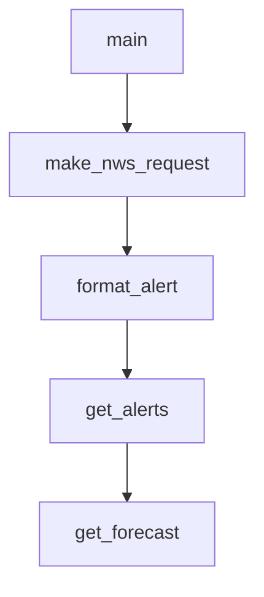

# Chapter 4: Protocol Flow and stdio Transport Behavior

Welcome to **Chapter 4: Protocol Flow and stdio Transport Behavior**. In this part of **MCP Quickstart Resources Tutorial: Cross-Language MCP Servers and Clients by Example**, you will build an intuitive mental model first, then move into concrete implementation details and practical production tradeoffs.


This chapter focuses on core protocol interactions implemented across the quickstart set.

## Learning Goals

- understand baseline `initialize` and `tools/list` handshake expectations
- model stdio communication behavior across runtimes
- diagnose protocol mismatches during first-run integration
- keep implementations compliant while adding custom capabilities

## Baseline Protocol Sequence

1. start server/client stdio process
2. initialize MCP session
3. request tools/capability metadata
4. invoke tool calls with valid schema arguments

## Source References

- [Quickstart README](https://github.com/modelcontextprotocol/quickstart-resources/blob/main/README.md)
- [Smoke Tests Guide](https://github.com/modelcontextprotocol/quickstart-resources/blob/main/tests/README.md)

## Summary

You now have a protocol baseline for debugging and extending quickstart implementations.

Next: [Chapter 5: Smoke Tests and Mock Infrastructure](05-smoke-tests-and-mock-infrastructure.md)

## Source Code Walkthrough

### `weather-server-go/main.go`

The `main` function in [`weather-server-go/main.go`](https://github.com/modelcontextprotocol/quickstart-resources/blob/HEAD/weather-server-go/main.go) handles a key part of this chapter's functionality:

```go
package main

import (
	"cmp"
	"context"
	"encoding/json"
	"fmt"
	"io"
	"log"
	"net/http"
	"strings"

	"github.com/modelcontextprotocol/go-sdk/mcp"
)

const (
	NWSAPIBase = "https://api.weather.gov"
	UserAgent  = "weather-app/1.0"
)

type ForecastInput struct {
	Latitude  float64 `json:"latitude" jsonschema:"Latitude of the location"`
	Longitude float64 `json:"longitude" jsonschema:"Longitude of the location"`
}

type AlertsInput struct {
	State string `json:"state" jsonschema:"Two-letter US state code (e.g. CA, NY)"`
}

type PointsResponse struct {
```

This function is important because it defines how MCP Quickstart Resources Tutorial: Cross-Language MCP Servers and Clients by Example implements the patterns covered in this chapter.

### `weather-server-python/weather.py`

The `make_nws_request` function in [`weather-server-python/weather.py`](https://github.com/modelcontextprotocol/quickstart-resources/blob/HEAD/weather-server-python/weather.py) handles a key part of this chapter's functionality:

```py


async def make_nws_request(url: str) -> dict[str, Any] | None:
    """Make a request to the NWS API with proper error handling."""
    headers = {"User-Agent": USER_AGENT, "Accept": "application/geo+json"}
    async with httpx.AsyncClient() as client:
        try:
            response = await client.get(url, headers=headers, timeout=30.0)
            response.raise_for_status()
            return response.json()
        except Exception:
            return None


def format_alert(feature: dict) -> str:
    """Format an alert feature into a readable string."""
    props = feature["properties"]
    return f"""
Event: {props.get("event", "Unknown")}
Area: {props.get("areaDesc", "Unknown")}
Severity: {props.get("severity", "Unknown")}
Description: {props.get("description", "No description available")}
Instructions: {props.get("instruction", "No specific instructions provided")}
"""


@mcp.tool()
async def get_alerts(state: str) -> str:
    """Get weather alerts for a US state.

    Args:
        state: Two-letter US state code (e.g. CA, NY)
```

This function is important because it defines how MCP Quickstart Resources Tutorial: Cross-Language MCP Servers and Clients by Example implements the patterns covered in this chapter.

### `weather-server-python/weather.py`

The `format_alert` function in [`weather-server-python/weather.py`](https://github.com/modelcontextprotocol/quickstart-resources/blob/HEAD/weather-server-python/weather.py) handles a key part of this chapter's functionality:

```py


def format_alert(feature: dict) -> str:
    """Format an alert feature into a readable string."""
    props = feature["properties"]
    return f"""
Event: {props.get("event", "Unknown")}
Area: {props.get("areaDesc", "Unknown")}
Severity: {props.get("severity", "Unknown")}
Description: {props.get("description", "No description available")}
Instructions: {props.get("instruction", "No specific instructions provided")}
"""


@mcp.tool()
async def get_alerts(state: str) -> str:
    """Get weather alerts for a US state.

    Args:
        state: Two-letter US state code (e.g. CA, NY)
    """
    url = f"{NWS_API_BASE}/alerts/active/area/{state}"
    data = await make_nws_request(url)

    if not data or "features" not in data:
        return "Unable to fetch alerts or no alerts found."

    if not data["features"]:
        return "No active alerts for this state."

    alerts = [format_alert(feature) for feature in data["features"]]
    return "\n---\n".join(alerts)
```

This function is important because it defines how MCP Quickstart Resources Tutorial: Cross-Language MCP Servers and Clients by Example implements the patterns covered in this chapter.

### `weather-server-python/weather.py`

The `get_alerts` function in [`weather-server-python/weather.py`](https://github.com/modelcontextprotocol/quickstart-resources/blob/HEAD/weather-server-python/weather.py) handles a key part of this chapter's functionality:

```py

@mcp.tool()
async def get_alerts(state: str) -> str:
    """Get weather alerts for a US state.

    Args:
        state: Two-letter US state code (e.g. CA, NY)
    """
    url = f"{NWS_API_BASE}/alerts/active/area/{state}"
    data = await make_nws_request(url)

    if not data or "features" not in data:
        return "Unable to fetch alerts or no alerts found."

    if not data["features"]:
        return "No active alerts for this state."

    alerts = [format_alert(feature) for feature in data["features"]]
    return "\n---\n".join(alerts)


@mcp.tool()
async def get_forecast(latitude: float, longitude: float) -> str:
    """Get weather forecast for a location.

    Args:
        latitude: Latitude of the location
        longitude: Longitude of the location
    """
    # First get the forecast grid endpoint
    points_url = f"{NWS_API_BASE}/points/{latitude},{longitude}"
    points_data = await make_nws_request(points_url)
```

This function is important because it defines how MCP Quickstart Resources Tutorial: Cross-Language MCP Servers and Clients by Example implements the patterns covered in this chapter.


## How These Components Connect


