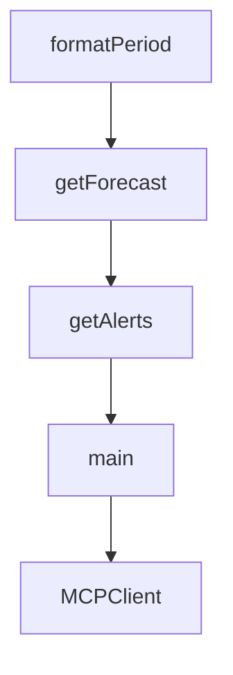

# Chapter 4: Protocol Flow and stdio Transport Behavior

Welcome to **Chapter 4: Protocol Flow and stdio Transport Behavior**. In this part of **MCP Quickstart Resources Tutorial: Cross-Language MCP Servers and Clients by Example**, you will build an intuitive mental model first, then move into concrete implementation details and practical production tradeoffs.


This chapter focuses on core protocol interactions implemented across the quickstart set.

## Learning Goals

- understand baseline `initialize` and `tools/list` handshake expectations
- model stdio communication behavior across runtimes
- diagnose protocol mismatches during first-run integration
- keep implementations compliant while adding custom capabilities

## Baseline Protocol Sequence

1. start server/client stdio process
2. initialize MCP session
3. request tools/capability metadata
4. invoke tool calls with valid schema arguments

## Source References

- [Quickstart README](https://github.com/modelcontextprotocol/quickstart-resources/blob/main/README.md)
- [Smoke Tests Guide](https://github.com/modelcontextprotocol/quickstart-resources/blob/main/tests/README.md)

## Summary

You now have a protocol baseline for debugging and extending quickstart implementations.

Next: [Chapter 5: Smoke Tests and Mock Infrastructure](05-smoke-tests-and-mock-infrastructure.md)

## Depth Expansion Playbook

## Source Code Walkthrough

### `weather-server-go/main.go`

The `formatPeriod` function in [`weather-server-go/main.go`](https://github.com/modelcontextprotocol/quickstart-resources/blob/HEAD/weather-server-go/main.go) handles a key part of this chapter's functionality:

```go
}

func formatPeriod(period ForecastPeriod) string {
	return fmt.Sprintf(`
%s:
Temperature: %d°%s
Wind: %s %s
Forecast: %s
`, period.Name, period.Temperature, period.TemperatureUnit,
		period.WindSpeed, period.WindDirection, period.DetailedForecast)
}

func getForecast(ctx context.Context, req *mcp.CallToolRequest, input ForecastInput) (
	*mcp.CallToolResult, any, error,
) {
	// Get points data
	pointsURL := fmt.Sprintf("%s/points/%f,%f", NWSAPIBase, input.Latitude, input.Longitude)
	pointsData, err := makeNWSRequest[PointsResponse](ctx, pointsURL)
	if err != nil {
		return &mcp.CallToolResult{
			Content: []mcp.Content{
				&mcp.TextContent{Text: "Unable to fetch forecast data for this location."},
			},
		}, nil, nil
	}

	// Get forecast data
	forecastURL := pointsData.Properties.Forecast
	if forecastURL == "" {
		return &mcp.CallToolResult{
			Content: []mcp.Content{
				&mcp.TextContent{Text: "Unable to fetch forecast URL."},
```

This function is important because it defines how MCP Quickstart Resources Tutorial: Cross-Language MCP Servers and Clients by Example implements the patterns covered in this chapter.

### `weather-server-go/main.go`

The `getForecast` function in [`weather-server-go/main.go`](https://github.com/modelcontextprotocol/quickstart-resources/blob/HEAD/weather-server-go/main.go) handles a key part of this chapter's functionality:

```go
}

func getForecast(ctx context.Context, req *mcp.CallToolRequest, input ForecastInput) (
	*mcp.CallToolResult, any, error,
) {
	// Get points data
	pointsURL := fmt.Sprintf("%s/points/%f,%f", NWSAPIBase, input.Latitude, input.Longitude)
	pointsData, err := makeNWSRequest[PointsResponse](ctx, pointsURL)
	if err != nil {
		return &mcp.CallToolResult{
			Content: []mcp.Content{
				&mcp.TextContent{Text: "Unable to fetch forecast data for this location."},
			},
		}, nil, nil
	}

	// Get forecast data
	forecastURL := pointsData.Properties.Forecast
	if forecastURL == "" {
		return &mcp.CallToolResult{
			Content: []mcp.Content{
				&mcp.TextContent{Text: "Unable to fetch forecast URL."},
			},
		}, nil, nil
	}

	forecastData, err := makeNWSRequest[ForecastResponse](ctx, forecastURL)
	if err != nil {
		return &mcp.CallToolResult{
			Content: []mcp.Content{
				&mcp.TextContent{Text: "Unable to fetch detailed forecast."},
			},
```

This function is important because it defines how MCP Quickstart Resources Tutorial: Cross-Language MCP Servers and Clients by Example implements the patterns covered in this chapter.

### `weather-server-go/main.go`

The `getAlerts` function in [`weather-server-go/main.go`](https://github.com/modelcontextprotocol/quickstart-resources/blob/HEAD/weather-server-go/main.go) handles a key part of this chapter's functionality:

```go
}

func getAlerts(ctx context.Context, req *mcp.CallToolRequest, input AlertsInput) (
	*mcp.CallToolResult, any, error,
) {
	// Build alerts URL
	stateCode := strings.ToUpper(input.State)
	alertsURL := fmt.Sprintf("%s/alerts/active/area/%s", NWSAPIBase, stateCode)

	alertsData, err := makeNWSRequest[AlertsResponse](ctx, alertsURL)
	if err != nil {
		return &mcp.CallToolResult{
			Content: []mcp.Content{
				&mcp.TextContent{Text: "Unable to fetch alerts or no alerts found."},
			},
		}, nil, nil
	}

	// Check if there are any alerts
	if len(alertsData.Features) == 0 {
		return &mcp.CallToolResult{
			Content: []mcp.Content{
				&mcp.TextContent{Text: "No active alerts for this state."},
			},
		}, nil, nil
	}

	// Format alerts
	var alerts []string
	for _, feature := range alertsData.Features {
		alerts = append(alerts, formatAlert(feature))
	}
```

This function is important because it defines how MCP Quickstart Resources Tutorial: Cross-Language MCP Servers and Clients by Example implements the patterns covered in this chapter.

### `weather-server-go/main.go`

The `main` function in [`weather-server-go/main.go`](https://github.com/modelcontextprotocol/quickstart-resources/blob/HEAD/weather-server-go/main.go) handles a key part of this chapter's functionality:

```go
package main

import (
	"cmp"
	"context"
	"encoding/json"
	"fmt"
	"io"
	"log"
	"net/http"
	"strings"

	"github.com/modelcontextprotocol/go-sdk/mcp"
)

const (
	NWSAPIBase = "https://api.weather.gov"
	UserAgent  = "weather-app/1.0"
)

type ForecastInput struct {
	Latitude  float64 `json:"latitude" jsonschema:"Latitude of the location"`
	Longitude float64 `json:"longitude" jsonschema:"Longitude of the location"`
}

type AlertsInput struct {
	State string `json:"state" jsonschema:"Two-letter US state code (e.g. CA, NY)"`
}

type PointsResponse struct {
```

This function is important because it defines how MCP Quickstart Resources Tutorial: Cross-Language MCP Servers and Clients by Example implements the patterns covered in this chapter.


## How These Components Connect


